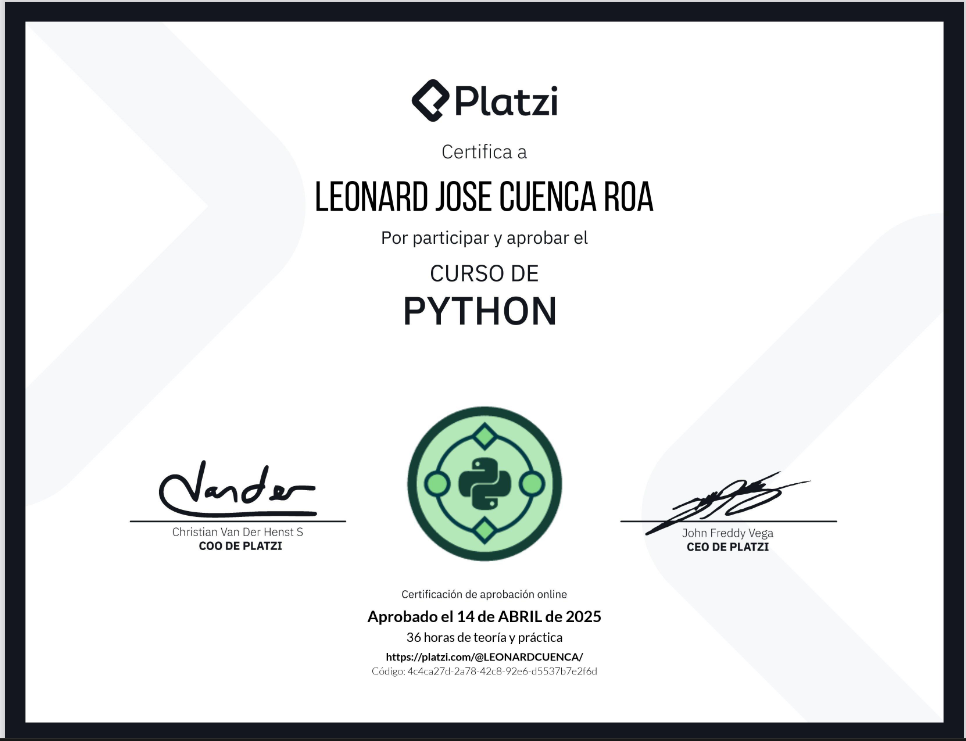

| Detalle | Información |
| :--- | :--- |
| **Publicado el** | Publicado el 11 de octubre de 2025 |
| **Profesor** | Luis Martinez |
| **Fecha de Inicio** | 15/12/2024 |
| **Fecha de Fin** | 15/01/2025 |

---
<div align="center">
  
</div>


| Curso | Certificado |
| :--- | :---: |
| Diploma Python | [Ver PDF](https://github.com/LeoSan/CursosBackendPython/blob/main/01_Primeros_pasos_Python\01_CursoPython\2025_Diploma-python_PLATZI.pdf) |


--- 


# Curso Python 

> Lugar: Platzi 
> Fecha: 01 Abril 2025 
> Profesora: 

## Clase 1: Instalación Python 

# Instalación de Python en Windows y macOS

Esta guía te llevará a través del proceso de instalación de Python en sistemas operativos Windows y macOS.

## Instalación en Windows

**Paso 1: Descargar el Instalador de Python**

1.  Abre tu navegador web y ve al sitio oficial de Python: [https://www.python.org/downloads/windows/](https://www.python.org/downloads/windows/)
2.  Busca la última versión estable de Python 3. Haz clic en el enlace correspondiente para descargar el instalador (generalmente un archivo `.exe`). Asegúrate de descargar la versión para Windows.

**Paso 2: Ejecutar el Instalador**

1.  Una vez que la descarga se complete, localiza el archivo `.exe` en tu carpeta de Descargas (o la ubicación donde guardaste el archivo).
2.  Haz doble clic en el archivo `.exe` para ejecutar el instalador.

**Paso 3: Configurar la Instalación**

1.  En la primera pantalla del instalador, asegúrate de marcar las siguientes casillas:
    * **"Add Python X.Y to PATH"** (donde X.Y es la versión de Python que estás instalando). Esto es crucial para poder ejecutar Python desde la línea de comandos.
    * **"Install launcher for all users (recommended)"** (opcional, pero recomendado).
2.  Haz clic en **"Install Now"** para iniciar la instalación con la configuración predeterminada, o en **"Customize installation"** si deseas cambiar la ubicación de instalación o instalar componentes específicos. Para la mayoría de los usuarios, "Install Now" es suficiente.

**Paso 4: Esperar la Finalización de la Instalación**

1.  Windows mostrará una barra de progreso mientras se instalan los componentes de Python. Espera a que el proceso se complete.

**Paso 5: Verificar la Instalación**

1.  Abre el **Símbolo del sistema** (puedes buscar "cmd" en el menú Inicio).
2.  Escribe el siguiente comando y presiona Enter:
    ```bash
    python --version
    ```
3.  Si Python se instaló correctamente, deberías ver la versión de Python que instalaste (por ejemplo, `Python 3.X.Y`).
4.  También puedes probar el intérprete de Python escribiendo `python` y presionando Enter. Esto abrirá la consola interactiva de Python (indicada por `>>>`). Para salir, escribe `exit()` y presiona Enter.

## Instalación en macOS

**Paso 1: Descargar el Instalador de Python**

1.  Abre tu navegador web y ve al sitio oficial de Python: [https://www.python.org/downloads/macos/](https://www.python.org/downloads/macos/)
2.  Busca la última versión estable de Python 3. Haz clic en el enlace correspondiente para descargar el instalador (generalmente un archivo `.pkg`). Asegúrate de descargar la versión para macOS.

**Paso 2: Ejecutar el Instalador**

1.  Una vez que la descarga se complete, localiza el archivo `.pkg` en tu carpeta de Descargas (o la ubicación donde guardaste el archivo).
2.  Haz doble clic en el archivo `.pkg` para ejecutar el instalador.

**Paso 3: Seguir las Instrucciones del Instalador**

1.  macOS te guiará a través de una serie de pantallas. Lee cada una cuidadosamente y haz clic en **"Continuar"** (Continue).
2.  Se te pedirá que aceptes los términos de la licencia. Haz clic en **"Aceptar"** (Agree).
3.  Puedes elegir la ubicación de instalación o dejar la predeterminada. Haz clic en **"Instalar"** (Install).
4.  Es posible que se te pida tu contraseña de administrador para permitir la instalación. Ingresa tu contraseña y haz clic en **"Instalar Software"** (Install Software).

**Paso 4: Esperar la Finalización de la Instalación**

1.  macOS mostrará una barra de progreso mientras se instalan los componentes de Python. Espera a que el proceso se complete.
2.  Una vez finalizada la instalación, puedes cerrar la ventana del instalador.

**Paso 5: Verificar la Instalación**

1.  Abre la aplicación **Terminal** (puedes encontrarla en Aplicaciones > Utilidades o buscándola con Spotlight).
2.  Escribe el siguiente comando y presiona Enter:
    ```bash
    python3 --version
    ```
    * **Nota:** En macOS, la versión preinstalada de Python 2 todavía puede estar presente. Por eso, es importante usar `python3` para referirte a la versión 3 que acabas de instalar.
3.  Si Python 3 se instaló correctamente, deberías ver la versión de Python que instalaste (por ejemplo, `Python 3.X.Y`).
4.  También puedes probar el intérprete de Python 3 escribiendo `python3` y presionando Enter. Esto abrirá la consola interactiva de Python 3 (indicada por `>>>`). Para salir, escribe `exit()` y presiona Enter.


## clase 2: 

## Semántica y Sintaxis en Programación: Breve Descripción con Ejemplos

En programación, la **sintaxis** y la **semántica** son dos conceptos fundamentales que describen cómo se escribe y qué significa el código.

**Sintaxis:**

* Se refiere a las **reglas gramaticales** que definen la estructura correcta de un lenguaje de programación. Es como la ortografía y la gramática del lenguaje humano.
* Si la sintaxis es incorrecta, el compilador o intérprete **no podrá entender el código** y generará errores.
* Se centra en la **forma** en que se escriben los símbolos, las palabras clave y las estructuras del lenguaje.

**Ejemplo de Sintaxis (Python):**

```python
# Sintaxis correcta:
if edad > 18:
    print("Es mayor de edad")

# Sintaxis incorrecta (falta el colon al final del if):
# if edad > 18
#     print("Es mayor de edad") # Esto generará un error de sintaxis
```

**Semántica:**

* Se refiere al significado del código. Describe qué hace el programa cuando se ejecuta.
* Un código puede tener una sintaxis correcta pero una semántica incorrecta, lo que significa que el programa se ejecutará sin errores pero no hará lo que se esperaba.
* Se centra en la lógica y el comportamiento del programa.


## Clase 5: Manipulación de Cadenas de Texto en Python

**¿Cómo se definen las cadenas en Python?**
Para crear una cadena en Python, puedes utilizar comillas simples, dobles o triples. Por ejemplo:

```python
Comillas simples: name = 'Carli'
Comillas dobles: name = "Carli"
Comillas triples: name = '''    Carli''' -> si permite anexar espacios 
```

**¿Cómo se indexan las cadenas en Python?**
Las cadenas son colecciones ordenadas y accesibles por índices. Puedes acceder a un carácter específico utilizando corchetes:

```python
name = 'Carli'
print(name[0])  # Imprime 'C'
print(name[-1])  # Imprime 'i'
```

**¿Cómo se concatenan cadenas?**
Puedes concatenar cadenas utilizando el operador + y repetirlas con el operador *:

```python
first_name = 'Carli'
last_name = 'Florida'
full_name = first_name + ' ' + last_name
print(full_name)  # Imprime 'Carli Florida'

print(name * 5)  # Imprime 'CarliCarliCarliCarliCarli'
```

**metodos  definidas** 
- len()
- .count() 
- .capitalize()
- .title() 
- .swapcase() 
- .replace(,) 
- .split() 
- .strip() 
- .lstrip() 
- .rstrip() 
- .find()
- .index() 
- eval() # Este y el siguiente son super métodos
- .exec()

## Clasee 6: Enteros, Flotantes y Booleanos

**Tipos de datos**

- Enteros: Son todos los números enteros. Se representa con la palabra Integer (INT)
- Flotantes: Son todos los números decimales. Se representa con la palabra FLOAT
- Booleanos: Representa verdadero (true) o falso (false).

**¿Qué es un tipo de dato en Python?**
En Python, un tipo de dato se refiere a la clase de datos que una variable puede contener. Esto se puede verificar con la función type(), que devuelve la clase del valor contenido en la variable. Por ejemplo, type('Hello') devuelve class 'str', indicando que el dato es una cadena de texto.

**¿Cómo se utiliza la notación científica en Python?**
La notación científica se emplea para representar números muy grandes o muy pequeños de manera compacta. Por ejemplo, 1e6 representa 1,000,000 y 1e-6 representa 0.000001. Esta notación es útil en cálculos científicos y financieros, donde los números pueden variar significativamente en magnitud.

La notación cientifica (exponencial) se utiliza cuando tenemos números muy grandes o muy pequeños y se utiliza con la nomenclatura e o E.

Para comentar en Python se comienza el texto con # y automaticamente se coloca de color verde indicando que Python ignora esta sentencia.

El typecasting en Python se refiere a la conversión explícita de un tipo de dato a otro. Por curiosidad los invito a que lo intente.

Acá les comparto unos cuantos ejemplos:

```python
# Typecasting

print(float(2))
print(int(2.6))
print(int(True))
print(int(False))
print(bool(1))
print(float(True))
print(type("hello" == "world"))
```

## Clase 7: Todo lo que Debes Saber sobre print en Python

Esta información es Oro!

No haré resumen, pero si quizás los usos más importantes que te servirán a nivel laboral. :).

Sep: Te puede ayudar para la construcción de archivos planos en caso de que necesites que la salida tenga algún separador especial: Ej: print("Nunca", "pares", "de", "aprender", sep="; ")

```python
## Separadores 
print("manzana", "banana", "naranja", sep="-")
print(1, 2, 3, sep=", ")

## Especificar el final de línea (end):
## Por defecto, print() añade un salto de línea (\n) al final de la salida. Puedes cambiar este comportamiento utilizando el parámetro end.

print("Esto se imprime en", end=" ")
print("la misma línea.")

for i in range(5):
    print(i, end=", ")
print("fin")

## Usar cadenas formateadas (f-strings):
## Las f-strings (disponibles desde Python 3.6) son una forma concisa y legible de insertar expresiones dentro de cadenas de texto. Se definen prefijando la cadena con una f o F y colocando las expresiones entre llaves

nombre = "Carlos"
puntuacion = 95
print(f"El estudiante {nombre} obtuvo una puntuación de {puntuacion}.")
print(f"El doble de {puntuacion} es {puntuacion * 2}.")

# Usar el método .format():
# El método .format() también permite formatear cadenas, aunque es un poco más verboso que las f-strings.

nombre = "Laura"
profesion = "ingeniera"
print("Mi nombre es {} y soy {}.".format(nombre, profesion))
print("El número {0} al cuadrado es {1}.".format(5, 5**2)) # Usando índices
print("Nombre: {n}, Edad: {e}".format(n="Pedro", e=25)) # Usando nombres de clave

## combinaciones 

productos = ["manzana", "plátano", "uva"]
print("Lista de productos:", *productos, sep=", ", end=".\n¡Gracias!")
```

## Clase 8:  Operaciones Matemáticas en Python

En el mundo de la programación con Python, las operaciones matemáticas básicas como la suma, resta, multiplicación y división son fundamentales. Sin embargo, Python ofrece operaciones adicionales que expanden nuestras posibilidades.


PEMDAS es una regla que indica el orden correcto de operaciones en una expresión matemática. Es una abreviación de las palabras en inglés "Parentheses" (paréntesis), "Exponents" (exponentes), "Multiplication" (multiplicación), "Division" (división), "Addition" (suma) y "Subtraction" (resta).

Gente corriganme si estoy mal, pero según yo recuerdo el acrónimo PEMDAS es:

P -> Paréntesis

E -> Exponenciación

M -> Multiplicación

D -> División

A -> Adición

S -> Sustracción

```python
#Operadores numéricos
a = 10
b = 10
print("Suma:", a + b)
print("Resta:", a - b)
print("Multiplicación:", a * b)
print("Potenciación:", a ** b)
print("División:", a / b)
print("Parte entera de la división:", a // b)
print("Módulo:", a % b)
a /= 2
print(a)
operation_1  = 2 + 3 * 4
operation_2  = (2 + 3) * 4
print(operation_1)
print(operation_2)
operation_3 = (2+3) * (4**2)/ 8 - 1
print(operation_3)

a = 10
b = 3
print(a > b)
print(a < b)
print(a >= b)
print(a <= b)
print(a == b)
print(a != b)
```

## Clase 9 Operaciones de Entrada/Salida en Consola


En Python, cuando trabajamos con proyectos que requieren interacción del usuario, es común solicitar datos como correo o contraseña para ejecutar acciones específicas. Este mismo enfoque es útil para entender la función input.

**¿Cómo se recibe información del usuario en Python?**
Para recibir información del usuario desde la consola, creamos una variable y asignamos el resultado de la función input. Por ejemplo, para pedir el nombre del usuario:
```python
nombre = input("Ingrese su nombre: ")
print(nombre)
```
Al ejecutar este código, se habilita una sección para introducir información. Ingresamos un nombre, presionamos Enter y se imprime el valor guardado en la variable nombre.

**¿Qué ocurre si eliminamos la función print?**
Si eliminamos print y ejecutamos el código, el nombre ingresado no se mostrará en la consola:

nombre = input("Ingrese su nombre: ")
Para ver el resultado, es imprescindible usar print.

Podemos solicitar la edad del usuario creando una variable edad y utilizando input, luego imprimimos ambos valores:
```python
nombre = input("Ingrese su nombre: ")
edad = input("Ingrese su edad: ")
print(nombre)
print(edad)
```
Al ejecutar, ingresamos el nombre y la edad, y ambos valores se muestran en pantalla.

**¿Cuál es el tipo de dato devuelto por input?**
El resultado de input es siempre un string, incluso si ingresamos un número. Podemos verificar el tipo de dato usando type:

```python
name = input("Ingrese su nombre: ")
age = input("Ingrese su edad: ")
print(type(name))
print(type(age))
```
Al ejecutar, se mostrará que ambos valores son de tipo str.

**¿Cómo se convierte el tipo de dato (casting)?**
Si queremos que la edad sea un número entero en lugar de un string, usamos el casting:
```python
age = int(input("Ingrese su edad: "))
#Ejecutamos y verificamos que age ahora es un entero. También podemos convertir a otros tipos de datos, como flotantes:

age = float(input("Ingrese su edad: "))
```
**¿Qué sucede si ingresamos un dato inesperado?**
Si el código espera un entero, pero ingresamos un string, se produce un ValueError. Es importante manejar el tipo de datos correctamente para evitar errores


## Clase 10: Lista 

Una lista en Python es una colección ordenada de elementos que puede contener elementos de diferentes tipos (enteros, flotantes, cadenas, etc.). Las listas son mutables, lo que significa que sus elementos se pueden cambiar después de que se ha creado la lista.

```python

# Creación de listas
lista_vacia = []
lista_numeros = [1, 2, 3, 4, 5]
lista_mixta = [1, "dos", 3.0, True]

print("Lista vacía:", lista_vacia)
print("Lista de números:", lista_numeros)
print("Lista mixta:", lista_mixta)

# Acceder a elementos
print("\nAcceso a elementos")
print("Primer elemento:", lista_numeros[0])
print("Último elemento:", lista_numeros[-1])

# Modificar elementos
print("\nModificar elementos")
lista_numeros[0] = 10
print("Lista de números modificada:", lista_numeros)

# Agregar y eliminar elementos
print("\nAgregar y eliminar elementos")
lista_numeros.append(6)
print("Lista después de append:", lista_numeros)
lista_numeros.insert(2, 99)
print("Lista después de insert:", lista_numeros)
lista_numeros.remove(99)
print("Lista después de remove:", lista_numeros)
ultimo = lista_numeros.pop()
print("Elemento eliminado con pop:", ultimo)
print("Lista después de pop:", lista_numeros)
elemento = lista_numeros.pop(1)
print("Elemento eliminado en la posición 1:", elemento)
print("Lista después de eliminar en la posición 1:", lista_numeros)

# Operaciones básicas
print("\nOperaciones básicas")
lista_concatenada = lista_numeros + lista_mixta
print("Lista concatenada:", lista_concatenada)
lista_repetida = lista_numeros * 2
print("Lista repetida:", lista_repetida)
print("¿Está 3 en la lista?", 3 in lista_numeros)
print("Longitud de la lista:", len(lista_numeros))

# Iteración sobre los elementos de una lista
print("\nIteración sobre elementos de la lista")
for elemento in lista_numeros:
    print(elemento)

# Salida final
print("\nGracias por utilizar el programa de listas. ¡Hasta la próxima!")
```

## Clase 11:  Método slice

Cuando asignamos una lista a una nueva variable, por ejemplo, B = A, no estamos creando una copia independiente. Ambas variables apuntan al mismo espacio de memoria. Así, cualquier cambio en A se reflejará en B.

¿Cómo evitar que dos listas apunten al mismo espacio de memoria?
Para evitar que dos variables apunten al mismo espacio de memoria, debemos crear una copia superficial de la lista original usando slicing. Por ejemplo:

Crear una lista A con números del 1 al 5.
Asignar B = A y luego imprimir ambas listas muestra que ambas son idénticas.
Eliminar un elemento de A también lo elimina de B


```python

a = [1,2,3,4]
b = a

print(id(a))
print(id(b)) ## Imprimer mismo espacio de memoria asignado si alteras b se altera a 

#Para esto podemos aplicar slice o copy 

#Ejemplo Slice 
c = a[:]
c = a.copy()
print(id(c))

# Lista de ejemplo
lista = [0, 1, 2, 3, 4, 5, 6, 7, 8, 9]

# Ejemplos de slicing
sublista1 = lista[2:5]
sublista2 = lista[:4]
sublista3 = lista[5:]
sublista4 = lista[::2]
sublista5 = lista[1:7:2]

# Slicing con índices negativos
sublista6 = lista[-5:]
sublista7 = lista[:-5]
sublista8 = lista[-8:-2:2]

```

## Notas 

- validar espacio de memorai print(id(a))

**¿Por qué es importante entender la asignación de memoria en listas?**
En Python, a diferencia de otros lenguajes, podemos almacenar diferentes tipos de datos en una colección. Entender cómo funciona la memoria es crucial para evitar errores en el código, especialmente en aplicaciones del mundo laboral.


## Clase 12 Listas de más dimensiones y Tuplas

Las matrices en Python son una herramienta poderosa que permite organizar datos en listas de listas, facilitando su manejo y manipulación.

```python
matrix = [
    [1, 2, 3],
    [4, 5, 6],
    [7, 8, 9]
]


for row in matrix:
    for element in row:
        print(element)

```

**¿Cuál es la diferencia entre matrices y tuplas?**
A diferencia de las matrices, las tuplas son inmutables, lo que significa que no se pueden modificar después de su creación. Las tuplas se utilizan para almacenar datos que no deben cambiar.

```python
# Ejemplo de tupla:
numbers = (1, 2, 3)
# Intentar modificar una tupla genera un error:
numbers[0] = 10  # Genera TypeError: 'tuple' object does not support item assignment


```

## Notas Mentales 
- Recuerda Leo, existen Listas, Diccionarios y Tuplas
- Las Listas [] es un conjunto de datos distintos ordenados o no ordenados 
- Los diccionarios [] es un conjunto variado de datos solo que tiene un key para indentificarlos 
- Las Tuplas () es un conjunto de datos inmutble 
- Recueda leo puedes consultar los diccionario así ->  employee.get('rol') donde rol si sabes que asi se llama la key podras obtener su valor 

## Clase 13: Aplicación de Matrices

>Las matrices son una herramienta fundamental en muchas áreas de la computación y las matemáticas. En Python, podemos usar listas dentro de listas para representar matrices bidimensionales (2D). Hoy, vamos a explorar varias aplicaciones prácticas de las matrices y cómo estas estructuras pueden ser usadas para representar tableros de juego.

- Análisis de Datos: Las matrices se utilizan para almacenar y manipular grandes conjuntos de datos, realizar cálculos estadísticos y análisis de datos.
- Inteligencia Artificial y Machine Learning: Las matrices son esenciales para representar datos de entrada y salida, pesos de redes neuronales y otros parámetros en algoritmos de aprendizaje automático.
- Computación Científica: Las matrices se utilizan para resolver ecuaciones lineales, realizar simulaciones y modelar fenómenos científicos.
- Gráficos por Computadora: Las matrices se utilizan para representar y transformar objetos en gráficos 2D y 3D.

## Clase 14: Diccionarios

> Los diccionarios en Python son una estructura que almacenan dos datos, la clave y el valor. Un ejemplo cotidiano es un diccionario físico donde buscamos el significado de una palabra y encontramos la palabra (clave) y su definición (valor). Veamos cómo se utilizan en código.

```python
# Configuración de una aplicación
config = {
    "host": "localhost",
    "port": 8080,
    "debug": True
}
print("Configuración:", config)

# Contador de palabras
palabras = ["manzana", "banana", "naranja", "manzana", "banana"]
contador = {}
for palabra in palabras:
    if palabra in contador:
        contador[palabra] += 1
    else:
        contador[palabra] = 1
print("Contador de palabras:", contador)

# Mapeo de usuarios a datos
usuarios = {
    "user123": {"nombre": "Juan", "edad": 30},
    "user456": {"nombre": "Ana", "edad": 25}
}
print("Datos de usuario user123:", usuarios["user123"])

# Almacenamiento de datos estructurados
libro = {
    "título": "Cien años de soledad",
    "autor": "Gabriel García Márquez",
    "año": 1967
}
print("Datos del libro:", libro)

# Datos en formato JSON
import json
json_data = json.dumps(libro)
print("Datos en JSON:", json_data)
```

## Clase 15: Comprehension Lists en Python (CLASE NUEVA)

>Una Comprehension List es una forma concisa de crear listas en Python, pues permite generar listas nuevas transformando cada elemento de una colección existente o creando elementos a partir de un rango. La sintaxis es compacta y directa, lo que facilita la comprensión del propósito de tu código de un vistazo.

```python
squares = [x**2 for x in range(1,11)]
#print("Cuadrados:", squares)

celsius = [0, 10, 20, 30, 40]
fahrenheit = [(temp * 9/5) *32 for temp in celsius]
#print("Temperatura en F:", fahrenheit)

#Numeros pares
evens = [x for x in range(1,21) if x%2 ==0]
#print(evens)

matrix = [[1,2,3],
          [4,5,6],
          [7,8,9]]

transposed = [[row[i] for row in matrix] for i in range(len(matrix[0]))]

print(matrix)
#print(transposed)

transposed = []
for i in range(len(matrix[0])):
    transposed_row = []
    for row in matrix:
        transposed_row.append(row[i])
    transposed.append(transposed_row)

print(transposed)
```

## Clase 16 Estructuras condicionales
>En programación, las estructuras condicionales son esenciales para tomar decisiones basadas en ciertas condiciones. Por ejemplo, al usar la instrucción IF en Python, se puede verificar si una variable cumple con una condición específica y ejecutar el código correspondiente.

**¿Cómo se usa la estructura IF en Python?**
```python
x = 10
if x > 5:
    print("x es mayor que 5")
```

**¿Qué pasa si la condición del IF es falsa?**

```python
x = 3
if x > 5:
    print("x es mayor que 5")
else:
    print("x es menor o igual a 5")
```

**¿Cómo se manejan múltiples condiciones?**
```python
x = 5
if x > 5:
    print("x es mayor que 5")
elif x == 5:
    print("x es igual a 5")
else:
    print("x es menor que 5")
```

**¿Cómo se manejan múltiples condiciones en un solo IF?**
```python
x = 15
y = 30
if x > 10 and y > 25:
    print("x es mayor que 10 y y es mayor que 25")
if x > 10 or y > 35:
    print("x es mayor que 10 o y es mayor que 35")
```

**¿Qué es la negación en las condiciones?**

```python
x = 15
if not x > 20:
    print("x no es mayor que 20")
```

**¿Cómo se anidan las estructuras IF?**

```python
isMember = True
age = 15
if isMember:
    if age >= 15:
        print("Tienes acceso ya que eres miembro y mayor que 15")
    else:
        print("No tienes acceso ya que eres miembro, pero menor a 15 años")
else:
    print("No eres miembro y no tienes acceso")
```

**Condicional ternario** 

```python
edad = 21
print("mayor de edad") if edad > 18 else print("menor de edad") 
```

## Clase 17 Bucles y Control de Iteraciones
> Aprender a automatizar el proceso de iteración en listas utilizando bucles y controles de iteración es fundamental para optimizar el manejo de datos en Python.

**¿Cómo iterar una lista usando un bucle for?**
```python
numbers = [1, 2, 3, 4, 5, 6]
for i in numbers:
    print(f"i es igual a: {i}")
```

**¿Cómo iterar usando la función range?**

```python
for i in range(10):
    print(i)  # Imprime del 0 al 9

for i in range(3, 10):
    print(i)  # Imprime del 3 al 9
```

**¿Cómo funciona el bucle while?**
```python
x = 0
while x < 5:
    print(x)
    x += 1
```

## Clase 18 Generadores e Iteradores

> Trabajar con iteradores y generadores en Python permite manejar grandes cantidades de datos de manera eficiente, sin necesidad de cargar todo en memoria.


## generador iterador 
```python

# Crear una lista
lista = [1, 2, 3, 4]

# Obtener el iterador de la lista
iterador = iter(lista)

# Usar el iterador para obtener elementos
print(next(iterador))  # Imprime: 1
print(next(iterador))  # Imprime: 2
print(next(iterador))  # Imprime: 3
print(next(iterador))  # Imprime: 4

# Intentar obtener otro elemento después de finalizar la iteración
print(next(iterador))  # Esto generará una excepción StopIteration

```

## Crear cadenas con iter 
```python
# Crear una cadena
texto = "hola mundo"

# Obtener el iterador de la cadena
iterador_texto = iter(texto)

# Iterar a través de la cadena
for caracter in iterador_texto:
    print(caracter)

```

## ¿Qué es un generador y cómo se utiliza?

```python
def mi_generador():
    yield 1
    yield 2
    yield 3

# Usar el generador
for valor in mi_generador():
    print(valor)
```

## ¿Cómo crear un generador para la serie de Fibonacci?
```python
def fibonacci(limite):
    a, b = 0, 1
    while a < limite:
        yield a
        a, b = b, a + b

# Usar el generador para la serie de Fibonacci hasta 10
for numero in fibonacci(10):
    print(numero)

```

## Clase 19 Uso de Funciones en Python

>En Python, uno de los principios fundamentales es el de divide y vencerás. Esto se refiere a dividir el código en porciones más pequeñas para facilitar su legibilidad, mantenimiento y reutilización. Las funciones nos permiten encapsular lógica específica, evitando la duplicación de código.
```python
def saludar(name, last_name):
    print(f"Hola, {name} {last_name}")

saludar("Diego", "Antezano")
```

## Clase 20: Funciones Lambda y Programación Funcional en Python

> Para realizar operaciones sencillas con lambda, no necesitamos especificar el nombre de la función. Solo requerimos parámetros y la operación deseada. Por ejemplo, para sumar dos números, podemos definir una función lambda así:

```python
sumar = lambda a, b: a + b
print(sumar(10, 4))
```

**¿Cómo aplicar lambda a elementos de una lista con map?**

```python
numeros = list(range(11))
cuadrados = list(map(lambda x: x ** 2, numeros))
print("Cuadrados:", cuadrados)
```

**¿Cómo filtrar elementos de una lista con lambda y filter?**
```python
numeros_pares = list(filter(lambda x: x % 2 == 0, numeros))
print("Pares:", numeros_pares)
```

## Clase 21:¿Cómo realizar una función recursiva en Python?
> La recursividad es una técnica fundamental en programación donde una función se llama a sí misma para resolver problemas complejos de manera más sencilla y estructurada.

## Ejemplo factorial 

En código Python, la función factorial se puede definir recursivamente de la siguiente manera:

```python
def factorial(n):
    if n == 0:
        return 1
    else:
        return n * factorial(n - 1)
```

## Clase 22: Manejo de Excepciones y Uso de Pass (CLASE NUEVA)

Las excepciones en Python están organizadas en una jerarquía de clases, donde las excepciones más generales se encuentran en la parte superior y las más específicas en la parte inferior.

Esta organización jerárquica permite a los programadores manejar excepciones de manera más precisa y efectiva.

```python

try:
    divisor = int(input("Ingresa un numero divisor: "))
    result = 100/divisor
    print(result)
except ZeroDivisionError as e:
    print("Error: El divisor no puede ser cero")
    print("Ha ocurrido un error: ", e)
except ValueError as e:
    print("Error: Debes introducir un número válido ")
    print("Ha ocurrido un error: ", e)


    #podemos tambien lanzar exeption se hace de esta manewra 
    raise NombreExeption('mensaje')

```

Es bueno mencionar que las exception se pueden clasificar y manejar por jeraquia: 
En la documentación de Python las podemos encontrar 
[Documentacion Exception](https://docs.python.org/es/3/library/exceptions.html)


## clase 23: Fundamentos de Programación Orientada a Objetos en Python

> La Programación Orientada a Objetos es un paradigma de programación que organiza el diseño del software en torno a objetos. Los objetos son instancias de clases, que pueden tener atributos (datos) y métodos (funciones).

## Conceptos Clave
- Clase: Es un molde o plantilla que define los atributos y métodos que tendrán los objetos.
- Objeto: Es una instancia de una clase.
- Atributo: Es una variable que pertenece a una clase o a un objeto.
- Método: Es una función que pertenece a una clase o a un objeto.
- Herencia: Es un mecanismo por el cual una clase puede heredar atributos y métodos de otra clase.
- Encapsulamiento: Es el concepto de ocultar los detalles internos de un objeto y exponer sólo lo necesario.
- Polimorfismo: Es la capacidad de diferentes clases de ser tratadas como instancias de la misma clase a través de una interfaz común.


## Clase 24 - 25 - 26: Herencia en POO con Python
> El concepto de herencia en programación permite que una clase derive atributos y métodos de otra, facilitando la reutilización de código y la creación de estructuras jerárquicas lógicas. En este ejercicio, se aplica herencia para modelar una concesionaria que vende autos, bicicletas y camiones.

## ¿Cómo definir una clase y aplicar herencia?
Comenzamos con la creación de una clase Vehículo que servirá como superclase para nuestras otras clases. Esta clase define los parámetros fundamentales que comparten en común todos los vehículos.

```python
class Vehiculo:
    def __init__(self, marca, modelo, precio):
        self.marca = marca
        self.modelo = modelo
        self.precio = precio
        self.disponible = True

    def iniciar(self):
        pass  # Implementación específica en clases hijas

    def detener(self):
        pass  # Implementación específica en clases hijas
```

## Creación de subclases: Bicicleta y Camión
Nuestra clase Vehículo puede ser expandida mediante herencia. A continuación, creamos las clases Bicicleta y Camión que heredan de Vehiculo, adaptando las funciones de la superclase a su uso específico.

```python
class Bicicleta(Vehiculo):
    def iniciar(self):
        print(f"La bicicleta {self.marca} está en marcha")

    def detener(self):
        print(f"La bicicleta {self.marca} se ha detenido")

class Camion(Vehiculo):
    def iniciar(self):
        print(f"El motor del camión {self.marca} está en marcha")

    def detener(self):
        print(f"El motor del camión {self.marca} se ha detenido")
```

## ¿Cómo gestionar clientes y concesionarios en un sistema OOP?
Las clases Comprador y Concesionaria permitirán la interacción entre vehículos y clientes dentro del contexto de una tienda.

## Implementación de clase Comprador
Esta clase no hereda de ninguna, pero integra la funcionalidad para comprar y consultar vehículos disponibles.

```python
class Comprador:
    def __init__(self, nombre):
        self.nombre = nombre
        self.coleccion_vehiculos = []

    def comprar_vehiculo(self, vehiculo):
        if vehiculo.disponible:
            self.coleccion_vehiculos.append(vehiculo)
            vehiculo.disponible = False
            print(f"{vehiculo.marca} ha sido añadido a la colección de {self.nombre}")
        else:
            print(f"Lo siento, el {vehiculo.marca} no está disponible")
```

## Desarrollo de clase Concesionaria
La Concesionaria manejará el inventario de vehículos y el registro de clientes, permitiendo la adición y la visualización del inventario.

```python
class Concesionaria:
    def __init__(self):
        self.inventario = []
        self.clientes = []

    def añadir_vehiculo(self, vehiculo):
        self.inventario.append(vehiculo)
        print(f"{vehiculo.marca} ha sido añadido al inventario")

    def registrar_cliente(self, cliente):
        self.clientes.append(cliente)
        print(f"{cliente.nombre} ha sido registrado como cliente")
    
    def mostrar_vehiculos_disponibles(self):
        print("Vehículos disponibles en la tienda:")
        for vehiculo in self.inventario:
            if vehiculo.disponible:
                print(f"Marca: {vehiculo.marca}, Precio: {vehiculo.precio}")
```

## Instanciamos los Objetos y vemos el funcionamiento 

```python
class Vehicle:
    def __init__(self, brand, model, price):
        #Encapsulación
        self.brand = brand
        self.model = model
        self.price = price
        self.is_available = True

    def sell(self):
        if self.is_available:
            self.is_available = False
            print(f"El vehiculo {self.brand}. Ha sido vendido")
        else:
            print(f"El vehiculo {self.brand}. No está disponible")
    
    #Abstracción
    def check_available(self):
        return self.is_available
    
    #Abstracción
    def get_price(self):
        return self.price
    
    def start_engine(self):
        raise NotImplementedError("Este metodo debe ser implementado por la subclase")
    
    def stop_engine(self):
        raise NotImplementedError("Este metodo debe ser implementado por la subclase")

#Herencia
class Car(Vehicle):
    #Polimorfismo
    def start_engine(self):
        if not self.is_available:
            return f"El motor del coche {self.brand} está en marcha"
        else:
            return f"El coche {self.brand} no está disponible"
    
    #Polimorfismo   
    def stop_engine(self):
        if self.is_available:
            return f"El motor del coche {self.brand} se ha detenido"
        else:
            return f"El coche {self.brand} No está disponible"

#Herencia
class Bike(Vehicle):
    #Polimorfismo
    def start_engine(self):
        if not self.is_available:
            return f"La bicicleta {self.brand} está en marcha"
        else:
            return f"La bicicleta {self.brand} no está disponible"

     #Polimorfismo   
    def stop_engine(self):
        if self.is_available:
            return f"La bicicleta {self.brand} se ha detenido"
        else:
            return f"La bicicleta {self.brand} No está disponible"

#Herencia
class Truck(Vehicle):
    #Polimorfismo
    def start_engine(self):
        if not self.is_available:
            return f"El motor del camión {self.brand} está en marcha"
        else:
            return f"El camión {self.brand} no está disponible"
    
    #Polimorfismo
    def stop_engine(self):
        if self.is_available:
            return f"El motor del camión {self.brand} se ha detenido"
        else:
            return f"El camión {self.brand} No está disponible"
        
class Customer:
    def __init__(self, name):
        self.name = name
        self.purchased_vehicles = []

    def buy_vehicle(self, vehicle: Vehicle):
        if vehicle.check_available():
            vehicle.sell()
            self.purchased_vehicles.append(vehicle)
        else:
            print(f"Lo siento,{vehicle.brand} no está disponible")

    def inquire_vehicle(self, vehicle: Vehicle):
        if vehicle.check_available():
            availablity = "Disponible"
        else:
            availablity = "No disponible"
        print(f"El {vehicle.brand} está {availablity} y cuesta {vehicle.get_price()}")

class Dealership:
    def __init__(self):
        self.inventory = []
        self.customers = []

    def add_vehicles(self, vehicle: Vehicle):
        self.inventory.append(vehicle)
        print(f"El {vehicle.brand} ha sido añadido al inventario")

    def register_customers(self, customer: Customer):
        self.customers.append(customer)
        print(f"El cliente {customer.name} ha sido añadido")

    def show_available_vehicle(self):
        print("Vehiculos disponibles en la tienda")
        for vehicle in self.inventory:
            if vehicle.check_available():
                print(f"- {vehicle.brand} por {vehicle.get_price()}")
    
car1 = Car("Toyota", "Corolla", 20000)
bike1 = Bike("Yamaha", "MT-07", 7000)
truck1 = Truck("Volvo", "FH16", 80000)

customer1 = Customer("Carlos")

dealership = Dealership()
dealership.add_vehicles(car1)
dealership.add_vehicles(bike1)
dealership.add_vehicles(truck1)

#Mostrar vehiculos disponibles
dealership.show_available_vehicle()

#Cliente consultar un vehiculo
customer1.inquire_vehicle(car1)

#Cliente comprar un vehiculo
customer1.buy_vehicle(car1)

#Mostrar vehiculos disponibles
dealership.show_available_vehicle()

```

## Clase 27: Los 4 pilares de la programacion orientada a objetos


- Encapsulamiento:* Agrupa datos y métodos relacionados en una clase. Oculta los detalles internos y controla el acceso a los datos.
    - Ejemplo: Una clase "Coche" que encapsula propiedades como "color" y métodos como "arrancar".

- Abstracción:* Simplifica sistemas complejos ocultando detalles innecesarios. Permite centrarse en las características esenciales de un objeto.
    - Ejemplo: Una interfaz "Vehículo" con método "mover", sin especificar cómo se implementa.

- Herencia:* Permite que una clase (hija) herede propiedades y métodos de otra (padre). Promueve la reutilización de código y la jerarquía de clases.
    - Ejemplo: "Coche" y "Moto" heredan de "Vehículo".

- Polimorfismo:* Permite que objetos de diferentes clases respondan al mismo método de manera única. Facilita el uso de una interfaz común para tipos de datos diversos.
    - Ejemplo: Diferentes tipos de "Vehículo" implementan el método "mover" de forma distinta.


## Clase 28: Uso de super() en Python (CLASE NUEVA)

>La función super() en Python es una herramienta clave para trabajar con la herencia en programación orientada a objetos. Permite a las subclases acceder y extender los métodos y atributos de su superclase sin referenciarlos explícitamente. Esto es muy útil en estructuras de herencia complejas, ya que facilita el mantenimiento y la extensión del código. En esta explicación, descubrirás cómo funciona super() en el contexto de clases de Python y su importancia en la programación orientada a objetos.

```python
class Person:
    def __init__(self, name, age):
        self.name = name
        self.age = age

    def greet(self):
        print("Hello! I am a person.")

class Student(Person):
    def __init__(self, name, age, student_id):
        super().__init__(name, age)
        self.student_id = student_id

    def greet(self):
        super().greet()
        print(f"Hello, my student ID is {self.student_id}")

student = Student("Ana", 20, "S123")
student.greet()
```

## Clase 29: Superando los Fundamentos de Programación Orientada a Objetos en Python

## Métodos que Vienen por Defecto en Python
En Python, todas las clases heredan de la clase base object. Esto significa que todas las clases tienen ciertos métodos por defecto, algunos de los cuales pueden ser útiles para personalizar el comportamiento de tus clases.

## Métodos por Defecto Más Comunes
- __init__(self): Constructor de la clase. Es llamado cuando se crea una nueva instancia de la clase. Inicializa los atributos del objeto.
- __str__(self): Devuelve una representación en cadena del objeto, utilizada por print() y str(). Este método es útil para proporcionar una representación legible del objeto.
- __repr__(self): Devuelve una representación “oficial” del objeto, utilizada por repr(). Este método está diseñado para devolver una cadena que represente al objeto de manera que se pueda recrear.

- Extender Funcionalidades: super() permite extender las funcionalidades de una superclase sin duplicar código.
- Inicialización Correcta: El uso adecuado de constructores asegura que todos los atributos sean inicializados correctamente.
- Personalizar Representaciones: Métodos como __str__ y __repr__ permiten personalizar cómo se representan los objetos, facilitando la depuración y el manejo de datos.
- Comparar y Ordenar Objetos: Métodos como __eq__, __lt__, etc., permiten definir cómo se comparan y ordenan los objetos, lo cual es esencial para muchas operaciones de datos.

```python
class Person:
    def __init__(self, name, age):
        self.name = name
        self.age = age

    def __str__(self):
        return f"{self.name}, {self.age} años"

    def __repr__(self):
        return f"Person(name={self.name}, age={self.age})"

# Crear instancias de Person
person1 = Person("Alice", 30)
person2 = Person("Bob", 25)

# Uso de __str__
print(person1)  # Output: Alice, 30 años

# Uso de __repr__
print(repr(person1))  # Output: Person(name=Alice, age=30)
```
## Clase 30: Manejo de Archivos .TXT (CLASE NUEVA)
> Uno de los aspectos más poderosos de Python es su capacidad para interactuar con archivos de texto, y no solo con variables como lo hemos hecho hasta ahora. Desde archivos TXT hasta CSV y JSON, Python facilita la lectura, escritura, y modificación de archivos externos. Imagina tener la capacidad de acceder a un cuento clásico, como el de Caperucita Roja, para extraer, manipular y enriquecer datos. Vamos a explorar cómo hacerlo paso a paso


## clase 31: Manejo de Archivos CSV (CLASE NUEVA)
>Manipular archivos CSV es esencial para gestionar datos tabulares, como registros de inventario, y es fundamental en la ciencia y el análisis de datos. En esta guía, aprenderás a leer, escribir, actualizar y añadir información a archivos CSV utilizando Python.


## ¿Cómo se lee un archivo CSV?
Para comenzar, es necesario importar la librería csv en Python, lo cual se hace con el siguiente comando:

```python
import csv
A continuación, se procede a abrir el archivo en modo lectura especificando su nombre. En este ejemplo, trabajamos con un archivo llamado products.csv que contiene columnas como nombre, precio, cantidad, etc.

with open('products.csv', mode='r') as file:
    csv_reader = csv.DictReader(file)
    for row in csv_reader:
        print(row)
```

Esto itera sobre cada fila del archivo y las imprime como diccionarios, donde la llave es el nombre de la columna y el valor es el dato correspondiente.

## ¿Cómo se visualiza la información por columnas?
Si se desea visualizar datos específicos por columnas, se puede modificar el código para que imprima solo los valores de interés:

```python
with open('products.csv', mode='r') as file:
    csv_reader = csv.DictReader(file)
    for row in csv_reader:
        print(f"Producto: {row['nombre']}, Precio: {row['precio']}")
```
Este fragmento muestra cómo imprimir específicamente la columna de nombres junto con el precio correspondiente de cada producto.


## ¿Cómo se añade una nueva fila a un CSV?
Para añadir información al final de un archivo CSV, emplea el modo de apertura "append" ('a'). Aquí creamos un nuevo producto y agregamos sus datos:

```python
new_product = {
    'nombre': 'Cargador Inalámbrico',
    'precio': '75',
    'cantidad': 100,
    'marca': 'MarcaX',
    'categoría': 'accesorios',
    'fecha_entrada': '2023-10-15'
}

with open('products.csv', mode='a', newline='') as file:
    writer = csv.DictWriter(file, fieldnames=new_product.keys())
    writer.writerow(new_product)
```

Este ejemplo muestra cómo se estructura un nuevo producto y luego se agrega al archivo existente sin sobrescribir la información previa.

## ¿Cómo añadir una nueva columna en un archivo CSV?
A veces es necesario no solo agregar, sino también crear nuevos datos derivados de las operaciones en las columnas existentes, como calcular un valor total. Aquí se ilustra cómo:

```python
with open('products.csv', mode='r') as file:
    csv_reader = csv.DictReader(file)
    fieldnames = csv_reader.fieldnames + ['total_value']

    with open('products_updated.csv', mode='w', newline='') as new_file:
        csv_writer = csv.DictWriter(new_file, fieldnames=fieldnames)
        csv_writer.writeheader()

        for row in csv_reader:
            row['total_value'] = float(row['precio']) * int(row['cantidad'])
            csv_writer.writerow(row)
```
Este código añade una nueva columna 'total_value' calculando el precio total multiplicado por la cantidad de cada producto, y guarda los cambios en un archivo nuevo para evitar alterar los datos originales.


## clase 32: Manejo de Archivos JSON (CLASE NUEVA)
> JSON, que significa JavaScript Object Notation, es un formato liviano de intercambio de datos. Es crucial para trabajar con datos en aplicaciones web y APIs. Aprender a manejarlo con Python es esencial para desarrolladores que buscan eficiencia y flexibilidad.


- Para leer un archivo JSON en Python, sigue estos sencillos pasos:
- Importar la librería JSON: Primeramente, debes importar el módulo JSON de Python.

```python
import json
##Abrir el archivo JSON: Utiliza la función open para acceder al archivo. Asegúrate de especificar el modo de lectura.

with open('Products.json', 'r') as file:
    products = json.load(file)
##Iterar sobre el contenido: Una vez cargados los datos, puedes iterar sobre ellos como si fueran una lista de diccionarios.

for product in products:
    print(product)
##Cada producto se imprimirá con sus claves y valores gracias a la estructura de diccionario que utiliza JSON.
```

## ¿Cómo extraer claves específicas de un archivo JSON?
En JSON, puedes extraer información específica iterando sobre las claves deseadas. Imagina que quieres solo los nombres y precios de los productos:

Iterar y extraer claves: Usa bucles para acceder a la información específica que necesitas.

```python
for product in products:
    print(f"Product: {product['name']}, Price: ${product['price']}")
##Al ejecutar este fragmento, obtendrás los nombres y precios de cada producto. Esta técnica es útil si trabajas con grandes volúmenes de datos.
```

## ¿Cómo añadir información a un archivo JSON?
Añadir información a un archivo JSON es tan sencillo como leerlo. Supongamos que quieres añadir un nuevo producto:

Crear el nuevo producto: Define el producto que deseas agregar en forma de diccionario.
```python
new_product = {
    "name": "Wireless Charger",
    "price": 75,
    "quantity": 100,
    "brand": "ChargeMaster",
    "category": "Accessories",
    "entry_date": "2024-07-01"
}

## Abrir y modificar el archivo: Primero, lee los datos existentes y luego añade el producto nuevo al final de la lista.

with open('Products.json', 'r') as file:
    products = json.load(file)

products.append(new_product)

with open('Products.json', 'w') as file:
    json.dump(products, file, indent=4)
## Ejecutar y verificar: Tras ejecutar el código, verifica que el nuevo producto se haya añadido correctamente al archivo JSON.
```

Manipular archivos JSON es una habilidad poderosa y esencial para cualquier desarrollador. Te permite conservar la estructura y legibilidad del archivo mientras gestionas información de manera eficaz. Además, la práctica constante y el aprendizaje con ejercicios adicionales, como convertir archivos entre CSV y JSON, potenciarán tus habilidades en el manejo de datos.


## Clase 33: Biblioteca estándar en Python (CLASE NUEVA)

## ¿Qué es la Biblioteca Estándar de Python?
La Biblioteca Estándar de Python es como tener un conjunto de herramientas integradas directamente en el lenguaje que te ayudan a realizar una variedad de tareas sin tener que reinventar la rueda. Desde la manipulación de archivos, pasando por cálculos matemáticos complejos, hasta la creación de servidores web, la Biblioteca Estándar tiene módulos que simplifican casi cualquier tarea que te propongas.

## ¿Qué es una Librería y qué es un Módulo?

- Librería: En Python, una librería es un conjunto organizado de módulos que puedes usar para añadir funcionalidades a tu código sin tener que escribirlas tú mismo. Piensa en ello como una colección de herramientas especializadas listas para usar.

- Módulo: Un módulo es un archivo de Python que contiene código que puedes reutilizar en tus proyectos. Un módulo puede incluir funciones, clases, y variables que te ayudan a resolver problemas específicos de manera eficiente. 


## Clase 34: Librería Os, Math y Random (CLASE NUEVA)

1. OS (Sistema Operativo):
    - os.getcwd() Retorna el directorio de trabajo actual.
    - os.chdir(path): Cambia el directorio de trabajo actual al especificado.
    - os.listdir(path): Lista los archivos y carpetas en el directorio especificado.
    - os.makedirs(path): Crea directorios de manera recursiva.
    - os.remove(path): Elimina el archivo especificado.
    - os.path.join(*paths): Une componentes de una ruta de manera segura según el sistema operativo.
    - os.path.exists(path): Verifica si una ruta existe.
    - os.rename(src, dst): Renombra un archivo o directorio.
    - os.environ: Proporciona acceso a las variables de entorno del sistema.
2. Módulo (Operaciones Matemáticas):
    - math.sqrt(x): Retorna la raíz cuadrada de x.
    - math.pow(x, y): Eleva x a la potencia y (equivalente a x ** y).
    - math.ceil(x): Redondea un número hacia arriba (al entero más cercano).
    - math.floor(x): Redondea un número hacia abajo (al entero más cercano).
    - math.factorial(x): Retorna el factorial de x.
    - math.fabs(x): Retorna el valor absoluto de x (como número flotante).
    - math.log(x[, base]): Retorna el logaritmo de x con base base (por defecto, base e).
    - math.sin(x), math.cos(x), math.tan(x): Retorna el seno, coseno y tangente de x (en radianes).
    - math.pi: Retorna el valor de π (pi).
3. Módulo (Generación Aleatoria):
    - random.random(): Retorna un número flotante aleatorio entre 0.0 y 1.0.
    - random.randint(a, b): Retorna un entero aleatorio entre a y b (ambos inclusive).
    - random.choice(seq): Retorna un elemento aleatorio de una secuencia (como una lista).
    - random.shuffle(seq): Baraja una secuencia (lista) en su lugar.
    - random.sample(population, k): Retorna una lista de tamaño k con elementos aleatorios sin repetición de la population.
    - random.uniform(a, b): Retorna un número flotante aleatorio entre a y b.
    - random.gauss(mu, sigma): Retorna un número siguiendo una distribución normal (gaussiana) con media mu y desviación estándar sigma.

## Clase 35: Librería Statistics y Análisis Estadístico (CLASE NUEVA)

> En el análisis de datos, es fundamental comprender y utilizar diversas medidas estadísticas para interpretar correctamente la información. Estas medidas nos permiten resumir y describir las características principales de un conjunto de datos, facilitando la toma de decisiones informadas.

De los metodos mas importantes de la libreria statistics de python podemos destacar son las siguientes: 

```python
import statistics 

## Puntos Claves es que podemos leer un archivo csv y listar en una variable tipo list y pasarlo directamente a la libreria con sus disferentes metodos. 

sales = list(monthly_sales.values())
#print(sales)

#Hallar la media
mean_sales = statistics.mean(sales)
print(f"La media es: {mean_sales}")

#Hallar la mediana
median_sales = statistics.median(sales)
print(f"La mediana es: {median_sales}")

#Hallar la moda
mode_sales = statistics.mode(sales)
print(f"La moda es: {mode_sales}")

#Desviación Estándar
stdev_sales = statistics.stdev(sales)
print(f"La desviación estándar es: {stdev_sales}")

#Hallar la varianza
variance_sales = statistics.variance(sales)
print(f"La moda es: {variance_sales}")

max_sales = max(sales)
min_sales = min(sales)

```

## Clase 36: Crear el juego de Guerra naval en Python


## Clase 37: Recapitulación de lo aprendido hasta ahora 

En esta nueva etapa, es crucial contar con conocimientos sólidos sobre:

- Programación orientada a objetos (POO): cómo estructurar mejor tu código, creando clases y objetos que sean reutilizables y fáciles de entender.
- Manejo avanzado de excepciones: cómo gestionar errores de forma elegante y robusta.
- Decoradores y generadores: formas avanzadas de controlar el flujo de tu código y maximizar la eficiencia.
- Módulos y paquetes: cómo organizar y estructurar grandes proyectos de forma profesional.
- Escritura de código eficiente y legible: técnicas para escribir código que no solo funcione, sino que sea mantenible y optimizado.


## Clase 38: Escribir código Pythonico y profesional

> Escribir código Pytónico es fundamental para cualquier desarrollador que aspire a trabajar en proyectos grandes y colaborativos. No se trata solo de hacer que el código funcione, sino de garantizar que sea claro, eficiente y mantenible. Al dominar estas habilidades, un desarrollador no solo mejora su capacidad para colaborar con otros, sino que también contribuye significativamente a la calidad de los proyectos. Este enfoque resalta la importancia de seguir las mejores prácticas de Python, un lenguaje celebrado por su simplicidad y legibilidad.

# Resumen de PEP 8: Guía de Estilo para Código Python

PEP 8 es una guía de estilo que busca mejorar la legibilidad y consistencia del código Python. Seguir estas convenciones facilita la colaboración y el mantenimiento del código.

## 1. Disposición del Código

* **Indentación:** Usar 4 espacios por nivel de indentación. No usar tabulaciones.
* **Longitud de Línea:** Limitar todas las líneas a un máximo de 79 caracteres. Para comentarios largos o cadenas de texto, se recomienda un máximo de 72 caracteres.
* **Líneas en Blanco:**
    * Separar las definiciones de funciones y clases de nivel superior con dos líneas en blanco.
    * Dentro de una clase, separar los métodos con una línea en blanco.
    * Usar líneas en blanco con moderación dentro de las funciones para separar secciones lógicas.
* **Importaciones:**
    * Importar cada módulo en una línea separada.
    * Los imports siempre deben colocarse en la parte superior del archivo, justo después de cualquier comentario o docstring del módulo.
    * Agrupar los imports en el siguiente orden:
        1.  Librerías estándar.
        2.  Librerías de terceros.
        3.  Importaciones locales/del mismo proyecto.
    * Dejar una línea en blanco entre cada grupo de imports.
* **Espacios en Expresiones y Sentencias:**
    * **Dentro de paréntesis, corchetes o llaves:** No usar espacios. `spam(ham[1], {eggs: 2})`
    * **Antes de una coma, punto y coma o dos puntos:** No usar espacios.
    * **Después de una coma o punto y coma:** Usar un espacio.
    * **Alrededor de operadores binarios:** Usar un espacio a cada lado (asignación `=`, comparaciones `==`, `<`, `>`, `!=`, `in`, `not in`, `is`, `is not`, booleanos `and`, `or`, `not`).
    * **Excepciones:**
        * No usar espacios alrededor del signo igual cuando se usa para definir un argumento con un valor por defecto. `def complex(real, imag=0.0):`
        * No usar espacios alrededor del operador binario con diferente prioridad. `i = i + 1` (correcto), `i=i+1` (incorrecto).
    * **Llamadas a funciones:** No usar espacios entre el nombre de la función y el paréntesis de apertura. `spam(1)` (correcto), `spam (1)` (incorrecto).
    * **Indexación/Slicing:** No usar espacios dentro de los corchetes. `ham[1:9]`, `ham[i:i+1:2]`

## 2. Nombres

* **Convenciones Generales:**
    * Evitar nombres de un solo carácter, excepto para contadores en bucles o variables matemáticas.
    * Usar nombres descriptivos y concisos.
* **Estilos de Nombres:**
    * **`lowercase`:** Para variables, funciones y métodos.
    * **`lowercase_with_underscores`:** Para variables, funciones y métodos (recomendado).
    * **`UPPERCASE_WITH_UNDERSCORES`:** Para constantes.
    * **`CapitalizedWords` (o `CamelCase`):** Para nombres de clases.
    * **`_single_leading_underscore`:** Para indicar miembros internos no públicos.
    * **`__double_leading_underscore`:** Para invocar el mecanismo de name mangling de Python (evitar su uso innecesario).
    * **`__double_leading_and_trailing_underscore__`:** Para nombres mágicos o atributos especiales.
* **Evitar:**
    * Usar nombres que sean palabras clave de Python.
    * Usar caracteres `l` (ele minúscula), `O` (o mayúscula) o `I` (i mayúscula) como nombres de variables de un solo carácter, ya que pueden confundirse con los números uno y cero.

## 3. Comentarios

* **Comentarios de Bloque:**
    * Generalmente aplican a algo del código que les sigue.
    * Indentados al mismo nivel que el código al que se refieren.
    * Comienzan con `#` y un espacio.
    * Separar párrafos dentro de un comentario de bloque con una línea en blanco que contenga un `#` único.
* **Comentarios en Línea:**
    * Usar con moderación.
    * Deben estar separados por al menos dos espacios de la sentencia.
    * Comienzan con `#` y un espacio.
    * No deben ser obvios o explicar lo que el código ya hace.
* **Docstrings:**
    * Escribir docstrings para todos los módulos, funciones, clases y métodos públicos.
    * Los docstrings de una línea se delimitan con triples comillas dobles (`"""Docstring de una línea."""`).
    * Los docstrings multilínea se delimitan con triples comillas dobles. El primer párrafo debe ser un resumen conciso del objeto. Dejar una línea en blanco después del párrafo de resumen. Los párrafos siguientes pueden detallar la convención de llamada, los efectos secundarios, etc.

## 4. Otras Recomendaciones

* **Espacios alrededor de operadores:** Usar un espacio alrededor de operadores binarios, operadores de asignación y comparaciones.
* **No comparar booleanos con `True` o `False` usando `==`:** Usar `if is_active:` en lugar de `if is_active == True:`.
* **No usar comparaciones de tipo directamente:** Usar `isinstance()` en lugar de comparar `type(obj) is Type`.
* **Manejo de Excepciones:** Especificar excepciones concretas en las cláusulas `except`. Usar `except Exception as e:` con precaución.
* **Retorno Consistente:** Si una función tiene una sentencia `return`, todas las rutas de ejecución deben tener una sentencia `return`. Si una función no devuelve explícitamente un valor, debe devolver implícitamente `None`.

Este es un resumen de los puntos clave del PEP 8. Se recomienda leer el documento completo para una comprensión más profunda. ¡Seguir estas directrices ayudará a escribir código Python más limpio y legible!


## Clase 39: Comentarios y Docstrings en Python

> Trabajar en proyectos grandes y complejos requiere no solo habilidades técnicas sino también la capacidad de comunicar eficazmente dentro del equipo. Mantener la claridad a través de documentación precisa, como comentarios y docstrings, es esencial. Estos no solamente facilitan la comprensión del código por parte de otros programadores, sino que también nos ayudan a recordar la lógica detrás de nuestras propias líneas de código en el futuro. Es crucial actualizar tanto el código como los comentarios si hacemos cambios, evitando así la confusión y el desorden.

```python

def calcular_promedio(numbers):
    """
    Calcula el promedio de una lista de números.

    Parameters:
    numbers (list): Lista de enteros o flotantes.

    Returns:
    float: El promedio de los números en la lista.
    """
    return sum(numbers) / len(numbers)

```

##  Clase 40: Scope y closures: variables locales y globales

> En el fascinante mundo de la programación, comprender la vida útil de una variable es vital para evitar errores comunes y mejorar el rendimiento del código


## ¿Cómo trabajan las variables locales?
Para ilustrar este concepto, imaginemos una función que crea una variable local en Python. Aquí, la variable x es asignada al número 10. Esta variable es de tipo local porque solo persiste y puede ser accesada dentro del cuerpo de la función donde se define.
```python
def funcion_local():
    x = 10  # Variable local
    print("El valor de la variable es", x)

funcion_local()
```


## ¿Cómo se comportan las variables globales?
En contraste, una variable global x puede ser definida fuera de cualquier función, lo que permite que su valor sea accedido o modificado desde cualquier parte del programa.

```python
x = 100  # Variable global

def mostrar_variable_global():
    print("El valor de la variable global es", x)

mostrar_variable_global()
```

## Usando variables globales con funciones internas
Supongamos que tenemos una variable global y deseamos modificar sus valores a través de funciones interiores y exteriores.

```python
x = "global"  # Variable global

def funcion_externa():
    x = "externa"  # Redefine 'x' en el ámbito de la función externa

    def funcion_interna():
        x = "local"  # Redefine 'x' en el ámbito de la función interna
        print(x)

    funcion_interna()
    print(x)

funcion_externa()
print(x)
```


## ¿Qué son las variables nonlocal?
Las variables nonlocal actúan como un puente entre variables locales y globales, permitiendo que las funciones internas accedan y modifiquen variables en funciones 'encapsulantes' externas.

```python
def funcion_externa():
    x = "inicial"

    def funcion_interna():
        nonlocal x
        x = "modificado"
        print("El valor en inner es", x)

    funcion_interna()
    print("El valor afuera es", x)

funcion_externa()
```

## Clase 41: Anotaciones de tipo
> Las anotaciones en Python son una herramienta que permite agregar información adicional sobre las variables, funciones y métodos que programamos

## ¿Cómo se utilizan las anotaciones en las variables?
Las anotaciones para las variables consisten en especificar el tipo esperado usando dos puntos seguidos de la declaración del tipo. Por ejemplo, al crear un identificador para empleados, podríamos especificarlo de la siguiente manera:

```python
id1: int = 101
id2: int = 102
total_id: int = id1 + id2
##Al realizar operaciones, también podemos anotar el tipo de resultado:
```

## ¿Cómo se implementan en funciones y métodos?
En las funciones, las anotaciones ayudan a definir los tipos de datos que los parámetros deben recibir y el tipo de dato que devolverá la función. La sintaxis se asemeja a esto:

```python
def sumar_ids_empleados(id1: int, id2: int) -> int:
    return id1 + id2
```

## ¿Cómo usar anotaciones en clases?
Al trabajar con clases, las anotaciones ayudan a definir tipos de los atributos y métodos. Veamos un ejemplo de una clase Empleado:

```python
class Empleado:
    def __init__(self, nombre: str, edad: int, salario: float):
        self.nombre = nombre
        self.edad = edad
        self.salario = salario

    def presentarse(self) -> str:
        return f"Hola, me llamo {self.nombre}. Tengo {self.edad} años."
```


## ¿Cómo verificar tipos de datos usando librerías?
Además de las anotaciones, es posible utilizar herramientas como MyPy para analizar estáticamente el tipo de datos en un archivo Python, buscando posibles inconsistencias o errores. MyPy no es parte de la biblioteca estándar de Python, por lo que necesitas instalarlo:

pip install mypy
Luego, puedes usarlo para analizar un archivo:

mypy mi_archivo.py


¿Qué son Optional y Union?
Las librerías Optional y Union permiten mayor flexibilidad en las anotaciones al trabajar con funciones que pueden manejar múltiples tipos de datos o retornar None.

Optional: Indica que un valor podría ser del tipo especificado o None.

```python

from typing import Optional

def encontrar_empleado(ids: list[int], id_buscado: int) -> Optional[int]:
    if id_buscado in ids:
        return id_buscado
    return None

# Union: Se usa cuando necesitas aceptar múltiples tipos de datos específicos, pero no None.
from typing import Union

def procesar_salario(salario: Union[int, float]) -> float:
    return float(salario)

```

## Clase 42: Validación de tipos en métodos

> La validación de tipos y manejo de excepciones en Python es esencial, sobre todo en proyectos colaborativos o críticos donde los datos externos juegan un papel crucial

## Nota 
- usamos la palabra reservada isinstance que permite evaluar el valor de una variable 
- podemos usar try except -> la mas usadas son ValueError, TypeError

```python
def dividir(a, b):
    if not isinstance(a, int) or not isinstance(b, int):
        raise TypeError("Ambos parámetros deben ser enteros")
    if b == 0:
        raise ValueError("El divisor no puede ser cero")
    return a / b


try:
    resultado = dividir(10, '2')
except TypeError as e:
    print(f"Error: {e}")

try:
    resultado = dividir(10, 0)
except ValueError as e:
    print(f"Error: {e}")

```


## Classe 43: Librería Collections y Enumeraciones

> Python es conocido por su versatilidad y la amplia gama de librerías estándar que ofrece, facilitando el manejo de estructuras de datos complejas.

#### Counter

Counter es un diccionario especializado para contar elementos hashables, como caracteres en una cadena o elementos en una lista.


```python
from collections import Counter

texto = "banana"
contador = Counter(texto)
print(contador)  # Salida: Counter({'a': 3, 'n': 2, 'b': 1})

```

#### deque

deque (double-ended queue) es una estructura de datos que permite agregar y eliminar elementos desde ambos extremos de la cola de manera eficiente.


```python
from collections import deque

d = deque([1, 2, 3])

d.append(4)       # Agrega al final

d.appendleft(0)   # Agrega al principio

print(d)          # Salida: deque([0, 1, 2, 3, 4])
```

#### defaultdict

defaultdict es como un diccionario regular, pero permite especificar un valor por defecto para claves no existentes.


```python
from collections import defaultdict

def_dict = defaultdict(int)

def_dict['a'] += 1

print(def_dict)  # Salida: defaultdict(\<class 'int'>, {'a': 1})
```

#### namedtuple

namedtuple permite definir tuplas con nombres para cada elemento, lo que las hace más legibles y permite acceder a los valores por nombre.


```python
from collections import namedtuple

Punto = namedtuple('Punto', ['x', 'y'])

p = Punto(3, 5)

print(p.x, p.y)  # Salida: 3 5
```


#### OrderedDict

OrderedDict es como un diccionario regular, pero mantiene el orden de los elementos según el orden de inserción.


```python
from collections import OrderedDict

orden_dict = OrderedDict()

orden_dict['a'] = 1

orden_dict['b'] = 2

orden_dict['c'] = 3

print(orden_dict)  # Salida: OrderedDict(\[('a', 1), ('b', 2), ('c', 3)])
```

### 2. Enum: Enumeraciones

Las enumeraciones son colecciones de constantes con nombres simbólicos que mejoran la legibilidad del código y evitan errores en valores repetidos o difíciles de entender.

Para crear una enumeración en Python, puedes usar la clase Enum del módulo enum:

```python

from enum import Enum


class DiaSemana(Enum):
    LUNES = 1
    MARTES = 2
    MIERCOLES = 3
    JUEVES = 4
    VIERNES = 5

print(DiaSemana.LUNES)         # Salida: DiaSemana.LUNES

print(DiaSemana.LUNES.name)    # Salida: LUNES

print(DiaSemana.LUNES.value)   # Salida: 1
```

#### Enumeraciones avanzadas: IntEnum y auto()

- **IntEnum**: Permite que las enumeraciones se comporten como enteros.

- **auto()**: Asigna automáticamente valores secuenciales.


```python
from enum import IntEnum, auto

class Nivel(IntEnum):
    BAJO = auto()

    MEDIO = auto()

    ALTO = auto()


print(Nivel.BAJO)      # Salida: Nivel.BAJO

print(Nivel.BAJO.value)  # Salida: 1
```

### Conclusión

- collections ofrece estructuras de datos eficientes para tareas comunes de manipulación de datos.

- Enum ayuda a definir constantes simbólicas, mejorando la legibilidad y evitando errores de valores ambiguos.

Ambas herramientas amplían las funcionalidades de Python de una manera eficaz y elegante.

## Clase 4: Decoradores en Python
> Los decoradores en Python son una herramienta poderosa que permite modificar o extender el comportamiento de las funciones o métodos, sin alterar su código original

```python

def procesar_pago():
    print("2. Procesando pago...")

def log_decorator(func):
    def wrapper():
        print("1. Iniciando log de la transacción...")
        func()
        print("3. Log de la transacción terminado.")
    return wrapper

# Aplicar el decorador
@log_decorator
def procesar_pago():
    print("Procesando pago...")

procesar_pago()

## Salida 
# 1. Iniciando log de la transacción...
# 2. Procesando pago...
# 3. Log de la transacción terminado


## Otro ejemplo 

def check_access(func):
    def wrapper(employee):
        if employee.get('role') == 'admin':
           return func(employee)
        else:
            print('Acceso denegado.')
    return wrapper


@check_access
def delete_empleado(employee):
    print(f'Empleado {employee['name']} ha sido eliminado')

admin = {'name':'carlos', 'role':'admin'}
employee = {'name':'ana', 'role':'rrhh'}


delete_empleado(admin)

delete_empleado(employee)


```

## Clase 45: Decoradores anidados y con parámetros

> Los decoradores anidados son una técnica avanzada en Python que permite aplicar múltiples decoradores a una sola función


- Decoradores con Parámetros: Se utilizan cuando necesitas pasar parámetros adicionales al decorador, permitiendo personalizar su comportamiento.
- Decoradores Anidados: Se usan para aplicar múltiples decoradores secuencialmente, añadiendo capas de funcionalidad a la función.

- Neta si esta complicado 


## Clase 46: Uso de Decoradores en clases y métodos

> Los decoradores en Python son un elemento poderoso que añade funcionalidad adicional a métodos o funciones sin modificar su estructura interna

- Sigue siendo un dolor de cabeza
## ¿Qué es un método estático?
Los métodos estáticos no dependen de la instancia de la clase sino que pertenecen a la clase en sí. Se utiliza el decorador @staticmethod cuando se desea crear un método que no necesita acceder a la clase o modificar sus datos.

```python
class Calculadora:
    @staticmethod
    def suma(a: int, b: int) -> int:
        return a + b
```

## ¿Qué hace un método de clase?
Un método de clase está vinculado a la clase y no a la instancia. Utiliza el decorador @classmethod, y el primer parámetro siempre es cls, que representa la clase.

```python
class Contador:
    cuenta = 0

    @classmethod
    def incrementar(cls):
        cls.cuenta += 1
```

## ¿Cómo se utiliza el decorador property?
El decorador property permite acceder a un método como si fuese un atributo. Esto mejora la encapsulación y mantiene el control sobre cómo se manipula la información interna de la clase.

Ejemplo de clase Círculo

```python
class Circulo:
    def __init__(self, radio: float):
        self._radio = radio
    
    @property
    def area(self) -> float:
        return 3.1416 * self._radio ** 2
    
    @property
    def radio(self) -> float:
        return self._radio

    @radio.setter
    def radio(self, valor: float):
        if valor < 0:
            raise ValueError("El radio no puede ser negativo")
        self._radio = valor

circle = Circle(5)
print(circle.area)

circle.radius = -10
print(cirlce.area)

```

## Reflexiones finales sobre decoradores en POO
> Los decoradores como staticmethod, classmethod, y property son herramientas valiosas que enriquecen el diseño de clases en Python. Permiten:

- Añadir funcionalidad especial sin modificar el código base.
- Mejorar la legibilidad y profesionalidad del código.
- Mantener un diseño orientado a objetos disciplinado y eficiente.


## Clase 47:  Métodos mágicos
> Los métodos mágicos en Python son funciones especiales que se utilizan para agregar funcionalidades internas a las clases. Se llaman "mágicos" porque se identifican por estar encapsulados entre dobles guiones bajos, como __init__ o __str__. Su finalidad es permitirnos personalizar el comportamiento de las instancias de nuestras clases de maneras específicas.


```python

class Persona:
    def __init__(self, nombre: str, edad: int):
        self.nombre = nombre
        self.edad = edad

    def __str__(self) -> str:
        # Devuelve una representación amigable para el usuario
        return f"Persona: {self.nombre}, {self.edad} años"

    def __repr__(self) -> str:
        # Devuelve una representación detallada del objeto para depuración
        return f"Persona(nombre='{self.nombre}', edad={self.edad})"

    def __eq__(self, otra_persona) -> bool:
        # Compara si dos personas son iguales en función del nombre y la edad
        return self.nombre == otra_persona.nombre and self.edad == otra_persona.edad

    def __lt__(self, otra_persona) -> bool:
        # Compara si una persona es "menor" que otra en función de la edad
        return self.edad < otra_persona.edad

    def __add__(self, otra_persona):
        # Sobrecarga el operador + para sumar las edades de dos personas
        return self.edad + otra_persona.edad

# Crear instancias de Persona
p1 = Persona("Ana", 28)
p2 = Persona("Luis", 35)
p3 = Persona("Ana", 28)

# __str__: Representación legible
#print(p1)  # Output: Persona: Ana, 28 años

# __repr__: Representación detallada
#print(repr(p2))  # Output: Persona(nombre='Luis', edad=35)

# __eq__: Comparación de igualdad

#print(p1 == p3)  # Output: True (son iguales en nombre y edad)

# __lt__: Comparación "menor que" por edad
#print(p1 < p2)  # Output: True (porque 28 es menor que 35)

# __add__: Sumar edades de dos personas
print(p1 + p2)  # Output: 63 (28 + 35)

```

## Clase 48: Sobrecarga de operaciones 

## ¿Qué es la Sobrecarga de Operadores?
Por defecto, los operadores en Python como + o == solo funcionan con tipos de datos predefinidos (números, cadenas, listas, etc.). Sin embargo, con la sobrecarga de operadores, podemos modificar cómo estos operadores funcionan con nuestras clases personalizadas.

Es generar metodos que podemos alterar el comportamientos de los operadores logicos, aritmeticos etc. 


1. Inicialización y Representación
- __init__: Inicializa una nueva instancia.
- __new__: Controla la creación de una instancia antes de inicializarla.
- __del__: Ejecuta lógica al eliminar una instancia.
- __repr__: Devuelve una representación formal del objeto.
- __str__: Devuelve una representación informal legible del objeto.

2. Operadores Aritméticos
- __add__: Suma (+).
- __sub__: Resta (-).
- __mul__: Multiplicación (*).
- __truediv__: División (/).
- __floordiv__: División entera (//).
- __mod__: Módulo (%).
- __pow__: Potencia (**).
- __neg__: Negativo (-obj).

3. Operadores de Comparación
- __eq__: Igualdad (==).
- __ne__: Desigualdad (!=).
- __lt__: Menor que (<).
- __le__: Menor o igual que (<=).
- __gt__: Mayor que (>).
- __ge__: Mayor o igual que (>=).

4. Contenedores e Iteradores
- __getitem__: Acceso por índice (obj[i]).
- __setitem__: Asignación por índice (obj[i] = valor).
- __delitem__: Eliminación por índice (del obj[i]).
- __len__: Tamaño (len(obj)).
- __iter__: Devuelve un iterador para el objeto.
- __next__: Devuelve el siguiente elemento del iterador.
- __contains__: Verifica si un elemento está contenido (x in obj).

5. Representaciones Numéricas
- __int__: Conversión a entero (int(obj)).
- __float__: Conversión a flotante (float(obj)).
- __bool__: Conversión a booleano (bool(obj)).

6. Gestión de Contextos
- __enter__: Lógica al entrar en un contexto (with obj:).
- __exit__: Lógica al salir de un contexto.

7. Operadores Bit a Bit
- __and__: AND bit a bit (&).
- __or__: OR bit a bit (|).
- __xor__: XOR bit a bit (^).

8. Manejo de Atributos
- __getattr__: Acceso a atributos inexistentes.
- __setattr__: Asignación de atributos (obj.attr = valor).
- __delattr__: Eliminación de atributos (del obj.attr).


```python

class Vector:
    def __init__(self, x, y):
        self.x = x
        self.y = y

    def __add__(self, other):
        return Vector(self.x + other.x, self.y + other.y)

    def __repr__(self):
        return f"Vector({self.x}, {self.y})"

v1 = Vector(2, 3)
v2 = Vector(4, 1)

v3 = v1 + v2  # Sobrecarga de `+`
print(v3)  # Output: Vector(6, 4)

```

## Buenas Prácticas al Sobrecargar Operadores
- Usa la sobrecarga cuando tenga sentido: No abuses de la sobrecarga de operadores. Solo la utilices cuando sea intuitivo y claro que un operador debe funcionar con tus clases.
- Mantén la consistencia: Si sobrecargas un operador como +, asegúrate de que el comportamiento sea consistente con lo que los usuarios esperan (por ejemplo, que la suma de dos vectores realmente sume sus componentes).
- Documenta el comportamiento: Aunque la sobrecarga de operadores puede hacer que tu código sea más limpio, es importante que documentes claramente cómo se comportan los operadores sobrecargados, especialmente si tienen un comportamiento no convencional.

# clase 49: Implementación de `if __name__ == "__main__":`
> Python cuenta con una característica poderosa que permite ejecutar código de manera directa usando la variable __name__. Este enfoque es invaluable para desarrolladores, facilitando la modularidad, la ejecución de pruebas y la depuración eficiente del código. La acción de establecer if __name__ == "__main__": nos permite ejecutar directamente el código que se encuentra dentro de este bloque cuando el archivo es ejecutado como un script principal.

```python

def sumar(a, b):
    return a + b

def restar(a, b):
    return a - b

def multiplicar(a, b):
    return a * b

def dividir(a, b):
    if b == 0:
        raise ValueError("El divisor no puede ser cero.")
    return a / b


if __name__ = "__name__":
    print('Operaciones')
    resp_1 = add(3,4)
    print(f"Suma: {resp_1}")

```


## Clase 50: Metaprogramación en Python
> Este enfoque no solo nos permite crear clases y objetos, sino que también nos brinda herramientas avanzadas para optimizar y controlar la creación de instancias. 
```python

class MultiplierFactory:
    
    def __new__(cls, factor: int):
        print(f"Creando instancia con factor {factor}")
        return super(MultiplierFactory, cls).__new__(cls)
    
    def __init__(self, factor: int):
        print(f"Inicializando con factor {factor}")
        self.factor = factor
    
    def __call__(self, number: int) -> int:
    return number * self.factor
    
multiplier = MultiplierFactory(5)

result = multiplier(10)
print(result)
```


## Clase 51: Uso de *args y **kwargs
>En el mundo de la programación, especialmente cuando trabajamos con funciones, nos encontramos con situaciones donde la cantidad de argumentos que vamos a recibir es incierta. 


## args 
> es una herramienta que se utiliza para recibir un número indefinido de argumentos. En Python, cuando definimos una función y le precedemos de un asterisco *, indicamos que estamos listos para recibir múltiples argumentos.

```python

def sum_numbers(*args):
    return sum(args)

# Llamada a la función con diferentes números de argumentos
print(sum_numbers(1, 2, 3, 4, 5))  # Retorna 15
print(sum_numbers(1, 2))           # Retorna 3
print(sum_numbers(7, 8, 9, 10))    # Retorna 34

```
## **kwargs

> Cuando se requiere trabajar con argumentos que poseen etiquetas (es decir, pares de llave y valor), el método adecuado es **kwargs. Al anteponer dos asteriscos ** a nuestra variable, indicamos que estamos preparados para recibir argumentos con nombre.

```python
def print_info(**kwargs):
    for key, value in kwargs.items():
        print(f"{key}: {value}")

# Llamada a la función con diferentes argumentos
print_info(name="Carlos", age=30, city="Bogotá")
print_info(name="Carlos", age=30, city="Bogotá", salary=12123.89, family=True )

```

## Podemos combinar 

```python
class Empleado:
    def __init__(self, name, *skills, **details):
        self.name = name
        self.skills = skills
        self.details = details

    def show_info(self):
        print(f"Name: {self.name}")
        print(f"Skills: {self.skills}")
        print(f"Details: {self.details}")

# Creación de un objeto e instancia de la clase
empleado = Empleado("Carlos", "Python", "Java", "C++", age=30, city="Bogotá")
empleado.show_info()

```

## ¿Qué es el desempaquetado y cuándo usarlo?

```python

def suma(a, b, c):
    return a + b + c

# Desempaquetado de lista
valores = [1, 2, 3]
print(suma(*valores))  # Retorna 6

def mostrar_informacion(name, age):
    print(f"Name: {name}, Age: {age}")

# Desempaquetado de diccionario
datos = {'name': 'Carlos', 'age': 30}
mostrar_informacion(**datos)

```


## Clase 52: Métodos privados y protegidos
> El encapsulamiento en programación orientada a objetos es fundamental para proteger la integridad de los datos y delimitar el acceso a los mismos.

## Nota
- La forma de proteger variables en pythin es así -> _protected_variable
- Atributo privado -> __provate_variable
- La forma de proteger metodos -> def _protected_metodo(): 
- La forma de ser un metodo privado -> __private_metodo() 
- Es dificil de ver pero son los subbraydos uno "_" es protegido cuando son  Dos "__" es privado no tiene que ver con las palabras privated o protected 


```python

class BaseClass:
    def __init__(self):
        self._variable_protegida = "Valor protegido"
    
    def _metodo_protegido(self):
        print("Este es un método protegido")

```


## Clase 53: Gestión avanzada de propiedades
> La manipulación de valores acumulativos y la invocación de atributos son parte esencial del flujo de trabajo en programación. Estos conceptos se vinculan directamente con el uso de propiedades, sobre todo cuando se trabaja con métodos y atributos protegidos o encapsulados.


```python
class Product:
    def __init__(self, name: str, stock: int, price: int):
        self.name = name
        self._stock = stock
        self._price = price

    @property
    def stock(self):
        return self._stock
    
    @property
    def price(self):
        return self._price
    
    @stock.setter
    def stock(self, new_stock: int):
        if new_stock < 0:
            raise ValueError("Stock cannot be negative")
        self._stock = new_stock

    @price.setter
    def price(self, new_price: int):
        if new_price < 0:
            raise ValueError("Price need to be a possitive number")
        self._price = new_price

    @stock.deleter
    def stock(self):
        print(f"Stock of '{self.name}' product has been deleted")
        del self._stock

    @price.deleter
    def price(self):
        print(f"Price of '{self.name}' product has been deleted.")
        del self._price

    def print_info(self):
        print(f"Producto: {self.name} - Stock: {self.stock if hasattr(self, '_stock') else 'N/A'} - $ {self.price if hasattr(self, '_price') else 'N/A'}")

#crear instancia de producto
producto1 = Product("Harina",4,1000)
producto1.print_info()

#modificar stock, precio y nombre de producto controladamente
producto1.stock = 6
producto1.price = 1200
producto1.name = "Arroz"
producto1.print_info()

#intentar establecer stock o precio negativo
#producto1.stock = -6
#producto1.price = -600

#Eliminar un stock y un precio
del producto1.stock
del producto1.price
producto1.print_info()

```


## Clase 54: Métodos estáticos y de clase avanzados
> El dominio de los métodos estáticos y de clase en Python es crucial para aprovechar al máximo las funciones de la programación orientada a objetos. Estos métodos ofrecen una solución eficiente para acceder y modificar las propiedades de las clases sin necesidad de crear instancias


```python
class CalculadoraImpuestos:
    @staticmethod
    def calcular_impuesto(monto, tasa_impuesto):
        return monto * tasa_impuesto / 100

# Uso del método estático
resultado = CalculadoraImpuestos.calcular_impuesto(1000, 60)
print(resultado)  # Salida: 600.0


class Pedido:
    descuento_global = 10

    @classmethod
    def actualizar_descuento(cls, nuevo_descuento):
        cls.descuento_global = nuevo_descuento

# Uso del class method
Pedido.actualizar_descuento(15)
print(Pedido.descuento_global)  # Salida: 15

```


## Clase 55: Introducción a la concurrencia y paralelismo
> Cuando creamos una aplicación, el manejo de tareas puede ser sencillo con pocos usuarios. Sin embargo, a medida que la aplicación gana popularidad, la gestión de un número creciente de solicitudes se complica. ¿Cómo podemos solucionar esto? A través de técnicas de paralelismo y concurrencia. Estas técnicas permiten una administración más eficiente de las tareas, especialmente en situaciones donde se requiere procesar múltiples operaciones de forma simultánea.

### Concurrencia

La **concurrencia** se refiere a la capacidad de un sistema para gestionar múltiples tareas al mismo tiempo, sin necesariamente ejecutarlas simultáneamente. En un entorno concurrente, las tareas pueden progresar en paralelo, aunque no estén ejecutándose al mismo tiempo, ya que el sistema cambia rápidamente entre tareas.

¿Cómo implementar concurrencia usando Python?
En Python, la librería threading nos permite introducir concurrencia a través de hilos. A continuación, se muestra un ejemplo de cómo realizar esto.

```python

import threading
import time

def procesar_solicitud(request_id):
    print(f"Procesando solicitud {request_id}")
    time.sleep(3)
    print(f"Solicitud {request_id} completada")

hilos = []
for i in range(3):
    hilo = threading.Thread(target=procesar_solicitud, args=(i,))
    hilos.append(hilo)
    hilo.start()

for hilo in hilos:
    hilo.join()

print("Todas las solicitudes completadas")

```
## Paralelismo

El **paralelismo** es la capacidad de ejecutar múltiples tareas al mismo tiempo, aprovechando varios núcleos de CPU. En un entorno verdaderamente paralelo, varias tareas se ejecutan simultáneamente en diferentes núcleos, lo que es ideal para tareas que requieren un uso intensivo de CPU.


```python
import multiprocessing

def calcular_cuadrado(n):
    return n * n

if __name__ == "__main__":
    numeros = [1, 2, 3, 4, 5]
    ## Crear un pool: Nos ayuda a ejecutar hilos en paralelo 
    with multiprocessing.Pool() as pool:
        resultados = pool.map(calcular_cuadrado, numeros)
    print(resultados)
```

## ¿Cuándo elegir concurrencia sobre paralelismo?
- Concurrencia: Ideal para tareas que involucran entrada/salida de datos, ya que permite dividir y manejar las tareas asíncronamente.

- Paralelismo: Recomendado para procesos intensivos de cálculo que requieren potencia de procesamiento y pueden ser ejecutados de manera simultánea.

### Resumen

- **Concurrencia**: Capacidad de manejar múltiples tareas a la vez, alternando entre ellas. Ideal para tareas de I/O intensivas.

- **Paralelismo**: Ejecución simultánea de tareas en múltiples núcleos. Ideal para tareas CPU intensivas.

- **asyncio**: Permite manejar tareas asíncronas y concurrentes de manera eficiente sin usar múltiples hilos o procesos.

Cada enfoque tiene sus fortalezas y limitaciones, y la elección depende de la naturaleza de las tareas.

## Clase 56: Threading y multiprocessing en Python

> Repasar este tema esta complejo 

```python

Imagina que estás trabajando en una aplicación que necesita procesar múltiples tareas al mismo tiempo: desde manejar solicitudes web hasta realizar cálculos complejos de manera simultánea. A medida que las aplicaciones se vuelven más exigentes, las soluciones básicas de concurrencia ya no son suficientes. Aquí es donde entran las herramientas avanzadas de Python como threading y multiprocessing, que te permiten sacar el máximo provecho de tu CPU y gestionar tareas de manera eficiente y sin errores.

En esta clase, aprenderás a manejar escenarios más complicados, como evitar que los hilos interfieran entre sí, compartir datos de manera segura entre procesos y prevenir bloqueos que puedan detener tu aplicación. Prepárate para llevar la programación concurrente y paralela a un nivel más profesional y resolver problemas que los desarrolladores enfrentan en proyectos del mundo real.

1. Sincronización de Hilos en Python
Cuando varios hilos intentan acceder a un mismo recurso al mismo tiempo, pueden ocurrir problemas de coherencia. Para evitar esto, se utilizan mecanismos de sincronización, como Lock y RLock, que garantizan que solo un hilo acceda a un recurso crítico a la vez.

Ejemplo: Uso de Lock para Evitar Condiciones de Carrera

import threading

# Variable compartida
saldo = 0
lock = threading.Lock()  # Crear un Lock

def depositar(dinero):
    global saldo
    for _ in range(100000):
        with lock:  # Bloquear el acceso para evitar condiciones de carrera
            saldo += dinero

hilos = []
for _ in range(2):
    hilo = threading.Thread(target=depositar, args=(1,))
    hilos.append(hilo)
    hilo.start()

for hilo in hilos:
    hilo.join()

print(f"Saldo final: {saldo}")  # Esperamos ver 200000 como saldo
Explicación:

El uso de Lock asegura que solo un hilo modifique la variable saldo en un momento dado, evitando que el resultado final sea incorrecto.
2. Compartir Datos entre Procesos con multiprocessing
A diferencia de los hilos, los procesos no comparten memoria de forma predeterminada. Para que dos procesos puedan compartir datos, Python proporciona herramientas como multiprocessing.Queue y multiprocessing.Value.

Ejemplo: Compartir Datos con Queue en multiprocessing

import multiprocessing

def calcular_cuadrado(numeros, cola):
    for n in numeros:
        cola.put(n * n)

if __name__ == "__main__":
    numeros = [1, 2, 3, 4, 5]
    cola = multiprocessing.Queue()

    proceso = multiprocessing.Process(target=calcular_cuadrado, args=(numeros, cola))
    proceso.start()
    proceso.join()

    # Extraer resultados de la cola
    while not cola.empty():
        print(cola.get())
Explicación:

Usamos Queue para que el proceso secundario pueda pasar datos de vuelta al proceso principal.
3. Problemas de Sincronización y Cómo Evitarlos
A medida que manejas tareas más complejas, es posible que te encuentres con problemas como deadlocks y race conditions. Entender estos problemas es crucial para escribir código concurrente robusto.

Evitar Deadlocks con RLock
Un deadlock ocurre cuando dos o más hilos se bloquean mutuamente al esperar por un recurso que está siendo utilizado por otro hilo. Para evitar esto, podemos usar RLock en lugar de Lock.

Ejemplo: Uso de RLock para Evitar Deadlocks

import threading

class CuentaBancaria:
    def __init__(self, saldo):
        self.saldo = saldo
        self.lock = threading.RLock()

    def transferir(self, otra_cuenta, cantidad):
        with self.lock:
            self.saldo -= cantidad
            otra_cuenta.depositar(cantidad)

    def depositar(self, cantidad):
        with self.lock:
            self.saldo += cantidad

cuenta1 = CuentaBancaria(500)
cuenta2 = CuentaBancaria(300)

hilo1 = threading.Thread(target=cuenta1.transferir, args=(cuenta2, 200))
hilo2 = threading.Thread(target=cuenta2.transferir, args=(cuenta1, 100))

hilo1.start()
hilo2.start()

hilo1.join()
hilo2.join()

print(f"Saldo cuenta1: {cuenta1.saldo}")
print(f"Saldo cuenta2: {cuenta2.saldo}")
Explicación:

Usamos RLock para evitar que múltiples operaciones simultáneas en una cuenta causen bloqueos.
4. Coordinación de Tareas con multiprocessing.Manager
Cuando los procesos deben compartir estructuras de datos complejas (como listas o diccionarios), podemos usar un Manager para crear un espacio de memoria compartido entre procesos.

Ejemplo: Uso de Manager para Compartir Listas entre Procesos

import multiprocessing

def agregar_valores(lista_compartida):
    for i in range(5):
        lista_compartida.append(i)

if __name__ == "__main__":
    with multiprocessing.Manager() as manager:
        lista_compartida = manager.list()

        proceso1 = multiprocessing.Process(target=agregar_valores, args=(lista_compartida,))
        proceso2 = multiprocessing.Process(target=agregar_valores, args=(lista_compartida,))

        proceso1.start()
        proceso2.start()

        proceso1.join()
        proceso2.join()

        print(f"Lista compartida: {lista_compartida}")
Explicación:

multiprocessing.Manager nos permite crear una lista compartida entre varios procesos, facilitando la comunicación entre ellos.

```


## Clase 57: Asincronismo con asyncio
> El asincronismo es un concepto crucial en el desarrollo contemporáneo de software, especialmente cuando buscamos eficiencia en el procesamiento de tareas. Tradicionalmente, las tareas se realizan de manera sincrónica: una acción se ejecuta y debe completarse antes de comenzar la siguiente. Sin embargo, con el asincronismo, podemos enviar múltiples solicitudes al servidor simultáneamente. El servidor procesa todas y envía las respuestas en un periodo más corto, lo que ayuda a mejorar el rendimiento del sistema.

El asincronismo en Python permite ejecutar tareas concurrentes sin bloquear el flujo de ejecución del programa. La biblioteca **asyncio** de Python facilita la creación y gestión de tareas asíncronas, lo que es ideal para aplicaciones que necesitan manejar múltiples operaciones de entrada y salida (I/O) de manera eficiente, como las solicitudes de red, el acceso a bases de datos y la lectura de archivos.

### Fundamentos del Asincronismo con asyncio

- **Asincronismo**: Consiste en realizar tareas de manera concurrente, de modo que una tarea pueda comenzar mientras otra está en pausa, sin detener el flujo general del programa.

- **async y await**: Estas palabras clave son esenciales en asyncio. async se usa para definir una función asíncrona (async def), mientras que await se usa dentro de estas funciones para pausar su ejecución hasta que se complete una operación asíncrona.

- **Corutinas**: Las funciones asíncronas en Python son "corutinas", que pueden ser pausadas y reanudadas. Esto permite que otras corutinas se ejecuten mientras una está esperando, optimizando el rendimiento.

### Ejemplo Básico con asyncio

Supongamos que tenemos una tarea simple que se ejecuta durante algunos segundos, como simulación de una tarea de red o una solicitud a una API.


```python

import asyncio

async def tarea(nombre, duracion):

print(f"Iniciando {nombre}")
await asyncio.sleep(duracion)  # Simula una tarea que toma tiempo
print(f"Terminando {nombre} después de {duracion} segundos")


# Ejecutar varias tareas

async def main():

await asyncio.gather(
    tarea("Tarea 1", 2),
    tarea("Tarea 2", 3),
    tarea("Tarea 3", 1)
)


# Ejecutar la función principal

asyncio.run(main())
### Explicación

# - async def tarea(nombre, duracion): Define una función asíncrona que simula el trabajo con asyncio.sleep(duracion).

# - await asyncio.gather(...): Ejecuta varias tareas de forma concurrente. gather acepta múltiples corutinas y las ejecuta al mismo tiempo, permitiendo que las tareas esperen sin bloquear el flujo general del programa.

### Uso de asyncio.gather y asyncio.sleep

# - **asyncio.gather**: Permite agrupar varias corutinas para ejecutarlas al mismo tiempo. Esto es útil cuando tienes varias tareas independientes que deseas que se completen en paralelo.

# - **asyncio.sleep**: Simula una operación de espera asíncrona, como el tiempo que toma una solicitud a una API o la lectura de un archivo.

### Ejemplo Realista: Descarga Simultánea de Páginas Web

# Imaginemos un programa que descarga contenido de varias URLs. Podemos simular el proceso de espera de las respuestas de una API con asyncio.sleep.

import asyncio

async def descargar_pagina(url):

   print(f"Descargando {url}")

   await asyncio.sleep(2)  # Simula la espera de respuesta de la red

   print(f"Descarga completa: {url}")

   return f"Contenido de {url}"


async def main():

   urls = ["https://ejemplo.com/1", "https://ejemplo.com/2", "https://ejemplo.com/3"]

  # Ejecutar todas las descargas en paralelo

   resultados = await asyncio.gather(*(descargar_pagina(url) for url in urls))

  print("Resultados de las descargas:")

   for resultado in resultados:

       print(resultado)


asyncio.run(main())

### Explicación

# - **Lista de URLs**: Simulamos una lista de URLs que queremos "descargar".

# - **await asyncio.gather(...)**: Llama a descargar_pagina para cada URL en paralelo, esperando los resultados de todas las descargas antes de continuar.
```
## Ejecución Secuencial vs. Asíncrona

>  Si las descargas se ejecutaran de forma secuencial, cada una tendría que esperar a que la anterior termine. Con asyncio.gather, se ejecutan en paralelo, y el tiempo total es aproximadamente el de la tarea más larga.

## Buenas Prácticas en asyncio

1. **Usa await correctamente**: Solo se puede utilizar await dentro de funciones definidas con async def. Usar await permite pausar la corutina y ceder el control para que otras corutinas avancen.

2. **asyncio.run(main())**: Es la forma recomendada para ejecutar el bucle de eventos asíncrono en el programa principal.

3. **Evita el bloqueo**: Las funciones sin await, como operaciones de CPU o funciones de espera síncronas, bloquearán el flujo de ejecución asíncrono.

## Ventajas del Asincronismo con asyncio

- **Rendimiento**: Permite manejar miles de operaciones I/O sin necesidad de crear múltiples hilos o procesos.

- **Escalabilidad**: Ideal para aplicaciones que necesitan manejar muchas conexiones simultáneamente, como servidores web.

- **Eficiencia**: Reduce el consumo de memoria y CPU al evitar el uso de múltiples procesos o hilos.

## Resumen

- **Asincronismo** con asyncio permite que las tareas de entrada y salida se ejecuten sin bloquear el flujo.

- **Corutinas** (async def) y **await** son esenciales para ejecutar código de forma asíncrona.

- **asyncio.gather** ejecuta varias tareas en paralelo.

- asyncio es ideal para tareas de I/O intensivas y es la solución recomendada para aplicaciones que necesitan alto rendimiento en operaciones concurrentes de red o archivo.

- Este enfoque permite crear aplicaciones eficientes y escalables en entornos de alto rendimiento.


## Clase 58: Asincronismo y concurrencia
> En el mundo de la programación, la ejecución asíncrona de tareas es una técnica esencial que permite realizar múltiples operaciones de manera eficiente. Al abordar la programación asíncrona, podemos mejorar el rendimiento de nuestras aplicaciones y garantizar que se mantenga responsiva incluso en tareas que consumen tiempo

## Beneficios de la programación asíncrona
- Eficiencia: Permite realizar otras operaciones mientras se espera a que se completen tareas largas.
- Mejora del rendimiento: Optimiza el uso de recursos, especialmente en aplicaciones de red y sistemas distribuidos.
- Interactividad: Mantiene la aplicación responsiva, mejorando la experiencia del usuario.

## Consejos prácticos para implementar operaciones asíncronas
- Mantén el código limpio: Evita el uso de multiple callbacks anidados, utiliza promesas o async/await para mantener la claridad en el flujo del código.
- Manejo de errores: Siempre implementa un manejo adecuado de excepciones en funciones asíncronas utilizando try/catch.
- Optimiza las llamadas: Minimiza las llamadas asíncronas innecesarias agrupándolas cuando sea posible.

## asyncio.gather()

asyncio.gather() en Python es una herramienta poderosa dentro de la librería asyncio que te permite ejecutar múltiples corrutinas de manera concurrente y esperar a que todas ellas se completen.


```python

## Ejemplo de asyncio.gather()

Este ejemplo muestra cómo usar `asyncio.gather()` para ejecutar dos corrutinas concurrentemente y obtener sus resultados.

```python
import asyncio
import time

async def tarea_uno():
    print("Tarea uno comenzando...")
    await asyncio.sleep(2)
    print("Tarea uno completada.")
    return "Resultado de la tarea uno"

async def tarea_dos():
    print("Tarea dos comenzando...")
    await asyncio.sleep(1)
    print("Tarea dos completada.")
    return "Resultado de la tarea dos"

async def main():
    resultados = await asyncio.gather(tarea_uno(), tarea_dos())
    print("Resultados:", resultados)

if __name__ == "__main__":
    asyncio.run(main())


```


## Clase 59: Creación de módulos en Python

> El uso de módulos y paquetes en Python es una práctica esencial que potencia la organización y reutilización del código. Un módulo es un archivo .py que contiene definiciones y declaraciones de funciones, variables y clases que puedes reutilizar en diferentes partes de un proyecto e incluso en múltiples proyectos

```python
from reports import generate_sales_report, generate_expenses_report

print(generate_sales_report('November', 12000))
print(generate_expenses_report('November', 3000))


```


## Clase 60: Gestión de paquetes

> Los paquetes en Python son una poderosa herramienta que permite la organización eficiente de módulos. Un paquete es esencialmente un directorio que contiene un archivo __init__.py y varios módulos o subpaquetes. 


```python

mi\_proyecto/

│

├── mi\_paquete/

│   ├── \_\_init\_\_.py

│   ├── operaciones\_matematicas.py

│   └── operaciones\_texto.py

└── main.py


```

## Gestión de Entornos Virtuales
> Para evitar conflictos entre dependencias de diferentes proyectos, es recomendable usar # entornos virtuales. Puedes crear y activar un entorno virtual usando venv:


## Crear un entorno virtual
python -m venv mi_entorno

## Activar el entorno virtual
## En Windows
mi_entorno\Scripts\activate

## En Unix o MacOS
source mi_entorno/bin/activate

## Clase 61: ublicación de paquetes en PyPI
> Publicar un paquete en PyPi (Python Package Index) puede ser un proceso revelador y emocionante. Tener la capacidad de compartir con la comunidad mil millones de líneas de código de valor incalculable y facilitar las funcionalidades en tu flujo de trabajo es una experiencia sin igual

## ¿Qué es PyPi?
> PyPi es el repositorio oficial de paquetes de Python. Este vasto repositorio incluye más de medio millón de paquetes, cada uno proporcionando diferentes versiones que los desarrolladores pueden utilizar. El proceso de publicación es esencial para asegurar que el paquete no solo esté disponible, sino que también esté bien documentado y listo para su uso por cualquier persona. Ofrece las siguientes ventajas:

- Distribución sencilla de paquetes y módulos gestionables.
- Instalación fácil mediante pip install seguido del nombre del paquete.
- Versionamiento para gestionar y compartir actualizaciones con toda la comunidad.
- Documentación y metadatos manteniendo a la comunidad informada sobre cambios y actualizaciones.

## ¿Cómo estructurar tu paquete para PyPi?
Antes de publicar un paquete, es esencial seguir ciertas guías para estructurarlo correctamente:

1. Nombre y versiones del paquete: Comienza definiendo el nombre de tu paquete. Las versiones empiezan con 0.0.1 y deben incrementarse cada vez que realices actualizaciones.

2. Información del autor: Introduce los detalles del autor, utilizando el correo con el que te registraste en PyPi.

3. Archivo pyproject.toml: Este archivo es clave ya que incluye información esencial del paquete, desde el nombre y versiones compatibles hasta datos del autor.

4. Archivo README: Formato Markdown es ideal para este archivo, ya que proporciona instrucciones, ejemplos de uso y cualquier otro detalle que los usuarios deban conocer.

5. Licencia: Aborda los términos y condiciones para el uso de tu paquete, asegurando claridad y cumplimiento legal.

6. Creación de espacio en GitHub: Una presencia en GitHub es mínima para facilitar contribuciones y control de versiones efectivas.

## ¿Cuáles son los pasos para publicar un paquete?
Publicar tu paquete implica una serie de comandos y herramientas indispensables:

Actualizar PIP: Asegúrate de tener la última versión de PIP para facilitar conexiones con PyPi.

Estructurar el proyecto: Logos básicos como el archivo __init__ y módulos internos deben estar debidamente preparados.

Utilizar Twine para publicación: Esta librería es vital para completar el proceso de publicación:

python3 -m pip install --upgrade twine
python3 -m twine upload dist/*
Comandos para creación de archivos necesarios: Crear archivos adicionales necesarios para la publicación:

python3 setup.py sdist bdist_wheel
¿Por qué compartir tu código en PyPi?
Publicar tu código en PyPi no solo facilita su distribución, sino que también contribuye al crecimiento y fortaleza de la comunidad de Python. Al compartir tu trabajo:

Empoderas a otros desarrolladores que pueden beneficiarse de tu innovación.
Gestión y actualización centralizada de versiones sin complicaciones.
Reconocimiento y prestigio como contribuyente a la comunidad de Python.


## Paso 1: Preparar tu Paquete
Asegúrate de que tu paquete esté bien estructurado. Una estructura típica podría ser:

mi_paquete/

│

├── mi_paquete/

│   ├── __init__.py

│   ├── modulo1.py

│   └── modulo2.py

├── tests/

│   ├── __init__.py

│   └── test_modulo1.py

├── setup.py

└── README.md


## Paso 2: Crear el Archivo setup.py
El archivo setup.py es crucial para definir los metadatos de tu paquete. Aquí tienes un ejemplo básico:

```python

from setuptools import setup, find_packages

setup(
    name="mi_paquete",
    version="0.1.0",
    packages=find_packages(),
    install_requires=[
        # Lista de dependencias
    ],
    author="Tu Nombre",
    author_email="tu_email@example.com",
    description="Una breve descripción de tu paquete",
    long_description=open('README.md').read(),
    long_description_content_type='text/markdown',
    url="https://github.com/tu_usuario/mi_paquete",
    classifiers=[
        "Programming Language :: Python :: 3",
        "License :: OSI Approved :: MIT License",
        "Operating System :: OS Independent",
    ],
    python_requires='>=3.6',
)

```
## Paso 3: Crear un Archivo README.md

Este archivo proporciona una descripción detallada de tu paquete. Es recomendable usar Markdown para formatearlo.

## Paso 4: Construir tu Paquete
Usa setuptools y wheel para construir tu paquete. Primero, asegúrate de tener estas herramientas instaladas:

pip install setuptools wheel

Luego, construye tu paquete

python setup.py sdist bdist_wheel


## Paso 5: Publicar en PyPI
Para publicar tu paquete, usa twine. Primero, instala twine si no lo tienes:

pip install twine

Luego, sube tu paquete a PyPI:

twine upload dist/*

Se te pedirá tu nombre de usuario y contraseña de PyPI. Si no tienes una cuenta, puedes crearla en PyPI.

## Paso 6: Verificar la Publicación
Después de una carga exitosa, tu paquete estará disponible en PyPI y podrás instalarlo usando pip:

pip install mi_paquete


Si estan subiendo el paquete y tienen problemas con el token en windows creen un archivo ".pypirc" en su raíz con la siguiente estructura:

[pypi]

  username = __token__

  password = <SU API_KEY>

De ahi ejecuten python twine upload dist/*

```python


```


## Clase 62: Proyecto 

Resumen

¿Qué habilidades aprendiste en este curso?
Este curso ha sido un viaje educativo fascinante en el mundo de Python, donde no solo aprendiste a escribir código de manera eficaz, sino que también te introdujiste en programación orientada a objetos, manejo de concurrencia, sincronización y creación de paquetes. Exploraste cómo implementar las mejores prácticas del lenguaje para mejorar tus habilidades como desarrollador.

¿Cómo utilizar las mejores prácticas al escribir código Paitónico?
Adoptar prácticas Paitónicas implica escribir código limpio, legible y eficiente. Algunas de estas prácticas incluyen:

Usar convenciones de nomenclatura adecuadas: Asegúrate de seguir el estándar de convenciones propuesto por Python, como nombres de variables en minúsculas y utilizar guion bajo para separar palabras (e.g.: mi_variable).
Emplear comentarios y docstrings: Documenta siempre tu código para hacerlo comprensible para otros programadores y tu yo futuro.
Simplificar el código: El mantra es “mantenerlo simple”. No sobrecomplicar funciones y asegurarte de que sean pequeñas y específicas.
¿Cómo añadir características a métodos orientados a objetos?
La programación orientada a objetos te abrió un camino hacia estructuras más organizadas. Aprendiste a:

Usar decoradores: Estos permiten modificar el comportamiento de funciones o métodos de una manera limpia y reutilizable.
Crear clases y objetos: Usar clases para definir estructuras con métodos y atributos, lo que facilita la gestión de datos complejos.
¿Qué es la concurrencia y sincronización en Python?
El manejo de concurrencia y asincronía en Python puede optimizar ampliamente tus programas, especialmente en tareas que pueden realizarse de manera simultánea, como peticiones de red o procesamiento de datos en segundo plano.

Concurrencia: Permite ejecutar múltiples operaciones al mismo tiempo, mejorando la eficiencia del programa.
Asincronía: Usa asyncio para manejar tareas que se puedan ejecutar concurrentemente sin bloquear el flujo de tu programa.
¿Cómo crear un sistema de gestión de reservas para un hotel?
Vamos a aplicar los conceptos aprendidos creando un sistema que gestiona reservas de hotel. Este sistema constará de varios componentes y funcionalidades.

¿Cuáles son los archivos clave en el proyecto?
El proyecto se compone de cuatro archivos principales:

Reservas: Donde cada cliente podrá hacer una reserva de una habitación.
Pagos: Gestión de los pagos de las reservas.
Habitaciones: Control de disponibilidad de habitaciones.
Main: Archivo principal que importa librerías y centraliza acciones.
¿Cómo estructurar el proyecto en Visual Studio Code?
Al observar la estructura del proyecto, notarás que hay dos carpetas en los recursos del curso:

Solución completa del proyecto: Una carpeta con la solución finalizada.
Plantilla: Estructura básica del proyecto que debes completar.
Además, contarás con instrucciones detalladas paso a paso para guiarte en la implementación del sistema de reservas.

¿Cómo se utilizan las clases y funciones en este proyecto?
En este sistema, utilizarás clases para manejar reservas y gestionar las habitaciones. Aquí es donde la orientación a objetos muestra su potencia, permitiéndote instanciar objetos y gestionar el estado de cada reserva e interacción con las habitaciones.

¿Cómo gestionar las reservas y pagos?
Los archivos de sistemas asíncronos y funciones proporcionan las directrices para recibir parámetros y gestionar cada aspecto de las reservas y los pagos de forma eficaz.

¿Cómo completar este curso?
Finalmente, tienes dos opciones para finalizar este curso: presentar un examen o completar el proyecto de gestión de reservas. La elección dependerá de tu preferencia personal y de cómo prefieras consolidar el conocimiento aprendido.

Si tienes dudas o deseas compartir tus aportes, puedes dejarlos en la sección de comentarios del curso. Carly, tu instructora, está disponible en redes sociales como carly.code para cualquier cuestión adicional. ¡Continúa explorando y nunca dejes de aprender!


## Respuestas 

1.
¿Cómo se define una clase en Python?
Usando la palabra clave class seguida del nombre de la clase.

2.
polimorfismo en la programación orientada a objetos?
La capacidad de una función, objeto o método de tomar varias formas.

3.
¿Cuál es la ventaja principal de manejar excepciones en tu código Python?
Prevenir que el programa se detenga abruptamente

4.
¿Cuál es el propósito principal de la función super() en Python?
Crear instancias de la superclase directamente
Repasar

5.
Si necesitas calcular la desviación estándar de una lista de ventas mensuales, ¿qué función de statistics usarías?
statistics.stdev()

6.
¿Qué herramienta puedes usar en Python para verificar que las anotaciones de tipo sean correctas en tiempo de desarrollo?
mypy

7.
¿Cuál es la función nativa de Python que permite validar si una variable es de un tipo específico en tiempo de ejecución?
isinstance()

8.
¿Cuál es la principal función de un decorador en Python?
Un decorador permite modificar o extender el comportamiento de una función sin cambiar su código original.

9.
¿Cuál es la ventaja principal de usar *args y **kwargs en decoradores?
Aseguran que solo se acepten argumentos posicionales en la función decorada.
Repasar

10.
¿Qué valor toma el atributo name cuando se ejecuta un archivo Python directamente?
main

11.
¿Qué tipo de valores se agrupan dentro de *args cuando se utiliza en una función?
Argumentos de tipo cadena únicamente.
Repasar

12.
¿Cuál es la principal diferencia entre concurrencia y paralelismo en términos de ejecución de tareas?

La concurrencia permite que varias tareas progresen al mismo tiempo sin ejecutarse simultáneamente, mientras que el paralelismo permite que las tareas se ejecuten simultáneamente en diferentes núcleos de CPU.

13.
¿Qué es el propósito principal del uso de async y await en Python?
Permitir que una función sea pausada y reanudada sin bloquear la ejecución de otras tareas, lo que es ideal para operaciones de I/O.

14.
¿Cuál es la principal diferencia entre la concurrencia y el asincronismo en Python?
La concurrencia permite ejecutar varias tareas “simultáneamente” en múltiples hilos o procesos, mientras que la asincronía gestiona tareas dependientes de I/O sin bloquear el programa en un solo hilo.

15.
¿Cuál es el propósito principal del archivo init.py en un paquete de Python?
Indicar que el directorio es un paquete de Python.


17.
¿Cuál es la diferencia principal entre un comentario y un docstring en Python?
Los comentarios explican decisiones técnicas o partes complejas del código, mientras que los docstrings documentan la funcionalidad de módulos, clases o funciones y son accesibles en tiempo de ejecución.

18. 
¿Cuál es la principal ventaja de usar defaultdict sobre un diccionario estándar en Python?
defaultdict asigna automáticamente un valor predeterminado a las claves inexistentes, evitando errores al acceder a claves no inicializadas.


19.
¿Cuál de los siguientes fragmentos de código es más “Pythonico” según los principios de simplicidad, claridad y eficiencia?
python numbers = [1, 2, 3, 4, 5] squares = list(map(lambda x: x**2, numbers))
REPASAR 

20.
¿Qué función se utiliza para aplicar una función a cada elemento de una lista en Python?
map()

21.
¿Qué hace la función return en una función?
Devuelve un valor desde una función

22.¿Qué ocurre si abres un archivo CSV en modo ‘a’ y escribes un nuevo registro?
El nuevo registro se añade al final del archivo

23. 
¿Cuál es la principal ventaja de utilizar módulos en Python?
Mejorar la organización y reutilización del código en proyectos grandes.

24. 
¿Cuál es la función del método mágico call en Python?

25. 
¿Qué decorador debes usar en Python cuando necesitas un método que no dependa de ninguna instancia ni de la clase misma?
Convierte una instancia de una clase en un objeto invocable como si fuera una función.

26.
¿Qué es una tupla en Python?
Una lista que no puede modificarse.


