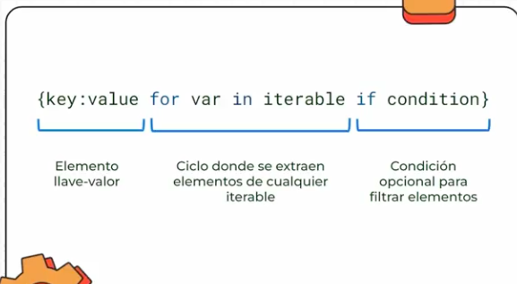
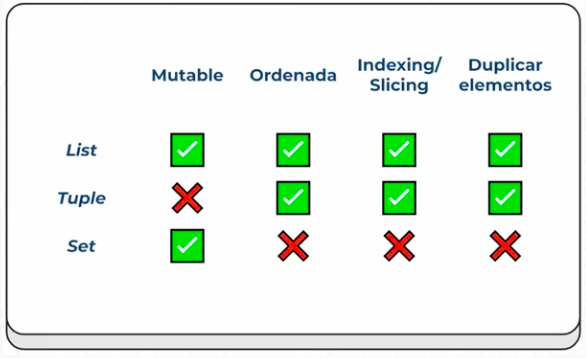
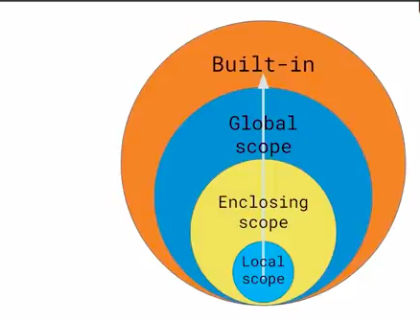
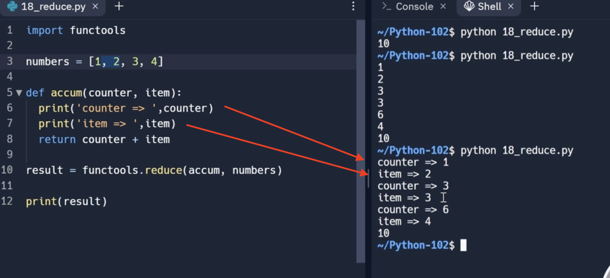
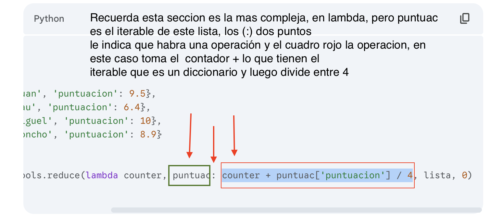

# Curso de Python: Comprehensions, Funciones y Manejo de Errores

> Fortalece tus habilidades de programación con Python, uno de los lenguajes más utilizados. Aprende conceptos como funciones, comprehensions, errores y manejo de archivos que elevarán tu nivel al programar. Crea un gran proyecto junto a tu profesor Nicolas Molina


## Clase 1: El ZEN Python 

> El Zen de Python es una colección de principios que define la filosofía detrás de este lenguaje. Estos principios te guiarán para escribir un código más limpio y mantenible. Vamos a explorarlo ejecutando el siguiente comando en Python

- "Bello es mejor que feo": El código debe ser estéticamente agradable.
- "Explícito es mejor que implícito": La claridad siempre debe priorizarse.
- "Simple es mejor que complejo": Busca siempre la solución más sencilla.
- "La legibilidad cuenta": El código debe ser fácil de leer y entender.

## ZEN completo 

- Hermoso es mejor que feo.
- Explícito es mejor que implícito.
- Simple es mejor que complejo.
- Complejo es mejor que complicado.
- Plano es mejor que anidado.
- Disperso es mejor que denso.
- La legibilidad cuenta.
- Los casos especiales no son tan especiales como para quebrantar las reglas.
- Aunque lo práctico gana a la pureza.
- Los errores nunca deberían pasar silenciosamente.
- A menos que se silencien explícitamente.
- Frente a la ambigüedad, evitar la tentación de adivinar.
- Debería haber una, y preferiblemente solo una, manera obvia de hacerlo.
- Aunque esa manera no sea obvia a menos que seas Holandés.
- Ahora es mejor que nunca.
- Aunque nunca es a menudo mejor que *ahora* mismo.
- Si la implementación es difícil de explicar, es una mala idea.
- Si la implementación es fácil de explicar, puede que sea una buena idea.
- Los espacios de nombres son una gran idea, ¡hagamos más de esas!


## Notas: 

 - import this permite importar el zen de python 


## Clase 2: Sets ó Conjuntos 
> Los conjuntos son una estructura de datos en Python que te ofrece una manera eficiente de manejar elementos que comparten ciertas características


## Caracteristicas  
- Se pueden modificar
- No tienen un orden
- No pueden tener elementos duplicados

```python

# no tiene un par key-value, así me doy cuenta que es un set, un conjunto.
set_countries = {'col', 'mex', 'bol'}
print (set_countries)

# si yo pongo algo repetido, él me lo quita al imprimir
set_countries2 = {'col', 'mex', 'bol', 'col'}
print (set_countries2) # {'col', 'mex', 'bol'}

# puede ser mixto. El set se ordena solo, lo importante es lo que tengo dentro.
set_types = {1, 'hola', False, 12.12}
print(set_types) # {False, 1, 12.12, 'hola'}

# la podemos crear a partir de un string
set_from_string = set('hoola')
print (set_from_string) # {'a', 'l', 'o', 'h'}

# la podemos crear a partir de una tupla
set_from_tuples = set (('abc','cbv','as','abc'))
print (set_from_tuples) # {'as', 'abc', 'cbv'}

# la podemos crear a partir de una lista
numbers = [1,2,3,1,2,3,4]
set_numbers= set(numbers)
print (set_numbers) # {1, 2, 3, 4}
# si quiero convertir este set único a una lista, lo puedo hacer:
unique_numbers = list(set_numbers)
print (unique_numbers)

```


## Clase 3: Modificando conjuntos

> Modificar conjuntos en Python ofrece una versatilidad notable, permitiéndonos actualizar, añadir o remover elementos de manera ágil.

## Funciones de set:
- len(): Tamaño del conjunto 

- add(): Añade un elemento.

- update(): Añade cualquier tipo de objeto iterable como: listas, tuplas.

- discard(): Elimina un elemento y si ya existe no lanza ningún error.

- remove(): Elimina un elemento y si este no existe lanza el error “keyError”.

- pop(): Nos devuelve un elemento aleatorio y lo elimina y si el conjunto está vacío lanza el error “key error”.

- clear(): Elimina todo el contenido del conjunto.

```python
set_countries = {'col', 'mex', 'bol'}

#len() : Devuelve el tamaño del conjunto
size = len(set_countries)
print(size)

#in, nueva Forma busqueda, [in] permite sabes si un elemento se encuentra en el conjunto, la expresión se evalua como true si el elemento se encuentra en el conjunto y false si el elemento no se encuentra en el conjunto
print('col' in set_countries)
print('pe' in set_countries)

# add(): Añade un elemento al conjunto.
set_countries.add('pe')
print(set_countries)
set_countries.add('pe')
print(set_countries)

# update(): Añade cualquier tipo de objeto iterable como: listas, tuplas
set_countries.update({'ar', 'ecua', 'pe'})
print(set_countries)

# remove(): Elimina un elemento y si este no existe lanza el error “keyError”
set_countries.remove('col')
print(set_countries)
set_countries.remove('ar')

#discard(): Elimina un elemento y si ya existe no lanza ningún error
set_countries.discard('arg')
print(set_countries)
set_countries.add('arg')
print(set_countries)

#pop(): Nos devuelve un elemento aleatorio y lo elimina y si el conjunto está vacío lanza el error “key error”.
print(set_countries.pop())
print(set_countries)

#clear(): Elimina todo el contenido del conjunto
set_countries.clear()
print(set_countries)
print(len(set_countries))

# Validar si exite un elemento 
isVal = 'col' in set_countries
print(isVal)

# sorted Ordenar alfabeticamente 
set_countries = {"col", "bol", "mex"}
print(sorted(set_countries))

```


## Clase 4: Operaciones con conjuntos
> Conocer cómo manipular conjuntos y realizar operaciones con ellos es esencial en áreas como programación, matemática y ciencia de datos

- union(set): Realiza la operacion “union” entre dos conjuntos. La unión entre dos conjuntos es sumar los elementos de estos sin repetir elementos. Esta operación tambien se puede realizar con el signo “|”: set_a | set_b.

- intersection(set): Realiza la operacion “intersection” entre dos conjuntos. La intersección entre dos conjuntos es tomar unicamente los elementos en común de los conjutnos. Esta operación tambien se puede realizar con el signo “&”: set_a & set_b.

- difference(set): Realiza la operacion “difference” entre dos conjuntos. La diferencia entre dos conjuntos es restar los elementos del segundo conjunto al primero. Esta operación tambien se puede realizar con el signo “-”: set_a - set_b.

- symmetric_difference(set): Realiza la operacion “symmetric_difference” entre dos conjuntos. 
La diferencia simetrica entre dos conjutnos consta de restar todos los elementos de ambos exceptuando el elemento en común. Esta operación tambien se puede realizar con el signo “^”: set_a ^ set_b.

## NOTA: No se pueden realizar operaciones con otras colecciones de datos, solo se puede únicamente entre conjuntos.

```python

set_a = {'col', 'mex', 'bol'}
set_b = {'pe', 'bol'}

# unión de los elementos
set_c = set_a.union(set_b)
print(set_c) # {'col', 'mex', 'bol', 'pe'}
print(set_a | set_b)  # {'col', 'mex', 'bol', 'pe'}

# obtener los elementos en común
set_c = set_a.intersection(set_b)
print(set_c) # {'bol'}
print(set_a & set_b)  # {'bol'}

# dejamos sólo los elementos de A
set_c = set_a.difference(set_b)
print(set_c)  # {'col', 'mex'}
print(set_a - set_b)  # {'col', 'mex'}
e
# es hacer una unión, sin los elementos en común
set_c = set_a.symmetric_difference(set_b)
print(set_c) # {'col', 'mex', 'pe'}
print(set_a ^ set_b) # {'col', 'mex', 'pe'}


```


## Clase 5: Playgrounds: Elimina elementos duplicados usando conjuntos
> Podemos usar union para resolver ciertos problemas de conjuntos  


```python
set_a = {'leo1', 'leo2', 'leo3'}
set_b = {'leo1', 'leo2', 'leo3', 'leo4'}
set_c = {'leo2', 'leo4', 'leo6', 'leo8'}

new_set = (set_a | set_b | set_c )
print(new_set) ## leo1, leo2, leo3, leo4, leo6, leo8


```

## Clase 6: List Comprehension
> El List Comprehension es una técnica poderosa y eficiente en Python que permite generar listas de manera concisa. Su sintaxis más corta y directa mejora la legibilidad del código, uno de los principios fundamentales de Python

# Sintaxis 


```python
## Antes 
days = ["lunes", "martes", "miercoles", "jueves", "viernes", "sabado", "domingo"]
newlist = []

for i in days:
  if "a" in i:
    newlist.append(i)

print(newlist) #["martes", "sabado"]

## Ahora 

days = ["lunes", "martes", "miercoles", "jueves", "viernes", "sabado", "domingo"]

newlist = [i for i in days if "a" in i]

print(newlist) # ["martes", "sabado"]


```

## Clase 7: Dictionary Comprehension
> Una herramienta que permite lograr estas cualidades en la creación de diccionarios es el Dictionary Comprehension. 


## Nota Mentales
- Recuerda si hablamos de diccionario usamos llaves si hablamos de listas usamos corchetes 
- A diferencia de la lista aquí manejamos Key(llave - valor) como te lo indica la imagen es el parametro extra quiero decir esto { llave : operacion ciclo for : condicional } 
- solo en Diccionario usamos : al pricipio del valor retornado  




```python

## Antes 

dict = {}
for i in range(1,5):
    dict[i] = i * 2
    
print(dict)

## Ahora

dict_v2 = { i : i * 2 for i in range(1,5)}
print(dict_v2)

## Otro Ejemplo 
## Antes 
countries = {'col', 'mex', 'bol', 'pe'}
population = {}

import random 

for i in countries:
    population[i] = random.randint(1, 100)

print(population) ## col:100, mex:1, bol:2, pe:140

## ahora

countries = {'col', 'mex', 'bol', 'pe'}
population_v2 = {country : random.randint(1, 100) for country in countries}

## La funcion ZIP  hace la union de una lista con otra OJO LISTAS OSEA ESTAS [] NO DICCIONARIOS ESTOS NO {}

names = ['nico', 'zule', 'santi']
ages = [12,14,98]

union_lista = list(zip(name, ages))

new_dict = {name: age for (name, age) in zip(names, ages)}

print(new_dict) 


```


## Clase 8: Dictionary Comprehension: condition
> Ahora incluimos un condicional a la estructura  


## Nota Mentales
- Recuerda si hablamos de diccionario usamos llaves si hablamos de listas usamos corchetes 
- A diferencia de la lista aquí manejamos Key(llave - valor) como te lo indica la imagen es el parametro extra quiero decir esto { llave : operacion ciclo for : condicional }  


```python

import random 

countries = {'col', 'mex', 'bol', 'pe'}
result_population_mayor = {}

population_v2 = {country : random.randint(1, 100) for country in countries }
print(population_v2)

result_population_mayor = { country : population for (country, population) in population_v2.items() if population > 50 }

print(result_population_mayor)

```

## Clase 9: Playgrounds: Crea una lista usando List Comprehension
> Para resolver este desafío, tu reto es refactorizar el código base utilizando la característica de "List Comprehension" de Python.

El código base incluye una lista llamada numbers que contiene números pares e impares. El algoritmo actual selecciona los números pares de esta lista y los agrega a una nueva lista llamada even_numbers.

Tu reto es crear la misma lista utilizando la característica de "List Comprehension" de Python para crear la lista de números pares de manera más concisa y eficiente y el resultado debería quedar en la variable even_numbers_v2. Las dos técnicas deberían de dar el mismo resultado.

```python

numbers = [35, 16, 10, 34, 37, 25]

even_numbers = []
for number in numbers:
  if number % 2 == 0:
    even_numbers.append(number)
print('v1 =>', even_numbers)

# Ahora usando List Comprehension 👇
even_numbers_v2 = []

print('v2 =>', even_numbers_v2)

```

## Clase 10:Lists vs. Tuples vs. Sets
> Cuando se trata de manejar grandes cantidades de información en programación, las estructuras de datos juegan un papel fundamental  




## Nota mentales 
- Hay cuatros factores para comprender el uso de las listas, diccionarios, tuplas,  conjuntos estos 4 factores son : Mutables - Ordenamiento - Indexación - Duplicados 

- Lista        : Son Mutables - Se Pueden Ordenar - Son Indexadas       - Puede Existir Duplicados - Usa Corchetes []
- Tuplas       : NO mutables  - Se Pueden Ordenar - Pueden Indexar      - Puede Exitir Duplicados - Usa parentesis  ()
- Diccionarios : Son Mutables - Se pueden Ordenar - Obligatorio Indexar - Puede existir Valores Duplicados pero no Keys - Usa llaves {} 
- Conjuntos    : Son Mutables - NO son ordenados - NO lleva indexación - NO Permite datos duplicados - Usas Parentesis y el metodo set

## Resumen 

> La elección de qué estructura de datos usar depende del contexto y de lo que se quiera hacer con ella. Las listas son útiles para almacenar colecciones ordenadas de elementos que se pueden modificar, las tuplas son útiles para almacenar colecciones ordenadas de elementos que no necesitan ser modificados y los conjuntos son útiles para almacenar colecciones no ordenadas y no repetidas de elementos


## Clase 11: Funciones
> En el mundo de la programación, las funciones son componentes clave para escribir código eficiente y fácil de mantener. Estas permiten encapsular grandes bloques de código que se ejecutan repetidamente, lo que evita la necesidad de reescribir el mismo código

## Beneficios de usar funciones
El uso de funciones ofrece múltiples beneficios, entre ellos:

- Reutilización del código: Facilita el reciclado de código al encapsular lógica en bloques modulares.
- Mejor mantenimiento: Simplifica el proceso de actualización y depuración al permitir cambios en un solo lugar.
- Claridad y organización: Ayuda a estructurar el código de forma clara, haciendo que sea más legible y entendible.
- Flexibilidad: Permite crear funciones que trabajen con entradas variables, adaptándose a diferentes necesidades del programa.

```python

print('Hola')

def my_print(text):
  print(text * 2)

my_print('Este es my texto')
my_print('Hola')

a = 10
b = 90

c = a + b

def suma(a, b):
  my_print(a + b)

suma(1 ,5) # 6
suma(10, 4) # 14
  

```

## Clase 12: Funciones: return
> Al trabajar con funciones que devuelven un valor, podemos encapsular lógica y realizar cálculos reutilizables que optimizan el manejo de la información en nuestro código.

```python

import io

def calculator(num_1, num_2, op):
  result = 0

  if op == "+":
    result = num_1 + num_2

  elif op == "-":
    result = num_1 - num_2

  elif op == "*":
    result = num_1 * num_2

  elif op == "/":
    try:
        result = num_1 / num_2
    except ZeroDivisionError as e:
        print(f"No se puede dividir entre 0 {num_2} no es valido")
        result = 0

  print(f"{num_1} {op} {num_2} = {result}")

if __name__ == '__main__':
  list_op = ("+", "-", "*", "/")
  op = str(input(f'choose operator with symbol {list_op}: '))
  num_1 = int(input('Choose number: '))
  num_2 = int(input('Choose other number: '))
  calculator(num_1, num_2, op)


```

## Clase 13: Parámetros por defecto y múltiples returns
> maginemos que queremos calcular el volumen de un objeto en base a tres parámetros: length, width y depth. La función se define de la siguiente manera:

## Notas 
- Podemos en python devolver varios resultados en una misma funcion no es recomendable ya que rompe las Leyes SOLID  
- Pero es importante saber que se puede hacer la sintaxis es al crear la funcion en el return podemos usar las variables declaradas internamente separadas por (,) 
- al recibirlas es una tupla, no mutable y se accede por su indice de la posición  
- podemos tambien declarar bnuevas variables y por la posición del return obtenerlas 
- codigo inferior explicación. 
    
```python
def find_volume(length=1, width=1, depth=1):
  return length * width * depth, width, 'hola'

## Obtenemos por orden de return declarado internamente en la función 
result, width, text = find_volume(width=10)

por_indice = find_volume(width=10)
print(result)
print(width)
print(text)

print(por_indice[0]) ## result => 10 
print(por_indice[1]) ## width => 10
print(por_indice[2]) ## text => hola 
```


## Clase 14: El scope - Alcance 
> Esa es la esencia del concepto de scope o alcance en programación. Tener un buen manejo del scope es vital para evitar errores y lograr un código más limpio y eficiente


## Notas Mentales 
- Existen Scope Local y global 
- Los locales son los que estan dentro de las funciones y fuera de esa función no existe ese valor 
- Las globales las podemos usar dentro de funciones pero hay que enviarla por parametro o declararla explicitamente dentro de la funcion indicando que es global.



```python

price = 100 # global
# result = 200

def increment():
  price = 200
  result = price + 10
  print(result)
  return result

print(price)
price_2 = increment()
print(price_2)
# print(result)

```


## Clase 15: Refactor game
> Refatorizar Juego Piedra papel o tijera 


```python

import random


def choose_options():
  options = ('piedra', 'papel', 'tijera')
  user_option = input('piedra, papel o tijera => ')
  user_option = user_option.lower()

  if not user_option in options:
    print('esa opcion no es valida')
    # continue
    return None, None

  computer_option = random.choice(options)

  print('User option =>', user_option)
  print('Computer option =>', computer_option)
  return user_option, computer_option

def check_rules(user_option, computer_option, user_wins, computer_wins):
  if user_option == computer_option:
    print('Empate!')
  elif user_option == 'piedra':
    if computer_option == 'tijera':
      print('piedra gana a tijera')
      print('user gano!')
      user_wins += 1
    else:
      print('Papel gana a piedra')
      print('computer gano!')
      computer_wins += 1
  elif user_option == 'papel':
    if computer_option == 'piedra':
      print('papel gana a piedra')
      print('user gano')
      user_wins += 1
    else:
      print('tijera gana a papel')
      print('computer gano!')
      computer_wins += 1
  elif user_option == 'tijera':
    if computer_option == 'papel':
      print('tijera gana a papel')
      print('user gano!')
      user_wins += 1
    else:
      print('piedra gana a tijera')
      print('computer gano!')
      computer_wins += 1
  return user_wins, computer_wins

def run_game():
  computer_wins = 0
  user_wins = 0  
  rounds = 1
  while True:
    print('*' * 10)
    print('ROUND', rounds)
    print('*' * 10)

    print('computer_wins', computer_wins)
    print('user_wins', user_wins)
    rounds += 1

    user_option, computer_option = choose_options()
    user_wins, computer_wins = check_rules(user_option, computer_option, user_wins, computer_wins)

    if computer_wins == 2:
      print('El ganador es la computadora')
      break

    if user_wins == 2:
      print('El ganador es el usuario')
      break

run_game()

```


## Clase 16: Playgrounds: Tienda de Tecnología
> Para resolver este desafío, tu reto completar la función message_creator para que retorne un mensaje distinto dependiendo del artículo de tecnología que reciba como entrada.

La función message_creator recibirá como entrada un string que indica el artículo de tecnología. Luego, deberás evaluar el valor de este string y retornar un mensaje distinto dependiendo del valor que reciba.

La implementacion debe responder al siguiente comportamiento:

Si recibes una computadora, debes retornar el mensaje: "Con mi computadora puedo programar usando Python".
Si recibes un celular, debes retornar el mensaje: "En mi celular puedo aprender usando la app de Platzi".
Si recibes un cable, debes retornar el mensaje: "¡Hay un cable en mi bota!".
Y si no recibes ninguno de estos valores, debes retornar el mensaje: "Artículo no encontrado".


```python

def message_creator(text):
   # Escribe tu solución 👇
    mensaje = ''
    match text:
        case "computadora":
            mensaje = "Con mi computadora puedo programar usando Python"
        case "celular":
            mensaje = "En mi celular puedo aprender usando la app de Platzi"
        case "cable":
            mensaje = "¡Hay un cable en mi bota!"
        case _:  # El equivalente a 'default'
            mensaje = "Artículo no encontrado"

   return mensaje


list_op = ("computadora", "celular", "cable")
op = str(input(f'choose operator with symbol {list_op}: '))
response = message_creator(op)
print(response)

```

## Clase 17: Funciones anónimas: lambda
> Las funciones lambda en Python son una herramienta increíblemente versátil que se utilizan para crear funciones anónimas y de sintaxis simplificada.

## Notas Mentales 
- lambda lo podemos anidar dentro de una lista 
- lambda la podemos asignar a una variable 
- Estructura lambda: ´lambda argumentos: expresión´


## En resumen, para recordar la estructura:

- Empieza con lambda.
- Luego vienen los argumentos (como en una función normal, separados por comas).
- Después van dos puntos :.
- Finalmente, la expresión de una sola línea que se va a calcular y retornar.

## Recuerda: 
> Las funciones lambda son concisas y útiles para operaciones simples de una sola expresión. Para lógica más compleja, es mejor definir una función normal con def.

```python

def increment(x):
  return x + 1


increment_v2 = lambda x: x + 1

result = increment(10)
print(11)

result = increment_v2(20)
print(result)

full_name = lambda name, last_name: f'Full name is {name.title()} {last_name.title()}'

text = full_name('nicolas', 'perez casas')
print(text)

## Ejemplos prácticos:

## Con map() para duplicar cada elemento de una lista:

numeros = [1, 2, 3, 4]
duplicados = list(map(lambda x: x * 2, numeros))
print(duplicados)  # Salida: [2, 4, 6, 8]

## Con filter() para obtener solo los números pares de una lista:

numeros = [1, 2, 3, 4, 5, 6]
pares = list(filter(lambda x: x % 2 == 0, numeros))
print(pares)  # Salida: [2, 4, 6]

## Con sorted() para ordenar una lista de tuplas por el segundo elemento:

datos = [("Juan", 25), ("Ana", 30), ("Pedro", 20)]
ordenados = sorted(datos, key=lambda item: item[1])
print(ordenados)  # Salida: [('Pedro', 20), ('Juan', 25), ('Ana', 30)]

```

## Clase 18: Higher order function: una función dentro de otra función
> El concepto de Higher Order Functions (HOF) puede parecer un poco abstracto al principio, pero entenderlo te ofrece un nuevo enfoque para solucionar problemas de programación.

## Notas mentales 
- Cuando declaramos una funcion dentro de otra, solo se usa su nombre no los parametros 
- recuerda cuando declaramos la segunda funcion internamente recibira los parametros que se usaran al principio de la segunda ejemplo my_func_uno(val1, val2, my_func_dos) 
- ya en la uno usamos esos parametros y se lo anexamos a la función que metemos los valores 

```python

def increment(x):
  return x + 1

increment_v2 = lambda x: x +1

def high_ord_func(x, func):
  return x + func(x)

high_ord_func_v2 = lambda x, func: x + func(x)

result = high_ord_func(2, increment)
# 2 + (2 + 1)
print(result)

result = high_ord_func_v2(2, increment_v2)
print(result)

result = high_ord_func_v2(2, lambda x: x + 2)
print(result)

## change
result = high_ord_func_v2(2, lambda x: x * 5)
print(result)

```

## Clase 19: Map 
> La función map es una de las herramientas más poderosas que Python ofrece para la manipulación y transformación de listas. Su principal objetivo es aplicar una función determinada a cada elemento de una lista, generando así una nueva lista con los elementos transformados.

## Estructura
- Paso 1: tenemos una lista o hacemos una lista []
    -numeros = [1, 2, 3, 4, 5]

- Paso 2: tenemos una funcion corta simple o lambda
    def cuadrado(n):
        return n ** 2

- Paso 3: podemos usar la palabra reservada map() que recibe una funcion y una lista
    map(cuadrado, numeros)

- Paso 4: podemos meter esa map en una variable pero recuerda regresa un objeto tipo map para ver realmente el resultado debemos convertirlo luego en una lista   
    resultado =  map(cuadrado, numeros)

- Paso 5: no hay que olvidar tranformar el resultado de map en una lista 
    print(list(resultado))

```python
numeros = [1, 2, 3, 4, 5]

def cuadrado(n):
  return n ** 2

resultados = map(cuadrado, numeros)
print(resultados)  # Output: <map object at 0x...>
print(list(resultados))  # Output: [1, 4, 9, 16, 25]

## Otro ejemplo 
numeros_str = ["10", "20", "30"]
numeros_int = map(int, numeros_str)
print(list(numeros_int))  # Output: [10, 20, 30]

## usando Lambda 

numeros = [1, 2, 3]
dobles = map(lambda x: x * 2, numeros)
print(list(dobles))  # Output: [2, 4, 6]
```


## Clase 20: Map con diccionarios
> Has escuchado hablar de map en Python, ¿verdad? Esta función es una herramienta eficiente que te permite transformar listas de forma elegante, incluso cuando estás trabajando con estructuras de datos más complejas como los diccionarios


```python

items = [
    {"producto": "camisa", "precio": 100},
    {"producto": "pantalones", "precio": 300},
    {"producto": "pantalones 2", "precio": 200},
]

precios = list(map(lambda item: item["precio"], items))
print(precios)  # Output: [100, 300, 200]


def agregar_impuestos(item):
    item["impuestos"] = item["precio"] * 0.19
    return item

nuevos_items = list(map(agregar_impuestos, items))


```

## Clase 21: Reto: map con inmutabilidad
> 


```python

items = [
  {
    'product': 'camisa',
    'price': 100,
  },
  {
    'product': 'pantalones',
    'price': 300
  },
  {
    'product': 'pantalones 2',
    'price': 200
  }
]

def add_taxes(item):
  new_item = item.copy()
  new_item['taxes'] = new_item['price'] * .19
  return new_item

new_items = list(map(add_taxes, items))
print('New list')
print(new_items)
print('Old list')
print(items)

```

## Clase 22: Playgrounds: Multiplica todos los elementos por dos
> Para resolver este desafío, tu reto es utilizar la función map de Python y una función lambda para transformar una lista de números. Debes retornar una lista en la que cada número de la lista original sea multiplicado por dos.

La función multiply_numbers recibirá como entrada una lista con números. Finalmente, la función retornará la lista transformada.


```python

def multiply_numbers(n):
    # Escribe tu solución 👇
    return n*2

numbers = [1, 2, 3, 4]
response = map( multiply_numbers, numbers)

print(number)
print(list(response))

```


## Clase 23: Filter
> El método Filter es una herramienta poderosa en Python que permite seleccionar ciertos elementos de una lista para crear una nueva lista basada en una condición específica.

## Notas Mentales 
- Map lo usamos para transformar datos 
- filter podemos filtrar datos 
- al igual que map retorna un objeto filter por lo que para poder ver el resultado debemos tranformar usando list()

FILTER La función filter(), devuelve un valor que esta siendo iterado de la cual su resultado será el valor que se esta buscando en el filter

SINTAXIS
_filter (function, iterable_)

Valores.
filter: Una función que se ejecutara para cada elemento iterable iterable: Lo que se va a filtrar.


```python

## ejemplo usando Lista con dicionarios adentro 

matches = [
  {
    'home_team': 'Bolivia',
    'away_team': 'Uruguay',
    'home_team_score': 3,
    'away_team_score': 1,
    'home_team_result': 'Win'
  },
  {
    'home_team': 'Brazil',
    'away_team': 'Mexico',
    'home_team_score': 1,
    'away_team_score': 1,
    'home_team_result': 'Draw'
  },
  {
    'home_team': 'Ecuador',
    'away_team': 'Venezuela',
    'home_team_score': 5,
    'away_team_score': 0,
    'home_team_result': 'Win'
  },
]

print(matches)
print(len(matches))

new_list = list(filter(lambda item: item['home_team_result'] == 'Win', matches))

def condicionalJuego(item):
    if item['home_team_result'] == 'Win':
        return item

new_list_func = list(filter(condicionalJuego, matches))

##print(new_list)
print(len(new_list))

##print(matches)
print(len(matches))

##print(new_list_func)
print(len(new_list_func))

```

## Clase 24: Playgrounds: Retorna solo palabras de 4 letras y más
> para resolver este desafío, tu reto es usar la función filter de Python y una función lambda para filtrar una lista de palabras, retornando una lista solo con las que cumplan con la condición de tener 4 o más letras.

La función filter_by_length recibirá como entrada una lista con palabras. Finalmente, la función retornará la lista filtrada.


```python

def filter_by_length(word):
    # Escribe tu solución 👇
    if len(word) => 4:
        return word

words = ['amor', 'sol', 'piedra', 'día']
response = list(filter(filter_by_length, words))
print(response)


```


## Clase 25: Reduce
> La función reduce es una herramienta poderosa en Python, esencial para transformar una lista en un solo valor mediante la acumulación de sus elementos

Reduce(fun, seq) tiene dos parametros:

Una función particular a aplicar a todos los elementos de una secuencia
Una secuencia de elementos.
Como funciona:

Primero toma los dos primeros elementos de la secuencia y aplica la función particular.
Toma el resultado anterior y a este valor mas el siguiente elemento de la secuencia le aplica la función particular.
El proceso continua hasta que no tiene mas elementos.
Retorna el resultado.

## Notas mentales 
- es complejo de entender 
- El reduce en su funcion interna o lambda debe enviarse dos parametros el acumulador y el items iterable 
- ya que devuelve siempre un valor 
- es usado para reducir como su nombre lo indica 
- La imagen indica como se comporta internamente 
- El metodo reduce puede recibir otro argumento y es indicando el valor inicial del counter, si no se envia este por defecto sera cero, pero si lo envias pues el counter iniciará desde ese valor enviado por parametro 




```python

import functools import reduce

# Lista de números
numbers = [1, 2, 3, 4]

# Uso de reduce para sumar todos los elementos
result = functools.reduce(lambda counter, item: counter + item, numbers)

# Imprimir el resultado
print(result)  # Salida: 10

## Otro ejemplo 

def accum(counter, item):
	return counter + item

print(reduce(accum, [1, 2, 3, 4]))


## Otro ejemplo 
numbers = (3012,63,1,121,23,5334)
print(f'Lista original \n{numbers}')

def mayor(numbers):
  result = reduce(max, numbers)
  return result

max_num = mayor(numbers)
print(f'Numero Máximo \n{max_num}')

## otro ejemplo 

num = [8, 1, 2, 3, 4]
def mayor(counter, item):
    if counter <= item :
        return item
    else :
        return counter

result = functools.reduce(mayor, num) 
print (result)

## Otro ejemplo 

from functools import reduce

items = [
    {'name':'Mouse',
    'price':100,
    'id': 1},
    {'name':'Teclado',
    'price': 300,
    'id': 2},
    {'name':'Monitor',
    'price':200,
    'id': 3},
    {'name':'Celular',
    'price':150,
    'id':4},
    {'name':'Alcohol',
    'price':475,
    'id': 5},
    {'name':'Control',
    'price': 750,
    'id': 6},
    {'name':'Cuaderno',
    'price':45,
    'id': 7},
    {'name':'Tablero',
    'price':650,
    'id':8}
]

def how_come(a,b):
    return a + b


list_num = list(map(lambda x:x['price'],items))
conclus = reduce(lambda a,b:a + b,list_num)
conclus = reduce(how_come,list_num)
print(conclus)


## Otro ejemplo 

import functools
##          counter , items            
def interes(cantidad, interes):
  print(cantidad)
  return cantidad * (1 + interes / 100 / 12)

inflacion = [7.07, 7.28, 7.45, 7.68, 7.65, 7.99]

result = functools.reduce(interes, inflacion, 599)

print(result) 

## Otros ejemplos

import functools


#1. Dada una lista de diccionarios con claves "producto" y "cantidad", calcular el total de la cantidad de productos.


lista = [ {
            'producto' : 'cajas',
            'cantidad': 50
          },
          { 
            'producto' : 'lapices',
            'cantidad': 32
          },
         { 
            'producto' : 'cuadernos',
            'cantidad': 12
          },
         { 
            'producto' : 'pincel',
            'cantidad': 3
          }
        ]


resultado = functools.reduce(lambda counter, cantidad: counter+cantidad['cantidad'], lista, 0)
print(resultado)

import functools


# 2. Dada una lista de diccionarios con claves "nombre" y "puntuacion", calcular el promedio de puntuaciones.


lista = [ {
            'nombre' : 'juan',
            'puntuacion': 9.5
          },
          { 
            'nombre' : 'lau',
            'puntuacion': 6.4
          },
         { 
            'nombre' : 'miguel',
            'puntuacion': 10
          },
         { 
            'nombre' : 'poncho',
            'puntuacion': 8.9
          }
        ]


resultado = functools.reduce(lambda counter, puntuac: counter+puntuac['puntuacion']/4, lista, 0)
print(resultado)

```


## Clase 26: Modulos 
> MODULO Un modulo se puede definir que es lo mismo a una biblioteca de código. Es decir es un archivo que contiene un conjunto de funciones que se pueden aplicar.

## Como crear un Módulo?
- Para crear un módulo debemos escribir el nombre del archivo + la extensión de python que es .py ejemplo name.py
- Escribimos el código que vamos a utilizar en el archivo que acabamos de nombrar.
- Abrimos el archivo con el cual vamos a trabajar y declaramos el modulo que le dimos el nombre por ejemplo con la extensión import, sería de la siguiente manera: import name

## ¿Cómo se utilizan los módulos integrados en Python?
> Python incluye una amplia variedad de módulos integrados que facilitan tareas comunes en programación. Algunos de estos módulos son:

. Random: Proporciona herramientas para generar números aleatorios o seleccionar elementos al azar.

- Sys: Proporciona acceso a variables y funciones específicas del sistema interactuando con el intérprete.

- Re: Permite trabajar con expresiones regulares, una técnica potente y flexible para buscar y manipular texto.

- Time: Facilita la obtención y manipulación de horas y fechas en diversos formatos.

- Collections: Ofrece estructuras de datos especializadas como listas, diccionarios y colas, extendiendo capacidades estándar.


```python


```


## Clase 27-28: Mis propios módulos Y Módulos como scripts
> Al comenzar a trabajar en proyectos de programación en Python, modularizar el código es una práctica esencial que mejora la organización y el mantenimiento del mismo

## Nota Mental 
- Recuerda que si impotamos modulos este se ejecuta eso hay que evitarlo se usa el Entry point 
- Por eso en los modulos se generan funciones para que se pueda acceder de manera explicitamente 
- Para Manejar la Dualidad al importar   -> Se le llama: Entry point
  if name == "main": run()
- if __name__ == "__main__":
	run() -> Este if dice que si es ejecutado desde la terminal, entre al run y si es ejecutado desde otro archivo, no se ejecuta.

- 

```python

# Archivo utils.py 


def saludaEsp():
    print("Hola Mundo")

def saludaItaliano():
    print("Bongiorno")

def saludaFrances():
    print("Bonjour")

def saludaEng():
    print("Hello")

# Archivo main.py 

from utils import saludaEsp

saludaEsp()

```
## Clase 29: Paquetes
> Un paquete en Python es fundamentalmente una carpeta que contiene múltiples módulos, lo que permite una mejor organización y reutilización del código

Buenas prácticas para el trabajo con paquetes
Trabajar con paquetes y el archivo __init__.py eficientemente puede mejorar la mantenibilidad y escalabilidad de tus proyectos. Aquí algunas recomendaciones:

Usa __init__.py para gestionar importaciones: Al definir imports dentro de este archivo, facilitas el uso de un namespace que es más limpio y reduce errores de nombre duplicado.

Explora ejemplos profesionales: Examina proyectos open-source como los de Sebastián Ramírez para conocer prácticas de creación de APIs y ver cómo se estructuran paquetes profesionales.


```python


from utils.saludar import saludaEng
from conexion.bd import conectaBd

saludaEng()

conectaBd()


```


## Clase 30: Playgrounds: Calcular la suma de todas las compras
> No lo resolvimos


```python


```

## Clase 31: Iterables
> Entender los iterables es fundamental para cualquier programador, ya que son una herramienta crucial en la manipulación de datos. 


ITERABLES Un iterable se define como el objeto que contiene un número contable con valores y este al tener un valor puede recorrer uno a uno los elementos que la contienen como una estructura de datos y operar con ellos, pero a la vez se rigen bajo la instrucción que se le es dada, con lo cual son dependientes de la instrucción a recibir.

Los metodos de su uso son dos __iter__() y __next__() .

Veamos un ejemplo:

Tenemos una serie de frutas las cuales debemos recorrer una a una para saber cuales son las que están dentro de la lista.

## Nota Mentales 
- Es iterarlo de manera manual con la palabra next(), esto permite ahorrar recurso imagina que tiene que dar un millon de iteraciones entonces con next() podemos solo iterar lo que deseamos 
- Desventajas si usamos next() y ese iterable no se ha generado nos muestra un error de StopIteration porque no tiene mas nada que iterar. 


```python

# Creamos un rango de números del 1 al 10
myIterable = range(1, 11)

# Convertimos el rango en un iterador
myIter = iter(myIterable)

# Imprimimos los valores del iterador uno a uno
print(next(myIter))  # Imprime 1
print(next(myIter))  # Imprime 2


```

## Clase 32: Errores en Python
> A lo largo de tu camino como desarrollador en Python, es fundamental aprender a identificar y manejar distintos tipos de errores. Al conocer estos errores, no solo podrás resolver problemas rápidamente, sino también mejorar la robustez de tu código.


Desde aqui muchas felicidades a todos por llegar hasta aqui. ╰(°▽°)╯


```python

suma = lambda x,y: x + y
assert suma(2,2) == 4

print('Hola 2')

age = 10
if age < 18:
  raise Exception('No se permiten menores de edad')

```

## Clase 33: Manejo de excepciones
> PRUEBA & ERROR Cuando se nos presenta un error o una excepción como se le llama en python, el programa se detiene y presenta el error que se presento, pero si utilizamos la excepción try() podemos omitir ese error y continuar con el programa. Esto es de uso fundamental para que el programa no continue con su ejecución por el error y así evitar retrasos en la producción, también de su uso para determinar en los bloques de código si se nos presenta un error poder ser identificado de manera mas facil.

Para qué try sea efectivo podemos utilizar estas declaraciones:

- Exception	Description
- try 	Permite probar un bloque de código en búsqueda de un error.
- except 	Permite manejar el tipo de error en el bloque.
- else 	Permite ejecutar el código cuando no hay ningún tipo de error en el bloque.
- finally 	Permite ejecutar el código en el bloque, independiente en el resultado de los bloques de prueba y excepción

```python

try:
    pass
except Exception as e:
    raise
else:
    pass
finally:
    pass


```


## Clase 34 : Captura la excepción: ZeroDivisionError
> 

```python


```


## Clase 35 : Leer un archivo de texto
> Aprender a manejar la lectura de archivos de texto en Python puede ser una habilidad crucial para todo desarrollador. Esta habilidad nos permite acceder a grandes volúmenes de datos, manipularlos y analizarlos de manera eficiente


## Notas Mentales 

- Excelente, muy importante saber que el .read ocupa mas espacio en memoria y que siempre se debe cerrar con .close, y para evitar esto, mejor debemos usar el with open. Muchas gracias!

- Una mejor manera de manipular archivos es utilizando context managers, porque garantizan que el archivo se cierre. With es un manejador contextual, controlar el flujo y que el archivo no se rompa

-  También es recomendable usar esta estructura para que no aparezcan símbolos raros encaso de que se sean archivos binarios. 'r' = para leer el archivo 'encoding="UTF-8' = convierte todo en letras ´with open("./archivos/numbers.txt", "r", encoding="UTF-8") as f:´

- Para archivos cortos podemos usar readLine() ya que funciona como un iterator tu le dices linea por linea y vas obteniendo el resultado linea por linea. 

- Siempre que podamos leer el archivo hay que cerrarlo 


```python

## Forma BAsica interada linea por linea 
file = open('./text.txt')
# print(file.read())
# print(file.readline())
# print(file.readline())
# print(file.readline())
# print(file.readline())

## usanjdo for y cerrando el archivo 
for line in file:
  print(line)

file.close()

## Otra forma la mas recomendada ya que maneja automaticamente el autoclose

with open('./text.txt', "r", encoding="UTF-8") as file:
  for line in file:
    print(line)


```

## Clase 36: Escribir en un archivo
> A la hora de manejar archivos de texto en Python, saber cómo escribir y leer en ellos es esencial. Ya sea para registrar datos o simplemente para modificar archivos existentes, el lenguaje Python brinda herramientas poderosas para hacerlo de manera eficiente. 

## Notas mentales 

- r: Permisos de solo lectura.
- w: Permisos de solo escritura, lo que sobrescribe el archivo si ya existe.
- r+: Permisos de lectura y escritura sin borrar el contenido existente.
- w+: Permisos de lectura y escritura que sobrescriben el contenido.
- https://www.w3schools.com/python/python_file_write.asp


```python

with open('./texs.txt', 'w+') as file:
  for line in file:
    print(line)
  file.write('nuevas cosas en este archivo\n')
  file.write('otra linea\n')
  file.write(' mas linea\n')


```

## Clase 37: Leer un CSV
> Los archivos CSV son una herramienta fundamental en el manejo y análisis de datos. Son ampliamente utilizados por equipos de finanzas y data science debido a su versatilidad para organizar información en filas y columnas.

## NOTAS MENTALES 
- El open es un iterable podemos acceder linea por linea usando next()

## Pasos para leer un CSV 

## Paso 1: Configurar el entorno
- Subir el archivo CSV: Antes de empezar a trabajar, debes subir el archivo worldpopulation.csv a la carpeta de tu proyecto y renombrarlo como data.csv.

- Crear un módulo para leer el CSV: Crea un nuevo archivo Python, read_with_csv.py, donde desarrollarás el script para procesar el CSV.

## Paso 2: Importar el módulo CSV de Python
- Comienza por importar el módulo nativo csv de Python, el cual facilita la lectura y manipulación de archivos CSV.

## Paso 3: Definir la función de lectura
Esta función leerá el archivo CSV y lo procesará:

```python
import csv


def read_csv(file_path):
    with open(file_path, mode='r') as csv_file:
        reader = csv.reader(csv_file, delimiter=',')
        data = []
        for row in reader:
            print("Esto es una fila:", row)
            data.append(row)
        return data
```

## ¿Cómo transformar datos CSV en diccionarios?
Una vez que tenemos los datos del CSV, es crucial transformarlos en un formato de diccionario para facilitar su manipulación y consulta.

## Paso 4: Extraer el encabezado
El encabezado del CSV nos proporcionará los nombres de las columnas, que serán las claves en nuestros diccionarios:

```python
header = next(reader)
```

## Paso 5: Convertir filas en diccionarios
Utilizamos zip para crear pares clave-valor con el encabezado y cada fila del CSV, generando así una lista de diccionarios:

```python
for row in reader:
    country_data = {key: value for key, value in zip(header, row)}
    data.append(country_data)
```

## ¿Cómo ejecutar el script como un programa independiente?
Configura tu módulo para que funcione tanto como parte del proyecto como un script independiente:
```python
if __name__ == "__main__":
    data = read_csv('app/data.csv')
    print(data[0])
```
## EJEMPLO 

```python
import csv

def read_csv(path):
  with open(path, 'r') as csvfile:
    reader = csv.reader(csvfile, delimiter=',')
    header = next(reader)
    data = []
    for row in reader:
      iterable = zip(header, row)
      country_dict = {key: value for key, value in iterable} ## Importante punto s
      data.append(country_dict)
    return data

if __name__ == '__main__':
  data = read_csv('./app/data.csv')
  print(data[0])


```

## Clase 38: Lee un CSV para calcular el total de gastos - Playgrounds: Lee un CSV para calcular el total de gastos
> 

Para resolver este desafío, debes utilizar el archivo data.csv que contiene los datos de los gastos de una empresa. El archivo tiene dos columnas: el nombre del área y el total de gastos del año.

Tu reto es implementar la función read_csv que lee el archivo CSV y calcula el total de gastos de la empresa. Para leer el archivo CSV, puedes utilizar la función open y el módulo csv de Python. Una vez que hayas leído los datos, puedes calcular el total de gastos implementando la lógica que consideres necesaria.

Ejemplo


```python
Input: data.csv
Administration,10
Marketing,20
Purchasing,10
Human Resources,20

Output:
60

```


## Clase 39: Creando una gráfica
> Bienvenido al fascinante mundo de la visualización de datos utilizando Python, un lenguaje conocido por su simplicidad y eficiencia. La visualización de datos no solo es perentoria en cualquier análisis, sino que representa la médula para comunicar resultados de manera clara y persuasiva. En esta guía, exploramos la creación de gráficos utilizando la librería Matplotlib, paso a paso, para facilitar tu aprendizaje y aplicación.

## ¿Qué es Matplotlib?
Matplotlib es una biblioteca de visualización de datos sumamente versátil que facilita la creación de una variedad de gráficos en Python. Aunque no viene instalada por defecto con Python, su instalación es sencilla y compatible con diversas aplicaciones dentro del entorno de desarrollo de datos. Algunos de los gráficos más comunes que puedes crear con Matplotlib son barras (bar charts) y gráficos circulares (pie charts).


## Recomendaciones para seguir aprendiendo
Practica creando más gráficos: Experimenta con diferentes tipos de gráfico, ajusta colores y personaliza configuraciones para mejorar la presentación visual de tus datos.

Profundiza en el uso de Matplotlib: Participa en cursos avanzados que exploran el potencial completo de esta librería. En la sección de recursos de Platzi encontrarás cursos que profundizan en el uso de Matplotlib y otras herramientas de Data Science.

Aplica tus conocimientos en proyectos reales: Desarrolla pequeñas aplicaciones que utilicen gráficos para analizar y presentar datos reales, consolidando tu aprendizaje y habilidades.

## Paso 1: instalar la libreria Matplolib 
- Ejecutar el comando ->  pip install matplotlib
- sudo apt-get install python3-tk


```python

import matplotlib.pyplot as plt

def generate_bar_chart(labels, values):
  fig, ax = plt.subplots()
  ax.bar(labels, values)
  plt.show()

def generate_pie_chart(labels, values):
  fig, ax = plt.subplots()
  ax.pie(values, labels=labels)
  ax.axis('equal')
  plt.show()

if __name__ == '__main__':
  labels = ['a', 'b', 'c']
  values = [10, 40, 800]
  # generate_bar_chart(labels, values)
  generate_pie_chart(labels, values)


## Otro Ejemplo 

import matplotlib.pyplot as plt
#plt es un alias para matplotlib.pyplot


# funcion para grafico de barra
def generate_bar_chart(labels, values):
  fig, ax = plt.subplots()
  #son dos valores que nos da la librería, fig es como la figura y ax se refire a las coordenadas donde  vamos a empezar a graficar
  ax.bar(labels, values)
  #aquí le estás indicando que quieres generar una gráfica de barras (bar), y le envías labels y values para que sepa que tiene que crear el gráfico con esos valores
  plt.show()
  #es para mque nos pide que muestre la gráfica


# funcion para pie chart
def generate_pie_chart(labels, values):
  fig, ax = plt.subplots()
  ax.pie(values, labels=labels)
  """
 Aquí le estamos indicando que queremos que nos muestre una gráfica de torta, 
  fijate que en el anterior pusimos un bar y no un pie.

  Ahora le indicamos los labels pero también tenemos que indicarle como van a ser los labels 
  """
  ax.axis('equal')
  plt.show()


# ejecutar archivo como script desde la terminal
if __name__ == '__main__':
  labels = ['a', 'b', 'c']
  values = [20, 50, 10]
  #son los valores y los labels que tendrá la gráfica
  generate_bar_chart(labels, values)
    #Llamando a la función

  generate_pie_chart(labels, values)
    #Llamamos a la función pie chart

```


## Clase 40: ejemplo usando Pandas para leer y graficar un archivo CSV 
> 


```python

# Importar las bibliotecas necesarias
import pandas as pd
import matplotlib.pyplot as plt

# Leer el archivo CSV con datos de población mundial
df = pd.read_csv('world_population.csv')

# Solicitar al usuario que ingrese el nombre del país
while True:
    nombre_pais = input("Ingrese el nombre del país: ")

    # Verificar si el país está en el DataFrame
    if nombre_pais in df["Country"].values:
        break  # Salir del bucle si el país es válido
    else:
        print("¡País no encontrado! Por favor, ingrese un país válido.")

# Especificar el nuevo orden de las columnas invirtiendo la lista original
desired_order = [
    '1970 Population', 
    '1980 Population', 
    '1990 Population', 
    '2000 Population', 
    '2010 Population', 
    '2015 Population', 
    '2020 Population', 
    '2022 Population'
]
data = df.loc[df["Country"] == nombre_pais, desired_order]

# Crear un gráfico de barras con los datos seleccionados
# Añadir width para especificar el ancho de las barras
plt.bar(data.columns, data.values[0], width=0.6)  

# Configurar el tamaño de la figura
plt.rcParams['figure.figsize'] = (5, 4)  # Ajustar el tamaño según sea necesario

# Rotar las etiquetas del eje x para mejorar la legibilidad
# Cambiar las etiquetas del eje x
nuevas_etiquetas = ['1970', '1980', '1990', '2000', '2010', '2015', '2020', '2022']
plt.xticks(data.columns, nuevas_etiquetas, rotation=45)

# Marcar el eje y con líneas punteadas para indicar el tamaño de la población
for columna, valor_poblacion in zip(data.columns, data.values[0]):
    plt.axhline(
        y=valor_poblacion, 
        color='gray', 
        linestyle='--', 
        linewidth=0.8)
    
    plt.text(
        columna, 
        valor_poblacion, 
        f'{valor_poblacion:,}', 
        va='bottom', ha='right', 
        fontsize=8, color='black'
    )

# Agregar el nombre del país al gráfico
plt.text(
    0.5, 
    1.1, 
    f'País: {nombre_pais}', 
    transform=plt.gca().transAxes, 
    ha='center', 
    va='center', 
    fontsize=20, 
    color='black'
)


# Mostrar el gráfico
plt.show()

```
## Respuestas

1.
¿Cuál de los siguientes es un principio de The Zen of Python?
Los errores nunca deben pasar silenciosamente, ni siquiera si así se expresa explícitamente.
REPASAR

2.
¿Cuál de las siguientes es una propiedad principal CORRECTA de los Sets o Conjuntos en Python?
No pueden tener duplicados.

3.
Tienes un set o conjunto de Python almacenado en la variable trips. ¿Cómo obtienes su cantidad de elementos?
len(trips)

4.
Dado el siguiente bloque de código:
list_comprehension.png
¿Cuál de las siguientes respuestas con List Comprehension nos peermite obtener el mismo resultad con una sintaxis más corta?

n = [i - 1 for i in range(1,6) if i <= 2]

5.
Dado el siguiente bloque de código:
Dictionary Comprehension condition.png
¿Cuál de las siguientes respuestas con Dictionary Comprehension nos permite obtener el mismo resultad con una sintaxis más corta?
d = { e: e - 1 for e in range(1,6) if e <= 2 }

6.
¿Cuál de las siguientes estructuras de datos NO nos permite duplicar elementos?
Set

7.
¿Cuál es la palabra clave reservada para crear una función en Python?
def

8.
Creaste una función sum que recibe 2 parámetros y los suma entre ellos. Ahora debes almacenar el resultado de esas sumas en un conjunto. ¿Cómo lo harias?
func_return_correct.png

9.
Dado el siguiente bloque de código:
def sum(a = 1, b = 0):
  return a + b
¿Cómo enviarías únicamente el valor de b para realizar la suma usando el valor por defecto de a?

No es posible. Para poder enviar un segundo argumento también debemos enviar el valor del primero.
Repasar

10.
¿Cuál de las siguientes funciones SIEMPRE devuelve la misma cantidad de elementos de la lista original?
map

11.
¿Cuál de las siguientes funciones SIEMPRE devuelve un solo valor después de iterar sobre todos los elementos de la lista original?
reduce

12.
¿Cómo se importa el módulo functools (nativo de Python)?
import functools

13.
Creaste una función sum dentro del archivo math.py. Ahora desde el archivo main.py (en la misma carpeta que math.py) debes importar ese módulo y usar la función sum. ¿Cómo lo harías?
import math math.sum(1,2)

14.
¿Cuál es la función del siguinte bloque de código: if __name__ == '__main__'?
Nos informa si el archivo se está ejecutando como script o como módulo.

15.
¿Cuál de los siguientes bloques de código provoca un error en Python?
Todas las respuestas arrojan un error.

16. 
¿Qué uso se le da al método map() de Python?

17. 
¿Cuál de las siguientes estructuras de datos es mutable?
List

18.
¿Cuál estructura de datos usa Python para retornar varios valores en una función?
Tuple

19.
¿Cuál será el resultado del siguiente bloque de código?
{2}

20.
¿Cuál es la forma correcta de crear una función en Python?
def nombre_func:
	# …


21.
¿Cuál es la forma correcta de generar una lista usando comprensión de listas en Python?
characters = [character for character in 'Platzi']


22.
¿Cuál es la diferencia entre remove y discard al trabajar con Sets o Conjuntos en Python?
Si el elemento que eliminamos no existe en el conjunto, remove da error, discard no.


23.
Dado el siguiente bloque de código: print(10 / user_option). Y siendo user_option una variable que puede recibir cualquier valor numérico (incluyendo 0). ¿Cómo manejarías la excepción de división sobre cero para que el código siga ejecutando a pesar del error?

try:
	print(10 / user_option)
except ZeroDivisionError as error:
	print(error) ```


