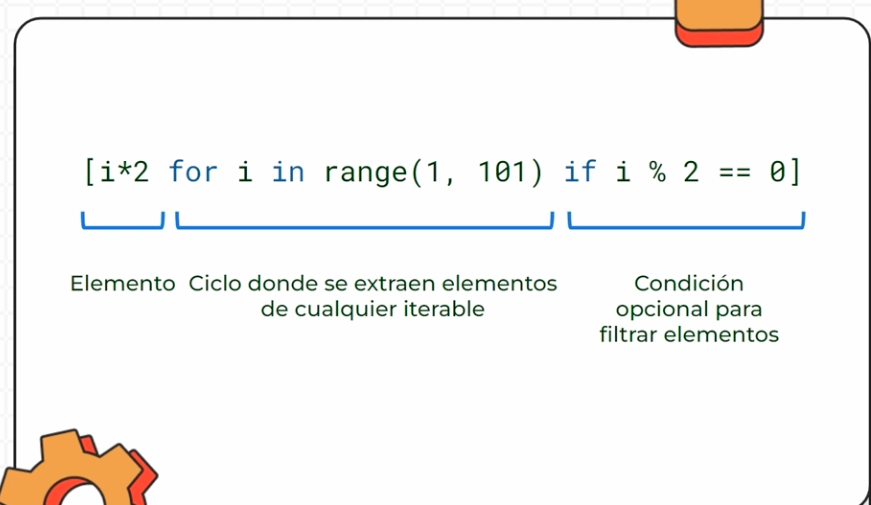

# Curso de Python: Comprehensions, Funciones y Manejo de Errores

> Fortalece tus habilidades de programación con Python, uno de los lenguajes más utilizados. Aprende conceptos como funciones, comprehensions, errores y manejo de archivos que elevarán tu nivel al programar. Crea un gran proyecto junto a tu profesor Nicolas Molina


## Clase 1: El ZEN Python 

> El Zen de Python es una colección de principios que define la filosofía detrás de este lenguaje. Estos principios te guiarán para escribir un código más limpio y mantenible. Vamos a explorarlo ejecutando el siguiente comando en Python

- "Bello es mejor que feo": El código debe ser estéticamente agradable.
- "Explícito es mejor que implícito": La claridad siempre debe priorizarse.
- "Simple es mejor que complejo": Busca siempre la solución más sencilla.
- "La legibilidad cuenta": El código debe ser fácil de leer y entender.

## ZEN completo 

- Hermoso es mejor que feo.
- Explícito es mejor que implícito.
- Simple es mejor que complejo.
- Complejo es mejor que complicado.
- Plano es mejor que anidado.
- Disperso es mejor que denso.
- La legibilidad cuenta.
- Los casos especiales no son tan especiales como para quebrantar las reglas.
- Aunque lo práctico gana a la pureza.
- Los errores nunca deberían pasar silenciosamente.
- A menos que se silencien explícitamente.
- Frente a la ambigüedad, evitar la tentación de adivinar.
- Debería haber una, y preferiblemente solo una, manera obvia de hacerlo.
- Aunque esa manera no sea obvia a menos que seas Holandés.
- Ahora es mejor que nunca.
- Aunque nunca es a menudo mejor que *ahora* mismo.
- Si la implementación es difícil de explicar, es una mala idea.
- Si la implementación es fácil de explicar, puede que sea una buena idea.
- Los espacios de nombres son una gran idea, ¡hagamos más de esas!


## Notas: 

 - import this permite importar el zen de python 


## Clase 2: Sets
> Los conjuntos son una estructura de datos en Python que te ofrece una manera eficiente de manejar elementos que comparten ciertas características


## Caracteristicas  
- Se pueden modificar
- No tienen un orden
- No pueden tener elementos duplicados

```python

# no tiene un par key-value, así me doy cuenta que es un set, un conjunto.
set_countries = {'col', 'mex', 'bol'}
print (set_countries)

# si yo pongo algo repetido, él me lo quita al imprimir
set_countries2 = {'col', 'mex', 'bol', 'col'}
print (set_countries2) # {'col', 'mex', 'bol'}

# puede ser mixto. El set se ordena solo, lo importante es lo que tengo dentro.
set_types = {1, 'hola', False, 12.12}
print(set_types) # {False, 1, 12.12, 'hola'}

# la podemos crear a partir de un string
set_from_string = set('hoola')
print (set_from_string) # {'a', 'l', 'o', 'h'}

# la podemos crear a partir de una tupla
set_from_tuples = set (('abc','cbv','as','abc'))
print (set_from_tuples) # {'as', 'abc', 'cbv'}

# la podemos crear a partir de una lista
numbers = [1,2,3,1,2,3,4]
set_numbers= set(numbers)
print (set_numbers) # {1, 2, 3, 4}
# si quiero convertir este set único a una lista, lo puedo hacer:
unique_numbers = list(set_numbers)
print (unique_numbers)

```


## Clase 3: Modificando conjuntos

> Modificar conjuntos en Python ofrece una versatilidad notable, permitiéndonos actualizar, añadir o remover elementos de manera ágil.

## Funciones de set:
- len(): Tamaño del conjunto 

- add(): Añade un elemento.

- update(): Añade cualquier tipo de objeto iterable como: listas, tuplas.

- discard(): Elimina un elemento y si ya existe no lanza ningún error.

- remove(): Elimina un elemento y si este no existe lanza el error “keyError”.

- pop(): Nos devuelve un elemento aleatorio y lo elimina y si el conjunto está vacío lanza el error “key error”.

- clear(): Elimina todo el contenido del conjunto.

```python
set_countries = {'col', 'mex', 'bol'}

#len() : Devuelve el tamaño del conjunto
size = len(set_countries)
print(size)

#in, nueva Forma busqueda, [in] permite sabes si un elemento se encuentra en el conjunto, la expresión se evalua como true si el elemento se encuentra en el conjunto y false si el elemento no se encuentra en el conjunto
print('col' in set_countries)
print('pe' in set_countries)

# add(): Añade un elemento al conjunto.
set_countries.add('pe')
print(set_countries)
set_countries.add('pe')
print(set_countries)

# update(): Añade cualquier tipo de objeto iterable como: listas, tuplas
set_countries.update({'ar', 'ecua', 'pe'})
print(set_countries)

# remove(): Elimina un elemento y si este no existe lanza el error “keyError”
set_countries.remove('col')
print(set_countries)
set_countries.remove('ar')

#discard(): Elimina un elemento y si ya existe no lanza ningún error
set_countries.discard('arg')
print(set_countries)
set_countries.add('arg')
print(set_countries)

#pop(): Nos devuelve un elemento aleatorio y lo elimina y si el conjunto está vacío lanza el error “key error”.
print(set_countries.pop())
print(set_countries)

#clear(): Elimina todo el contenido del conjunto
set_countries.clear()
print(set_countries)
print(len(set_countries))

# Validar si exite un elemento 
isVal = 'col' in set_countries
print(isVal)

# sorted Ordenar alfabeticamente 
set_countries = {"col", "bol", "mex"}
print(sorted(set_countries))

```


## Clase 4: Operaciones con conjuntos
> Conocer cómo manipular conjuntos y realizar operaciones con ellos es esencial en áreas como programación, matemática y ciencia de datos

- union(set): Realiza la operacion “union” entre dos conjuntos. La unión entre dos conjuntos es sumar los elementos de estos sin repetir elementos. Esta operación tambien se puede realizar con el signo “|”: set_a | set_b.

- intersection(set): Realiza la operacion “intersection” entre dos conjuntos. La intersección entre dos conjuntos es tomar unicamente los elementos en común de los conjutnos. Esta operación tambien se puede realizar con el signo “&”: set_a & set_b.

- difference(set): Realiza la operacion “difference” entre dos conjuntos. La diferencia entre dos conjuntos es restar los elementos del segundo conjunto al primero. Esta operación tambien se puede realizar con el signo “-”: set_a - set_b.

- symmetric_difference(set): Realiza la operacion “symmetric_difference” entre dos conjuntos. 
La diferencia simetrica entre dos conjutnos consta de restar todos los elementos de ambos exceptuando el elemento en común. Esta operación tambien se puede realizar con el signo “^”: set_a ^ set_b.

## NOTA: No se pueden realizar operaciones con otras colecciones de datos, solo se puede únicamente entre conjuntos.

```python

set_a = {'col', 'mex', 'bol'}
set_b = {'pe', 'bol'}

# unión de los elementos
set_c = set_a.union(set_b)
print(set_c) # {'col', 'mex', 'bol', 'pe'}
print(set_a | set_b)  # {'col', 'mex', 'bol', 'pe'}

# obtener los elementos en común
set_c = set_a.intersection(set_b)
print(set_c) # {'bol'}
print(set_a & set_b)  # {'bol'}

# dejamos sólo los elementos de A
set_c = set_a.difference(set_b)
print(set_c)  # {'col', 'mex'}
print(set_a - set_b)  # {'col', 'mex'}
e
# es hacer una unión, sin los elementos en común
set_c = set_a.symmetric_difference(set_b)
print(set_c) # {'col', 'mex', 'pe'}
print(set_a ^ set_b) # {'col', 'mex', 'pe'}


```


## Clase 5: Playgrounds: Elimina elementos duplicados usando conjuntos
> Podemos usar union para resolver ciertos problemas de conjuntos  


```python
set_a = {'leo1', 'leo2', 'leo3'}
set_b = {'leo1', 'leo2', 'leo3', 'leo4'}
set_c = {'leo2', 'leo4', 'leo6', 'leo8'}

new_set = (set_a | set_b | set_c )
print(new_set) ## leo1, leo2, leo3, leo4, leo6, leo8


```

## Clase 6: List Comprehension
> El List Comprehension es una técnica poderosa y eficiente en Python que permite generar listas de manera concisa. Su sintaxis más corta y directa mejora la legibilidad del código, uno de los principios fundamentales de Python

# Sintaxis 


```python
## Antes 
days = ["lunes", "martes", "miercoles", "jueves", "viernes", "sabado", "domingo"]
newlist = []

for i in days:
  if "a" in i:
    newlist.append(i)

print(newlist) #["martes", "sabado"]

## Ahora 

days = ["lunes", "martes", "miercoles", "jueves", "viernes", "sabado", "domingo"]

newlist = [i for i in days if "a" in i]

print(newlist) # ["martes", "sabado"]


```

## Clase 7: Dictionary Comprehension
> Una herramienta que permite lograr estas cualidades en la creación de diccionarios es el Dictionary Comprehension. 


```python

## Antes 

dict = {}
for i in range(1,5):
    dict[i] = i * 2
    
print(dict)

## Ahora

dict_v2 = { i : i * 2 for i in range(1,5)}
print(dict_v2)

## Otro Ejemplo 
## Antes 
countries = {'col', 'mex', 'bol', 'pe'}
population = {}

import random 

for i in countries:
    population[i] = random.randint(1, 100)

print(population) ## col:100, mex:1, bol:2, pe:140

## ahora

countries = {'col', 'mex', 'bol', 'pe'}
population_v2 = {country : random.randint(1, 100) for country in countries}


```


## Clase 8: 

```python

```

## Clase 9: 

```python

```

## Clase 10: 

```python

```


