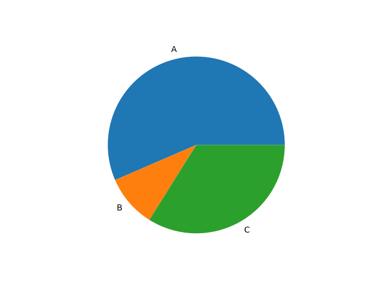
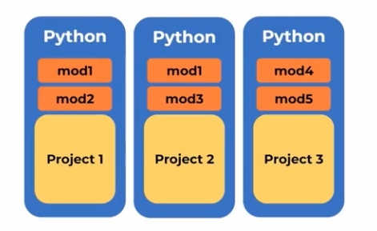

# Curso de Python: PIP y Entornos Virtuales

> Trabaja profesionalmente con Python gestionando proyectos con PIP y entornos virtuales. Instala y contenediza aplicaciones en Docker, aprende a utilizar FastAPI para construir servidores web, y explora librerías como Pandas y Requests.

Nicolas Molina
@nicobytes
Colombian living in
Bolivia
Senior Software
Developer with +8 Years

## Clase 1: Python en tu propio entorno de desarrollo local

## Comandos básicos en la terminal, con esto iniciamos el proyecto:

- pwd: Indica en qué ubicación estamos
- mkdir: Crear una nueva carpeta
- ll: Lista de archivos
- cd: Nos permite abrir una carpeta
- clear: Nos permite despejar la terminal
- git init: Inicializar
- touch: Crear archivos

## Otros comandos

- rm: sirve para borrar archivos
- rmdir: sirve para borrar directorios
- mv: sirve para mover directorios
- df: indica el espacio en disco, el disponible, usado y total

```python

```


## Clase 2 - 3: Instalación en macOS
> 

**Paso 1: Descargar el Instalador de Python**

1.  Abre tu navegador web y ve al sitio oficial de Python: [https://www.python.org/downloads/macos/](https://www.python.org/downloads/macos/)
2.  Busca la última versión estable de Python 3. Haz clic en el enlace correspondiente para descargar el instalador (generalmente un archivo `.pkg`). Asegúrate de descargar la versión para macOS.

**Paso 2: Ejecutar el Instalador**

1.  Una vez que la descarga se complete, localiza el archivo `.pkg` en tu carpeta de Descargas (o la ubicación donde guardaste el archivo).
2.  Haz doble clic en el archivo `.pkg` para ejecutar el instalador.

**Paso 3: Seguir las Instrucciones del Instalador**

1.  macOS te guiará a través de una serie de pantallas. Lee cada una cuidadosamente y haz clic en **"Continuar"** (Continue).
2.  Se te pedirá que aceptes los términos de la licencia. Haz clic en **"Aceptar"** (Agree).
3.  Puedes elegir la ubicación de instalación o dejar la predeterminada. Haz clic en **"Instalar"** (Install).
4.  Es posible que se te pida tu contraseña de administrador para permitir la instalación. Ingresa tu contraseña y haz clic en **"Instalar Software"** (Install Software).

**Paso 4: Esperar la Finalización de la Instalación**

1.  macOS mostrará una barra de progreso mientras se instalan los componentes de Python. Espera a que el proceso se complete.
2.  Una vez finalizada la instalación, puedes cerrar la ventana del instalador.

**Paso 5: Verificar la Instalación**

1.  Abre la aplicación **Terminal** (puedes encontrarla en Aplicaciones > Utilidades o buscándola con Spotlight).
2.  Escribe el siguiente comando y presiona Enter:
    ```bash
    python3 --version
    ```
    * **Nota:** En macOS, la versión preinstalada de Python 2 todavía puede estar presente. Por eso, es importante usar `python3` para referirte a la versión 3 que acabas de instalar.
3.  Si Python 3 se instaló correctamente, deberías ver la versión de Python que instalaste (por ejemplo, `Python 3.X.Y`).
4.  También puedes probar el intérprete de Python 3 escribiendo `python3` y presionando Enter. Esto abrirá la consola interactiva de Python 3 (indicada por `>>>`). Para salir, escribe `exit()` y presiona Enter.

## Clase 4: Python con VSCode
> Instalar librerias 

Solo recomendo una 
- python validado por microsoft 
- 
```python

```


## Clase 5: Python con Git y GitHub
> Creamos un proyecto en github y trabajar en repositorio 

## Pasos para crear un gitignore por proyecto en este caso python

- Paso 1: accedemos a esta pagina -> https://www.toptal.com/developers/gitignore
- Paso 2: Ingresamos los valores que necesitamos ignorar para este caso [windown Linux Macos Python]
- Paso 3: Esto nos genera un text ya con lo que se considera que se debe ingnorar para un proyecto Python
- Paso 4: Copia dicho txt, validamos si tenemos creado el archivo .gitignore en nuestro repo, si esta creado validalo si no generalo y pega lo que genero el portal web.  

```python


```

## Clase 6: Flujo de trabajo en Python
> 

El flujo de trabajo es:
1. creas un archivo.
2. lo pruebas
3. lo agregas a git
4. git add .
5. git commit -m
6. git pull origin main
7. git push origin main


## Clase 7: ¿Qué es pip?
> PIP es específico de Python y se utiliza para gestionar paquetes y módulos en proyectos de Python
> pip es un administrador de paquetes de Python que facilita la instalación y el mantenimiento de paquetes de software escritos en Python. Con pip, puedes instalar fácilmente paquetes de Python desde Internet, como las bibliotecas que necesitas para tu proyecto, y actualizarlos o desinstalarlos según sea necesario.

> Para utilizar pip, primero debes asegurarte de tener instalado Python en tu sistema. Luego, puedes instalar pip cancelado el siguiente comando en tu terminal:

python -m pip install pip

> Una vez que tienes pip instalado, puedes usar para instalar paquetes de Python obtuvo el siguiente comando:
pip install nombre-del-paquete


## Notas mentales 
- PIP es a Python como NPM es a JavaScript


## Enlace 
- https://pypi.org/project/pip/

Correr en la terminal los siguientes comandos

## comandos para recordar
- pip3 list 
- pip3 freeze
- pip install <paquete> => pip install matplotlib
- which python3


```python

import matplotlib.pyplot as plt

def generate_pie_chart():
    labels = ['A', 'B', 'C']
    values = [200, 34, 120]

    fig, ax = plt.subplots()
    ax.pie(values, labels=labels)
    plt.savefig('pie.png')
    plt.show()
    plt.close()

if __name__ == '__main__':
    generate_pie_chart()

```
## ejemplo Ejecutando el código 


## Clase 8: 
> Gráficas en Python con PIP

```python

import os


def create_folder(path, name_folder="logs"):
    path_to_create = os.path.join(path, name_folder)
    try:
        os.mkdir(path_to_create)
        print("Created successfully!")
    except Exception as err:
        print(f"It has occurred an unexpected error, details: {err}")

```


## Clase 9: ¿Qué es un ambiente virtual?
> Los entornos virtuales son una forma de crear un sistema operativo virtual dentro de otro sistema operativo. Esto permite a un usuario tener varios sistemas operativos diferentes en un mismo equipo físico, lo que puede ser muy útil en situaciones en las que es necesario utilizar diferentes aplicaciones o tecnologías que requieren entornos diferentes

## ¿Qué es un entorno virtual en Python?

Un entorno virtual (o ambiente virtual) en el contexto de Python es una herramienta que te permite crear un espacio aislado en tu sistema donde puedes instalar paquetes y dependencias de Python sin afectar el entorno global de Python en tu máquina.

## Beneficios de los entornos virtuales:

- Aislamiento: Cada entorno virtual es independiente y aísla las bibliotecas y paquetes que instalas en él.
- Gestión de dependencias: Facilita la especificación de dependencias necesarias para tu proyecto en un archivo requirements.txt.
- Evitar conflictos: Previene que las bibliotecas de un proyecto afecten a otros proyectos o al entorno global de Python.
- Limpieza y organización: Permite una gestión ordenada y eliminación de entornos virtuales no utilizados.

## Ventajas 

- Permiten utilizar varios sistemas operativos en un mismo equipo físico
- Permiten instalar y utilizar diferentes aplicaciones y tecnologías de manera segura, sin tener que hacer cambios permanentes en el sistema operativo principal
- Pueden ser fácilmente movidos o copiados, lo que significa que pueden ser utilizados en diferentes equipos o compartidos con otros usuarios
- También pueden ser fácilmente respaldados y restaurados en caso de que se produzca un problema, lo que puede ayudar a prevenir la pérdida de datos o el tiempo de inactividad
- Ofrecen una forma conveniente y segura de utilizar diferentes aplicaciones y tecnologías en un mismo equipo

# Notas mentales 
- Instalar a nivel global puede causar distintos problemas al momento de manejar diferentes proyectos, por ejemplo para algunos proyectos necesitaras otro tipo de version, libreria o modulos y para solucionar esto se creo un ambiente virtual en python el cual encapsula cada proyecto y no lo deja de forma compartida. 


```python

```

## Clase 10: Usando entornos virtuales en Python
> 


### Pasos para realizar un ambiente virtual

- Paso 1: Verificar donde esta python y pip
    - which python3
    - which pip3

- Paso 2: Si estas en linus o wsl debes instalar
    - sudo apt install -y python3-venv

- Paso 3: Poner cada proyecto en su propio ambiente, entrar en cada carpeta.
    - python3 -m venv env_name

- Passo 4: Activar el ambiente
    - source env_name/bin/activate

- Paso 5: Salir del ambiente virtual
    - deactivate

- Paso 6: Podemos instalar las librerias necesarias en el ambiente virtual como por ejemplo
    - pip3 install matplotlib==3.5.0

- Paso 7: Verificar las instalaciones
    - pip3 freeze
- Paso 8: En caso que desees eliminar rm -r [env_name]

## Notas mentales 
- algo que debes recordar es que se genera un ambiente por cada carpeta de proyecto no es de manera global 
- Si tenemos en /Python/Proyecto1 ó /Python/Proyecto2 ó /Python/Proyecto3 debemos ejecutar el comando por cada carpeta 
- Ejemplo del comando python3 -m venv "env_name"
- luego lo activamos source "env_name"/bin/activate
- which python3
- which pip3
 

```python

```


## Clase 11: requirements.txt
> 

Requirements.txt = Archivo que gestiona todas las dependencias y en que versiones se necesitan.

Generar el archivo con el siguiente comando

pip3 freeze > requirements.txt
Revisar lo que hay dentro del archivo

cat requirements.txt
Instalar las dependencias necesarias para contribuir más rápido en proyectos

pip3 install -r requirements.txt
Preparar archivo para contribución

```python
# App Project
git clone
cd app
python3 -m venv env
source env/bin/activate
pip3 install -r requirements.txt
python3 main.py

```

## Clase 12: Solicitudes HTTP con Requests
> Esta clase nos enseñan como realizar solicitudes a APis por ejemplo en JavaScript usamos su propio metodo llamado fetch, o  una libreria descargar por npm  llamada  Axios en python se llama requests 

## Debemos instalar 
- pip3 install request

```python

import requests

response = requests.get('https://www.example.com')

print(response.status_code)
print(response.text)

```


## Clase 13: Pandas
> Es una de las librerias mas utilizadas en python y nos sirven para analizar y manipular datos de archivos duros

Activar anbiente del proyecto


source env/bin/activate
Verificar


which python3
Ver que hay dentro del archivo en el cual se evidencia que no hay pandas


cat reqruirements.txt
Agregar nueva libreria


pip3 install pandas
Verificar librerias instaladas


pip3 freeze
Actualizar el documento que contiene las librerias


pip3 freeze > requirements.txt
```python

# Tenemos esta explicacion en una  carptea [13_pandas]
import charts 
import pandas as pd

def lee_csv_grafica():
    archivo = "/Users/leonard/Documents/Dev/python/CursosBackendPython/01_Primeros_pasos_Python/03_Curso_Python_PIP_Entornos_Virtuales/practica/13_pandas/data.csv"
    try:
        df = pd.read_csv(archivo)
        df = df[df['Continent']=='South America']
        countries = df['Country'].values
        porcentages = df['World Population Percentage'].values
        charts.generate_pie_chart(countries,porcentages, 'South America')
    except Exception as e:
        print(f"Error: {e}")

```

## Clase 14: Python para Backend: web server con FastAPI
> FastAPI
Es un framework de Python para crear aplicaciones web rápidas y seguras. Utilice la mejor OpenAPI para definir la interfaz de la aplicación y proporcione un conjunto de herramientas para validar y documentar la API de manera automática.

>Uvicorn

Es un servidor ASGI (Asynchronous Server Gateway Interface) de alto rendimiento para ejecutar aplicaciones ASGI como FastAPI. Es una alternativa a otros servidores ASGI como Daphne y Hypercorn.

FastAPI y Uvicorn se utilizan juntos para proporcionar un entorno rápido y fácil de usar para el desarrollo y el uso de aplicaciones web basadas en ASGI.


## Notas mentales 
- https://fastapi.tiangolo.com/#installation
- https://www.uvicorn.org/ -> Permite desplegar nuestro codigo fuente para que se ejecute como un servidor web 
- pip3 install fastapi 
- pip3 install "uvicorn[standard]"
- pip3 freeze > requirements.txt
- pyenv versions
- Correr el servidor -> uvicorn main:app --reload ->  uvicorn main:app --reload --port 8080


```python
import store
from fastapi import FastAPI
from fastapi.responses import HTMLResponse

app = FastAPI()

#Nuestro Decorador generamos al ruta 
@app.get('/')
def get_list():
      return [1,2,3]

@app.get('/contactos')
def get_list():
      return [
            {'Nombre':'Kenny', 'telefono':123456789}, 
            {'Nombre':'Leo', 'telefono':123456789}, 
            {'Nombre':'mamá', 'telefono':123456789}, 
            {'Nombre':'papá', 'telefono':123456789}, 
        ]

@app.get('/web', response_class=HTMLResponse)
async def read_items():
    return """
    <html>
    <head>
    <title>Hola Soy Pagina Web en Servidor Python </title>
    </head>
    <body>
        <h1 style="color:red">Hola Soy Pagina Web en Servidor PythonL!</h1>
        <h3>Me sorprende lo <b>rapido</b> y comodo!</h2>
    </body>
    </html>
"""


def run():
    store.get_categorias()

if __name__ == '__main__':
        run()


```


## Clase 15: ¿Qué es Docker?
>  Docker es una plataforma de código abierto que permite crear, distribuir y ejecutar aplicaciones de forma independiente del sistema operativo subyacente. Proporciona una forma eficiente y rápida de crear entornos aislados llamados contenedores, que encapsulan una aplicación y todas sus dependencias, incluyendo bibliotecas, frameworks y herramientas necesarias para su funcionamiento

- Docker utiliza una imagen del sistema operativo como base para las aplicaciones empaquetadas en contenedores. Esto permite que los contenedores sean ligeros y fáciles de distribuir, ya que solo incluyen lo necesario para ejecutar la aplicación y no todo el sistema operativo completo. 

- Docker también proporciona una capacidad adicional de abstracción y automatización de virtualización en el nivel de sistema operativo. Esto permite que los contenedores se ejecuten en cualquier que tenga Docker instalado, independientemente de la plataforma subyacente


## 5 razones por las que Docker es esencial:

- Portabilidad y Consistencia: Docker encapsula una aplicación junto con todas sus dependencias, bibliotecas, y configuraciones en un contenedor. Esto garantiza que la aplicación funcionará de la misma manera en cualquier entorno, ya sea en un equipo de desarrollo, un servidor de pruebas o en producción, eliminando problemas de "funciona en mi máquina".

- Aislamiento de Aplicaciones: Docker permite ejecutar múltiples aplicaciones en contenedores separados en la misma máquina, sin que interfieran entre sí. Cada contenedor tiene su propio entorno, lo que evita conflictos entre versiones de software o dependencias.

- Despliegue Rápido y Escalabilidad: Docker permite desplegar aplicaciones rápidamente y escalar horizontalmente sin complicaciones. Puedes lanzar nuevas instancias de una aplicación en contenedores en cuestión de segundos, lo que facilita la respuesta a cambios en la demanda.

- Eficiencia de Recursos: Los contenedores de Docker son ligeros y utilizan menos recursos que las máquinas virtuales tradicionales porque comparten el mismo sistema operativo base. Esto permite que más contenedores se ejecuten en la misma infraestructura, reduciendo los costos de hardware y mejorando la eficiencia.

- Integración con CI/CD: Docker se integra perfectamente con flujos de trabajo de integración continua y despliegue continuo (CI/CD). Permite automatizar la construcción, prueba y despliegue de aplicaciones de manera confiable y reproducible, acelerando el ciclo de desarrollo y mejorando la calidad del software.

## Nota Mental 
> Parte del gran ecosistema es que podamos dividir un problema y esto tambien se refiere docker que podamos de ciertamanera generar un ambiente por cada desarrollo a veces necesitamos python en sus versiones anteriores y todas sus librerias compatibles con esa version socker nos permite generar diferentes ambientes si estar alterando nuestro sistema operativo. 




```python


```

## Clase 16: Instalación de Docker en Windows, macOS y Ubuntu
> 
Pasos para instalar Docker Desktop en macOS Sonoma (M2):

Descarga Docker Desktop:

Abre tu navegador web y ve a la página oficial de Docker: https://www.docker.com/products/docker-desktop/
Haz clic en el botón que dice "Download for Mac". Docker detectará automáticamente que tienes un chip M2 y te ofrecerá la versión correcta.
Abre el archivo DMG:

Una vez que la descarga se complete, ve a tu carpeta de Descargas y haz doble clic en el archivo Docker.dmg.
Arrastra Docker al directorio Aplicaciones:

Se abrirá una ventana con el icono de Docker y la carpeta Aplicaciones. Arrastra el icono de Docker a la carpeta Aplicaciones.
Ejecuta Docker Desktop:

Ve a tu carpeta Aplicaciones y haz doble clic en el icono de Docker.
Es posible que macOS te pregunte si estás seguro de abrir una aplicación descargada de internet. Haz clic en "Abrir".
Acepta los términos de servicio:

Se abrirá una ventana con los términos de servicio de Docker Desktop. Léelos y haz clic en "Acepto los términos".
Autenticación (si es necesario):

Es posible que se te pida que ingreses la contraseña de tu Mac para autorizar la instalación.
Docker Desktop se iniciará:

Una vez instalado, el icono de Docker aparecerá en tu barra de menú (en la parte superior derecha de la pantalla). Docker Desktop se ejecutará en segundo plano.
Verifica la instalación:

Abre la aplicación Terminal (la puedes encontrar en Aplicaciones > Utilidades).
Escribe el siguiente comando y presiona Enter:
Bash

docker --version
Si Docker está instalado correctamente, verás la versión de Docker que tienes instalada.
También puedes probar ejecutando un contenedor simple:
Bash

docker run hello-world

## comandos mas utilizados 

| Categoría             | Comando                                        | Descripción                                                                                                | Ejemplo                                        |
| :-------------------- | :--------------------------------------------- | :--------------------------------------------------------------------------------------------------------- | :--------------------------------------------- |
| **Gestión de Imágenes** | `docker pull <imagen>[:<tag>]`               | Descarga una imagen desde un registro.                                                                    | `docker pull ubuntu:20.04`                    |
|                       | `docker images`                                | Lista las imágenes locales.                                                                                | `docker images`                                |
|                       | `docker rmi <imagen>|<ID>`                     | Elimina una o más imágenes locales.                                                                        | `docker rmi ubuntu:20.04 my-custom-image`      |
|                       | `docker search <término>`                      | Busca imágenes en Docker Hub.                                                                               | `docker search nginx`                          |
|                       | `docker build -t <nombre>:<tag> <ruta>`        | Construye una imagen desde un Dockerfile.                                                                  | `docker build -t my-app:v1 .`                 |
|                       | `docker push <nombre>:<tag>`                   | Sube una imagen a un registro.                                                                             | `docker push mi-usuario/mi-imagen:latest`      |
| **Gestión de Contenedores** | `docker run [opciones] <imagen> [comando]` | Crea y ejecuta un contenedor.                                                                              | `docker run -d -p 8080:80 nginx`              |
|                       | `docker ps`                                    | Lista los contenedores en ejecución.                                                                       | `docker ps`                                    |
|                       | `docker ps -a`                                 | Lista todos los contenedores (en ejecución y detenidos).                                                   | `docker ps -a`                                 |
|                       | `docker stop <contenedor>|<ID>`                | Detiene uno o más contenedores en ejecución.                                                               | `docker stop mi-nginx`                         |
|                       | `docker start <contenedor>|<ID>`               | Inicia uno o más contenedores detenidos.                                                                   | `docker start mi-nginx`                        |
|                       | `docker restart <contenedor>|<ID>`             | Reinicia uno o más contenedores.                                                                           | `docker restart mi-nginx`                      |
|                       | `docker rm <contenedor>|<ID>`                  | Elimina uno o más contenedores detenidos.                                                                  | `docker rm mi-nginx otro-contenedor`           |
|                       | `docker logs <contenedor>|<ID>`                | Muestra los logs de un contenedor.                                                                         | `docker logs mi-nginx`                         |
|                       | `docker exec -it <contenedor> <comando>`       | Ejecuta un comando dentro de un contenedor en ejecución (interactivo).                                     | `docker exec -it mi-nginx bash`                |
|                       | `docker inspect <objeto>`                      | Muestra información detallada sobre un contenedor o imagen.                                                | `docker inspect mi-nginx`                      |
|                       | `docker top <contenedor>|<ID>`                 | Muestra los procesos dentro de un contenedor.                                                               | `docker top mi-nginx`                          |
| **Gestión de Redes** | `docker network ls`                          | Lista las redes Docker.                                                                                    | `docker network ls`                            |
|                       | `docker network create <nombre>`               | Crea una nueva red Docker.                                                                                 | `docker network create mi-red`                 |
|                       | `docker network connect <red> <contenedor>`    | Conecta un contenedor a una red.                                                                           | `docker network connect mi-red mi-contenedor`  |
|                       | `docker network disconnect <red> <contenedor>` | Desconecta un contenedor de una red.                                                                        | `docker network disconnect mi-red mi-contenedor` |
|                       | `docker network rm <red>|<ID>`                 | Elimina una red Docker.                                                                                    | `docker network rm mi-red`                     |
| **Gestión de Volúmenes** | `docker volume ls`                           | Lista los volúmenes Docker.                                                                                | `docker volume ls`                             |
|                       | `docker volume create <nombre>`                | Crea un nuevo volumen Docker.                                                                              | `docker volume create mi-volumen`              |
|                       | `docker volume inspect <volumen>`              | Muestra información detallada sobre un volumen.                                                              | `docker volume inspect mi-volumen`              |
|                       | `docker volume rm <volumen>`                   | Elimina un volumen Docker.                                                                                 | `docker volume rm mi-volumen`                  |
|                       | `docker volume prune`                          | Elimina volúmenes no utilizados.                                                                           | `docker volume prune`                            |
| **Otros** | `docker login`                                 | Inicia sesión en un registro de Docker.                                                                    | `docker login`                                 |
|                       | `docker logout`                                | Cierra la sesión del registro de Docker.                                                                   | `docker logout`                                |
|                       | `docker info`                                  | Muestra información del sistema Docker.                                                                    | `docker info`                                  |
|                       | `docker stats [contenedor...]`                 | Muestra estadísticas de uso de recursos de los contenedores.                                                | `docker stats mi-nginx`                        |
|                       | `docker compose up [-d]`                       | Inicia los servicios definidos en `docker-compose.yml`.                                                    | `docker compose up -d`                         |
|                       | `docker compose down`                          | Detiene y elimina los servicios definidos en `docker-compose.yml`.                                        | `docker compose down`                            |


## Clase 17: Dockerizando scripts de Python

## Me sucedio un error 
```python
[+] Building 0/0
[+] Building 0/1erver  Building                                                                                                      0.1s 
[+] Building 0.2s (1/2)                                                                                              docker:desktop-linux 
[+] Building 0.3s (2/2) FINISHED                                                                                     docker:desktop-linux
 => [web-server internal] load build definition from Dockerfile                                                                      0.0s
 => => transferring dockerfile: 242B                                                                                                 0.0s 
 => ERROR [web-server internal] load metadata for docker.io/library/python:3.13.2    

```

## pasos desde tu Proyecto.
## Paso 1: 
- Uno construimos el archivo Dockerfile: 
```python
FROM python:3.13.2 ## Lenguaje a usar 

WORKDIR /app # nombre de tu app 
COPY requirementes.txt /app/requirementes.txt # Copiar los elementos que se necesitan a tu appa 

RUN pip install --no-cache-dir --upgrade -r /app/requirementes.txt # Ejecutar depenencias 

COPY . /app   # que copie todo tu codigo a tu contenedor llamdo app

CMD bash -c "while true; do sleep 1; done" # Ejecute un bash 

```

## Paso 2: Generamos el archivo docker-compuse.yml 
```python

services:
  web-server:
    build:
      context: .
      dockerfile: Dockerfile
    volumes:
      - .:/app
    ports:
     - '80:80'
```

## Pasos 3
- sudo docker compose build --no-cache # Para crear el docker
- docker compose up -d # Para lanzarlo
- docker compose ps # Para ver el estado del contenedor
- docker compose exec app-csv bash # Para ingresar al docker y desarrollar ahi


docker-compose build: Este comando se utiliza para construir las imágenes de los servicios especificados en el archivo "docker-compose.yml". Esto significa que tomará las especificaciones de construcción de cada servicio, como el Dockerfile y los contextos, y creará una imagen nueva y actualizada.

docker-compose ps: Este comando se utiliza para ver el estado de los servicios especificados en el archivo "docker-compose.yml". Muestra si los servicios están corriendo o detenidos, y también muestra el nombre del contenedor, el puerto y la imagen utilizada.

docker-compose down: Este comando se utiliza para detener y eliminar los contenedores, redes y volúmenes creados por "docker-compose up".

docker-compose up -d: Este comando se utiliza para iniciar los servicios especificados en el archivo "docker-compose.yml" en segundo plano. El parámetro "-d" indica que se ejecutará en segundo plano.

docker-compose ps: Es el mismo comando que el segundo, pero se repite para mostrar el estado de los servicios después de haber sido iniciados.

docker-compose exec app-csv bash: Este comando se utiliza para ejecutar una terminal dentro del contenedor especificado, en este caso "app-csv", y conectarse a él mediante una sesión interactiva de bash. Esto permite realizar tareas dentro del contenedor, como verificar los archivos o ejecutar comandos.

## Clase 19: 
> 
```python

```


## Preguntas

1.
¿Qué es un entorno virtual?
La herramienta de Python para aislar o encapsular proyectos con sus propios paquetes y versiones sin afectar a otros proyectos y entornos virtuales.

2.
¿Con qué comando creamos entornos virtuales en Python 3?
python3 -m venv [ruta del entorno virtual]

3.
¿Qué herramienta nos permite aislar y encapsular TODO: archivos del proyecto, paquetes y sus versions, Python e incluso el sistema operativo?
Docker

4.
¿Con qué comando instalamos el paquete requests en su versión 2.27.1?
pip install requests==2.27.1

5.
Estás desarrollando un proyecto en Python que utiliza diferentes paquetes de terceros en versiones muy especificas. ¿Cuál es la mejor forma de trabajar con el resto de mi equipo para que siempre instalen esos paquetes en esas versiones cuando clonen el proyecto?
Creando un requirements.txt con todos los paquetes y sus versiones e indicando en el README que instalen las dependencias leyendo ese archivo con pip.


