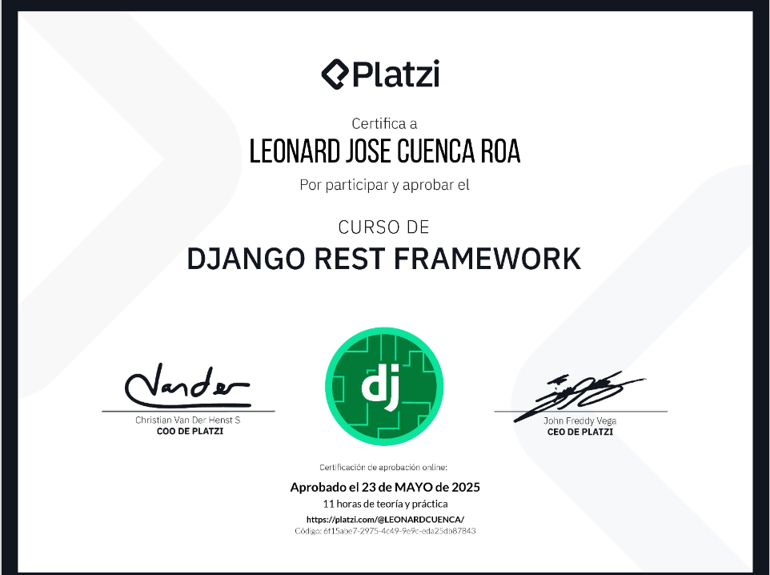
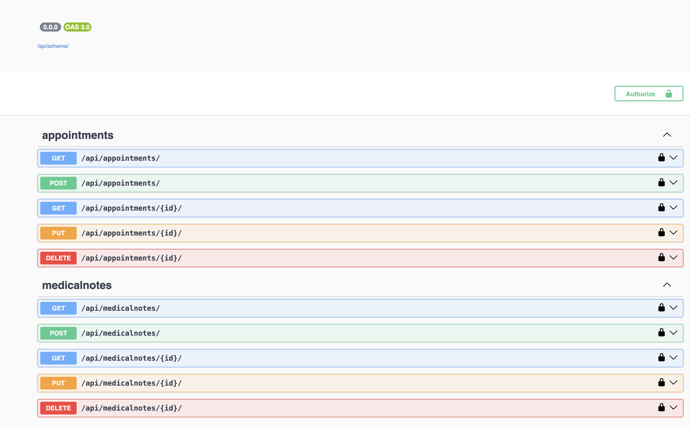
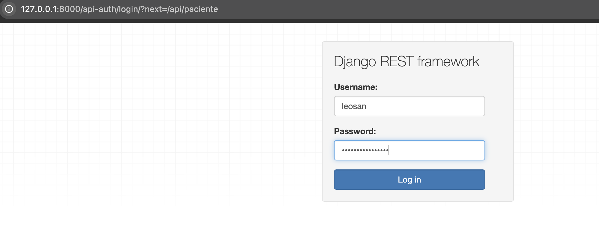
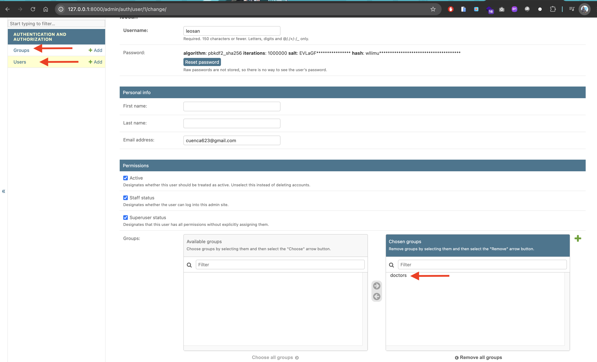
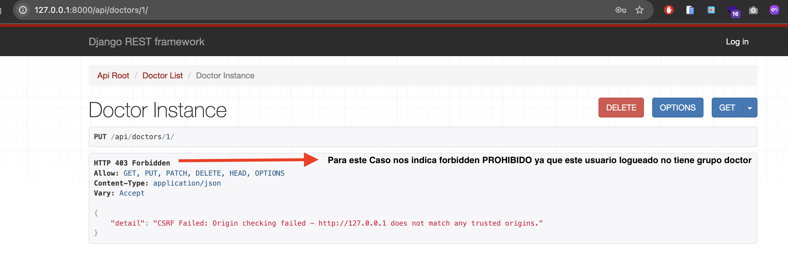
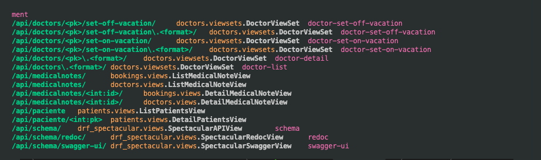

| Detalle | Información |
| :--- | :--- |
| **Publicado el** | Publicado el 11 de octubre de 2025 |
| **Profesor** | Luis Martinez |
| **Fecha de Inicio** | 22/10/2025 |
| **Fecha de Fin** | 11/12/2025 |

---
<div align="center">
  
</div>


| Curso | Certificado |
| :--- | :---: |
| Curso de Django Rest Framework | [Ver PDF](https://github.com/LeoSan/CursosBackendPython/blob/main/01_Primeros_pasos_Python/07_Curso_Django_Rest_Framework/2025_diploma-django-rest-framework_platzi.pdf) |


--- 


## Curso de Django Rest Framework
> Construye APIs seguras y escalables con Django REST Framework. Crea modelos, serializadores, endpoints, validaciones, autenticación, vistas y pruebas, usando las mejores prácticas del desarrollo web moderno.

- Profesor: Luis Martínez
- Fecha Inicio: 05/Mayo/2025 
- Fecha Fin: 23/Mayo/2025 

## Clase 1: Creación de APIs con Django REST Framework
> 

## ¿Por qué las APIs son esenciales para las aplicaciones?
Las APIs conectan aplicaciones permitiendo que compartan información en tiempo real.
Sin APIs, no sería posible realizar tareas básicas como verificar tu ubicación o procesar pagos.
Permiten la comunicación eficiente entre servidores, fundamental para la funcionalidad de cualquier aplicación moderna.

## ¿Cómo facilita Django REST Framework la creación de APIs?
- Django REST Framework permite configurar y desplegar APIs sin necesidad de crear todo desde cero.
- Se encarga de la seguridad, la comunicación y la interacción con bases de datos, ofreciendo un enfoque escalable.
- Este framework se enfoca en la simplicidad y rapidez, haciendo que el desarrollo sea eficiente y sin complicaciones.

## ¿Qué hace a Django REST Framework adecuado tanto para principiantes como para expertos?
- Empresas de todos los tamaños, desde startups hasta grandes corporaciones, usan Django REST Framework debido a su versatilidad y facilidad de uso.
- No es necesario ser un experto para empezar a trabajar con él, lo que lo convierte en una opción accesible para cualquier desarrollador.
- Al utilizar Django REST Framework, puedes concentrarte en lo que realmente importa: crear experiencias digitales de calidad.

## ¿Qué beneficios ofrece Django REST Framework en la producción de APIs?
- Ahorra tiempo al evitar el desarrollo de funciones repetitivas y básicas.
- Integra funciones clave como autenticación, manejo de datos y seguridad de forma nativa.
- Facilita la escalabilidad, permitiendo que las aplicaciones crezcan sin problemas técnicos mayores.

```Python

```


## Clase 2: APIs y JSON: Comunicación entre Servidores y Aplicaciones Web
> Las APIs (Application Programming Interfaces) permiten que los computadores se comuniquen entre ellos de manera estructurada

## ¿Qué es el formato JSON y por qué es importante?
- JSON (JavaScript Object Notation) es el formato estándar para enviar y recibir datos a través de APIs.
- Permite almacenar y estructurar información como texto, arreglos y objetos.
- Por ejemplo, un usuario puede tener varios hobbies, y estos se almacenan en un arreglo dentro de un JSON.

## ¿Cómo se estructuran las APIs REST?
- REST (Representational State Transfer) es una arquitectura que define cómo deben enviarse los mensajes a través de HTTP usando JSON.
- Garantiza que las comunicaciones sean predecibles, lo que significa que las mismas solicitudes siempre producirán los mismos resultados.

## ¿Cuáles son los métodos principales de una API REST?
- GET: Se utiliza para obtener información. Puede devolver una lista de recursos o un recurso específico.
- POST: Permite crear nuevos recursos, como agregar un nuevo usuario.
- DELETE: Utilizado para eliminar un recurso existente.
- PUT y PATCH: Modifican la información de un recurso, ya sea un solo campo o todo el contenido.

```Python

```


## Clase 3: Creación de APIs con Django REST Framework
> 

## ¿Cómo instalar y configurar Django REST Framework?
- Paso 1: Primero, necesitas tener instalado Python. Confirma la instalación con el comando: python3 --version.
Crea un entorno virtual con: python3 -m venv venv, y actívalo con source venv/bin/activate (Linux/Mac) o consulta los recursos para hacerlo en Windows.

- Paso 2: Instala Django y Django REST Framework con: pip install django djangorestframework.

## ¿Cómo iniciar un proyecto con Django?
- Paso 3: Crea un nuevo proyecto usando el comando: django-admin startproject doctorapp . => el Punto Indica que cree el proyecto en el folder donde estoy actualmente 
Esto generará los archivos necesarios dentro de la carpeta donde estés trabajando.
- Paso 4: Agrega las librerías instaladas a un archivo requirements.txt con el comando: pip freeze > requirements.txt, lo cual es crucial para mantener control sobre las versiones que estás utilizando en tu proyecto.

## ¿Cómo integrar Django REST Framework en el proyecto?
- paso 5: Dentro del archivo settings.py, busca la configuración INSTALLED_APPS y agrega 'rest_framework'.
La documentación oficial de Django REST Framework proporciona detalles sobre su instalación y configuración, lo cual es una excelente fuente de referencia.

## ¿Qué extensiones son recomendables para mejorar el entorno de desarrollo?
Usa extensiones como “Python” y “Black” de Microsoft en tu editor para mejorar la experiencia de desarrollo.
La extensión de Python te permite realizar depuraciones fácilmente.
Black formatea tu código automáticamente conforme al estándar PEP8, ayudando a mantener un código limpio y consistente.

## ¿Cómo ejecutar el proyecto?
- Paso 6: Ejecuta el servidor de desarrollo con: python manage.py runserver. Esto te permite ver los cambios que realices en tiempo real.
Visita la URL generada para confirmar que Django se ha configurado correctamente.

```Python

```

## Clase 4: Django REST: Funcionalidades y Ventajas al Crear APIs
> 

## ¿Cómo reutiliza Django REST las funcionalidades de Django?
Django REST reutiliza varias de las funcionalidades principales de Django, lo que permite un flujo de trabajo más sencillo:

- ORM de Django: DRF usa el Object-Relational Mapping (ORM) de Django para manejar modelos y realizar consultas a la base de datos sin escribir SQL.

- Sistema de URLs: Mejora el sistema de URLs de Django con un sistema de routers que crea automáticamente rutas de acceso a los recursos, simplificando la configuración de enrutamiento.

- Vistas basadas en clases: DRF extiende las vistas de Django con un nuevo concepto llamado Viewsets, que agrupa funcionalidades como listar, crear, actualizar y borrar dentro de una sola clase.

## ¿Qué añade Django REST para facilitar la creación de APIs?
Además de aprovechar la estructura de Django, Django REST agrega funcionalidades clave que hacen más fácil el desarrollo de APIs:

- Serializadores: Permiten transformar objetos Python a JSON y viceversa, facilitando la creación de APIs basadas en los modelos de Django sin tener que duplicar la información.

- Viewsets: Agrupan varias acciones en una sola clase, simplificando el código y reduciendo redundancias. Además, permiten manejar acciones según el método HTTP utilizado.

- Mejoras en seguridad: Gracias a la integración con Django, se pueden utilizar todas las configuraciones de seguridad como middleware y permisos.

- Compatibilidad con Django Admin: Permite seguir administrando la información de la aplicación a través de la interfaz administrativa de Django.

## ¿Cómo optimiza Django REST el desarrollo de APIs?
DRF optimiza varios aspectos del desarrollo de APIs al ofrecer herramientas que simplifican tareas comunes:

- Enrutamiento automático de URLs a través de routers.
- Serialización eficiente de datos basados en modelos Django, evitando la duplicación de lógica.
- Manejo de vistas más flexible con Viewsets que agrupan múltiples funcionalidades.
- Continuidad con las funcionalidades de seguridad y administración de Django, sin necesidad de configuraciones adicionales.

## Qué añade Django RF para desarrollar API's

Django REST agrega funcionalidades clave que hacen más fácil el desarrollo de APIs robustas, escalables y fácil de mantener:

- Estructura del Proyecto: Crea una carpeta api/ en tu app para organizar serializers, views y routers.
- Serializers: Usa ModelSerializer para simplificar la creación de serializers y validar datos.
- Vistas y Rutas: Utiliza vistas basadas en clases y routers para manejar operaciones CRUD de manera eficiente.
- Autenticación y Permisos: Configura el sistema de autenticación y establece permisos adecuados para controlar el acceso.
- Throttling: Implementa throttling para proteger tu API y garantizar acceso justo.
- Documentación: Genera documentación interactiva con herramientas como Swagger o Redoc.
- Pruebas: Escribe pruebas automatizadas usando APITestCase para asegurar el correcto funcionamiento de la API.
- Versionado: Considera implementar un esquema de versionado para manejar cambios futuros.
- Manejo de Errores: Utiliza las excepciones de DRF para ofrecer respuestas coherentes en caso de errores.

ORM: Permite interactuar con la base de datos utilizando objetos Python en lugar de consultas SQL.
Serializers: Convierten datos complejos (como objetos de modelos) en formatos como JSON y viceversa.
ViewSets: Agrupan las operaciones CRUD en una sola clase para simplificar el manejo de vistas en APIs.

## Clase 5: Modelos y Serializadores en Django para DoctorApp
> Pasos para genear modelos en tu APIs

- Paso 01: Generar los comandos para crear los modelos, recueda por cada ajuste debes correr los ultimos dos comandos 
```Python
- python3 manage.py startapp patients
- python3 manage.py startapp doctors
- python3 manage.py startapp bookings
- python manage.py makemigrations
- python manage.py migrate
```

- Paso 02: Registramos las apps creadas en el ´settings.py´ 

```Python
INSTALLED_APPS = [
    'django.contrib.admin',
    'django.contrib.auth',
    'django.contrib.contenttypes',
    'django.contrib.sessions',
    'django.contrib.messages',
    'django.contrib.staticfiles',
    'rest_framework',
    'patients',
    'doctors',
    'bookings',
]
```
- Paso 03: Este paso es generar el modelo.py 


- Paso 04: Este paso es generar el serializers.py => Recuerda los serializadores nos permiten convertir un modelo a Json y viceversa 

- Paso 04: Este paso Generar las views con sus decorador que va indicando si es GET, POST, UPDATE, DELETE 

- Paso 05: 

- Paso 06:

- Paso 07:

```Python
- python3 manage.py startapp patients
- python3 manage.py startapp doctors
- python3 manage.py startapp bookings
- python manage.py makemigrations
- python manage.py migrate


```


## Clase 6: Uso de Serializadores en Vistas con Django REST Framework
> Pasos para Poblar las tablas 

## Pasos 
- Paso 1: pip install django-seed psycopg -> Instalar django-seed 
- Paso 2: 
```Python
    INSTALLED_APPS = [

    ....

    "django_seed",

    ]
```
- Paso 3: ´python manage.py seed patients --number=10´ => genera 10 elementos 
- Paso 4: 

{
"id":11,
"first_name":"Leonard",
"last_name":"Cuenca",
"date_of_birth":"2025-01-20",
"contact_number":"1",
"email":"cuenca623@gmail.com",
"address":"Calle 3434 con Calle 234",
"medical_history":"Reposo"
}

## Clase 7: Creación y modificación de pacientes en API REST con Django
> 

```Python

from .serializers import PatientSerializer
from .models import Patient

from rest_framework.decorators import api_view
from rest_framework.response import Response
from rest_framework import status 

#GET/api/patients/ => Listar 

@api_view(["GET"])
def list_patients(request):
    patients = Patient.objects.all()
    serializer = PatientSerializer(patients, many=True)
    return Response(serializer.data)

@api_view(["GET"])
def detail_patients(request, pk):
    if request.method == 'GET':
        try:
            patient = Patient.objects.get(id=pk)
            serializer = PatientSerializer(patient)
            return Response(serializer.data, status=status.HTTP_200_OK)  # Devolver los datos del paciente creado
        except Patient.DoesNotExist:
            return Response(status=status.HTTP_204_NO_CONTENT)  # Si hay errores, devolverlos
    return Response(serializer.errors, status=status.HTTP_400_BAD_REQUEST)  # Si hay errores, devolverlos


@api_view(["POST"])
def create_patient(request):
    serializer = PatientSerializer(data=request.data)  # Deserializar los datos enviados por el cliente
    if serializer.is_valid(raise_exception=True):  # Verificar si los datos son válidos
        serializer.save()  # Guardar el nuevo paciente en la base de datos
        return Response(serializer.data, status=status.HTTP_201_CREATED)  # Devolver los datos del paciente creado
    return Response(serializer.errors, status=status.HTTP_400_BAD_REQUEST)  # Si hay errores, devolverlos


@api_view(["PUT"])
def edit_patient(request, pk):
    try:
        patient = Patient.objects.get(id=pk)
        serializer = PatientSerializer(patient, data=request.data)
        serializer.is_valid(raise_exception=True)
        serializer.save()  # Guardar el paciente en la base de datos
        return Response(serializer.data, status=status.HTTP_201_CREATED)  # Devolver los datos del paciente editados
    except Patient.DoesNotExist:
        return Response(status=status.HTTP_204_NO_CONTENT)  # Si hay errores, devolverlos


@api_view(["DELETE"])
def delete_patient(request, pk):
    try:
        patient = Patient.objects.get(id=pk)
        patient.delete()
        return Response(status=status.HTTP_200_OK)
    except Patient.DoesNotExist:
        return Response(status=status.HTTP_204_NO_CONTENT)  # Si hay errores, devolverlos
```


## Clase 8 y 9: Pruebas de APIs con Postman y Curl
> 
## ¿Cómo se utiliza Postman para probar una API?
> Postman es una herramienta poderosa para interactuar con APIs. Permite realizar requests, gestionar colecciones y simular comportamientos de usuarios. Para probar nuestra API:

- Descarga e instala Postman desde su página principal.
- Accede a la interfaz donde puedes crear nuevos requests.
- Por ejemplo, para listar pacientes en un servidor local, usa la URL: http://localhost:8000/api/patients.
- Selecciona el método GET y presiona Send. Verás la lista de pacientes como respuesta.
- Postman también permite guardar cada request en una colección para su uso posterior, ideal para pruebas repetitivas.

## ¿Cómo se pueden manejar los requests en la línea de comandos con Curl?
Si no necesitas todas las funcionalidades de Postman o estás en un entorno sin ventanas, Curl es la opción adecuada. Curl te permite ejecutar requests directamente desde la consola, útil cuando estás trabajando en servidores.

Abre una terminal y utiliza un comando Curl para hacer un request, por ejemplo, listar pacientes con:
```Python
curl -X GET http://localhost:8000/api/patients
```
También puedes convertir fácilmente un request de Postman a Curl. En la interfaz de Postman, selecciona el ícono de código, copia el comando Curl generado y ejecútalo en la terminal.

## ¿Cómo crear un paciente nuevo usando Postman?
Para crear un nuevo recurso en nuestra API, como un paciente:

Selecciona el método POST en Postman.
Define el cuerpo de la petición en formato JSON, seleccionando Body > Raw > JSON. Por ejemplo:
{
  "name": "Oscar Barajas",
  "age": 30,
  "email": "oscar@example.com"
}
Ejecuta el request y asegúrate de que la respuesta indique que el recurso fue creado correctamente.
También puedes generar el comando Curl correspondiente desde Postman y ejecutarlo en la consola.

## ¿Cómo combinar Postman y Curl para mejorar las pruebas?
Ambas herramientas se complementan bien. Postman facilita la creación y prueba de requests con una interfaz gráfica amigable, mientras que Curl te permite ejecutar esos mismos requests en entornos más limitados. Postman incluso puede generar el código Curl de un request, lo que es muy útil para integrar estos comandos en scripts automatizados o suites de pruebas.

## Ventajas de Postman:

- Interfaz gráfica intuitiva.
- Automatización de pruebas.
- Facilita la colaboración.
- Ventajas de cURL:

## VS 
- Ligero y flexible.
- Compatible con múltiples sistemas.
- Fácil integración en scripts.

## Clase 10: Refactorización de Vistas: De Funciones a Clases en Django REST
> Un aspecto clave de Django Rest Framework es que ofrece herramientas muy útiles que simplifican el desarrollo. A diferencia de otros frameworks donde es necesario implementar muchas funcionalidades manualmente, DRF te permite optar entre hacerlo a mano o aprovechar sus características integradas. Esto facilita la creación de aplicaciones completamente personalizadas y flexibles, adaptadas a las necesidades específicas del proyecto

```Python

from .serializers import PatientSerializer
from .models import Patient


from rest_framework.response import Response
from rest_framework import status
from rest_framework.generics import ListAPIView, CreateAPIView

class ListPatientsView(ListAPIView, CreateAPIView):
    allowe_methods = ["GET", "POST"]
    serializer_class = PatientSerializer
    queryset = Patient.objects.all()

```


## Clase 11:  Vistas Genéricas en Django: Detalle, Actualización y Eliminación

## ¿Cómo evitar la duplicación de código con vistas genéricas?
Django permite usar vistas genéricas como RetrieveAPIView, UpdateAPIView y DestroyAPIView.
Sin embargo, es más eficiente usar la clase combinada RetrieveUpdateDestroyAPIView, que integra estas tres funcionalidades.
Con esta clase podemos obtener, actualizar o eliminar un recurso sin necesidad de importar múltiples vistas.

## ¿Cómo funciona el refactor a las vistas genéricas?
El código que antes obtenía el objeto y devolvía un error 404 si no se encontraba, ahora es reemplazado por una vista genérica que maneja esa lógica automáticamente.
Al definir la vista genérica RetrieveUpdateDestroyAPIView, simplemente necesitamos definir las variables correspondientes, como el modelo y los permisos, y se manejan todas las operaciones CRUD (create, read, update, delete).
Esto nos permite reducir significativamente el código y mantener la funcionalidad.

```Python

from .serializers import PatientSerializer
from .models import Patient

from rest_framework.generics import ListAPIView, CreateAPIView, RetrieveAPIView, UpdateAPIView,  DestroyAPIView, RetrieveUpdateDestroyAPIView  

class ListPatientsView(ListAPIView, CreateAPIView):
    allowe_methods = ["GET", "POST"]
    serializer_class = PatientSerializer
    queryset = Patient.objects.all()

class DetailPatientsView(RetrieveUpdateDestroyAPIView):
    allowe_methods = ["GET", "PUT", "DELETE"]
    serializer_class = PatientSerializer
    queryset = Patient.objects.all()

```


## Clase 12: Documentación de APIs con DRF Spectacular y Swagger en Django
> 

## ¿Cómo documentar una API automáticamente?
Django y Django REST Framework (DRF) nos ofrecen la posibilidad de usar una librería llamada DRF Spectacular. Esta herramienta sigue el estándar OpenAPI para generar documentación automática.
Este estándar permite que cualquier cambio en las vistas o en los endpoints de la API se refleje inmediatamente en la documentación, sin necesidad de modificarla manualmente.

## ¿Qué es Swagger y cómo usarlo para la documentación de tu API?
Swagger es una interfaz visual que muestra la documentación generada por DRF Spectacular. Permite a los desarrolladores interactuar directamente con la API, probar los endpoints y revisar los parámetros y respuestas posibles.
Además, ofrece la opción de descargar un archivo con el esquema OpenAPI que puede ser utilizado por otras herramientas o interfaces.


## Pasos 
- Paso 1: Debemos generar un app para la documentación para este caso usaremos el siguiete comando -> ´ python3 manage.py startapp docs´ OJO: valida que estes en la ruta manage.py y que tengas el entorno activo  
- Paso 2: Instalamos DRF-Espectaculas con el comando -> ´pip install drf-spectacular´
- Paso 3: recuerda cada instalcion o cada app creada debemos ajustar el setting.py -> 

```Python
INSTALLED_APPS = [
    'django.contrib.admin',
    'django.contrib.auth',
    'django.contrib.contenttypes',
    'django.contrib.sessions',
    'django.contrib.messages',
    'django.contrib.staticfiles',
    'rest_framework',
    'drf_spectacular', ## Aqui Espectacular 
    'django_seed',
    'patients',
    'doctors',
    'bookings',
    'docs', ## Aqui el Docs 
]
```

- Paso 4: en nuestro seeting debemos configurar el paso inicial para el esptecular debemos anexae el siguiente diccionario
Explicación [Aqui Enlace](https://drf-spectacular.readthedocs.io/en/latest/readme.html)  
```Python
REST_FRAMEWORK = {
    # YOUR SETTINGS
    'DEFAULT_SCHEMA_CLASS': 'drf_spectacular.openapi.AutoSchema',
}
```
- Paso 5: crear las url en el **Docs** Explicación [Aqui Enlace ](https://drf-spectacular.readthedocs.io/en/latest/readme.html)
```Python
from drf_spectacular.views import SpectacularAPIView, SpectacularRedocView, SpectacularSwaggerView
urlpatterns = [
    # YOUR PATTERNS
    path('api/schema/', SpectacularAPIView.as_view(), name='schema'),
    # Optional UI:
    path('api/schema/swagger-ui/', SpectacularSwaggerView.as_view(url_name='schema'), name='swagger-ui'),
    path('api/schema/redoc/', SpectacularRedocView.as_view(url_name='schema'), name='redoc'),
]
```

- Paso 6: configuramos la url master o admin para que consuma la **Docs**
```Python
from django.contrib import admin
from django.urls import path, include

urlpatterns = [
    path('admin/', admin.site.urls),
    path('api/', include('patients.urls')),

    #Documentación
    path('', include('docs.urls')),
]
```

 - Paso 7: Consulta la deocumentación en sus dos versiones swagger-UI ó redoc podemos acceder consultando la url generada 

  

## Clase 13: Uso de Viewsets y Routers en Django REST Framework
> Los Viewsets en Django REST Framework nos ayudan a simplificar la creación de vistas al reutilizar una clase que agrupa el código necesario para manejar diferentes operaciones sobre un recurso, como listar, crear, actualizar y eliminar. Al integrarlos con los routers, evitamos la necesidad de definir cada URL manualmente, ya que el router se encarga de generar todas las rutas de manera automática.

## ¿Qué son los Viewsets y cómo funcionan?
- Un Viewset es una clase reutilizable que agrupa todas las operaciones que se suelen realizar con una vista (lista, detalle, creación, actualización, eliminación).

- Al usar Viewsets, reducimos la cantidad de clases y URLs que necesitamos escribir, ya que todas las operaciones se manejan desde un solo lugar.
- En lugar de crear múltiples clases, un solo Viewset puede manejar todas las acciones requeridas para un recurso.

## ¿Cómo se crea un Viewset?
Importamos ModelViewSet desde rest_framework.viewsets.
Definimos una clase que hereda de ModelViewSet, como DoctorViewset.
Asignamos un QuerySet y un Serializer para definir cómo se gestionará la información y cómo será serializada.

```Python
from rest_framework import viewsets
from .serializers import DoctorSerializer
from .models import Doctor

class DoctorViewset(viewsets.ModelViewSet):
    queryset = Doctor.objects.all()
    serializer_class = DoctorSerializer
```

## ¿Cómo se registran los Viewsets con los routers?
Los routers simplifican la creación de URLs, ya que generan las rutas automáticamente al registrar un Viewset.
Usamos DefaultRouter de Django REST Framework para registrar el Viewset y generar las rutas correspondientes.
```Python
from rest_framework.routers import DefaultRouter
from .viewsets import DoctorViewset

router = DefaultRouter()
router.register(r'doctors', DoctorViewset)
urlpatterns = router.urls
```
## ¿Cómo se prueban los Viewsets?
- Una vez registrado el Viewset, podemos verificar las URLs generadas ejecutando el servidor y accediendo a la API.
- Las operaciones de creación, actualización y eliminación de un recurso se pueden realizar directamente en las URLs generadas automáticamente.

## ¿Qué ventajas ofrecen los Viewsets y los routers?
- Evitamos la repetición de código al gestionar varias operaciones con una sola clase.
- Los routers generan automáticamente las rutas necesarias para cada recurso, lo que facilita su uso y mantenimiento.
- Las URLs generadas tienen nombres claros, lo que permite su uso programático dentro del código.

```Python
from rest_framework import viewsets

from .serializers import DoctorSerializer
from .models import Doctor


class DoctorViewSet(viewsets.ModelViewSet):
    serializer_class = DoctorSerializer
    queryset = Doctor.objects.all()
```

## Clase  14: Creación de acciones personalizadas en Django REST Framework
> Detro de lso viewsets nos permite generar acciones extras con el proposito de generar tareas extras para un feature en especifico 

```python
from rest_framework import viewsets
from rest_framework.decorators import action
from rest_framework.response import Response
from .serializers import DoctorSerializer
from .models import Doctor


class DoctorViewSet(viewsets.ModelViewSet):
    serializer_class = DoctorSerializer
    queryset = Doctor.objects.all()

    @action(['POST'], detail=True, url_path='set-on-vacation')
    def set_on_vacation(self, requests, pk):
        doctor = self.get_object()
        doctor.is_on_vacation = True
        doctor.save()
        return Response({"status": "El doctor está en vacaciones"})

    @action(['POST'], detail=True, url_path='set-off-vacation')
    def set_off_vacation(self, requests, pk):
        doctor = self.get_object()
        doctor.is_on_vacation = False
        doctor.save()
        return Response({"status": "El doctor NO está en vacaciones"})
```

## clase 15: Autenticación y Autorización en APIs con Django REST Framework
> 

## Autenticación: 
DRF soporta varios métodos de autenticación (Basic, Session, Token, JWT) y puedes configurarlos según las necesidades de tu proyecto.
## Permisos: 
DRF proporciona permisos predeterminados como IsAuthenticated, IsAdminUser, pero también permite definir permisos personalizados.

## Gestión de Roles: 
La gestión de roles en DRF puede hacerse utilizando los permisos predeterminados de Django, como is_staff, o mediante Grupos y permisos personalizados.

## tipos de autenticación utilizados en APIs
1. Autenticación Básica: Utiliza un nombre de usuario y una contraseña codificados en Base64.

2. Claves API: Emplea una clave única proporcionada a cada usuario para autenticar solicitudes.

3. Tokens JWT (JSON Web Tokens): Utiliza tokens firmados que contienen información del usuario y tienen una duración limitada.

4. OAuth 2.0: Un protocolo de autorización que permite a las aplicaciones acceder a recursos en nombre del usuario sin compartir las credenciales.

5. Autenticación Bearer: Similar a JWT, utiliza tokens que deben ser incluidos en el encabezado de la solicitud.

## Paso 

- Paso 1: Tenemos que ir al setting.py y realizar este ajuste 
```python

REST_FRAMEWORK = {
    
    'DEFAULT_AUTHENTICATION_CLASSES': ( ## Esta sección 
        'rest_framework.authentication.SessionAuthentication',
    ),
}

```
- Paso 2: Generamos la url que nos permite configurar contraseña 
    - CursosBackendPython/01_Primeros_pasos_Python/07_Curso_Django_Rest_Framework/practicas/doctorapp/urls.py

```python
urlpatterns = [
    path('admin/', admin.site.urls),
    path('api-auth/', include('rest_framework.urls')), ## esta es la interfaz por defecto del crud de admin 
    path('', include('docs.urls')),
    path('api/', include('patients.urls')),
    path('api/', include('doctors.urls')),
    path('api/', include('bookings.urls')),
]
```

- Paso 3: si no hay usuario podemos crearlos por consola ´python3 manage.py createsuperuser ´
leosan-holamundootravez 
- Paso 4: podemos acceder entrando en cualquier endpoint nos debe indicar por favor loguearnos 
- 

## Pasos Ahora validar por permiso 
- Paso 0: Debemos ubicar el viewsets.py  
- Paso 1: Debemos importar los permisos de ´from rest_framework.permissions import IsAuthenticated´
    - IsAuthenticated
    - IsAuthenticatedOrReadOnly
- Paso 2: En la clase que pinta el API debemos generar una variable llamada permission_clases = IsAuthenticated
- Paso 3: ya usando el endpoint nos mostrará si esta logueado para que de acceso en usar el API 

## Grupos 
- Paso 1: crear los usuarios 
- Paso 2: usando el admin de Django podemos crear un grupo y asignarlo al usuario 
    - 
- Paso 3: creamos ahora un archivo ´permissions.py´ y generamos una nueva clase ojo esto se hace dentro de la app [Modelo] donde se esta programando el endPoint 
```python
## Ruta: CursosBackendPython/01_Primeros_pasos_Python/07_Curso_Django_Rest_Framework/practicas/doctors/permissions.py

## Clase 
## Hay que especificarle el nombre del Grupop creado que se esta validando name=Grupo ver imagen paso 2 
from rest_framework import permissions

class IsDoctor(permissions.BasePermission):
    def has_permission(self, request, view):
        return request.user.groups.filter(name='doctors').exists()

```

- Paso 4: en el viewset.py debemos importar el permission 

```python
## Ruta: CursosBackendPython/01_Primeros_pasos_Python/07_Curso_Django_Rest_Framework/practicas/doctors/viewsets.py

## Importamos 
from .permissions import IsDoctor

```
- Paso 5: probamos con un usuario que no tenga el grupo asignado y nos mostrará esto 
- 

## Clase 16: Validaciones Personalizadas en Serializadores de Django REST
> Simplemente generar calidaciones en el endpoint con los datos que vamos a guardar en el api

## Pasos 
- Paso 1: Ubicamos el serializer.py para este ejemplo usamos Doctors 
- Paso 2: Anexamos el siguiente código 

```python
class DoctorSerializer(serializers.ModelSerializer):
    class Meta:
        model = Doctor
        fields = '__all__'

    def validate_email(self, value): ## Aqui para validar un unico campo 
        if "@example.com" in value:
            return value
        raise serializers.ValidationError("El correo debe incluir @example.com")

    def validate(self, attrs): ##  aqui para validar todo los campo o añadir reglas nuevas 
        if len(attrs['contact_number']) < 10 and attrs['is_on_vacation']:
            raise serializers.ValidationError(
                "Por favor, ingrese un número válido antes de irte a vacaciones"
            )
        return super().validate(attrs)
```

- Paso 3: ya aplicando los pasos podemos ver en el endpoint los mensajes 


## Clase 17: Serializadores Anidados en Django: Implementación y Uso Práctico

## Pasos 
- Paso 1: Debemos ubica el serializers.py del endpoint que deseamos alterar y anexar una nueva variable con el serializar deseado es algo complejo de explicar pero dejo el código para su maxima ejemplificación 

```python
from rest_framework import serializers

from .models import Patient, Insurance, MedicalRecord
from bookings.serializers import AppointmentSerializer ## Paso 1

class PatientSerializer(serializers.ModelSerializer):
    appointments = AppointmentSerializer(many=True, read_only=True) ## Paso 2

    class Meta:
        model = Patient
        #fields = '__all__'
        fields = [
            'id',    
            'first_name', 
            'last_name' ,
            'date_of_birth' ,
            'contact_number' ,
            'email' ,
            'address' ,
            'medical_history',
            'appointments', ## Paso 3
        ]
```

## Clase 18: Cálculo de Edad y Experiencia con Serializer Method Field en Django

**Ejemplo** 

```python
class PatientSerializer(serializers.ModelSerializer):
    appointments = AppointmentSerializer(many=True, read_only=True)
    age = serializers.SerializerMethodField() # Paso 1 

    class Meta:
        model = Patient
        fields = [
            'id',
            'first_name',
            'last_name',
            'age', # Paso 2
            'date_of_birth',
            'contact_number',
            'email',
            'address',
            'medical_history',
            'appointments',
        ]

    def get_age(self, obj): # Paso 3
        age_td = date.today() - obj.date_of_birth
        years = age_td.days // 365
        return f"{years} años"
```


## Clase 19: Creación y Gestión de Endpoints para Citas Médicas en Django REST

**Ejemplo** 

```python
from rest_framework import viewsets, status
from rest_framework.decorators import action
from rest_framework.response import Response
from rest_framework.permissions import IsAuthenticated
from bookings.serializers import AppointmentSerializer
from bookings.models import Appointment
from .serializers import DoctorSerializer
from .models import Doctor
from .permissions import IsDoctor

class DoctorViewSet(viewsets.ModelViewSet):
    serializer_class = DoctorSerializer
    queryset = Doctor.objects.all()
    permission_clases = [IsAuthenticated]

    @action(['POST'], detail=True, url_path='set-on-vacation')
    def set_on_vacation(self, requests, pk):
        doctor = self.get_object()
        doctor.is_on_vacation = True
        doctor.save()
        return Response({"status": "El doctor está en vacaciones"})

    @action(['POST'], detail=True, url_path='set-off-vacation')
    def set_off_vacation(self, requests, pk):
        doctor = self.get_object()
        doctor.is_on_vacation = False
        doctor.save()
        return Response({"status": "El doctor NO está en vacaciones"})
    
    ## Ejemplo de accion extra para 
    @action(['POST', 'GET'], detail=True, serializer_class=AppointmentSerializer) ## Paso 1, hay que indicar que sea un detalle, y aplicar serializer_class para que muestre en el formulario del endpoint los datos 
    def appointments(self, request, pk):
        doctor = self.get_object()

        if request.method == 'POST':
            data = request.data.copy()
            data['doctor'] = doctor.id
            serializer = AppointmentSerializer(data=data)
            serializer.is_valid(raise_exception=True)
            serializer.save()
            return Response(serializer.data, status=status.HTTP_201_CREATED)

        if request.method == 'GET':
            appointments = Appointment.objects.filter(doctor=doctor)
            serializer = AppointmentSerializer(appointments, many=True)
            return Response(serializer.data)
        

```

## Clase 20 : Pruebas Unitarias en Django: Validación de API con API Client Test

## ¿Qué es el cliente API y cómo se usa?
El cliente APIClient es esencial para nuestras pruebas ya que simula requests HTTP, permitiéndonos probar las respuestas de nuestra API sin hacer requests reales. Esto nos ahorra tiempo y recursos. Además, se configura automáticamente para trabajar con datos JSON, simplificando las pruebas.


## ¿Cómo se manejan las URLs en las pruebas?
Para obtener las URLs dinámicamente en nuestras pruebas, utilizamos el método reverse() de Django, que permite construir URLs basadas en sus nombres. Esto es especialmente útil cuando trabajamos con URLs que requieren parámetros, como IDs.


```python
from django.test import TestCase
from django.urls import reverse
from rest_framework import status
from rest_framework.test import APIClient
from patients.models import Patient
from doctors.models import Doctor

class DoctorViewSetTests(TestCase):

    def setUp(self):
        self.patient = Patient.objects.create(
            first_name='Luis',
            last_name='Martinez',
            date_of_birth='1990-12-05',
            contact_number='12312312',
            email='example@example.com',
            address='Dirección de prueba',
            medical_history='Ninguna',
        )
        self.doctor = Doctor.objects.create(
            first_name='Oscar',
            last_name='Barajas',
            qualification='Profesional',
            contact_number='23412341234',
            email='example2@example.com',
            address='Medellín',
            biography='Sin',
            is_on_vacation=False,
        )
        self.client = APIClient()

    def test_list_should_return_200(self):
        url = reverse(
            'doctor-appointments',
            kwargs={"pk": self.doctor.id},
        )
        response = self.client.get(url)
        self.assertEqual(response.status_code, status.HTTP_403_FORBIDDEN)
```

## Pasos 
- Paso 1: Cada app de Django tiene su propio archivo test.py para este caso usaremos la appa de doctor, definimos nuestra clase prueba ´class DoctorViewSetTests(TestCase):´ sinceramente es una maqueta lo fundamental pero cambiará por cada tipo de prueba para este caso vamos emular registros de pacientes 

- Paso 2: debemos instalar ´pip3 install django-extensions´
- Paso 3: agregamos en setting.py lo instalado 

```python 
INSTALLED_APPS = [
    'django.contrib.admin',
    'django.contrib.auth',
    'django.contrib.contenttypes',
    'django.contrib.sessions',
    'django.contrib.messages',
    'django.contrib.staticfiles',
    'rest_framework',
    'drf_spectacular',
    'django_seed',
    'django-extensions', ## aqui esta 
    'patients',
    'doctors',
    'bookings',
    'docs',
]
```

- Paso 4: gracias a esta extension nos permite ver las urls en consola ejecurtando el siguiente comando ´python3 manage.py show_urls´ 
    - 

devuelve el listado de todas la url del proyecto hacemos esto para usar el 

```python
        url = reverse(
            'doctor-appointments',
            kwargs={"pk": self.doctor.id},
        )
```
    - Luego lo importamos ´from django.urls import reverse´

- Paso 5: Ejecutamos nuestras pruebas por consola usando el comando ´python3 manage.py test´
- PASO 6: aqui ya solo es dedicarse a validar los diferentes resultados 

## clase 21: Limitación de Solicitudes en APIs con Django REST
> Qué es el Throttling

El throttling es una técnica utilizada en aplicaciones web, especialmente en APIs, para controlar la cantidad de solicitudes que un cliente puede hacer en un período de tiempo específico. Su objetivo principal es prevenir abusos, proteger recursos y garantizar un rendimiento óptimo.

De manera visual, un throttle consiste en bloquear la invocación de funciones hasta que se complete un tiempo determinado o una acción en específico. De esta manera reducimos el número de peticiones a la API. Lo que conlleva reducir costos y prevenir ataque

## Pasos -> https://www.django-rest-framework.org/api-guide/throttling/
- Paso 1: Debemos ubicar el archivo setting.py y anexar el siguiente diccionario 
```python

REST_FRAMEWORK = {
    'DEFAULT_SCHEMA_CLASS': 'drf_spectacular.openapi.AutoSchema',
    'DEFAULT_AUTHENTICATION_CLASSES': (
        'rest_framework.authentication.SessionAuthentication',
    ),
    'DEFAULT_THROTTLE_CLASSES': [
        'rest_framework.throttling.AnonRateThrottle',
        'rest_framework.throttling.UserRateThrottle'
    ],
    'DEFAULT_THROTTLE_RATES': {
        'anon': '5/day',
        'user': '1000/day'
    },
}

```

- Paso 2: Ya con esto limita la cantidad de veces que se consulta el API es para evitar ataques y que se usen recursos 


## Preguntas Mentales 

1.
¿Cuál método de una API REST usarías para modificar solo un campo específico de un recurso?
PATCH

2.
¿Por qué se utiliza JSON en las interacciones entre sistemas a través de APIs?
Porque permite estructurar datos de forma legible y eficiente.

3.
¿Qué herramienta automatiza el formato de código en Django conforme al estándar PEP8?
Black

4.
Si tienes un modelo en Django, ¿cómo puedes convertir los datos de una instancia de ese modelo en formato JSON usando DRF?
Usando un Serializador

5.
¿Cuál es una de las principales funciones de los Serializadores en DRF?
Transformar objetos Python a JSON

6.
¿Qué método HTTP usamos para modificar un recurso en una vista de detalle en Django?
PUT

7.
Al realizar una eliminación de un recurso con DELETE en Django, ¿qué código de estado HTTP se debe devolver?
204 No Content

8.
Si un recurso es modificado con éxito utilizando PUT, ¿qué sucede después en la base de datos?
Se actualiza el recurso con los nuevos datos usando el método save() del serializador

9.
¿Cómo aseguramos que los datos de una solicitud PUT sean válidos antes de guardar un recurso modificado en Django?
Usamos el método is_valid() del serializador

10.
¿Qué clase de permiso se debe usar en Django REST Framework para asegurar que un usuario esté autenticado antes de acceder a un endpoint?
IsAuthenticated

11.
Al probar la autenticación de una API con un usuario no logueado, ¿qué código de error esperarías recibir si intentas acceder a un recurso protegido?
401 Unauthorized

12.
¿Qué método usarías para retornar un error de validación en formato JSON cuando se envían datos incorrectos en el API?
raise serializers.ValidationError

13.
Al probar una vista protegida por permisos, ¿cómo aseguras que un usuario autenticado tenga acceso en las pruebas?
Configurando el APIClient con credenciales de usuario.

14.
¿Qué método de Django se usa para construir URLs dinámicas en pruebas unitarias?
reverse()

15.
¿Qué técnica puedes implementar en Django REST para limitar la cantidad de solicitudes que un usuario puede hacer en un período de tiempo?
Throttling
