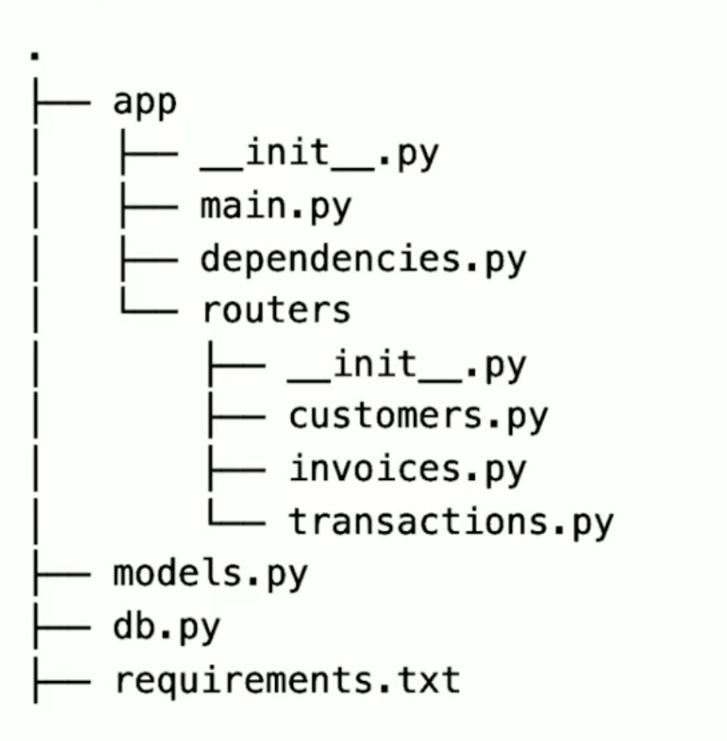
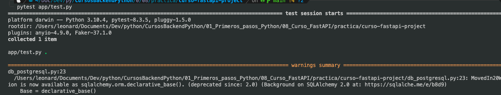

# Curso de FastAPI
> Crea y conecta APIs modernas con FastAPI y Python. Estructura proyectos, valida datos, organiza modelos, añade autenticación, relaciones y pruebas, y optimiza consultas y rendimiento usando SQLModel y Pydantic.

- Profesor: Luis Martínez
- Fecha Inicio: 23/Mayo/2025  
- Fecha Fin: 28/Mayo/2025

## Clase 1: Creación de APIs rápidas y eficientes con FastAPI

## ¿Por qué FastAPI es revolucionario en la creación de APIs?
FastAPI permite desarrollar APIs de alto rendimiento sin complicaciones de configuración, lo que la convierte en una herramienta ideal para aplicaciones que demandan velocidad y escalabilidad. Con este framework, Python puede competir con los lenguajes más rápidos, ofreciendo una experiencia de desarrollo sencilla y poderosa. Algunas características que lo hacen destacar incluyen:

- Velocidad: Utiliza las capacidades de Python y aprovecha tipado y optimización de datos para maximizar el rendimiento.
- Simplicidad: Gracias a su diseño intuitivo y buena documentación, se adapta tanto a principiantes como a expertos.
- Escalabilidad: Ideal para aplicaciones de misión crítica, soporta grandes volúmenes de tráfico, usado por empresas de alto nivel.

## 
- enlace -> https://fastapi.tiangolo.com/
```Python

```


## Clase 2: Creación de APIs con FastAPI: Framework Rápido y Versátil


## ¿Cómo funciona FastAPI internamente?
FastAPI está basado en dos frameworks principales:

- Starlette: Gestiona las solicitudes HTTP, permitiendo a la API recibir y responder peticiones de manera eficiente.
- Pydantic: Facilita la creación de modelos de datos. Con estos modelos, puedes estructurar la información para agregar, modificar o eliminar datos en la API de forma controlada y validada.

```Python

```

## Clase 3: Creación de Entornos Virtuales y Configuración de FastAPI


## Pasos 
- Paso 1: Primero generamos un entorno -> ´python3 -m venv fastapivenv´ -> ´source fastapivenv/bin/activate´
- Paso 2: Instalamos fastAPI -> 'pip3 install "fastapi[standar]"'
- Paso 2: Instalamos fastAPI -> 'pip install uvicorn'
- Paso 4: creamos un repositorio para gestionar el API -> ´mkdir curso-fastapi-project´ -> cd curso-fastapi-project
- Paso 5: creamos el archivo main.py dentro del repositorio creado del proyecto -> ´touch main.py´
- Paso 6: este archivo es tu server 

```Python

## Ejemplo 
import arrow
import uvicorn
from fastapi import FastAPI

app = FastAPI()


@app.get("/time")
async def time():
    return {"curren_time": arrow.utcnow().format("YYYY-MM-DD HH:mm:ss")}


if __name__ == "__main__":
    uvicorn.run(app, host="0.0.0.0", port=8000)

```
- Paso 6: ejecutar el api -> ´uvicorn main:app --reload´
- Paso 7: podemos acceder de manera local
    -  swangger ->  http://127.0.0.1:8000/docs 
    - local     ->  http://127.0.0.1:8000/


## Clase 4: Crear un Endpoint Dinámico con FastAPI para Obtener Hora por País y Formato
> Manera de pasar variables usando el decorador 


```Python

import arrow
import zoneinfo
from datetime import datetime
import uvicorn
from fastapi import FastAPI

app = FastAPI()

country_timezones = {
    "CO": "America/Bogota",
    "MX": "America/Mexico_City",
    "AR": "America/Argentina/Buenos_Aires",
    "BR": "America/Sao_Paulo",
    "PE": "America/Lima",
}


@app.get("/time-with-arrow")
async def time(iso_code:str):
    return {"curren_time": arrow.utcnow().format("YYYY-MM-DD HH:mm:ss")}

@app.get("/time-with-datetime/{iso_code}")
async def time(iso_code: str):
    iso = iso_code.upper()
    timezone_str = country_timezones.get(iso)
    tz = zoneinfo.ZoneInfo(timezone_str)
    return {"time": datetime.now(tz)}

if __name__ == "__main__":
    uvicorn.run(app, host="0.0.0.0", port=8000)

```

## Clase 5: Validación de datos con Pydantic en FastAPI: Creación de endpoints
> Para crear un endpoint dinámico y seguro en FastAPI, es fundamental validar la información recibida, especialmente si el contenido se envía en el cuerpo de la solicitud.

## ¿Cómo estructurar un modelo de datos en FastAPI?
Para definir un modelo de datos, FastAPI emplea Pydantic, que permite usar clases para representar un esquema y validar la información que ingresa. Los pasos iniciales incluyen:

## Importar BaseModel de Pydantic.
Crear una clase llamada Customer que herede de BaseModel.
Definir campos dentro de la clase con sus tipos, por ejemplo, name: str para el nombre y age: int para la edad.
Utilizar typing para permitir múltiples tipos de datos, como en el campo description, que podría ser de tipo str o None (opcional).

En FastAPI, se utiliza async para definir endpoints con el fin de aprovechar la programación asíncrona. Esto permite manejar múltiples solicitudes de manera concurrente sin bloquear el hilo principal. Al realizar operaciones que pueden tardar, como consultas a bases de datos o llamadas a APIs externas, async ayuda a mejorar el rendimiento y la capacidad de respuesta de la aplicación,

```Python
# main.py

import arrow
import zoneinfo
from datetime import datetime
import uvicorn
from fastapi import FastAPI

from pydantic import BaseModel 

class Customer(BaseModel):
    name:str
    descripcion:str|None
    email:str 
    age:int 

@app.post("/customers")
async def create_customer(customer_data: Customer):
    """
        Una forma sencilla para documentar tu método 
    """
    return customer_data

if __name__ == "__main__":
    uvicorn.run(app, host="0.0.0.0", port=8000)

```


## Clase 6: Modelado de Datos y Conexión de Modelos en FastAPI
> Para diseñar una API robusta, es esencial modelar correctamente los datos, especialmente al crear nuevos modelos que organicen y relacionen la información eficientemente. En esta guía, exploraremos cómo crear modelos en FastAPI para estructurar datos, conectar modelos y optimizar la funcionalidad de nuestra API

## Pasos: 
- Paso 1: Podemos aplicar la estructuración MVC para manejar nuestro FASTAPI iniciamos creando el archivo modelo.py y ahí anexamos nuestros modelos. 

- Paso 2: Creamos nuestro  modelo en nuestro model.py 

```Python
from pydantic import BaseModel


class Customer(BaseModel):
    id: int
    name: str
    description: str | None
    email: str
    age: int

class Transaction(BaseModel):
    id: int
    ammount: int
    description: str

class Invoice(BaseModel):
    id: int
    customer: Customer
    transactions: list[Transaction]
    total: int

    @property## Visiviliza esta variable como variable de clase 
    def ammount_total(self):
        return sum(transaction.ammount for transaction in self.transactions)

```
- Paso 3: importamos desde main.py los modelos y en nuestros endpoint podemos aplicar y usar nuestro modelo 

```Python

@app.post("/customers")
async def create_customer(customer_data: Customer):
    """
        Una forma sencilla para documentar tu método 
    """
    return customer_data

@app.post("/transaction")
async def create_customer(transaction_data: Transaction):
    """
        Una forma sencilla para documentar tu método 
    """
    return transaction_data

@app.post("/invoice")
async def create_customer(invoice_data: Invoice):
    """
        Una forma sencilla para documentar tu método 
    """
    return invoice_data

```

## Clase 7: Validación de Datos y Modelos en Endpoints de FastAPI
> La validación de datos y la gestión de modelos en FastAPI permite crear endpoints seguros y eficientes. En este ejemplo, mostramos cómo manejar un modelo para recibir y devolver datos sin exponer identificadores innecesarios

## Notas: 
- Podemos usar el metodo de pydantic para crear validaciones sencillas desde el modelo ´model_validate´

```Python

db_customers: list[Customer] = []

@app.post("/customers", response_model=Customer)
async def create_customer(customer_data: CustomerCreate):
    customer = Customer.model_validate(customer_data.model_dump()) ## Aqui la magia 
    # Ausmiendo que hace base de datos
    customer.id = len(db_customers)
    db_customers.append(customer)
    return customer

```


## Clase 8: Conexión de FastAPI con SQLite usando SQLModel
> Para conectar FastAPI con una base de datos real, primero configuraremos una base de datos SQLite utilizando la librería SQLModel, que facilita la integración sin necesidad de escribir SQL. SQLModel combina Pydantic y SQLAlchemy, permitiendo que nuestros modelos se almacenen directamente en bases de datos con una sintaxis simplificada

## PASOS

## ¿Cómo instalar y configurar SQLModel?
1. Instalación: Abre la terminal y ejecuta:

    pip install sqlmodel

También es recomendable registrar las dependencias en un archivo requirements.txt, como SQLModel y FastAPI con sus respectivas versiones. Esto ayuda a instalar todas las dependencias en otros entornos fácilmente.

2. Creación del archivo de configuración:

Crea un archivo db.py.
Importa las clases Session y create_engine de SQLModel para gestionar la conexión.
Define las variables para la conexión, como la URL de la base de datos, en este caso sqlite:///database_name.db.

3. Creación del engine:

Utiliza create_engine con la URL de la base de datos para crear el motor que gestionará las sesiones.
```Python

from fastapi import FastAPI
from typing import Annotated

from fastapi import Depends
from sqlmodel import Session, create_engine, SQLModel

sqlite_name = "db.sqlite3"
sqlite_url = f"sqlite:///{sqlite_name}"

engine = create_engine(sqlite_url)


def get_session():
    with Session(engine) as session:
        yield session


SessionDep = Annotated[Session, Depends(get_session)]

```

4. Importamos la conexion donde deseamos usarlo 

```Python

# main.py 

from db import SessionDep ## Paso 1

db_customers: list[Customer] = []


@app.post("/customers", response_model=Customer)
async def create_customer(customer_data: CustomerCreate, session: SessionDep): ## Paso 2
    customer = Customer.model_validate(customer_data.model_dump())
    # Ausmiendo que hace base de datos
    customer.id = len(db_customers)
    db_customers.append(customer)
    return customer

```
4. Debemos usar el SQLModel en nuestro modelo para generar las tablas deseadas 
## Ejemplo 
> Como podemos ver usamos la clase SQLModel que permite configurar nuestras clases para generar tablas lo primordial es enviar como parametro tambien table=True para que funcione  ->  Customer(SQLModel, table=True): 

```python

from pydantic import BaseModel
from sqlmodel import Field, SQLModel 


class Customer(SQLModel, table=True):
    id: int | None = Field(default=None, primary_key=True)
    name: str
    description: str | None
    email: str
    age: int


```

## Clase 9: Integración de SQLModel en FastAPI para Manejo de Bases de Datos
> 

## Pasos 
- Paso 1: Debemos crear el metodo para generar la tablas en la base de datos 

```Python
def create_all_tables(app:FastAPI):
    SQLModel.metadata.create_all(engine)
    yield ## Indicamos que use esta funcionalidad a otro llamado 


```

- Paso 2: Ubicamos main.py y en la configuración de app restablecemos lo que necesitamos -> lifespan=create_all_tables

```Python

app = FastAPI(lifespan=create_all_tables) ## lifespan nos permite ejecutar un metodo al comienzo o al final que se inicia el APP (server) para este caso -> create_all_tables() lo definimos en el archivo db_postgresql
```
- Paso 3: configuramos nuestro endpoint, notese que agregamos add(), commit(), refresh() esto nos permite interactuar ya con la base de datos 
```python 
#main.py 

@app.post("/customers", response_model=Customer)
async def create_customer(customer_data: CustomerCreate, session: SessionDep):
    customer = Customer.model_validate(customer_data.model_dump())
    session.add(customer)## Ejecuta la sentencia 
    session.commit()## Aplica los cambios 
    session.refresh(customer)##refresca el modelo con lo nuevo 
    return customer
```


## Clase 10 y 11: Find, Create, Update, Delete Gestión de Endpoints en FastAPI para CRUD de Clientes
> Dejo la manera de ejemplo de CRUD
- Archivo de referencia [Enlace](../08_Curso_FastAPI/practica/curso-fastapi-project/app/routers/customers.py)

## Buscar ID

```Python
@router.get("/customers/{customer_id}", response_model=Customer, tags=['customers'])
async def read_customer(customer_id: int, session: SessionDep):
    """
        End Point para buscar por id
    """
    customer_db = session.get(Customer, customer_id)
    if not  customer_db:
        raise HTTPException(status_code=status.HTTP_404_NOT_FOUND, detail="Cliente no encontrado")
    return customer_db

```

## Update 
```Python
@router.patch("/customers/{customer_id}", response_model=Customer, status_code=status.HTTP_201_CREATED, tags=['customers'])
async def put_customer(customer_id: int, customer_data: CustomerUpdate, session: SessionDep):  
    """
        End Point para modificar cliente por ID 
    """  
    customer_db = session.get(Customer, customer_id)
    if not  customer_db:
        raise HTTPException(status_code=status.HTTP_404_NOT_FOUND, detail="Cliente no encontrado")

    customer = customer_data.model_dump(exclude_unset=True)
    customer_db.sqlmodel_update(customer)
    session.add(customer_db)## Ejecuta la sentencia 
    session.commit()## Aplica los cambios 
    session.refresh(customer_db)##refresca el modelo con lo nuevo 
    return customer_db

```

## Delete 
```Python

@router.delete("/customers/{customer_id}", tags=['customers'])
async def delete_customer(customer_id: int, session: SessionDep):
    """
        End Point para eliminar cliente por ID
    """
    customer_db = session.get(Customer, customer_id)
    if not  customer_db:
        raise HTTPException(status_code=status.HTTP_404_NOT_FOUND, detail="Cliente no encontrado")
    session.delete(customer_db)## Ejecuta la sentencia 
    session.commit()## Aplica los cambios 
    return {"detail":"OKI"}

```

## Clase 12: Estructuración de Aplicaciones con FastAPI y API Router
> Se sugiere una estructura muy baga, aquí un ejemplo practico 
- Se sugiere aplicar arquitectura Limpia
- Se sugiere aplicar arquitectura Exagonal 
- Imagen Muestra 
- Se tomará este proyecto básico como referencia [Enlace Aqui](../08_Curso_FastAPI/practica/curso-fastapi-project/app/main.py)
- Haciendo esta estructura debemos cambiar la forma de ejeuctar el comando -> ´uvicorn app.main:app --reload´
- Se implementa la mejora de Router

```python

import arrow
import zoneinfo
from datetime import datetime
import uvicorn
from fastapi import FastAPI
from db_postgresql import create_all_tables
from .routers import customers

app = FastAPI(lifespan=create_all_tables) 

app.include_router(customers.router)

```

## Clase 13: Relaciones en FastAPI y SQL Model: Creación y Uso Práctico
> os modelos de datos en bases de datos relacionales permiten organizar y relacionar información sin duplicarla en múltiples tablas, optimizando así la gestión de datos. Al usar FastAPI y SQLModel, es posible configurar estas relaciones en los modelos que luego reflejarán las tablas en la base de datos, permitiendo un acceso eficiente y estructurado a los datos.

## Notas mentales 
- Para las relaciones podemos importar **Relationship** de nuestra libreria **sqlmodel**
- Para este ejempli es una relacion de un cliente puede tener muchas transacciones por lo que es 1..m 
- Como sabemos en la tabla hija va la id del padre como vemos en el ejemplo 
- foreign_key: Define la clave foránea en el modelo.
- Relationship: Establece una relación entre tablas.
- back_populates: Conecta las relaciones en ambas direcciones.

```python
## Transacciones 
class TransactionBase(SQLModel):
    ammount: int
    description: str

class Transaction(TransactionBase, table=True):
    id: int | None = Field(default=None, primary_key=True)
    customer_id: int = Field(foreign_key="customer.id")
    customer: Customer = Relationship(back_populates="transactions")


class TransactionCreate(TransactionBase):
    customer_id: int = Field(foreign_key="customer.id")

```

## Clase 14: Relaciones Muchos a Muchos en Bases de Datos con SQLModel
> Las relaciones de muchos a muchos en bases de datos nos permiten asociar múltiples elementos de una tabla con muchos elementos de otra, utilizando una tabla intermedia. Esta tabla de enlace facilita las conexiones entre ambos elementos, permitiendo una mayor flexibilidad en la organización y gestión de los datos

## Notas mentales 
- Primer paso se genera una tabla pivote ver ejemplo 
- Segundo en la tabla Padre llevara esta nomeclatura -> customers: list["Customer"] = Relationship(back_populates="plans", link_model=CustomerPlan) ## Relacion de muchos a muchos
- Tercero la otra tabla Padre llevara la siguiente nomeclatura ->  plans: list[Plan] = Relationship(
        back_populates="customers", link_model=CustomerPlan
    )
- Para este Ejemplo la tabla pivote es CustomerPlan y esta tiene la ids de las tablas padres Plan y  Customer


```python
class CustomerPlan(SQLModel, table=True):## Tabla pivote 
    id: int = Field(primary_key=True)
    plan_id: int = Field(foreign_key="plan.id")
    customer_id: int = Field(foreign_key="customer.id")


class Plan(SQLModel, table=True):
    id: int | None = Field(primary_key=True)
    name: str = Field(default=None)
    price: int = Field(default=None)
    descripcion: str = Field(default=None)
    customers: list["Customer"] = Relationship(back_populates="plans", link_model=CustomerPlan) ## Relacion de muchos a muchos

class Customer(CustomerBase, table=True):
    id: int | None = Field(default=None, primary_key=True)
    transactions: list["Transaction"] = Relationship(back_populates="customer")
    plans: list[Plan] = Relationship(
        back_populates="customers", link_model=CustomerPlan
    )

```

## Clase 15: Creación y Suscripción de Planes y Clientes en FastAPI
> 
```python
from fastapi import APIRouter
from sqlmodel import select

from db_postgresql import SessionDep
from models import Plan

router = APIRouter()


@router.post("/plans")
async def create_plan(plan_data: Plan, session: SessionDep):
    plan_db = Plan.model_validate(plan_data.model_dump())
    session.add(plan_db)
    session.commit()
    session.refresh(plan_db)
    return plan_db


@router.get("/plans", response_model=list[Plan])
async def list_plan(session: SessionDep):
    # plans = session.execute(select(Plan)).all()
    plans =session.execute(select(Plan)).scalars().all()
    return plans
```

## Clase 16: Consultas Avanzadas con SQL Model y Filtrado de Estados en FastAPI
> Uso del Query
## nota mental
- from fastapi import  Query -> este hace la magia de enviar valores  por get 

```python
@router.get("/customers/{customer_id}/plans")
async def subscribe_customer_to_plan(
    customer_id: int, session: SessionDep, plan_status: StatusEnum = Query()
):
    customer_db = session.get(Customer, customer_id)

    if not customer_db:
        raise HTTPException(status_code=status.HTTP_404_NOT_FOUND)

    query = (
        select(CustomerPlan)
        .where(CustomerPlan.customer_id == customer_id)
        .where(CustomerPlan.status == plan_status)
    )
    plans = session.execute(query).all()
    return plans
##{"detail":"OKI"}

```

## Clase 17: Validación de Emails Únicos en Bases de Datos con Pydantic y FastAPI
> La validación efectiva de datos es crucial en el desarrollo de software, especialmente cuando se habla de correos electrónicos. Con herramientas como FastAPI y Pydantic, puedes asegurar no solo que tus e-mails tengan el formato adecuado, sino también que sean únicos dentro de tu base de datos.

## Notas mentales 
- from pydantic import EmailStr importar y usar en el modelo 
- https://docs.pydantic.dev/2.0/usage/types/string_types/#emailstr
- from pydantic import  field_validator =>  para realizar validaciones personalizadas 

```python

class CustomerBase(SQLModel):  
    name: str = Field(default=None)
    description: str | None = Field(default=None)
    email: EmailStr = Field(default=None)
    age: int = Field(default=None)

```

## Clase 18: Implementación de Paginación en FastAPI con SQLModel
> El profesor se paso de maniaco explica hacerlo manual el paginador cosa que ya con un plugin se puede hacer usaremos para este caso pip install fastapi-pagination

## Nota Mental 
- Sin embargo se dejan los ejemplos de hacer un paginador a manita y otro ejemplo usando el plugin [Enlace](../08_Curso_FastAPI/practica/curso-fastapi-project/app/routers/transactions.py)
- No pude arrancar usando el paginate lo que pude comprender que para hacerlo funcionar se usa sqlalchemi y no estamos usando ese modelo estamos usando SQLModel sin embargo luego haré una practica para validar eso 


## Clase 19: Implementación de Middlewares en FastAPI para Medir Tiempos de Request
> Los middlewares son piezas clave para gestionar tareas comunes antes y después de cada request en FastAPI. Al crear un middleware, modificamos el comportamiento global de nuestras APIs, lo que hace nuestro código más organizado y eficiente.


```python

import uvicorn
from fastapi import FastAPI, Request
#from fastapi_pagination.middleware import PaginationMiddleware
from fastapi_pagination import Page, paginate, add_pagination
from db_postgresql import create_all_tables
from .routers import customers, transactions, plan

app = FastAPI(lifespan=create_all_tables)

# 1. Añade el middleware de paginación
#app.add_middleware(PaginationMiddleware)

# 2. Incluye tus routers
app.include_router(customers.router)
app.include_router(plan.router)
app.include_router(transactions.router)

# 3. Añade el soporte de paginación para SQLAlchemy/SQLModel
add_pagination(app)

@app.middleware("http") 
async def log_request_headers(request: Request, call_next):
    
    print("Request Headers:")
    for header, value in request.headers.items():
        print(f"{header}: {value}")
    response = await call_next(request) 
    return response

if __name__ == "__main__":
    uvicorn.run(app, host="0.0.0.0", port=8000)

```
## Clase 20: Pruebas unitarias con FastAPI y Pytest: Configuración y Ejecución
> Aprender a configurar pruebas unitarias es esencial para desarrollar aplicaciones con FastAPI. Esto asegura que tus desarrollos tengan calidad y que puedas detectar errores rápidamente, agilizando tu flujo de trabajo. FastAPI, combinado con el framework PyTest, permite escribir y ejecutar pruebas automatizadas de manera sencilla y efectiva.

## ¿Qué necesitas para configurar las pruebas de FastAPI?
Las pruebas en FastAPI requieren configuración local inicial y una base de datos separada específica para testing. Con esto, puedes ejecutar pruebas repetidamente sin afectar tu entorno de producción. Las herramientas principales son:

- PyTest: framework especializado en pruebas unitarias.
- TestClient de FastAPI: facilita simular solicitudes HTTP (GET, POST) como si las realizara un navegador.
- SQLAlchemy y SQLModel: para configurar motores y sesiones de base de datos.

## ¿Cómo configurar el entorno local?
Para poder correr pruebas efectivamente, sigue estos pasos:

1. Crear archivo de configuración para pruebas
Crea un archivo llamado convTest.py. Aquí estarán todas las configuraciones específicas de pruebas.

2. Ajuste en motor de base de datos
No se recomienda usar la base de datos de producción para pruebas. En cambio, crea un motor específico para testing:
```python
from sqlalchemy import create_engine
from sqlalchemy.pool import StaticPool

engine = create_engine(
    "db_testing_url",
    connect_args={"check_same_thread": False},
    poolclass=StaticPool
)
```
La opción check_same_thread en False evita conflictos entre distintos hilos, y StaticPool mantiene la base de datos en memoria para facilitar pruebas rápidas.

3. Manejo de tablas con fixtures de PyTest
PyTest emplea fixtures, funciones reutilizables entre diferentes pruebas. Utiliza un fixture para crear y luego eliminar tablas automáticamente:
```python
import pytest
from sqlmodel import SQLModel, Session

@pytest.fixture(name="session")
def session_fixture():
    SQLModel.metadata.create_all(engine)
    with Session(engine) as session:
        yield session
    SQLModel.metadata.drop_all(engine)
```

## ¿Cómo sobrescribir funcionalidades para testing correctamente?
Para aislar las pruebas y usar configuraciones específicas sin afectar producción, utiliza la sobreescritura de dependencias:
```python
from fastapi.testclient import TestClient
from app.main import app

@pytest.fixture(name="client")
def client_fixture(session: Session):
    def get_session_override():
        return session

    app.dependency_overrides[get_session] = get_session_override

    with TestClient(app) as client:
        yield client
        app.dependency_overrides.clear()
```
Este enfoque te permite probar endpoints especificando comportamientos únicos en ambiente controlado.

## ¿Cómo validar tu configuración correctamente?
Realiza una prueba simple en un archivo test.py para diagnosticar si la configuración funcionó correctamente:


```python
from fastapi.testclient import TestClient

def test_client(client):
    assert type(client).__name__ == TestClient.__name__
```
4. Para ejecutar podemos realizar el siguiente comando desde nuestro proyecto raiz 'pytest app/test.py'
- qudando de esta manera -> 
- Recuerda ese punto verde quiere decir que corrio bien :S 


## Clase 21: Pruebas Unitarias para CRUD de Clientes en FastAPI
> 

## notas mentales
- Debemos crear un directorio test y podemos crear nuestros archivos con nuestra nomeclatura test_nombre_modulo_funcionalidad_.py
- para ejecutar ahora ´pytest app/test/tests_customers.py´
- Recuerda previamente debes realizar una arhivo conftest.py ya que desde aqui se conecta a tu base de datos de pruebas 
- Con este ejemplo podemos validar como se hace y como se usa los assert 

```python
from fastapi import status


def test_create_customer(client):
    response = client.post(
        "/customers",
        json={
            "name": "Jhon Doe",
            "email": "jhon@example.com",
            "age": 33,
        },
    )
    assert response.status_code == status.HTTP_201_CREATED


def test_read_customer(client):
    response = client.post(
        "/customers",
        json={
            "name": "Jhon Doe",
            "email": "jhon@example.com",
            "age": 33,
        },
    )
    assert response.status_code == status.HTTP_201_CREATED
    customer_id: int = response.json()["id"]
    response_read = client.get(f"/customers/{customer_id}")
    assert response_read.status_code == status.HTTP_200_OK
    assert response_read.json()["name"] == "Jhon Doe"

```

## Clase 22 : Autenticación Básica HTTP con FastAPI
> No me gusto el del profesor 

aplique la de un alumno 

## Paso 1: configuro y uso lo soiguiente 
- usamos HTTPBasic()         => Función: HTTPBasic() es una dependencia que FastAPI te proporciona para declarar que una ruta o un conjunto de rutas requieren autenticación básica HTTP. Al usar HTTPBasic() como una dependencia en la definición de una ruta, FastAPI automáticamente espera que la petición HTTP entrante incluya el encabezado Authorization con las credenciales codificadas en Base64.

- usamos HTTPBasicCredentials => Función: HTTPBasicCredentials es una clase de datos (dataclass en Python) que FastAPI utiliza para representar las credenciales de autenticación básica HTTP que fueron extraídas del encabezado Authorization por la dependencia HTTPBasic().

## Paso 2: Definimos nuestro modelo basico ojo ya aquí podemos afianzarnos con algun token o una secretkey 
```python
security = HTTPBasic() #este lo pasamos como dependencia a la funcion que crearemos

def authenticate(credentials: HTTPBasicCredentials = Depends(security)):
    if (credentials.username == "lis" and credentials.password == "liss"):
        return True
    raise HTTPException(status_code=status.HTTP_401_UNAUTHORIZED, detail="Unauthorized")

```

## Paso 3: en nuestros endpoint que deseamos alguna autorización podemos pasale como parametro esta solicitud 
```python
@router.post("/customers", response_model=Customer, tags=['customers'], status_code=status.HTTP_201_CREATED)
async def create_customer(customer_data: CustomerCreate, session: SessionDep, auth: bool = Depends(authenticate)):
    """
        End Point para crear cliente
    """
    customer = Customer.model_validate(customer_data.model_dump())
    session.add(customer)## Ejecuta la sentencia 
    session.commit()## Aplica los cambios 
    session.refresh(customer)##refresca el modelo con lo nuevo 
    return customer
```


Explicación:

- Celery: Es un broker de tareas asíncronas. En una aplicación FastAPI, se utiliza para delegar tareas que no necesitan una respuesta inmediata al usuario (como el procesamiento de datos pesados, envío de correos electrónicos, etc.) a procesos en segundo plano. Esto evita bloquear la solicitud del usuario y mejora la capacidad de respuesta de la API.

- Sistema de caché externo (como Redis o Memcached): Se utiliza para almacenar en memoria los resultados de operaciones costosas (como consultas a la base de datos o cálculos complejos). Cuando la misma información se solicita nuevamente, se puede servir directamente desde la caché, evitando tener que realizar la operación costosa de nuevo y mejorando significativamente el rendimiento.

- Ambos, Celery y un sistema de caché externo, abordan problemas relacionados con la gestión de tareas que consumen tiempo y la optimización del rendimiento en una aplicación FastAPI.


- A: Si bien los ORM ayudan con las relaciones de bases de datos, Celery y los sistemas de caché no están directamente enfocados en simplificar la creación de estas relaciones.
- C: La gestión de dependencias y la consistencia del entorno de desarrollo son abordadas por herramientas como pip y entornos virtuales, no por Celery o sistemas de caché.
- D: La definición de modelos de datos complejos y validaciones avanzadas es la función principal de Pydantic, que se integra muy bien con FastAPI, pero no es el problema que resuelven Celery o los sistemas de caché.


## Preguntas Mentales

1.
¿Cuál es el propósito de utilizar entornos virtuales al trabajar con FastAPI?
Permiten mantener las dependencias del proyecto separadas de otros proyectos.
2.
¿Cuál es la ventaja de utilizar un archivo separado como models.py para definir los modelos en una aplicación FastAPI?
Permite organizar mejor el código y evitar el código espagueti.
3.
¿Qué técnica podrías usar para asegurar que los datos ingresados por el usuario sean válidos antes de almacenarlos en FastAPI?
Utilizar un modelo de validación que verifique los datos antes de procesarlos.
4.
¿Qué se debe hacer para que un nuevo customer se guarde en la base de datos al crearlo en FastAPI?
Agregar el customer a la sesión y ejecutar session.commit.
5.
¿Cuál es el método HTTP más adecuado para actualizar parcialmente un recurso en FastAPI?
PATCH
6.
Al modificar el modelo de datos en FastAPI y agregar un nuevo campo, ¿cuál es la mejor práctica para reflejar estos cambios en la base de datos?
Utilizar migraciones
7.
En una app FastAPI, ¿qué problema resuelve el uso de Celery o un sistema de cache externo?
Permite manejar tareas asíncronas y mejorar el rendimiento al evitar recalcular información repetidamente.
8.
En un middleware para registrar el tiempo de procesamiento, ¿qué es esencial para el cálculo?
Guardar la hora de inicio y finalización del procesamiento para calcular la duración total.
9.
En pruebas unitarias con FastAPI, ¿qué propósito tiene `dependency_overrides`?
Reemplazar la sesión de base de datos productiva por una sesión de pruebas.
10.
Al agregar un campo 'Status' a un modelo, ¿cómo asegurar que tenga un valor por defecto?
Definiendo el valor por defecto directamente en el campo al crear el modelo (ej: Status=Campo(default=Active)).
11.
En una API que usa paginación, ¿cómo se controla qué porción de datos se recibe en cada solicitud?
A través de parámetros en la URL que indican qué registros omitir y cuántos mostrar.
12.
Después de crear una prueba, ¿qué paso es crucial antes de considerarla completa y confiable?
Asegurarse de usar 'assert' para verificar que el resultado obtenido coincide con el esperado.
13.
¿Qué propósito tiene la tabla intermedia 'customer_plan' en una relación de muchos a muchos?
Conecta múltiples clientes con múltiples planes, gestionando las relaciones entre ambas entidades.
14.
¿Cómo protege FastAPI los datos en las APIs?
Implementa mecanismos en los endpoints, como autenticación básica con usuario y contraseña, según necesidad y lógica del negocio.
15.
¿Qué indica el uso de un decorador 'validator' tachado en el código?
Que el decorador ha sido reemplazado por una nueva herramienta (field validator) y no debería usarse.

