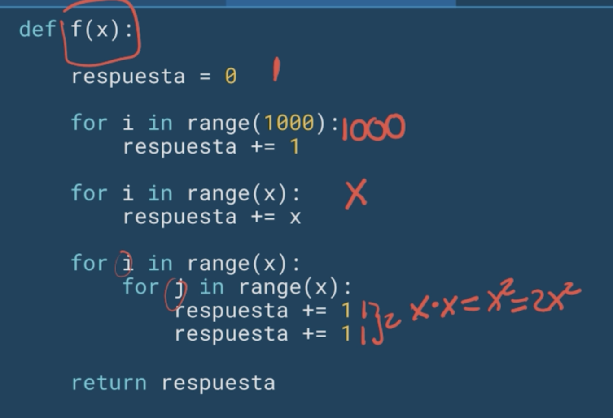
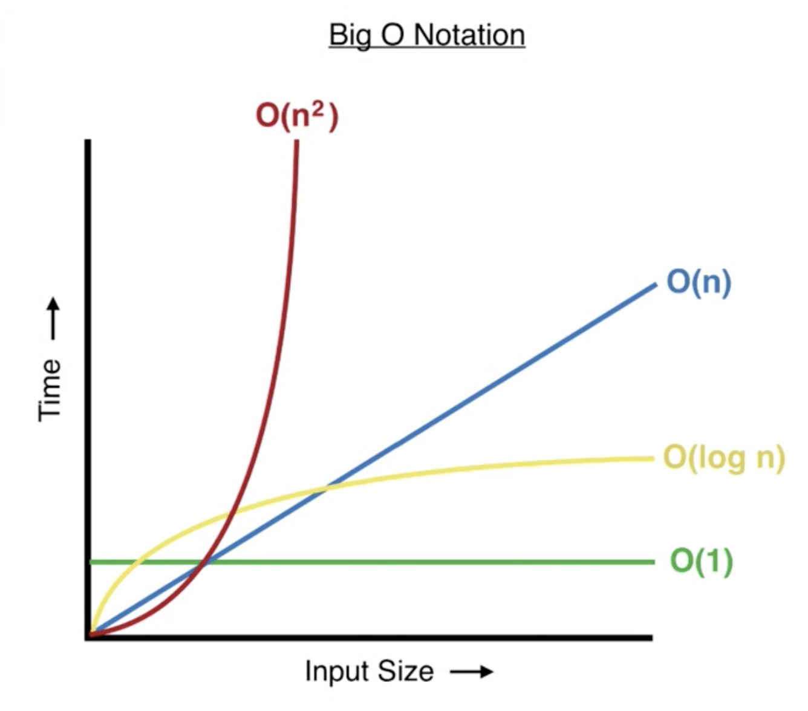
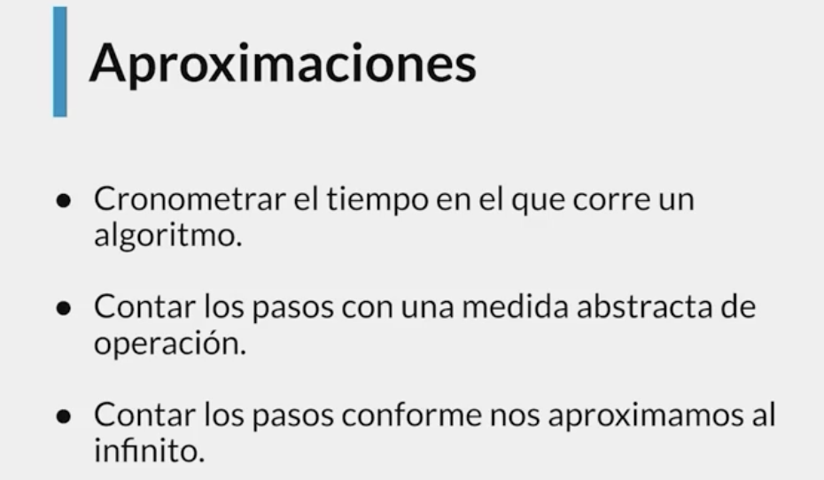

# Curso de Complejidad Algorítmica con Python
> Crea aplicaciones web completas con Flask: rutas, vistas, formularios, bases de datos con SQLAlchemy, autenticación, plantillas con Jinja, pruebas unitarias y mejoras visuales con TailwindCSS.

- Profesor: David Aroesti
- Fecha Inicio: 19/Junio/2025  
- Fecha Fin: 
- Guia : https://github.com/platzi/curso-flask/ 
- Curso Viejo -> https://platzi.com/clases/old/flask-19/ -> flask viejo curso 


## Clase 1-2: Complejidad Algorítmica: Comparación y Medición de Eficiencia

La complejidad algorítmica es algo implícito de la programación. En otras palabras cuando escribimos código lo que hacemos es llevar una secuencia de pasos para solucionar un determinado problema (algoritmo) a una sintaxis que comprende el computador. Esta secuencia de pasos no siempre es la más optima ( costo de recursos ya sea temporal- tiempo o espacial- memoria). Es muy importante emplear algoritmos eficientes que consuman lo mínimo de recursos del computador. Ahora la Programación orientada a Objetos es un paradigma de programación que tiene sus ventajas y al igual que otros paradigmas lo que buscan es generar eficiencia al momento de escribir y mantener el código. La relación que yo encontraría es que es necesario saber la complejidad algorítmica de tus métodos para decidir si tu solución es la más optima y así evitar que tus funciones o métodos consuman demasiado recurso.

Nota: La complejidad algorítmica es muy importante cuando trabajas con una cantidad enorme de datos, así que es muy importante conocerlo sin importar el tipo de paradigma que uses de programación

La complejidad algorítmica nos permite comparar la eficiencia de 2 algoritmos, esto a su vez va a predecir el tiempo que va a tomar resolver un problema. No solamente podemos analizar la complejidad desde la perspectiva temporal, también la podemos hacer desde la espacial, como por ejemplo cuanto espacio en memoria necesitamos.

La complejidad algorítmica temporal la podemos definir como T(n) el cual determinara el tiempo que demora en resolver nuestro algoritmo.

Aproximaciones

¿Como podríamos aplicar nuestra función T(n)?

Cronometrar el tiempo en el que corre un algoritmo. Sin embargo no es una buena forma de medir los algoritmos, ya que no se puede predecir cuanto demorara a medida que crece nuestros pasos.

Contar los pasos con una medida abstracta de operación. Nos puede acercar a una medición ideal, sin embargo varia mucho de algoritmo en algoritmo y a medida que crece nuestro dataset existen muchos términos que llegan a ser irrelevantes.

Contar los pasos conforme nos aproximamos al infinito pero con una medida asintótica.

Medición temporal

Para una realizar una medida temporal simplemente calculamos la diferencia del tiempo previo y posterior de la ejecución del algoritmo.

```Python
import time

def factorial(n):
    respuesta = 1

    while n > 1:
        respuesta *= n
        n -= 1

    return respuesta


def factorial_r(n):
    if n == 1:
        return 1

    return n * factorial(n - 1)


if __name__ == '__main__':
    n = 200000

    comienzo = time.time()
    factorial(n)
    final = time.time()
    print(final - comienzo)

    comienzo = time.time()
    factorial_r(n)
    final = time.time()
    print(final - comienzo)
```

## clase 3: Análisis del Crecimiento de Funciones en Algoritmos

## Problema 



## Análisis 


Rojo  = función polinómica 
Azul  = función lineal Amarillo = Función Logarítmica 
Verde = Constante.

> por ende el Big O de ese forloop es N (O(n)), o bien, como el profesor lo denota, O(x)
## Teoria 




