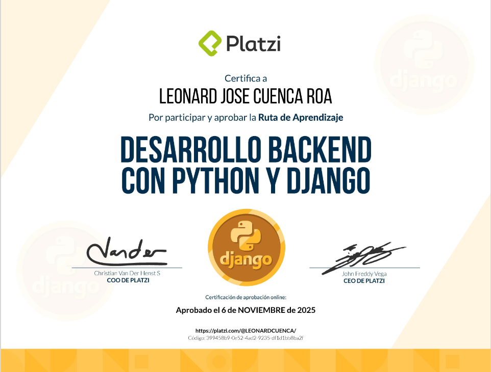
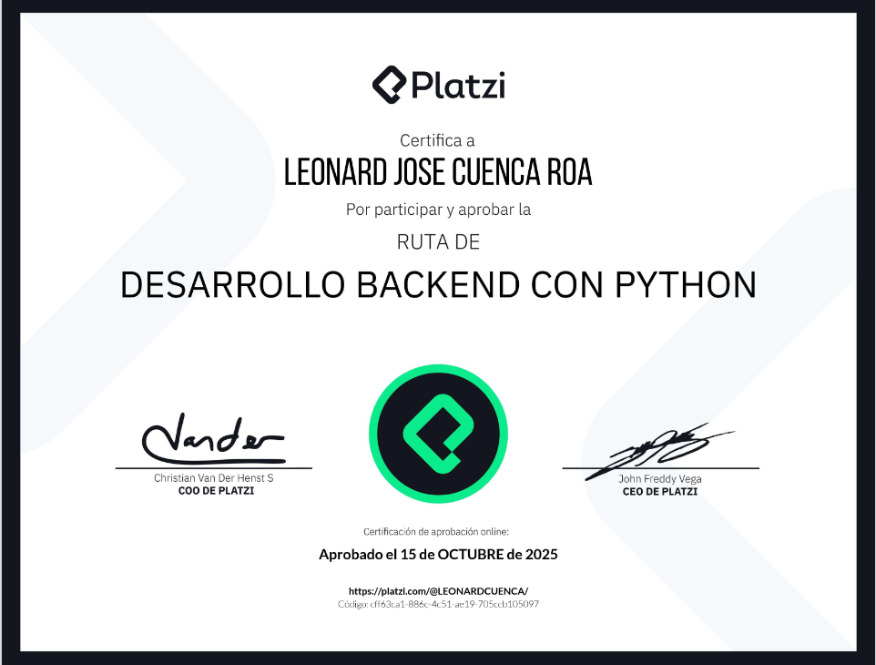

| Detalle | Información |
| :--- | :--- |
| **Publicado el** | Publicado el 11 de octubre de 2022 |
| **Profesor** | Luis Martinez |
| **Fecha de Inicio** | 01/05/2022 |
| **Fecha de Fin** | 28/08/2025 |

---

  

  

| Curso | Certificado |
| :--- | :---: |
| Python para principiantes | [Ver PDF](https://github.com/LeoSan/CursosBackendPython/blob/main/01_Primeros_pasos_Python\2025_Diploma-python-principiantes_PLATZI.pdf) |
| Diploma Desarrollo Backend con Python | [Ver PDF](https://github.com/LeoSan/CursosBackendPython/blob/main/01_Primeros_pasos_Python\2025_Diploma-Desarrollo-Backend-con-Python_PLATZI.pdf) |

--- 