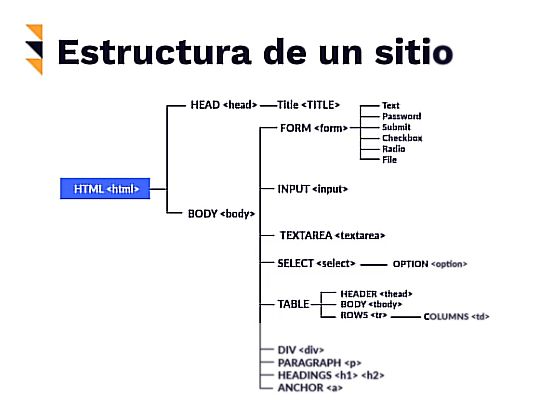
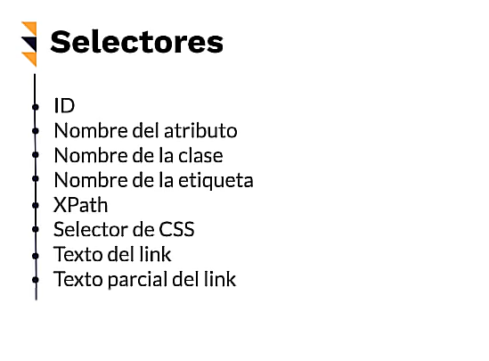
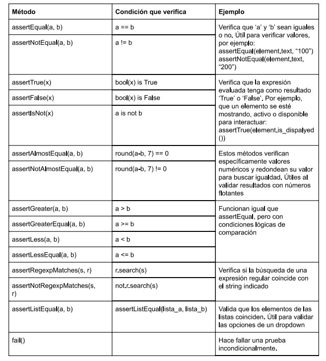
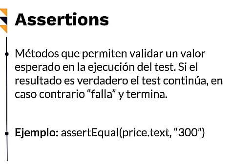
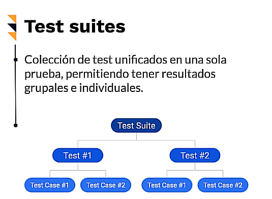
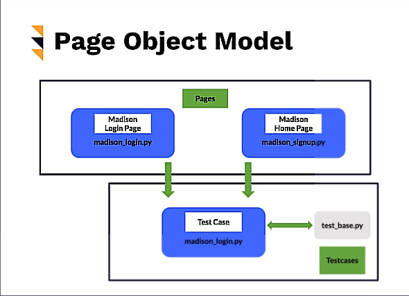

# Curso de Introducción a Selenium con Python

## Datos Clase: 

> Selenium es un framework de automatización de navegadores multilenguaje. Con él podrás simular las acciones de tus usuarios dentro de aplicaciones web con fines de testing, generar los reportes correspondientes, automatizar tareas repetitivas e incluso extraer datos de la web. Cualquier acción humana puede ser replicada y serás capaz de programarla.

- Publicado el 23 de junio de 2020
- Profesor: Hector Vega @TerragnigmArk 
- Fecha Inicio:15/10/2025 
- Fecha Fin: 02/12/2025

## Clase 01: 🎯 Por qué aprender Selenium y qué verás 

> Requisitos 
- Python 
- HTML 
- Fundamentos de pruebas se software 


## Clase 02: 📚 Curso de introducción a Selenium con Python 

## **Concepto**
> Es una herramienta para automatización de acciones en los diferentes navegadores.
> **¿Qué es Selenium?**: Es una suite de herramientas para automatización de navegadores.

## **Características**
- Selenium es **compatible** con los navegadores web más populares y múltiples lenguajes de programación: Java, C#, Kotlin, Perl, PHP, Python, Ruby, JavaScript.
- No es una herramienta diseñada nativamente para testing, pero es su uso más común.
- No es una herramienta diseñada nativamente para Scraping, pero se puede usar.
- El origen del nombre es por "Selenio", que es la cura para el envenenamiento por mercurio (una broma interna contra la herramienta "Mercury" de HP).
- Selenium NO es un único software, sino una suite de distintos componentes.

### Historia
**América (2004)**
- **Creador**: Jason Huggins.
- Creó un *JavaScriptTestRunner* que después fue llamado **Selenium Core**.

**Japón**
- **Creador**: Shinya Kasatani.
- Generó un Plugin para Firefox fácil de usar y sin necesidad de escribir código.
- Llamado **Selenium IDE** (Capaz de grabar, repetir, importar y exportar automatizaciones).

**América**
- **Creador**: Simon Stewart.
- Creó el protocolo **WebDriver** para utilizar una API de alto nivel y ejecutar comandos directamente en el navegador. 


## Selenium IDE
- Pros de Selenium IDE:
    - Excelente para iniciar en Testing y Pruebas unitarias
    - No requiere saber programar
    - Exporta scripts para Selenium RC y Selenium WebDriver
    - Genera reportes

- Contras de Selenium IDE:
    - Disponible solo para Firefox y Chrome
    - No sorporta DDT (Data Driven Testing)

## Selenium RC
- Pros de Selenium RC:
    - Soporte para:
    - Varias plataformas, navegadores y lenguajes
    - Operaciones lógicas y condicionales
    - DDT
    - Posee una API madura

- Selenium RC:
    - Complejo de instalar
    - Necesita de un servidor corriendo
    - Comandos redundants y ambigüos en su API
    - Navegación no tan realista

## Selenium WebDriver
- Pros de Selenium WebDriver:
    - Soporte para múltiples lenguajes
    - Fácil de instalar
    - Comunicación directa con el navegador
    - Interacción más realista

- Constras de Selenium WebDriver:
    - No soporta nuevos navegadores tan rápido
    - No genera reportes o resultados de pruebas
    - Requiere de saber programar (Pero con Platzi esto no es desventaja (; )

## Selenium Grid:
    - Se utiliza junto a Selenium RC
    - Permite correr pruebas en paralelo
    - Conveniente para ahorrar tiempo


## Clase 03: 🛠️ Otras herramientas de testing y automatización

## Puppeteer

**Puppeteer** es una librería de Node.js que proporciona una API de alto nivel para controlar Chrome o Chromium a través del Protocolo DevTools. Es excelente para automatización centrada en Chrome/Chromium.

| Pros (Ventajas) | Contras (Desventajas) |
| :--- | :--- |
| **Integración con Chrome/Chromium:** Ofrece un control profundo y eficiente al estar desarrollado por Google. | **Soporte limitado de navegadores:** Se centra principalmente en Chrome y Chromium (soporte experimental o limitado para otros). |
| **Rendimiento y Velocidad:** Suele ser muy rápido y estable en el entorno Chrome. | **Solo soporta JavaScript/Node.js:** Los *scripts* de automatización deben escribirse en JavaScript o TypeScript. |
| **API Sencilla y Clara:** Su curva de aprendizaje es relativamente baja para desarrolladores familiarizados con Node.js. | **No es ideal para *cross-browser testing*:** La limitación de navegadores lo hace inadecuado para la cobertura total de navegadores. |
| **Casos de Uso Adicionales:** Ideal para *web scraping*, generación de PDFs y capturas de pantalla de páginas web. | **Requiere Node.js:** Es un requisito fundamental para su uso. |

***

## Cypress.io

**Cypress.io** es un *framework* de *front-end testing* que se ejecuta directamente en el navegador, en el mismo *loop* de ejecución que tu aplicación. Se enfoca en una experiencia de desarrollo y *debugging* superior.

| Pros (Ventajas) | Contras (Desventajas) |
| :--- | :--- |
| **Experiencia del Desarrollador (DX):** Fácil de configurar e instalar, con una API muy intuitiva. | **Soporte de Navegadores Limitado:** Aunque ha mejorado, tradicionalmente su soporte ha sido más limitado (principalmente Chrome, Edge, Firefox, Electron). |
| **Ejecución y *Debugging* Rápido:** Ejecuta pruebas directamente en el navegador, lo que permite depurar en tiempo real con sus DevTools. | **Solo soporta JavaScript/TypeScript:** Las pruebas deben escribirse en estos lenguajes. |
| **Auto-esperas (Automatic Waiting):** Maneja automáticamente elementos asíncronos y esperas, reduciendo la inestabilidad (*flakiness*) de las pruebas. | **No soporta múltiples pestañas/ventanas:** No puede interactuar con múltiples pestañas o navegadores simultáneamente (limitación arquitectónica). |
| **Capturas y Videos Integrados:** Genera capturas de pantalla y videos automáticamente al fallar las pruebas. | **No soporta automatización de aplicaciones móviles nativas.** |

***

## Selenium

**Selenium** (principalmente Selenium WebDriver) es un conjunto de herramientas de código abierto ampliamente reconocido para la automatización de navegadores.

| Pros (Ventajas) | Contras (Desventajas) |
| :--- | :--- |
| **Amplio Soporte de Navegadores:** Compatible con todos los principales navegadores (*cross-browser testing* exhaustivo). | **Curva de Aprendizaje Elevada:** Su configuración inicial es más compleja y requiere gestionar *drivers* y *bindings* de lenguaje. |
| **Soporte Multi-Lenguaje:** Permite escribir *scripts* en varios lenguajes (Java, Python, C#, JavaScript, Ruby, etc.). | **Necesidad de Herramientas Externas:** Carece de características integradas como informes, auto-esperas robustas o un *test runner* (*frameworks* de terceros son necesarios). |
| **Comunidad Grande y Activa:** Cuenta con una de las comunidades más grandes, lo que significa mucha documentación y soporte. | **Ejecución Lenta (relativa):** Al usar el protocolo **WebDriver**, la comunicación externa entre el *script* y el navegador puede ser más lenta. |
| **Escalabilidad (Selenium Grid):** Permite ejecutar pruebas en paralelo en múltiples máquinas y entornos simultáneamente. | **Mantenimiento Alto:** Las pruebas pueden ser frágiles y requieren más mantenimiento debido a la dependencia de selectores. |

--- 

 **¿Qué es Flakiness?**

En el contexto de la automatización y el *testing* de *software*, el término **Flakiness** (inestabilidad o fragilidad de las pruebas) se refiere a la propiedad de una prueba automatizada de producir **resultados inconsistentes** (a veces pasa, a veces falla) **sin que haya habido ningún cambio en el código fuente** de la aplicación ni en el código de la prueba.

Una prueba que pasa el lunes y falla el martes (o en la siguiente ejecución) sin una causa clara y reproducible, se considera una **"Flaky Test"** (prueba inestable).

### Consecuencias del Flakiness:

* **Pérdida de Confianza:** El equipo deja de confiar en la *suite* de pruebas, ignorando las fallas porque "probablemente sea solo una prueba inestable".
* **Ralentización del CI/CD:** Interrumpe el flujo de Integración y Entrega Continua, ya que se requiere re-ejecutar las pruebas fallidas varias veces.
* **Pérdida de Tiempo:** Los desarrolladores y *testers* gastan tiempo valioso investigando fallas que no son *bugs* reales.

### Causas Comunes del Flakiness:

1.  **Problemas de Tiempo (Timing Issues):** El más común. La prueba intenta interactuar con un elemento o verificar un resultado antes de que la aplicación haya completado la operación asíncrona (como una llamada a una API, una animación o la carga del DOM).
2.  **Condiciones de Carrera (*Race Conditions*):** Cuando las pruebas se ejecutan en paralelo y compiten por un recurso compartido (ej. una entrada en la base de datos).
3.  **Dependencia del Orden de Ejecución:** Una prueba depende del estado o los datos que dejó una prueba anterior (lo que viola el principio de aislamiento).
4.  **Inestabilidad del Entorno:** Factores externos como latencia de red variable, lentitud del servidor de pruebas o entornos de prueba inconsistentes.

---

| Concepto Relacionado | Descripción | Relación con Flakiness |
| :--- | :--- | :--- |
| **Non-Deterministic Test** (*Prueba No Determinista*) | Es el nombre técnico para una **Flaky Test**. Se refiere a que la prueba no siempre produce el mismo resultado para el mismo código. | **Es la definición técnica de *Flakiness*.** |
| **Fragile Test** (*Prueba Frágil*) | Una prueba que falla ante cambios menores en la aplicación que no deberían afectar la funcionalidad (*ej. un pequeño cambio en el CSS*). | Es una causa común de *Flakiness*. Una prueba frágil a menudo se convierte en una *Flaky Test* cuando el entorno es inestable. |
| **Brittle Test** (*Prueba Quebradiza*) | Similar a Frágil. Una prueba que es difícil de mantener y que requiere constantes ajustes de código (ej. por usar selectores de UI muy específicos). | Su alto coste de mantenimiento y la facilidad con la que se rompe la hacen propensa a ser inestable. |
| **Slow Test** (*Prueba Lenta*) | Una prueba que tarda mucho tiempo en ejecutarse, generalmente debido a una alta complejidad, esperas fijas (*sleeps*) o interacciones excesivas. | No es Flaky, pero a menudo se vuelve Flaky. Las pruebas lentas amplifican los problemas de *timing* e inestabilidad del entorno, y son candidatas a ser deshabilitadas si se vuelven inestables. |
| **Order-Dependent (OD) Flakiness** | Un tipo específico de Flakiness donde la prueba solo falla cuando se ejecuta justo antes o justo después de otra prueba en particular. | Es una **causa raíz específica de Flakiness**, generalmente debido a recursos o estados compartidos no limpiados correctamente. |
| **Greedy Test** (*Prueba Codiciosa*) | Una prueba que consume demasiados recursos del sistema (memoria, CPU, red), lo que puede afectar a otras pruebas que se ejecutan en paralelo. | Puede **inducir Flakiness** en otras pruebas al causar escasez de recursos y ralentización inesperada en el entorno de ejecución. |

En resumen, cuando una prueba no es **determinista** (el resultado varía) o es demasiado **frágil** (se rompe fácilmente), se está enfrentando al gran problema de la **Flakiness**.


## Clase 04: ⚙️ Configurar entorno de trabajo

## Practica básica Primer Paso Selenium 

- Paso 0: crea un ambiente virtual
    - `py -m venv venv` -> Creamos 
    - `venv\scripts\activate` -> activamos en windows 
    - `source venv/bin/activate` -> activamos en linux 

- Paso 1: Validamos version de Python se trabaja mucho mejor con la version 3.8 
    - python3 --version 
    - pip3 --version

- Paso 2: Instalamos Selenium  
    -  `pip3 install selenium` 

- Paso 3: Instalamos libreria report 
    - `pip3 install pyunitre`

- Paso 4: podemos generar un archivo con 
    - `touch requirements.txt` 
    - pasar lo que tenemos instalado  `pip3 freeze > requirements.txt`
    - y ejecutar en proximo proyectos `pip install -r requirements.txt`

## Clase 05: 🐍 Compatibilidad con Python 3.9 y aprendiendo a utilizar múltiples versiones

Compatibilidad de Selenium con Python 3.9

¡Es aquí cuando das un gran paso en tu camino para convertirte en una developer profesional! Al crear un ambiente virtual estás aislando tu proyecto del resto de tu computadora y haciendo que funcione con módulos independientes. Es decir, para llevar este curso puedes tener una versión de Python y Selenium y para hacer otro proyecto puedes tener versiones distintas. Esto hace que los proyectos no se rompan.

Usualmente, sin hacer uso de ambientes virtuales, los proyectos en tu computadora se verían así:

> [!NOTE]
> si en linux no se te activa el entorno de trabajo recuerda que son permisos debes ejecutar los siguientes pasos 
    - Paso 0: `rm -rf ./venv`                -> Eliminar en caso el entorno viejo 
    - Paso 1: `python3 -m venv venv`         -> Crear el entorno de nuevo
    - Paso 2: `chmod +x ./venv/bin/activate` -> Generar  permiso 
    - Paso 3: Funciona en Bach => `source ./venv/bin/activate` ó Shell Zsh => `. ./venv/bin/activate`   -> Activar entorno
    - Paso 4: Deberia verse así `(venv) istemas@GlenaCNP-Leonard:~/proyectos/CursoSelenium/practicas/basica$ `

**Enlace**
- https://googlechromelabs.github.io/chrome-for-testing/#stable -> Para descargra chrome

## Clase 06: 🌐 Abrir Navegador

Para abrir un navegador con Selenium, necesitamos instanciar un `driver`. Aquí un ejemplo básico usando `webdriver_manager` para facilitar la gestión del driver.

```python
from selenium import webdriver
from selenium.webdriver.chrome.service import Service
from webdriver_manager.chrome import ChromeDriverManager
import time

# Instanciamos el driver de Chrome
driver = webdriver.Chrome(service=Service(ChromeDriverManager().install()))

# Navegamos a una URL
driver.get("https://www.google.com")

# Maximizamos la ventana
driver.maximize_window()

# Esperamos unos segundos (solo para ver el resultado)
time.sleep(3)

# Cerramos el navegador
driver.quit()
```
> Resumen
En ocasiones algunos sitios pueden tener bloqueos regionales o no estar disponibles por la alta cantidad de solicitudes que llegan a tener.
Si el sitio de práctica no abre, puedes intentar ingresando a OneStepCheckout Responsive Demo.

**Documentos**
- https://selenium-python.readthedocs.io/locating-elements.html

**Como Funciona**





**Notas**
- from selenium.webdriver.common.by import By

 def test_search_text_field(self):
        search_field = self.driver.find_element(By.ID,"search")
    
    def test_search_text_field_by_name(self):
        search_field = self.driver.find_element(By.NAME,"q")

    def test_search_text_field_by_class_name(self):
        search_field = self.driver.find_element(By.CLASS_NAME,"input-text")

## Clase 08: ✅ Preparar assertions y test suites
**Listad de Metodos que nos permite realizar las pruebas**







## Clase 09: 🧠 Entender las clases WebDriver y WebElement

Un sitio web se construye mediante un árbol de elementos HTML. **Selenium WebDriver** nos permite interactuar con estos elementos simulando acciones humanas gracias a dos clases principales: `WebDriver` y `WebElement`.

### 1. Clase WebDriver
Representa al **navegador** en sí mismo. Nos permite controlar la ventana, navegar entre URLs y manejar alertas.

**Propiedades Comunes**
| Propiedad | Descripción | Ejemplo |
| :--- | :--- | :--- |
| `current_url` | Obtiene la URL actual del sitio. | `print(driver.current_url)` |
| `current_window_handle` | Referencia (ID) de la ventana activa. | `driver.current_window_handle` |
| `name` | Nombre del navegador subyacente. | `driver.name` # 'chrome' |
| `page_source` | Código fuente HTML de la página. | `driver.page_source` |
| `title` | Título de la pestaña (`<title>`). | `driver.title` |

### 2. Clase WebElement
Representa un **elemento HTML específico** (botón, input, div, etc.) con el que queremos interactuar.

**Propiedades Comunes**
| Propiedad | Descripción | Ejemplo |
| :--- | :--- | :--- |
| `size` | Tamaño del elemento (ancho y alto). | `elemento.size` |
| `tag_name` | Nombre de la etiqueta HTML. | `elemento.tag_name` # 'input' |
| `text` | Texto visible dentro del elemento. | `elemento.text` |

**Métodos Comunes**
| Método | Descripción | Ejemplo |
| :--- | :--- | :--- |
| `clear()` | Limpia el texto de un input o textarea. | `campo_nombre.clear()` |
| `click()` | Hace clic en el elemento. | `boton_enviar.click()` |
| `get_attribute(name)` | Obtiene el valor de un atributo HTML. | `input.get_attribute('value')` |
| `is_displayed()` | ¿El elemento es visible para el usuario? | `banner.is_displayed()` |
| `is_enabled()` | ¿El elemento está habilitado? | `boton.is_enabled()` |
| `is_selected()` | ¿El checkbox/radio está marcado? | `check.is_selected()` |
| `send_keys(val)` | Simula escribir teclas. | `input.send_keys('Hola')` |
| `submit()` | Envía el formulario al que pertenece el elemento. | `input.submit()` |
| `value_of_css_property(prop)` | Obtiene el valor de una propiedad CSS. | `btn.value_of_css_property('color')` |


## Clase 10: 📝 Manejar form, textbox, checkbox y radio button

**Enlaces**
- [Waits en Selenium](https://selenium-python.readthedocs.io/waits.html)
- [Sitios de prueba](https://federico-toledo.com/sitios-de-prueba-para-practicar/)
- [Extensión RandomEverything](https://marketplace.visualstudio.com/items?itemName=helixquar.randomeverything)

**Notas**
- **Sintaxis Antigua**: Si encuentras ejemplos con `find_element_by_*`, recuerda actualizarlos a `driver.find_element(By.ESTRATEGIA, 'valor')`.
- **XPath**: Es una herramienta poderosa, pero evita copiar XPaths absolutos frágiles. Aprende a construir XPaths relativos y robustos.
- **Datos Aleatorios**: La extensión *RandomEverything* para VSCode es útil para generar datos de prueba.

**Práctica**
- `02_DesarrolloBackendPythonDjango_2025_Avanzado\01_CursoIntroduccionSeleniumPython\Practica\basica\06_FORM_TEXTBOX_CHECK.py`

## Clase 11: 🔽 Manejar dropdown y listas

**Manejo de Dropdowns (Select)**
Para interactuar con menús desplegables clásicos (`<select>`), Selenium ofrece la clase `Select`.

```python
from selenium.webdriver.support.ui import Select
from selenium.webdriver.common.by import By

# 1. Localizamos el elemento <select>
dropdown_element = driver.find_element(By.ID, "id_del_dropdown")

# 2. Creamos el objeto Select
select = Select(dropdown_element)

# 3. Seleccionamos una opción
# Por texto visible
select.select_by_visible_text("Opción 1")

# Por valor (atributo value)
select.select_by_value("valor_1")

# Por índice (posición, empezando en 0)
select.select_by_index(1)
```

**Notas Importantes**
- **Deprecación**: Selenium 4.3.0 eliminó `find_element_by_*`. Usa siempre `driver.find_element(By.ESTRATEGIA, "valor")`.
- **React/Angular**: En frameworks modernos, los dropdowns a veces no son etiquetas `<select>` reales, sino `<div>` complejos. En esos casos, `Select` no funcionará y deberás simular clics:
    1. Clic en el dropdown para abrirlo.
    2. Esperar a que la opción sea visible.
    3. Clic en la opción deseada.

**Práctica**
- `02_DesarrolloBackendPythonDjango_2025_Avanzado\01_CursoIntroduccionSeleniumPython\Practica\basica\07_DROPDOWN_LISTAS.py`

## Clase 12: 🚨 Manejar alert y pop-up

Las **alertas nativas** de JavaScript (`alert`, `confirm`, `prompt`) son ventanas emergentes del navegador que no forman parte del HTML de la página. Por lo tanto, no se pueden inspeccionar con "Click derecho > Inspeccionar".

Para interactuar con ellas, Selenium debe **cambiar el foco** (switch) de la página principal a la alerta.

### Métodos Principales (`Alert`)

| Método | Descripción | Ejemplo |
| :--- | :--- | :--- |
| `text` | Propiedad para leer el mensaje de la alerta. | `print(alert.text)` |
| `accept()` | Hace clic en el botón **Aceptar** / **OK**. | `alert.accept()` |
| `dismiss()` | Hace clic en el botón **Cancelar** (si existe). | `alert.dismiss()` |
| `send_keys(txt)` | Escribe texto en la alerta (solo para `prompt`). | `alert.send_keys("Texto")` |

### Código de Ejemplo

```python
from selenium import webdriver
import time

# ... inicialización del driver ...

# 1. Cambiar el foco a la alerta activa
alert = driver.switch_to.alert

# 2. Leer el texto
print(f"Mensaje de la alerta: {alert.text}")

# 3. Escribir (si es un prompt)
# alert.send_keys("Hola Selenium")

# 4. Aceptar la alerta
alert.accept()

# Volver al contenido principal (opcional, suele ser automático al cerrar la alerta)
driver.switch_to.default_content()
```

**Práctica**
- `02_DesarrolloBackendPythonDjango_2025_Avanzado\01_CursoIntroduccionSeleniumPython\Practica\basica\08_ALERT_POP_UP.py`


## Clase 13: 🧭 Automatizar navegación

Esta práctica demuestra cómo controlar el historial del navegador y actualizar la página mediante scripts automatizados, simulando las acciones de los botones "Atrás", "Adelante" y "Recargar" del navegador.

#### 🔑 Funciones Clave de Navegación

Las siguientes funciones del objeto `driver` son esenciales para moverse a través del historial de navegación:

*   **`driver.back()`**
    *   **Acción:** Simula hacer clic en el botón **"Atrás"** del navegador.
    *   **Uso:** Regresa a la página visitada inmediatamente anterior en el historial de la sesión.
    *   **En el código:** Se usa después de realizar la búsqueda en Google para volver a la página de inicio.

*   **`driver.forward()`**
    *   **Acción:** Simula hacer clic en el botón **"Adelante"** del navegador.
    *   **Uso:** Avanza a la página siguiente en el historial (solo funciona si previamente se ha retrocedido).
    *   **En el código:** Se usa para volver a la página de resultados de búsqueda después de haber retrocedido.

*   **`driver.refresh()`**
    *   **Acción:** Simula hacer clic en el botón **"Recargar"** o presionar **F5**.
    *   **Uso:** Vuelve a cargar la página web actual. Útil para verificar que los cambios se persisten o para reiniciar el estado de la vista.

#### 📝 Flujo de la Prueba

1.  **Inicio:** Abre el navegador y va a `google.com`.
2.  **Búsqueda:** Busca el término "Platzi" y envía el formulario.
3.  **Navegación:**
    *   Retrocede al home de Google (`back`).
    *   Avanza nuevamente a los resultados de búsqueda (`forward`).
    *   Refresca la página de resultados (`refresh`).

> **Nota:** Se utiliza `sleep(3)` entre cada acción únicamente para que el ojo humano pueda percibir los cambios de navegación, ya que Selenium ejecuta estas acciones en milisegundos.

**Practica**
- 02_DesarrolloBackendPythonDjango_2025_Avanzado\01_CursoIntroduccionSeleniumPython\Practica\basica\09_NAVIGATION.py


## Clase 14: ⏳ Demora Implícita (Implicit Wait)

En la automatización web, las páginas no siempre cargan instantáneamente. Los elementos pueden tardar en aparecer debido a la red, animaciones o procesamiento del servidor. Selenium ofrece dos formas principales de manejar estos tiempos de espera:

Es una configuración global que se aplica a **toda la vida** de la instancia del `driver`.

*   **¿Qué hace?**: Le dice al WebDriver que espere una cantidad específica de tiempo (ej. 10 segundos) al intentar encontrar *cualquier* elemento si no está disponible de inmediato.
*   **Comportamiento**: Si el elemento se encuentra antes de que expire el tiempo, el script continúa inmediatamente. Si pasa el tiempo y no lo encuentra, lanza una excepción `NoSuchElementException`.
*   **Uso**:
    ```python
    driver.implicitly_wait(10) # Se configura una sola vez al inicio
    ```
*   **Pros**: Fácil de implementar.
*   **Contras**: Se aplica a todo, lo que puede ralentizar las pruebas si hay muchos elementos que no existen (esperará por cada uno). No permite esperar por condiciones complejas (como que un botón sea cliqueable).

#### 2. Demora Explícita (`Explicit Wait`)

Es una espera definida para una condición específica en un elemento específico.

*   **¿Qué hace?**: Detiene la ejecución del script hasta que se cumpla una condición determinada (ej. que un botón sea visible, que una alerta esté presente) o hasta que se agote el tiempo máximo.
*   **Herramientas**: Se usa `WebDriverWait` junto con `expected_conditions` (EC).
*   **Uso**:
    ```python
    from selenium.webdriver.support.ui import WebDriverWait
    from selenium.webdriver.support import expected_conditions as EC

    # Espera hasta 10s a que el elemento sea visible
    element = WebDriverWait(driver, 10).until(
        EC.visibility_of_element_located((By.ID, "myElement"))
    )
    ```
*   **Pros**: Muy flexible y robusto. Permite esperar por estados específicos (visible, cliqueable, texto presente, etc.). Solo espera lo necesario.
*   **Contras**: Más verboso (requiere más líneas de código).

#### 🆚 Cuadro Comparativo

| Característica | Implícita | Explícita |
| :--- | :--- | :--- |
| **Alcance** | Global (toda la sesión) | Local (elemento específico) |
| **Condición** | Solo presencia en el DOM | Cualquier condición (visible, cliqueable, etc.) |
| **Uso recomendado** | Proyectos simples o como red de seguridad básica | **Estándar de la industria** para pruebas robustas |

> **Recomendación:** Evita mezclar ambas esperas en la misma sesión, ya que puede causar tiempos de espera impredecibles. Se prefiere el uso de **Esperas Explícitas** para un control total.

**Practica**
- 02_DesarrolloBackendPythonDjango_2025_Avanzado\01_CursoIntroduccionSeleniumPython\Practica\basica\10_DEMORAS_IMPLI_EXPLI.py

## Clase 15: 🚦 Condicionales esperadas


|Expected Condition|	Descripción|	Ejemplo
| :--- | :--- | :--- |
|element_to_be_clickable(locator) |	Espera a que el elemento sea visible y habilitado para hacer clic en el mismo	WebDriverWait|(self.driver,10).until(expected_conditions.element_to_be_clickable((By.NAME,"accept_button")))
|element_to_be_selected(element) |	Espera a que un elemento sea seleccionado|	subscription = self.driver.find_element_by_name("terms"). WebDriverWait(self.driver, 10).until(expected_conditions.element_to_be_selected(terms)))
| invisibility_of_element_located(locator)|	Espera a que un elemento no sea visible o no se encuentre presente en el DOM	|WebDriverWait(self.driver,10).until(expected_conditions.invisibility_of_element_located((By.ID,"loading_banner")))
| presence_of_all_elements_located(locator) |	Espera a que por lo menos uno de los elementos que se indican coincida con los presentes en el sitio|	WebDriverWait(self.driver,10).until(expected_conditions.presence_of_all_elements_located((By.CLASS_NAME,"input-text"))) |
|presence_of_element_located(locator)|	Espera a que un elemento sea visible se encuentre presente en el DOM|	WebDriverWait(self.driver,10).until(expected_conditions.presence_of_element_located((By.ID,"search-bar")))
|text_to_be_present_in_element(locator,text_)|	Espera a que un elemento con el texto indicado se encuentre presente|	WebDriverWait(self.driver,10).until(expected_conditions.text_to_be_present_in_element((By.ID,"seleorder"),"high"))
|title_contains(title)|Espera a que la página contenga en el título exactamente como es indicado|	WebDriverWait(self.driver, 10).until(expected_conditions.title_contains("Welcome"))
|title_is(title)|	Espera a que la página tenga un título idéntico a como es indicado	|WebDriverWait(self.driver, 10).until(expected_conditions.title_is("Welcome to Platzi"))
|visibility_of(element)|	Espera a que el elemento indicado esté en el DOM, sea visible, su alto y ancho sean mayores a cero	|first_name = self.driver.find_element_by_id("firstname") WebDriverWait(self.driver, 10).until(expected_conditions.visibility_of(first_name))
|visibility_of_element_located(locator)|	Espera a que el elemento indicado por su selector esté en el DOM, sea visible y que su alto y ancho sean mayores a cero |	WebDriverWait(self.driver,10).until(expected_conditions.visibility_of_element_located((By.ID,"firstname")))


## Clase 16: ➕ Agregar y eliminar elementos


Esta práctica se centra en cómo interactuar con elementos que aparecen y desaparecen del DOM en tiempo real según las acciones del usuario. Es un escenario común en aplicaciones modernas (ej. carritos de compra, listas de tareas).

#### 🔑 Puntos Clave del Código

1.  **Agregar Elementos (Bucle Simple)**
    Para agregar elementos, simplemente localizamos el botón "Add Element" una vez y lo presionamos repetidamente dentro de un bucle.
    *   **Concepto**: El botón de agregar es estático (siempre está ahí), por lo que podemos obtener su referencia antes del bucle y reutilizarla.

2.  **Eliminar Elementos (Manejo de Errores y Elementos Dinámicos)**
    Eliminar es más complejo porque los botones de "Delete" aparecen y desaparecen.
    *   **Estrategia `button[1]`**: Siempre buscamos el **primer** botón de borrar disponible (`button[1]`). Al hacer clic, ese botón desaparece del DOM, y el que era el segundo pasa a ser el primero.
    *   **Bloque `try/except`**: Es vital aquí. Si intentamos borrar más elementos de los que existen, `find_element` fallará porque no encontrará el botón. El `try/except` captura este error para que la prueba no se rompa y simplemente nos avise.

3.  **Interacción Dinámica (Input)**
    El script utiliza `input()` de Python para permitirte decidir en tiempo de ejecución cuántos elementos probar, haciendo el script flexible para diferentes escenarios de prueba manual.

**Practica**
-   02_DesarrolloBackendPythonDjango_2025_Avanzado\01_CursoIntroduccionSeleniumPython\Practica\basica\11_ELIMINAR_ELEMENTO.py


## Clase 17: 👻 Resumen: Manejo de Elementos Dinámicos (Disappearing Elements)

En esta práctica, nos enfrentamos a un menú de navegación donde uno de sus elementos ("Gallery") aparece y desaparece aleatoriamente cada vez que se carga la página. Este es un ejemplo clásico de **contenido dinámico no determinista**.

#### 🧠 Lógica del Script

El objetivo es asegurar que la prueba no termine hasta que el menú esté completo (5 elementos).

1.  **Bucle de Reintento (`while len(options) < 5`)**:
    *   El script entra en un bucle que no se detiene hasta que detecta que la lista de opciones encontradas tiene una longitud de 5.

2.  **Estrategia de Refresco (`driver.refresh()`)**:
    *   Si durante la iteración no se encuentra alguno de los elementos (capturado por el `except`), el script asume que la página cargó la versión incompleta del menú.
    *   En lugar de fallar la prueba, incrementa un contador de intentos (`tries`) y **recarga la página** para probar suerte de nuevo.

3.  **Construcción Dinámica de Selectores**:
    *   Usa un f-string para iterar por los elementos de la lista HTML: `f"/html/body/div[2]/div/div/ul/li[{i + 1}]/a"`. Esto permite buscar `li[1]`, `li[2]`, etc., de forma programática.

> **Lección:** En pruebas de UI, a veces el estado de la aplicación no es el ideal al primer intento. Estrategias de "polling" o reintento (como refrescar hasta obtener el estado deseado) son útiles para estabilizar pruebas en entornos volátiles, aunque deben usarse con precaución para no ocultar bugs reales.


##  cls vs self
Al ser un método de clase, el primer argumento es cls (la clase misma) en lugar de self (la instancia).
Por eso usamos cls.driver = ... para guardar el driver en la clase, de modo que todos los métodos de prueba (test_...) puedan acceder a él usando self.driver.

En resumen: Lo usamos para abrir el navegador una sola vez y reutilizarlo en todas las pruebas de esa clase, haciendo la ejecución mucho más rápida.


**Practica**
- 02_DesarrolloBackendPythonDjango_2025_Avanzado\01_CursoIntroduccionSeleniumPython\Practica\basica\12_ELEMENTOS_DINAMICOS.py

## Clase 18: 🎛️ Resumen: Controles Dinámicos (Dynamic Controls)

**Practica**
- 02_DesarrolloBackendPythonDjango_2025_Avanzado\01_CursoIntroduccionSeleniumPython\Practica\basica\14_CONTROLES_DINAMICOS.py

Esta práctica aborda elementos que cambian de estado o aparecen/desaparecen de forma asíncrona (con un retraso), lo que requiere que nuestras pruebas sean capaces de esperar y validar estos cambios.

#### 🛠️ Métodos y Estrategias Utilizadas

1.  **`implicitly_wait(15)`**:
    *   **Función**: Configura una espera global.
    *   **Aplicación**: En esta práctica, es crucial. Cuando hacemos clic en "Remove", el checkbox no desaparece instantáneamente (hay una barra de carga). Gracias a esta espera, cuando intentamos buscar el mensaje "It's gone!", Selenium espera automáticamente hasta que aparece en el DOM, evitando que la prueba falle por no encontrarlo de inmediato.

2.  **XPath con `contains(text(), ...)`**:
    *   **Código**: `//button[contains(text(),"Remove")]`
    *   **Explicación**: Permite localizar elementos basándose en una parte de su texto visible. Es muy útil para botones dinámicos donde el texto podría cambiar ligeramente o tener espacios extra.

3.  **Selectores CSS (`By.CSS_SELECTOR`)**:
    *   **Código**: `find_element(By.CSS_SELECTOR, '#message')`
    *   **Explicación**: Se introduce el uso de selectores CSS como alternativa a XPath. `#message` busca un elemento con `id="message"`. Es una sintaxis más limpia y a menudo más rápida que XPath para selecciones simples por ID o clase.

4.  **Validación de Texto (`validate_paragraph_text`)**:
    *   Creamos una función auxiliar para evitar repetir código. Esta función busca el mensaje de confirmación (que aparece dinámicamente) y verifica que su texto coincida con lo esperado ("It's gone!", "It's enabled!", etc.).

> **Nota**: Aunque aquí usamos `implicitly_wait` por simplicidad, para controles asíncronos complejos se recomienda usar **Esperas Explícitas (`WebDriverWait`)** para tener un control más preciso sobre qué condición específica estamos esperando (ej. `element_to_be_clickable`).

## Clase 19: ✍️ Resumen: Detección de Errores Tipográficos (Typos)

**Practica**
- 02_DesarrolloBackendPythonDjango_2025_Avanzado\01_CursoIntroduccionSeleniumPython\Practica\basica\15_TYPOS.py

Esta práctica se enfoca en validar contenido textual que puede cambiar dinámicamente o contener errores aleatorios. El objetivo es asegurar que el texto mostrado al usuario sea exactamente el esperado.

#### 🧠 Lógica del Script

1.  **Verificación de Texto**:
    *   El script busca un párrafo específico y extrae su texto (`.text`).
    *   Compara este texto con una cadena de referencia: `"Sometimes you'll see a typo, other times you won't."`.

2.  **Bucle de Reintento (`while`)**:
    *   Dado que la página carga aleatoriamente una versión con error o una correcta, usamos un bucle `while`.
    *   Si el texto no coincide (hay un *typo*), el script **refresca la página** (`driver.refresh()`) e intenta de nuevo.
    *   Esto garantiza que la prueba no falle por un error aleatorio del sitio, sino que persista hasta encontrar el estado correcto (o podría limitarse a un número máximo de intentos para evitar bucles infinitos en un caso real).

3.  **Validación Final**:
    *   Usa `assertEqual(found, True)` para confirmar que, eventualmente, se logró encontrar la versión correcta del texto.

> **Aplicación Real**: Este patrón es útil para probar sistemas A/B testing o contenido generado dinámicamente donde se necesita verificar que todas las variantes posibles son correctas o que al menos la variante deseada es accesible.

## Clase 20: 📊 Ordenar tablas

**Practica**
- 02_DesarrolloBackendPythonDjango_2025_Avanzado\01_CursoIntroduccionSeleniumPython\Practica\basica\16_ORDENAR_TABLE.py
- 02_DesarrolloBackendPythonDjango_2025_Avanzado\01_CursoIntroduccionSeleniumPython\Practica\basica\17_TABLAS_EFICIENTE.py

### 📊 Resumen: Manejo de Tablas de Datos

Esta práctica se enfoca en la extracción estructurada de datos desde tablas HTML, una tarea común para verificar reportes o listados en aplicaciones web.

#### 🧠 Lógica del Script

1.  **Estructura de Datos (`List of Lists`)**:
    *   Se inicializa una lista de listas: `table_data = [[] for i in range(COLUMN_NUMBER)]`.
    *   Esto permite organizar los datos por columnas (verticalmente) en lugar de por filas, lo cual es útil si queremos validar el ordenamiento de una columna específica.

2.  **Iteración Anidada (Columnas vs Filas)**:
    *   **Bucle Externo (Columnas)**: Recorre cada columna para capturar su encabezado (`thead`).
    *   **Bucle Interno (Filas)**: Dentro de cada columna, recorre todas las filas (`tbody`) para extraer el valor de la celda correspondiente.

3.  **XPath Dinámico**:
    *   Se utiliza la inyección de variables en el string de XPath para navegar la matriz de la tabla:
        *   `tr/th[{i + 1}]`: Selecciona la columna actual.
        *   `tr[{j + 1}]/td[{i + 1}]`: Selecciona la celda en la fila `j` y columna `i`.

> **Nota**: Este enfoque de "fuerza bruta" es útil para tablas pequeñas. Para tablas grandes, es más eficiente extraer todas las filas (`find_elements(By.TAG_NAME, "tr")`) y procesarlas en memoria para reducir las llamadas al driver (round-trips).


## Clase 21: 💾 Data Driven Testing (DDT)

**Concepto**
El **Data Driven Testing (DDT)** es una metodología donde los scripts de prueba se ejecutan repetidamente utilizando diferentes conjuntos de datos extraídos de fuentes externas (como archivos CSV, Excel, bases de datos o JSON).

Esto permite separar la **lógica del test** de los **datos del test**, haciendo el código más limpio, mantenible y escalable.

**Librería `ddt` en Python**
Para implementar esto usamos la librería `ddt`.
- **Instalación**: `pip install ddt`
- **Decoradores Clave**:
    - `@ddt`: Se coloca sobre la clase `unittest.TestCase`.
    - `@data`: Se coloca sobre el método de test. Recibe los datos a iterar.
    - `@unpack`: Desempaqueta tuplas o listas en argumentos individuales para el método.

**Ejemplo de Flujo**
1.  Creamos un archivo `testdata.csv` con columnas: `termino_busqueda`, `cantidad_esperada`.
2.  Creamos una función para leer el CSV y devolver una lista de filas.
3.  Inyectamos esos datos al test usando `@data(*get_data('archivo.csv'))`.
4.  El test se ejecutará automáticamente tantas veces como filas tenga el archivo.

**Práctica**
- [02_DesarrolloBackendPythonDjango_2025_Avanzado\01_CursoIntroduccionSeleniumPython\Practica\basica\18_TDD.py](cci:7://file:///c:/Users/GlenaCDNP-Leonard/Documents/CursosBackendPython/02_DesarrolloBackendPythonDjango_2025_Avanzado/01_CursoIntroduccionSeleniumPython/Practica/basica/18_TDD.py:0:0-0:0)
*(Nota: Asegúrate de crear el archivo `testdata.csv` en la misma carpeta para que funcione)*


## Clase 22: 🏗️ Page Object Model (POM)
**Ejemplo**
<div align="center">
  
</div>


**Concepto**
El **Page Object Model (POM)** es un patrón de diseño fundamental en automatización que crea una capa de abstracción entre el código de prueba y la interfaz web.
- **Page Object (`google_page.py`)**: Clase que representa una página web específica. Contiene los **localizadores** (IDs, XPaths) y los **métodos** para interactuar con ella (escribir, hacer clic, obtener texto).
- **Test Script (`google_test.py`)**: Contiene la lógica de la prueba y las validaciones (**assertions**). No interactúa directamente con el HTML, sino que "pide" acciones al Page Object.

**Análisis del Código Implementado**

1.  **`GooglePage` (El Objeto)**:
    -   `__init__(driver)`: Constructor que recibe el navegador para controlarlo.
    -   `@property`: Decorador que permite acceder a métodos como atributos (ej. `google.keyword` para leer el input).
    -   `open()`: Método simple para navegar a la URL base.
    -   `search(keyword)`: Método de "Negocio" que agrupa acciones técnicas (`type_search` + `click_submit`) en una sola acción lógica.

2.  **`GoogleTest` (La Prueba)**:
    -   `setUpClass`: Configura el navegador una sola vez para toda la clase (eficiencia).
    -   `test_search`:
        1.  Instancia `GooglePage(self.driver)`.
        2.  Llama a `google.open()` y `google.search('Platzi')`.
        3.  Valida el resultado con `self.assertEqual`.

**Ventajas**
-   **Mantenibilidad**: Si Google cambia el ID de su barra de búsqueda, solo actualizas una línea en `GooglePage`. Todos los tests que usen esa página se arreglan automáticamente.
-   **Legibilidad**: Los tests se leen casi como lenguaje natural, ocultando la complejidad técnica de Selenium.


**Práctica**
- [Page Object](file:///c:/Users/GlenaCDNP-Leonard/Documents/CursosBackendPython/02_DesarrolloBackendPythonDjango_2025_Avanzado/01_CursoIntroduccionSeleniumPython/Practica/basica/POM/01_google_page.py)
- [Test Case](file:///c:/Users/GlenaCDNP-Leonard/Documents/CursosBackendPython/02_DesarrolloBackendPythonDjango_2025_Avanzado/01_CursoIntroduccionSeleniumPython/Practica/basica/POM/02_google_test.py) 


## Clase 23: 🏆 Realizar una prueba técnica
**Ejemplo**
<div align="center">
  
</div>

**Descripción del Reto Técnico**
El objetivo de esta práctica es automatizar un flujo de usuario completo en un sitio de comercio electrónico real (**Mercado Libre**), simulando una prueba técnica común en entrevistas de QA Automation.

**Flujo Automatizado:**
1.  Ingresar a la home de Mercado Libre.
2.  Seleccionar país (Colombia).
3.  Buscar un producto ("Playstation 4").
4.  Filtrar por condición ("Nuevo") y ubicación ("Bogotá").
5.  Ordenar resultados por "Mayor precio".
6.  Extraer (Scrapear) los nombres y precios de los primeros 5 resultados.

**Estrategias Implementadas:**
-   **Manejo de Elementos Dinámicos**: Uso intensivo de `WebDriverWait` y `ExpectedConditions` para esperar que los filtros y menús carguen antes de interactuar.
-   **Interacción Avanzada**: Uso de `execute_script` para clicks forzados en elementos superpuestos o difíciles.
-   **Web Scraping**: Extracción de datos estructurados (Diccionario `{'Nombre': 'Precio'}`) desde la lista de resultados.

**Práctica**
- [Page Object (Lógica de Interacción)](file:///c:/Users/GlenaCDNP-Leonard/Documents/CursosBackendPython/02_DesarrolloBackendPythonDjango_2025_Avanzado/01_CursoIntroduccionSeleniumPython/Practica/basica/POM_ML/mercado_libre_page.py)
- [Test Script (Flujo de Prueba)](file:///c:/Users/GlenaCDNP-Leonard/Documents/CursosBackendPython/02_DesarrolloBackendPythonDjango_2025_Avanzado/01_CursoIntroduccionSeleniumPython/Practica/basica/POM_ML/mercado_libre_tests.py) 

---

# CUESTIONARIO

1. ¿Qué es Selenium?
Una suite de software para testing de aplicaciones web.
**Repasar**

2. ¿Qué librerías complementan Selenium para generar pruebas efectivas?
Unittest, PyUnitReport, DDT

3. Los métodos setUp() y tearDown() son para:
Realizar acciones específicas antes y después de los casos de prueba.

4. Tienes una barra de búsqueda cuyo nombre es name="q" ¿Con qué código accedes a esta?
driver.find_element_by_name('q')

5. ¿Qué assertion te permite validar el que el título del sitio web es el siguiente?
🚀Platzi: ‎Cursos Online Profesionales de Tecnología

self.assertEqual('🚀Platzi: ‎Cursos Online Profesionales de Tecnología', self.driver.title)

6. ¿Con qué me permite interactuar la clase WebElement de Selenium?
Con el navegador mismo: elementos a la vista, checkbox, textbox, dropdown y radiobutton.
**Repasar**

7. ¿Qué hace el siguiente código?
username.send_keys('user123')
username.send_keys(KEYS.ENTER) 

Introduce el texto 'user123' en el elemento de la variable 'username' y después "presiona" la tecla "ENTER"

8. ¿Qué hace el siguiente código?

select_amount = Select(driver.find_element_by_name('amount')) 
select_amount.select_by_value('3') 
Busca al elemento con nombre 'amount' y selecciona la opción cuyo valor sea igual a "3"

9. ¿Qué acciones podemos utilizar para interactuar con un alert de JavaScript?
Aceptar, rechazar, extraer texto y enviar texto

10. ¿Por qué debemos utilizar la menor cantidad de esperas implícitas posibles?

Porque la suma de los tiempos hace que la prueba sea mucho más lenta

11. ¿Qué es una expected condition (condición esperada)?
Únicamente condiciones predefinidas a las que el script espera se cumplan antes de continuar

**Repasar**

12. ¿Cuál es la diferencia entre DDT y TDD?
DDT es testing basado en código escrito. TDD es código basado en pruebas para pasarlas positivamente.


13. ¿Cuál es el principal beneficio de Page Object Model (POM)?
Permite un mejor mantenimiento de las pruebas a largo plazo y facilita su legibilidad

14. ¿Cuáles son consideraciones al presentar una prueba técnica?
Tener claro los pasos a seguir y pensar como el usuario final

15. ¿Por qué no debería automatizar o hacer testing en sitios que explícitamente lo prohíben?
Porque es ilegal
**Repasar**