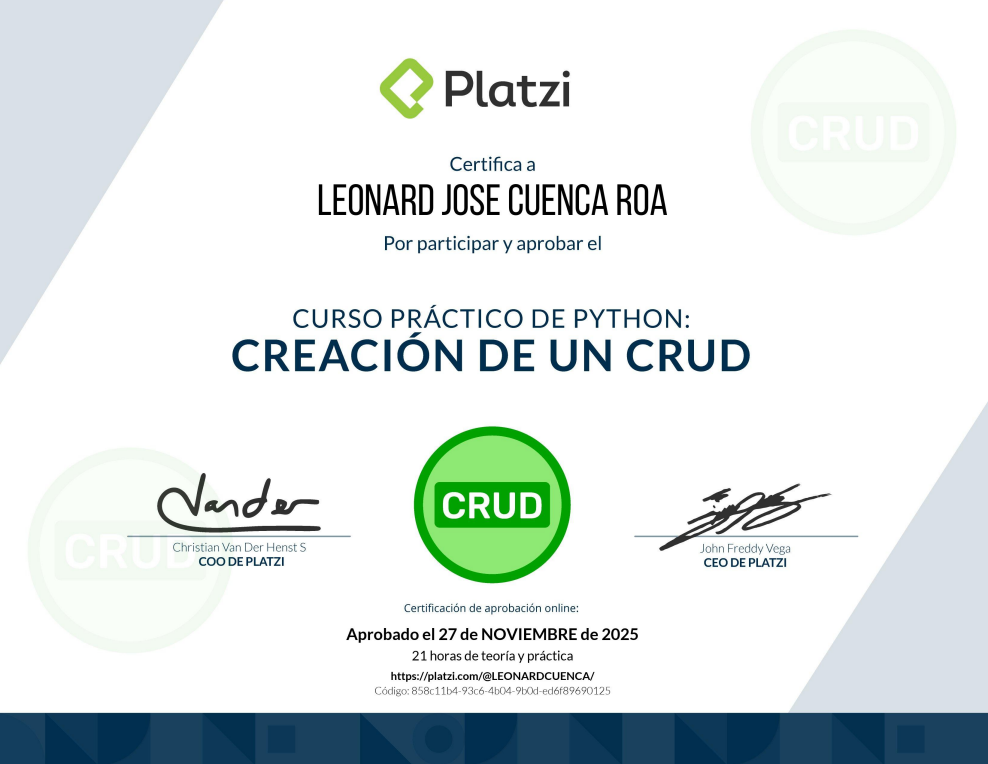

| Detalle | Información |
| :--- | :--- |
| **Publicado el** | Publicado el 11 de octubre de 2025 |
| **Profesor** | Luis Martinez |
| **Fecha de Inicio** | 22/10/2025 |
| **Fecha de Fin** | 11/12/2025 |

---

  

| Curso | Certificado |
| :--- | :---: |
| Diploma Pÿthon POO | [Ver PDF](https://github.com/LeoSan/CursosBackendPython/blob/main/02_DesarrolloBackendPythonDjango_2025_Avanzado\02_CreacionCRUD\2025_diploma-python-practico_PLATZI.pdf) |

--- 

