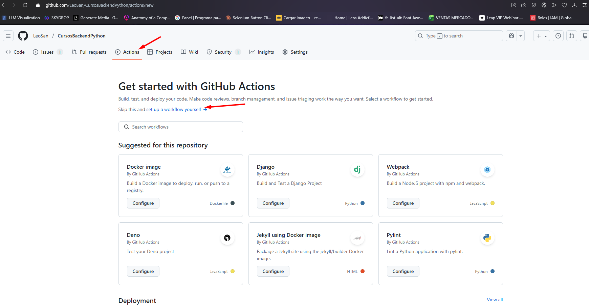
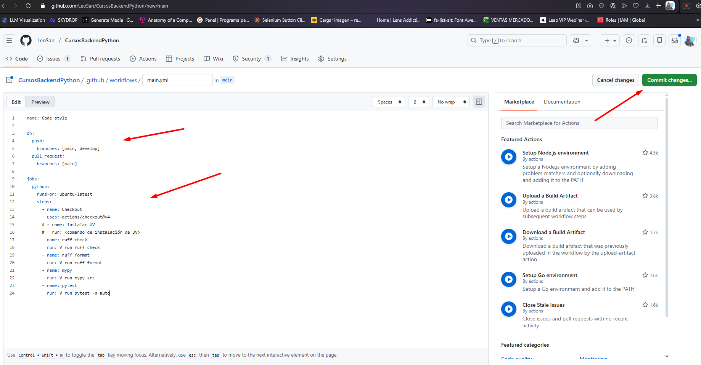

# Curso de Python Profesional: Arquitectura de Proyectos, Entornos y PyPI🚀

> Domina las herramientas modernas de desarrollo en Python con proyectos prácticos. Aprende a escribir, probar y automatizar código profesional con Ruff, pytest, Mypy y GitHub Actions. Mejora tu flujo de trabajo con formateo automático, validaciones en tiempo real y despliegues eficientes que te preparan para entornos de producción reales.

| Detalle | Información |
| :--- | :--- |
| **Publicado el** | 22 Octubre 2025 |
| **Profesor** | Luis Martinez  |
| **Fecha de Inicio** | 29/11/2025  |
| **Fecha de Fin** | 31/12/2025  |
| **Enlace** | https://platzi.com/cursos/python-avanzado/  |


---
<div align="center">
  
</div>


| Curso | Certificado |
| :--- | :---: |
| Diploma Curso de Python Profesional: Arquitectura de Proyectos, Entornos y PyPI | [Ver PDF](https://github.com/LeoSan/CursosBackendPython/blob/main/02_DesarrolloBackendPythonDjango_2025_Avanzado\04_ArquitecturaProyectosEntornosPyPI\2025_CursoPythonProfesionalArquitecturaPIP_PLATZI.pdf) |

--- 


## Tabla de Contenidos
- [CLASE 01:  Calidad, automatización y asincronía en Python profesional](#clase-01--calidad,-automatizacion-y-asincronia-en-python-profesional)
- [CLASE 02:  Configuración inicial del proyecto Platy News con Python](#clase-02--configuracion-inicial-del-proyecto-platy-news-con-python)
- [CLASE 03: Configuración y uso de Ruf como formateador automático en Python](#clase-03-configuracion-y-uso-de-ruf-como-formateador-automatico-en-python)
- [CLASE 04: Configuración de MyPy para validación estática de tipos en Python](#clase-04-configuracion-de-mypy-para-validacion-estatica-de-tipos-en-python)
- [CLASE 05:  Configuración y uso de ruff para análisis estático en Python](#clase-05--configuracion-y-uso-de-ruff-para-analisis-estatico-en-python)
- [CLASE 06:  Configuración de pre-commit con Ruff y MyPy para validar código](#clase-06--configuracion-de-pre-commit-con-ruff-y-mypy-para-validar-codigo)
- [CLASE 07: Ejecución paralela de pruebas unitarias con pytest y coverage](#clase-07-ejecucion-paralela-de-pruebas-unitarias-con-pytest-y-coverage)
- [CLASE 08: Configuración de GitHub Actions para CI/CD con Python](#clase-08-configuracion-de-github-actions-para-ci/cd-con-python)
- [CLASE 09: Configuración de logging y Sentry para monitoreo en producción](#clase-09-configuracion-de-logging-y-sentry-para-monitoreo-en-produccion)
- [CLASE 10: Medición de rendimiento de código con Timeit en Python](#clase-10-medicion-de-rendimiento-de-codigo-con-timeit-en-python)
- [CLASE 11: Análisis de rendimiento en Python con cProfile y Snakeviz](#clase-11-analisis-de-rendimiento-en-python-con-cprofile-y-snakeviz)
- [CLASE 12: Programación asíncrona en Python con AsyncIO para operaciones I/O](#clase-12-programacion-asincrona-en-python-con-asyncio-para-operaciones-i/o)
- [CLASE 13: Sintaxis async y await en Python para concurrencia eficiente](#clase-13-sintaxis-async-y-await-en-python-para-concurrencia-eficiente)
- [CLASE 14: Event loop de asyncio: creación manual y debugging avanzado](#clase-14-event-loop-de-asyncio-creacion-manual-y-debugging-avanzado)
- [CLASE 15: Migración de Request síncrono a HTTPX asíncrono en Python](#clase-15-migracion-de-request-sincrono-a-httpx-asincrono-en-python)
- [CLASE 16: Automatización de tareas con Make y Makefile en proyectos](#clase-16-automatizacion-de-tareas-con-make-y-makefile-en-proyectos)
- [CLASE 17: Publicación de paquetes Python con UV y TestPyPI](#clase-17-publicacion-de-paquetes-python-con-uv-y-testpypi)


## CLASE 01:  Calidad, automatización y asincronía en Python profesional

**¿Por qué calidad, automatización y asincronía en Python marcan la diferencia?**
La diferencia no está en “hacerlo correr”, sino en construir software que resista el paso del tiempo. La calidad evita el caos de estilos y errores. La automatización libera tiempo de tareas repetitivas. La asincronía multiplica la eficiencia en operaciones de input y output con APIs y bases de datos.

Código que evoluciona sin romperse en cada cambio.
Equipos que hablan el mismo idioma técnico.
Menos fricción operativa y más foco en valor de negocio.
Mejor rendimiento cuando hay espera por I/O.

**¿Qué reglas y herramientas garantizan el mismo idioma del equipo?**
Imagina cinco personas editando un archivo sin reglas: sería un caos. La salida es estandarizar prácticas y exigirlas con herramientas que verifiquen cada cambio sin intervención manual.


**¿Qué reglas alinean al equipo en Python?**
PEP 8 para respetar reglas importantes del lenguaje.
Anotaciones de tipo para claridad y mantenimiento.
Tests unitarios para validar comportamientos de forma confiable.

**¿Qué herramientas automatizan la calidad sin intervención?**
Formateadores y linters para legibilidad y consistencia.
Recommit hooks para validar cada cambio antes de subir al repositorio.
GitHub Actions para ejecutar herramientas de calidad en cada push.
TaskRunners como Make para evitar recordar comandos largos.

**¿Cómo desarrollar las habilidades clave y qué lograrás al finalizar?**
El objetivo es ejecutar un pipeline de calidad sin fricción y dominar la asincronía para mejorar el rendimiento en I/O. Además, compartirás tu trabajo con la comunidad.


**¿Cómo automatizar reglas y configurar un pipeline de calidad?**
Automatizar tus reglas de desarrollo para que se verifiquen siempre.
Configurar un pipeline completo que valida la calidad sin intervención manual.
Integrar verificaciones en cada cambio y en cada push.

**¿Cómo dominar la programación asincrónica y refactorizar I/O?**
Dominar la programación asincrónica para optimizar operaciones que esperan respuesta.
Refactorizar código síncrono a asíncrono, mejorando drásticamente el rendimiento en tareas con APIs o bases de datos.

**¿Cómo publicar en la comunidad y dar el salto profesional?**
Publicar en la comunidad: tu primer aporte open source de Python en PyPI.
Consolidar disciplina, herramientas y práctica real para construir Python Profesional.


```PYTHON


```

## CLASE 02:  Configuración inicial del proyecto Platy News con Python


**¿Qué es Platy News y qué lograrás con Python?**
Platy News es una CLI que integra varias fuentes de información para buscar noticias y complementarlas con análisis de IA. Reúne conocimientos desde variables y ciclos hasta entornos virtuales, POO, typing y AsyncIO, guiándote hacia un trabajo más profesional y colaborativo.

Aplicación de línea de comandos con comandos intuitivos en la terminal.
Búsqueda de noticias con múltiples fuentes: News API, The Guardian y OpenAI.
Análisis con IA integrado mediante un LLM.
Python 3.13 como requisito por el uso de typing avanzado.
Trabajo en equipo y mejora de un código legacy.
Pruebas unitarias con carpeta test para validar el proyecto.

**¿Cómo clonar e instalar el proyecto paso a paso?**
El proyecto se distribuye en un repositorio con readme que irás mejorando. La estructura incluye paquetes, módulos y la carpeta test con pruebas unitarias. Usarás Visual Studio Code para explorar el código y la terminal para ejecutar comandos.


**¿Qué estructura tiene el repositorio y qué herramientas usarás?**
README inicial que documenta requisitos y uso.
Paquetes y módulos organizados por funcionalidad.
test con pruebas unitarias para validar el comportamiento.
Visual Studio Code para editar y ejecutar.
Terminal para comandos del flujo de instalación.

**¿Qué comandos ejecutar en la terminal?**
Clonación con git clone usando el enlace SSH y apertura en VS Code.
git clone <URL-SSH>
cd <carpeta-del-repositorio>
code -r .
Creación del entorno virtual con el comando indicado y activación según tu sistema.
vvm
# luego activar con el comando que muestre vvm.
Instalación en modo editable para habilitar el comando platynews.
vpip install -e
Verificación rápida del comando (mostrará errores si faltan claves).
platynews

**¿Cómo configurar API keys y ejecutar comandos con IA?**
La configuración se hace con un archivo .env en la raíz del proyecto. Debes crear el archivo y pegar las API keys siguiendo el readme. Sin estas claves, platynews mostrará errores al iniciar.


**¿Dónde crear y pegar las API keys en .env?**
Crea el archivo .env según lo indicado en el readme.
Genera y copia la clave de News API desde tu cuenta y pégala en .env.
En OpenAI crea una nueva clave secreta y verifica que tienes saldo activo.
Regístrate en The Guardian como desarrollador, confirma el correo y copia la clave recibida a .env.
Guarda el archivo y vuelve a ejecutar platynews.

**¿Cómo probar una consulta con guardian y LLM?**
Abre el readme y toma un ejemplo de uso con un tema como “cambio climático”.
Ejecuta el comando para preguntar por las “principales causas” usando el source guardian.
Espera unos segundos para ver la lista de temas procesados por el LLM.
Si aparece la ayuda de uso en vez de errores, las API keys están bien configuradas.

Buenas prácticas:

Verifica el entorno virtual activo antes de instalar o ejecutar.
Mantén el readme actualizado con cada cambio.
Revisa la carpeta test para entender los unit tests del proyecto.


## CLASE 03: Configuración y uso de Ruf como formateador automático en Python

**¿Cómo instalar y configurar Ruf con pyproject.toml?**
Configurar Ruf desde el principio evita fricciones de estilo y facilita la colaboración. La instalación se hace en el entorno de desarrollo y queda registrada en el archivo de configuración del proyecto.

Abre la terminal en la carpeta del proyecto.
Agrega la dependencia al entorno de desarrollo con el gestor de paquetes.
V add --def Ruf
Verifica que en pyproject aparezca la dependencia en el grupo de desarrollo.
Ejecuta el formateo en el path actual.
root format .
Revisa los cambios: se reportan archivos reformateados y archivos sin cambios.
Ejemplo real: 20 archivos reformateados y 3 sin cambios.
Cambios típicos que verás:
Inserción de líneas en blanco para legibilidad.
Cambio de comillas simples a dobles o viceversa.
Alineación y espacios según PEP 8.
Idea clave: por defecto, Ruf aplica PEP 8 automáticamente. Si tu equipo usa otro estándar, configura las reglas en pyproject.toml para mantener consistencia.


**¿Qué reglas PEP 8 aplica y cómo personalizarlas?**
Ruf es un reemplazo de Black que formatea según PEP 8. Sin embargo, puedes ajustar el estilo para seguir reglas ya establecidas en tu proyecto, todo desde pyproject.toml dentro de la sección de configuración de la herramienta.


**¿Cómo cambiar el estilo de comillas?**
Si necesitas que las comillas sean simples, define el quote style en la configuración. Al volver a ejecutar el formateo, Ruf actualizará los archivos según la regla.

[tool.ruf]
quote style = "single"
Efecto: cuando había comillas dobles, pasarán a comillas simples.
Úsalo solo si tu proyecto no seguirá PEP 8 por defecto en este aspecto.

**¿Cómo excluir archivos con extend exclude?**
Evita que se formatee código generado automáticamente por un framework agregando rutas a una lista de exclusiones. Crea una carpeta, por ejemplo: do not format, y añádela a la configuración.

[tool.ruf]
extend exclude = ["Platinus/do not format/"]
Crea un archivo .py dentro de esa ruta con comillas simples.
Ejecuta:
root format .
Resultado: ese archivo no se modifica.
Buenas prácticas de configuración: - Mantén un estándar único: si no es PEP 8, que sea el estándar del proyecto. - Controla cambios de estilo desde pyproject.toml para todo el equipo.


**¿Qué buenas prácticas y flujo de trabajo recomiendan?**
Adoptar Ruf de forma ordenada reduce conflictos en pull requests y acelera las revisiones.

Configura Ruf desde el inicio del proyecto para evitar divergencias de formato.
Integra Ruf format en hooks de pre-commit para validar antes de cada commit.
Define reglas consistentes en pyproject.toml y compártelas con todo el equipo.
Si necesitas volver a PEP 8 por defecto, revierte cambios de configuración y vuelve a formatear.


## CLASE 04: Configuración de MyPy para validación estática de tipos en Python


**¿Qué es MyPy y por qué mejora la validación estática de tipos en Python?**
MyPy permite encontrar incompatibilidades de tipos sin correr la aplicación. Con esto, el código se vuelve más robusto, fácil de mantener y confiable en equipos grandes. La clave: leer el error, entender el contexto y aplicar el tipado correcto.

Detecta errores antes de tiempo y evita bugs en producción.
Ayuda a documentar contratos de funciones y estructuras.
Acelera el refactor con confianza.
Permite reportes para ver cobertura de tipado por archivo.

**¿Cómo instalar y ejecutar MyPy en Platzi News?**
Primero se instala como dependencia de desarrollo y luego se ejecuta sobre el directorio de código fuente para ver los errores detectados.


**¿Cómo instalar MyPy y los tipos para requests?**
Instala MyPy como dev dependency.
v add --dev mypy
Si usas requests sin tipados, instala los stubs para eliminar el error de “Stub not installed”.
v add --dev types-requests

**¿Cómo ejecutar el análisis y leer los errores de tipos?**
Corre MyPy sobre el código fuente.
mypy src
Interpreta el resultado: archivo, dos puntos, número de línea y descripción del problema.
Ten en cuenta que versiones cambian y los mensajes pueden variar; lo importante es interpretar el tipo esperado vs. el recibido.

**¿Cómo solucionar errores comunes y generar reportes HTML?**
A continuación, ajustes reales de tipado, mejoras a parámetros y una forma de ignorar validaciones puntuales cuando conoces la intención del código.


**¿Cómo tipar params compatibles en requests.get?**
El error indica que params no coincide con la firma esperada. La causa: una clave como api_key con tipo desconocido. Solución: tipar el diccionario para que las llaves sean strings y los valores sean string o int.

Versión con typing clásico.
from typing import Union

params: dict[str, Union[str, int]] = {
    "query": query,
    "api_key": api_key,
}
Versión moderna y más legible (operador |).
params: dict[str, str | int] = {
    "query": query,
    "api_key": api_key,
}
Notas clave: - dict[str, …] tipa las llaves como strings. - str | int asegura compatibilidad con la firma de requests. - Quitar int mostrará un error inmediato si algún valor es entero.

Al volver a ejecutar MyPy, el error desaparece cuando el tipo es compatible.


**¿Cómo ignorar validaciones puntuales con type: ignore?**
Cuando la intención del código es válida pero choca con una regla, puedes ignorar solo esa línea con el motivo específico.

settings = Settings()  # type: ignore[call-arg]
Buenas prácticas: - Usa comentarios de ignore solo cuando entiendas el mensaje. - Documenta el motivo con el código de error entre corchetes. - Evita ignorar bloques completos; sé específico a la línea.


**¿Cómo corregir join cuando la lista no es de strings?**
La función join requiere un iterable de strings. Si hay enteros mezclados, convierte cada elemento a string antes de unir.

msg = ", ".join(str(x) for x in missing_keys)
Garantiza que join reciba siempre lista de strings.
Evita errores del tipo “no se puede asignar al parámetro iterable[str]”.
Al limpiar y ejecutar de nuevo, MyPy puede mostrar el mensaje esperado:

Éxito: no hay issues encontrados en dieciséis archivos analizados.

**¿Cómo generar un reporte HTML de cobertura de tipos?**
Para compartir con el equipo qué archivos y líneas están tipados, genera un reporte HTML.

Instala la dependencia requerida.
v add --dev lxml
Genera el reporte en una carpeta.
mypy src --html-report mypy_report
Abre el index del reporte y revisa precisión por archivo y líneas tipadas.


## CLASE 05:  Configuración y uso de ruff para análisis estático en Python


**¿Por qué usar ruff para análisis estático en Python?**
Ruff permite detectar errores temprano y ahorrar tiempo. Integra revisión de estilo PEP 8, limpieza de imports y mejoras automáticas del código. Se configura en el archivo pyproject.toml, junto a otras herramientas como MyPy.

Es un formateador y un linter en uno solo.
Reemplaza PGLint y Flake ocho con reglas consolidadas.
Es ultrarrápido y apto para proyectos grandes.

**¿Qué es un formatter y qué es un linter?**
Un formatter (como ruff usado como formatter) “arregla” el estilo para cumplir PEP 8.
Un linter analiza el código fuente sin ejecutarlo para detectar errores de sintaxis, imports no usados y problemas potenciales.
Ejecuta cada uno así:

ruff format
ruff check

**¿Cómo se configura ruff en pyproject.toml?**
Define la configuración dentro de pyproject.toml.
Ajusta reglas según tu proyecto y, si quieres, agrúpalas con las de MyPy.
Mantén las reglas de lint juntas bajo la configuración de tool ruff para claridad.

**¿Cómo ejecutar ruff, corregir y seleccionar reglas?**
La práctica recomendada es correr ruff con frecuencia. Primero, inspecciona con check y, si hay errores arreglables, aplica fix.

ruff check
ruff check fix
Caso real: ruff reporta “diez errores”, de los cuales “ocho” son fixable. Con “check fix”, elimina imports no usados y aplica mejoras seguras. Quedan “dos errores” manuales, como variables definidas que nunca se usan.
Ruff evita borrar líneas que podrían cambiar el comportamiento; tú decides si eliminarlas.

**¿Cómo activar rule selection e isort para ordenar imports?**
Ruff permite ampliar la verificación con más reglas. Ejecuta todas para medir tu base de código:

ruff check select all
Ejemplo: aparecen “doscientos sesenta y seis” errores al activar más reglas. Esto muestra que ruff es altamente configurable y que, por defecto, usa un conjunto básico.
Desde la documentación, copia los “selects” recomendados: incluyen reglas de pycodestyles, pyflakes, pyupgrade y la “I” de isort para ordenar imports.
Tras configurar, usa “check fix” para que ruff elimine imports no usados y ordene los imports: primero los de Python, luego librerías externas y, al final, los locales. Separados por un enter, y dos enters antes del código.

**¿Qué cambios automáticos y de estilo verás en el código?**
Conversión de .format a “literal string” según la versión de Python: ruff sugiere el literal string por ser la práctica actual recomendada.
Límite de línea en 88 caracteres (PEP 8): divide donde sea seguro para mantener el código ejecutable. No partas expresiones críticas; busca el punto correcto para el salto.
Caso práctico: tras “catorce errores”, ruff arregla “siete” automáticamente. El resto requiere tu revisión.

**¿Qué buenas prácticas fortalecen tu flujo con ruff?**
Adoptar ruff desde el inicio eleva la calidad y agiliza revisiones. Integra su uso en tu ciclo de desarrollo.

Configúralo desde el inicio del proyecto para consistencia.
Ejecuta “run check” con regularidad, idealmente en cada commit. Con pre-commit podrás automatizarlo.
Combínalo con MyPy para tipos y PyTest para pruebas, logrando una suite completa de calidad de código.


## CLASE 06:  Configuración de pre-commit con Ruff y MyPy para validar código


**¿Qué es pre-commit y cómo garantiza calidad en cada commit?**
Pre-commit es un framework que simplifica la configuración de hooks que se ejecutan automáticamente cada vez que haces un commit. Al instalarlo y crear el archivo de configuración pre-commit.config.yml, puedes activar reglas como corrección de fin de archivo, eliminación de espacios en blanco y validación de YAML. Al correr pre-commit install, el hook se integra en la carpeta .git para que todo commit pase por estas comprobaciones.


**¿Qué reglas básicas conviene activar?**
end-of-file-fixer: asegura una línea vacía al final del archivo.
trailing-whitespace: elimina espacios en blanco innecesarios.
check-yaml: valida la sintaxis de archivos YAML.

**¿Cómo instalar y configurar pre-commit con Ruff y MyPy?**
Primero instala pre-commit como dependencia de desarrollo y valida que responde en la terminal. Si avisa que falta configuración, crea pre-commit.config.yml y añade tus reglas. Luego ejecuta pre-commit install: se activará el hook local.

Herramientas clave: Ruff como linter y formatter. MyPy como analizador estático de tipos.
Archivo de proyecto: pyproject.toml con la configuración de Ruff y reglas como Bandit.
Habilidad práctica: interpretar mensajes de error y corregirlos antes del commit.
# Instalar el hook en el repositorio
pre-commit install

# Flujo de trabajo básico
git status
git add .
git commit -m "mensaje"
Un ejemplo minimal de estructura para pre-commit.config.yml con las reglas mencionadas:

repos:
  - repo: ...
    rev: ...
    hooks:
      - id: end-of-file-fixer
      - id: trailing-whitespace
      - id: check-yaml

  - repo: ...  # Integración de Ruff (Astral)
    rev: ...
    hooks:
      - id: ruff
      - id: ruff-format

  - repo: ...  # mirrors-mypy
    rev: "1.8.0"
    hooks:
      - id: mypy

**¿Cómo probar la configuración con Ruff?**
Genera un cambio que viole una regla: por ejemplo, una línea muy larga.
Ejecuta git add y git commit con un mensaje como “intento de commit malo”.
El primer commit puede instalar dependencias de hooks automáticamente.
Verás que Ruff bloquea el commit con el detalle del error: la línea supera el límite.

**¿Cómo integrar MyPy en los hooks?**
Añade mirrors-mypy con un ref que coincida con tu versión, por ejemplo: "1.8.0".
Guarda cambios y recuerda: si modificas pre-commit.config.yml, debes hacer git add de ese archivo para que el hook lo tenga en cuenta.
Reintenta el commit y confirma que MyPy ejecute sus comprobaciones.

**¿Cómo validar, evitar errores y aplicar seguridad con Bandit?**
Puedes necesitar terminar un commit urgente y omitir las verificaciones de estilo. En ese caso, usa la opción --no-verify al final del comando de commit. Úsala con responsabilidad.

git commit -m "mensaje urgente" --no-verify
Para seguridad, activa reglas de Bandit desde la configuración de Ruff en tu pyproject.toml. Un caso típico es la regla S307, que alerta sobre el uso inseguro de eval.

# Ejemplo inseguro: Bandit S307
user_input = input("Ingresa una expresión:")
resultado = eval(user_input)  # Inseguro: ejecución arbitraria de código
Al intentar el commit, pre-commit mostrará: “función insegura, considera cambiarla”.
Elimina el uso de eval y vuelve a ejecutar git add y git commit.
El commit pasará cuando el código cumpla las reglas activadas.

**¿Qué buenas prácticas mejoran tu flujo?**
Configúralo desde el inicio del proyecto para estándares consistentes.
Incluye solo herramientas esenciales para no ralentizar los commits.
Combínalo con continuous integration y continuous deployment para doble validación: local y remota.


## CLASE 07: Ejecución paralela de pruebas unitarias con pytest y coverage


**¿Qué es pytest y por qué mejora tus pruebas unitarias?**
Pytest es el estándar moderno en Python para pruebas unitarias. Es más simple de escribir, ofrece mejor reporte de errores y soporta plugins avanzados sin complicar la sintaxis. Lo mejor: puede ejecutar los unit tests existentes sin reescribirlos.

Pruebas unitarias: validan unidades pequeñas de código y documentan el comportamiento esperado.
Unit Test: biblioteca estándar tradicional; en el proyecto de Platzi News se usó para crear tests.
Pytest: ejecución sencilla, reporting claro y extensible mediante plugins.

**¿Cómo instalar pytest como dependencia de desarrollo?**
Ejecuta: v add --dev pytest.
Verás los paquetes instalados y cambios en pyproject con la versión de pytest.

**¿Qué configuración básica necesita pytest?**
En pyproject, agrega la sección de configuración: tool.pytest.ini_options.
Define las rutas de pruebas con testPaths y los patrones con python_files.
Expón la app con PYTHONPATH apuntando a SRC para que pytest encuentre tu código.


[tool.pytest.ini_options]
testPaths = ["tests"]
python_files = ["test_*.py"]
pythonpath = ["src"]


**¿Cómo medir cobertura con coverage y generar reportes útiles?**
La métrica coverage indica qué porcentaje de tu código está cubierto por pruebas. Ayuda a priorizar dónde escribir nuevos tests y a visualizar líneas no ejercitadas.

Instala el plugin: v add --dev pytest-cov.
Ejecuta con parámetros de cobertura y reporte HTML.
pytest --cov=SRC --cov-report=html

Se genera la carpeta htmlcov con index.html y un resumen por archivo.
Ejemplo observado: 80 % de cobertura total. Archivos con 100 % están completos; otros muestran líneas sin probar.
Interpretación visual: líneas verdes aprobadas; líneas rojas sin pruebas que las ejecuten.


**¿Qué decisiones tomar con el reporte de coverage?**
Prioriza módulos en rojo con lógica crítica.
Agrega casos para ramas no cubiertas (condiciones, excepciones, bordes).
Repite la medición hasta alcanzar un nivel objetivo sostenible.


**¿Cómo paralelizar pruebas con xdist y aplicar TDD en tu flujo?**
La ejecución paralela con xdist usa múltiples núcleos para reducir drásticamente el tiempo de feedback. Esto incentiva ciclos rápidos y seguros, ideal al practicar TDD.

Instala el plugin: v add --dev pytest-xdist.
Ejecuta en paralelo con detección automática de núcleos.
pytest -n auto
Resultado observado: todas las pruebas en menos de un segundo usando 11 workers.
Agrega verbosidad para más detalle en la terminal: progreso, nodo, clase y método del test.
pytest -n auto --cov=SRC --cov-report=html -b -v


**¿Por qué sumar Test Driven Development a esta configuración?**
Test Driven Development te hace escribir el test antes del código.
Beneficios: diseño más claro, foco en requisitos y verificación continua al refactorizar.
Con pytest, coverage y xdist, el ciclo rojo–verde–refactor es ágil y confiable.


**¿Qué otros plugins puedes explorar para tu contexto?**
pytest-mock: crea mocks de dependencias fácilmente.
pytest-randomly: ejecuta en orden aleatorio para detectar dependencias entre tests.
La ecosistema de pytest incluye miles de plugins: elige el que resuelva tu necesidad específica


## CLASE 08: Configuración de GitHub Actions para CI/CD con Python


**¿Cómo configurar GitHub Actions para CI/CD en Python con ruff, mypy y pytest?**

La integración continua ejecuta pruebas y validaciones automáticamente al integrar cambios con frecuencia. La entrega continua va más allá automatizando el despliegue. Con Actions, puedes crear un workflow que corra en cada push y en cada pull request hacia ramas clave.

Problema común: funciona local, falla en otro entorno por configuraciones o dependencias distintas.
Solución: automatizar validaciones de estilo con ruff, tipado estático con mypy y pruebas unitarias con pytest.
Beneficio: calidad consistente y detección temprana de errores.


**¿Qué eventos disparan el workflow y cómo ahorrar minutos?**
Define cuándo corre la Action con la llave on. Se recomienda limitar a ramas críticas para optimizar minutos.

Ejecutar en push solo en branches main y develop.
Ejecutar en pull request únicamente hacia main.
Repos públicos: gratis. Repos privados: 2000 minutos gratis; adminístralos y evita validar ramas WIP.
Ejemplo de disparadores y estructura mínima:

```bash
name: Code style

on:
  push:
    branches: [main, develop]
  pull_request:
    branches: [main]

jobs:
  python:
    runs-on: ubuntu-latest
    steps:
      - name: Checkout
        uses: actions/checkout@v4
      # - name: Instalar UV
      #   run: <comando de instalación de UV>
      - name: ruff check
        run: V run ruff check
      - name: ruff format
        run: V run ruff format
      - name: mypy
        run: V run mypy src
      - name: pytest
        env:
          # define las variables usadas en tu .env con valores NO reales
          newsapi_api_key: "this is not a API key"
          google_api_key: "this is not a API key"
          gemini_model: "this is not a API key"
          max_articles: "this is not a API key"
          request_timeout: "this is not a API key"
        run: V run pytest -n auto
```

**¿Qué pasos y comandos ejecuta el pipeline?**

En el job se usa Ubuntu automáticamente. Los pasos típicos incluyen:

Checkout del repositorio.
Instalar UV para ejecutar comandos de Python.
ruff check: valida reglas de estilo y errores como E501 (línea muy larga).
ruff format: formatea el código automáticamente.
mypy src: analiza tipos solo en la carpeta src.
pytest -n auto: ejecuta pruebas aprovechando múltiples núcleos.


**¿Cómo corregir fallos de estilo y tipado en la pipeline?**
Si falla ruff por E501 (línea muy larga), corrige el archivo y valida con un flujo de git ordenado.

git pull para traer cambios recientes.
Crear rama: git switch -c fixed-pep8.
Editar el archivo, por ejemplo quitando el comentario que rompe PEP8.
git add y git commit (pasa validaciones de pre-commit).
git push y abrir el pull request.
Verifica en la pestaña Actions que los checks corren en el PR.
Cuando ruff y mypy pasen, puede fallar pytest si faltan variables de entorno como un API key. Los tests no deben usar claves reales; solo comprobar que existen.


**¿Cómo inyectar variables de entorno seguras en pytest?**

Agrega env en el paso de pytest con valores falsos, suficientes para que los tests encuentren las variables.

- name: pytest
  env:
    # define las variables usadas en tu .env con valores NO reales
    API_KEY: "this is not a API key"
    # API_SECRET: "this is not a API key"
    # PROJECT_ID: "dummy"
  run: V run pytest -n auto
Haz commit y push de la actualización del workflow.
Revisa el PR: ruff, mypy y pytest deben pasar en segundos.

**¿Qué buenas prácticas fortalecen tu CI/CD con GitHub Actions?**
Adopta hábitos que mantengan tu flujo estable y rápido.

Crear el workflow desde la pestaña Actions y partir de ejemplos oficiales de las librerías.
Usar actions reusables desde la documentación de cada herramienta para mayor flexibilidad.
Considerar la funcionalidad de cache disponible en la action de ruff para mejorar tiempos.
Nombrar el workflow (por ejemplo, Code style) para identificar los checks fácilmente.
Limitar on a main y develop, y pull requests hacia main, para cuidar minutos.
Ejecutar pytest con -n auto para paralelizar pruebas.
Mantener variables sensibles fuera del repo; usar valores dummy en env del workflow.


**RESUMEN PASOS**
- Paso 1: Podemos acceder al github con nuestra cuenta, podemos seguir los pasos que se dan en la documentacion de github actions.

  - Podemos crear un workflow a la medida que es lo que necesitamos para este caso  
  - 

- Paso 2: Crear nuestro workflow el comando esta en la parte superior

  - 

- Paso 3: esta seccion se ejecuta cuando se hace un push o un pull request


## CLASE 09: Configuración de logging y Sentry para monitoreo en producción


**¿Qué es observabilidad y cómo mejora producción?**
La observabilidad es la capacidad de entender qué ocurre dentro de una aplicación en producción. Incluye logging, métricas y monitoreo de errores. El logging registra eventos clave: operaciones normales y pasos críticos. Ayuda a diagnosticar problemas, monitorear rendimiento, auditar acciones de usuarios y comprender el comportamiento del sistema en tiempo real.


**¿Qué niveles de log usar y cuándo?**
Los niveles empiezan en debug y terminan en critical. Elegir el nivel define qué mensajes quedan registrados.

debug: detalles de depuración muy específicos. Muestra más contexto.
info: flujo normal de la app. Incluye info, warning, error y critical.
warning: situaciones no críticas que requieren atención. No incluye info ni debug.
error: fallas recuperables que afectan funcionalidades.
critical: errores severos que requieren acción inmediata.
Cuando se habilita un nivel en servidores, se busca el balance entre utilidad y ruido. Por eso, no se incluye debug al usar info, y en warning no se incluyen info ni debug. Evita saturar almacenamiento con mensajes innecesarios.


**¿Cómo mejorar legibilidad con colores en consola?**
Platzi News usa console de Reach para colorear salidas y hacerlas más legibles.

Mensajes personalizados con colores como “yellow”.
Estilos como “boldblue” para resaltar información.
Enlaces clicables en consola cuando aplica.
Úsalo para distinguir estados: por ejemplo, “no se encontraron artículos” en “yellow”.


**¿Cómo aplicar logging en Platzi News paso a paso?**
Platzi News ya tiene logging implementado y permite elegir log level al ejecutarse. Así se valida el comportamiento en producción y se ajusta la verbosidad según la necesidad.


**¿Qué observar con info y debug?**
Ejecuta con info para ver el flujo normal. Ejemplo: búsqueda de “tecnología” en news API muestra “searching for tecnología”.
Ejecuta con debug para ver detalles adicionales. Ejemplo: “fetching articles” y los request de HTTPS que se realizan.
Al no especificar nivel, se muestra solo el resultado. Tenlo presente en entornos de usuario final.
Buenas prácticas clave:

Evita usar print para depurar. Usa el logger con niveles correctos.
Elimina print temporales que ignoran el nivel configurado.
Estandariza mensajes para rastrear el flujo de ejecución.

**¿Cómo integrar Sentry para monitoreo de errores?**
Sentry centraliza errores y logs en un dashboard. Permite ver tracebacks, variables en contexto y detalles del entorno para resolver más rápido.


**¿Cómo crear cuenta e instalar el SDK?**
Ingresa y selecciona “get started”. Crea tu cuenta y completa el onboarding con “Start”.
Elige la plataforma: Python. No selecciones framework si no aplica.
Pulsa “Configurar SDK” y ajusta el comando al gestor usado, por ejemplo V.
Copia el comando, instálalo y verifica que el SDK esté agregado en el proyecto.
Inserta la configuración provista, con tu API y datos de conexión, en el archivo de configuración de Platzi News. Mueve los import a la parte superior para evitar errores.

**¿Cómo probar y leer errores con Sentry?**
Provoca un error controlado: una división por cero. Por ejemplo:

1/0 para generar el fallo intencional.

Ejecuta una búsqueda conocida y verifica que Sentry reciba el evento.

Abre el error desde el botón del dashboard y revisa el traceback: verás la ruta de ejecución desde el comando hasta el archivo de configuración.
Observa variables disponibles en el scope. Esto ayuda a validar casos y encontrar causas reales.
Usa “Copiar a Clipboard” para llevar el reporte a un editor y, si lo deseas, compartirlo con una IA que te asista en el análisis.
Configura alertas por correo para recibir notificaciones cuando aparezcan nuevos errores en producción.


## CLASE 10: Medición de rendimiento de código con Timeit en Python


**¿Cómo medir rendimiento en Python con timeit?**
Para comparar enfoques, crea dos funciones que hagan lo mismo y mide varias veces. Así identificas diferencias reales de desempeño y evitas suposiciones.


**¿Cómo preparar las funciones a comparar?**
Define un tamaño grande para notar diferencias y valida que ambas funciones produzcan el mismo resultado.

# archivo: timing_pruebas.py
numero = 10_000_000

def suma_con_sum():
    return sum(range(numero))

def suma_con_for():
    total = 0
    for i in range(numero):
        total += i
    return total

print(f"¿Son iguales? {suma_con_sum() == suma_con_for()}")  # True
Puntos clave: - Usa el mismo dato de entrada para ambas funciones. - Verifica la igualdad antes de medir con print. - Mantén el código simple y legible.


**¿Cómo ejecutar timeit y formatear resultados?**
Configura un número de repeticiones para obtener una medición estable. timeit ejecuta la función varias veces y devuelve un tiempo útil para comparar.

import timeit

repeticiones = 10  # menos repeticiones = resultados más rápidos de ver

tiempo_sum = timeit.timeit(suma_con_sum, number=repeticiones)
tiempo_for = timeit.timeit(suma_con_for, number=repeticiones)

print(f"Tiempo para sum: {tiempo_sum:.6f}s")
print(f"Tiempo para for: {tiempo_for:.6f}s")
Detalles importantes: - Usa el parámetro number para indicar cuántas veces se llama cada función. - Formatea con :.6f para ver diferencias pequeñas con claridad. - Compara valores en el mismo formato.


**¿Cómo interpretar los resultados?**
En la práctica observamos que sum(range(...)) es más rápido que un for tradicional en Python: el primero puede quedar por debajo de un segundo, mientras que el for ronda alrededor de 1.6 segundos en la misma escala de datos. Con esto, ya puedes elegir la implementación más eficiente para cargas grandes.


**¿Qué es la notación Big O y por qué importa?**
La notación Big O describe cómo crece el tiempo o la memoria de un algoritmo a medida que aumenta el tamaño de la entrada. Se enfoca en el peor caso, no es una medida exacta, pero sí una guía para comparar eficiencia y escalabilidad entre alternativas. Con este criterio sabrás si un algoritmo se volverá muy lento o consumirá demasiada memoria cuando procese muchos datos.

Conceptos clave: - Complejidad algorítmica: relación entre tamaño de entrada y recursos usados. - Peor escenario: caso que más tarda o más memoria usa. - Comparación relativa: orienta decisiones sin depender de tiempos absolutos.


**¿Qué buenas prácticas y qué reto aplicar ya?**
Mide con método y toma decisiones informadas. Así mejoras rendimiento sin sacrificar claridad.

Buenas prácticas: - Elige un number apropiado: más repeticiones, más precisión. - Separa el setup del código a medir. - Mide varias veces y calcula promedios. - Considera rendimiento y legibilidad. - No optimices prematuramente: primero mide.

Reto práctico: - Revisa las funciones del proyecto y detecta cuáles requieren ajuste de rendimiento. - Usa timeit para medir cuánto tarda cada método o funcionalidad. - Propón mejoras para hacerlas más rápidas y comparte tus ajustes en los comentarios.

¿Ya comparaste tus funciones con timeit? Cuéntame qué mejoras aplicaste y qué diferencias de tiempo encontraste.


## CLASE 11: Análisis de rendimiento en Python con cProfile y Snakeviz


**¿Qué problema de rendimiento se resolvió y cómo se midió?**
Se parte de un método con problemas de rendimiento, llamado find duplicate titles, y de su versión optimizada. Se construyó un experimento que genera artículos con títulos duplicados, ejecuta ambas funciones en diferentes tamaños de lista y compara tiempos.

Se usó Timeit para medir el tiempo total de cada función.
Se probaron tamaños crecientes para observar cómo escala el tiempo de ejecución.
Se imprimieron resultados en notación Big O para contrastar el comportamiento del original vs el mejorado.
Con 100 artículos, el método optimizado mejora cerca de 7.5 veces.
Con 20.000 artículos, el original tarda casi 4 segundos, mientras que el mejorado queda por debajo de 1 segundo.
Ejecutar el experimento con Timeit:

python src/timeit_platineus.py

**¿Cómo se mejoró find duplicate titles sin bucles anidados?**
El original tenía dos for anidados. Ese patrón degrada el rendimiento al crecer la cantidad de artículos. La versión optimizada evita la anidación: primero obtiene la lista de todos los títulos y luego valida si están repetidos, lo que reduce el costo al escalar.

Eliminar bucles anidados reduce trabajo redundante.
Analizar primero la lista de títulos facilita detectar duplicados con menos comparaciones.
El tiempo de ejecución deja de crecer de forma desproporcionada conforme aumentan los artículos.
La diferencia se evidencia en pruebas con 20.000 elementos.
Pauta de refactor (esqueleto orientativo):

def find_duplicate_titles_original(articles):
    # Dos bucles anidados: más comparaciones.
    ...

def find_duplicate_titles_mejorado(articles):
    # Primero extrae títulos y luego valida duplicados sin anidar bucles.
    ...

**¿Cómo usar cProfile y Snake Bits para analizar el rendimiento?**
Timeit ofrece un tiempo total; cProfile revela dónde se gasta el tiempo. Así puedes identificar funciones críticas sin crear scripts auxiliares adicionales. Luego, con Snake Bits, visualizas el perfil en un diagrama interactivo.


**¿Cómo ejecutar cProfile desde la terminal?**
cProfile se ejecuta como módulo y recibe el módulo objetivo de tu aplicación.
Se pasan parámetros al módulo tal como lo harías normalmente.
python -m cProfile platzynews.main search tecnologia source newsapi
Para guardar la salida en un archivo .prof y visualizarla después:

python -m cProfile -o platineus.prof platzynews.main search tecnologia source newsapi

**¿Qué significan ncalls, tot time y cum time?**
cProfile muestra una tabla con métricas clave para interpretar cuellos de botella reales.

ncalls: número de veces que se llamó la función.
tot time: tiempo total en esa función excluyendo subfunciones.
cum time: tiempo acumulado, incluyendo subfunciones.
function name: nombre completamente calificado de la función.
Consejos prácticos:

Ordena por tot time o cum time para ver lo más costoso primero.
Revisa el main del proyecto para ubicar el inicio del flujo.

**¿Cómo visualizar con Snake Bits y qué buscar?**
Instala la librería y genera el archivo .prof con cProfile. Luego abre el perfil para navegar por el diagrama y la tabla.

# Instalación como dependencia de desarrollo
v add --dev snake_bits

# Visualización del perfil
snake bits platineus.prof
Qué explorar en la vista:

Filtra por main para centrarte en el inicio de la ejecución.
Observa cuánto tarda cada método/clase; por ejemplo, fetch articles que llama a la API.
Usa el botón de Call Stack para ver la cadena de llamadas.
Cambia el estilo de gráfico y ajusta la profundidad para acotar el análisis.
Si hay errores al abrir Snake Bits en proyectos grandes, filtra resultados para reducir el tamaño de las estadísticas.


## CLASE 12: Programación asíncrona en Python con AsyncIO para operaciones I/O


**¿Qué diferencia hay entre asincronía, concurrencia y paralelismo?**
La asincronía busca eficiencia cuando hay esperas. La concurrencia permite que varias tareas avancen a la vez sin ejecutarse literalmente al mismo tiempo. El paralelismo ejecuta varias tareas al mismo tiempo en distintos núcleos de CPU.

Asincronía: ideal para operaciones de entrada/salida (I/O) como llamadas a APIs, archivos, bases de datos y red. Evita bloqueos mientras esperas respuestas externas.
Concurrencia: múltiples tareas progresan de forma intercalada. Optimiza el uso del tiempo de espera.
Paralelismo: acelera cargas intensivas de CPU ejecutando en varios núcleos simultáneamente.

**¿Cuándo usar programación asíncrona para I/O y paralelismo para CPU?**
Usa asincronía cuando el cuello de botella es esperar: APIs web, archivos, red o bases de datos.
Usa paralelismo cuando el cuello de botella es cálculo intensivo en CPU.

**¿Cómo funciona AsyncIO con corrutinas, futures, tareas y event loop?**
AsyncIO es la librería estándar para código asíncrono en Python. Su motor, el event loop, coordina pausas y reanudaciones para que las tareas avancen sin bloquear el hilo principal.


**¿Qué es una corrutina y cómo se pausa con await?**
Una corrutina es una función declarada con el prefijo async. Puede pausarse con await y reanudar su ejecución más tarde. Al llamarla, retorna una corrutina pendiente de ejecutar.

import asyncio

async def operar_io():
    # Pausa la corrutina durante 1 segundo (simula una espera de I/O).
    await asyncio.sleep(1)

coro = operar_io()  # Retorna una corrutina que puede ser ejecutada más adelante.
Palabras clave: async, await, corrutina.
Idea clave: una corrutina “espera por algo” sin bloquear el hilo principal.

**¿Qué es un future y qué estados maneja?**
Un future es “una caja” donde llegará un resultado.

Puede estar pendiente, terminada o con error.
Al hacer await sobre un future, la corrutina se pausa hasta que el resultado esté listo.

**¿Qué es una tarea y qué hace el event loop?**
Una tarea empaqueta la corrutina para que el event loop la administre de forma concurrente.

El event loop revisa estados, pausa y reanuda corrutinas y tareas en el momento adecuado.
Sin event loop, nada avanza: es el motor de AsyncIO.

**¿Dónde aporta valor en Platinus y en llamadas a APIs?**
La asincronía permite consultar múltiples fuentes a la vez. En Platinus, esto significa preguntar a News API, The Guardian y otras fuentes en paralelo lógico, reduciendo el tiempo total de respuesta al no esperar cada llamada de forma secuencial.

Casos de uso ideales: llamadas a APIs web. Lectura y escritura de archivos. Consultas a bases de datos. Operaciones de red.
Beneficio práctico: menos tiempo de espera total al superponer esperas externas.

**¿Qué reto práctico puedes abordar ahora?**
Identifica en el código actual las secciones que esperan respuestas externas.
Prioriza APIs, archivos, bases de datos y red para convertirlas a asincronía.
Empaqueta corrutinas en tareas y deja que el event loop gestione la concurrencia.


**Notas:**
- Corutinas: 
  - Es el punto de partida 
  - es una funcion que tiene el prefijo de asyn 
  - que puede pausarse con await 
  - nos permite pausar y reanudar la ejecucion de una funcion 

- Feature: 
  - Es una caja vacia que puede tener un resultado en el futuro 
  - puede estar pendiente, terminada o con error 
  - cuando uno hace un await a un fetuare, la corutina se pausa hasta que el resultado este listo 

- tarea: 
  - requiere una corutina
  - se usa para empaquetar la corutina que se desea usar 
  - luego se pasa el motor de asynio para que pueda ser ejecutada correctamente 

- Event loop: 
  - es el motor que se encarga de pausa o reanudar todas las corutinas 
  - es el que coordina todas las tareas 
  - es el que decide cuándo pausar y reanudar las tareas 

**Analogía: El Restaurante con un solo Mesero (El Event Loop)**

Imagina un restaurante muy concurrido que tiene **un solo mesero** (el *Event Loop*).

1.  **Enfoque Síncrono (Bloqueante):**
    El mesero toma la orden de la Mesa 1, va a la cocina y **se queda parado esperando** los 20 minutos que tarda el chef en preparar el plato. Mientras espera, ignora a las demás mesas. Hasta que no entregue la comida a la Mesa 1, no atiende a la Mesa 2. Es ineficiente y lento.

2.  **Enfoque Asíncrono (AsyncIO):**
    El mesero toma la orden de la Mesa 1, la entrega a la cocina y **no se queda esperando**. Le dice al chef: "avísame cuando esté listo" (*await*) y regresa inmediatamente al salón.
    Mientras la cocina trabaja (*operación I/O*), el mesero aprovecha para tomar la orden de la Mesa 2, servir agua a la Mesa 3 o cobrar a la Mesa 4.
    Cuando la cocina toca la campana indicando que el plato de la Mesa 1 está listo (*Future completado*), el mesero pausa lo que estaba haciendo, recoge el plato y lo entrega.

**Conclusión:** Aunque solo hay un mesero (un solo hilo/proceso), parece que hace todo "al mismo tiempo" porque aprovecha cada segundo de espera para avanzar en otras tareas. Nunca se queda bloqueado.


## CLASE 13: Sintaxis async y await en Python para concurrencia eficiente


**¿Qué son async y await en Python moderno?**
Async define funciones asíncronas, corrutinas, que pueden pausar su ejecución sin bloquear el programa. Await pausa una corrutina hasta que otra operación asíncrona termina. Al combinarlas, se obtiene concurrencia clara y eficiente.

Corrutinas: funciones declaradas con async que pueden suspenderse y reanudarse.
No bloqueo: al usar await correctamente no se congela el programa completo.
Event loop: ciclo que orquesta corrutinas; si introduces llamadas bloqueantes, lo detienes.
Beneficio medible: tiempos totales mucho menores cuando las esperas se solapan.

**¿Cómo transformar código síncrono a asíncrono con asyncio?**
La base es un flujo que procesa una lista de tareas con nombre y segundos de espera, imprime logs de inicio y fin, y mide tiempos. En su forma síncrona, el total fue de 9 segundos. Tras el refactor, con asyncio, la aplicación completa tardó alrededor de 3 segundos, y la tarea con 1 s de espera terminó antes que las demás.


**¿Cuál es la base síncrona con time.sleep?**
import time

def tarea(nombre, segundos):
    print(f"inicia {nombre}")
    time.sleep(segundos)
    print(f"finaliza {nombre}")
    return nombre, segundos

def main():
    # A, B, C, D con distintas duraciones
    tareas = [("A", 3), ("B", 2), ("C", 1), ("D", 3)]
    resultados = []
    for n, s in tareas:
        resultados.append(tarea(n, s))
    print(resultados)

if __name__ == "__main__":
    main()

**¿Cómo convertir funciones en corrutinas con async?**
Cambia las funciones a corrutinas con async.
Reemplaza time.sleep por await asyncio.sleep(segundos) para no bloquear.
import asyncio

async def tarea(nombre, segundos):
    print(f"inicia {nombre}")
    await asyncio.sleep(segundos)
    print(f"finaliza {nombre}")
    return nombre, segundos

**¿Cómo ejecutar tareas en paralelo con asyncio.gather?**
Convierte main en corrutina.
Usa await asyncio.gather(...) para correr varias corrutinas en paralelo.
Ejecuta el event loop con asyncio.run(main()).
import asyncio

async def main():
    tareas = [
        tarea("A", 3),
        tarea("B", 2),
        tarea("C", 1),
        tarea("D", 3),
    ]
    resultados = await asyncio.gather(*tareas)
    print(resultados)

if __name__ == "__main__":
    asyncio.run(main())
Paralelismo cooperativo: cada await cede el control al event loop.
Orden de finalización: completa primero quien espera menos tiempo.
Datos clave: versión síncrona ~9 s; versión asíncrona ~3 s.

**¿Qué cuidar del event loop y qué reto practicar?**
Si no usas await donde corresponde, bloqueas el event loop y el comportamiento se parece al flujo síncrono. Evita llamadas bloqueantes como time.sleep dentro de corrutinas; usa await asyncio.sleep y ejecuta todo con asyncio.run.

Usa await en operaciones asíncronas para no bloquear.
Reemplaza time.sleep por await asyncio.sleep dentro de corrutinas.
Orquesta varias corrutinas con asyncio.gather.
Arranca el event loop con asyncio.run.
Reto propuesto: crea una función asíncrona que simule pedir datos a una API usando await asyncio.sleep como delay de red, y pruébala en el intérprete interactivo.

import asyncio

async def obtener_datos():
    print("consultando API...")
    await asyncio.sleep(1)
    print("listo")
    return {"status": "ok"}

async def main():
    datos = await obtener_datos()
    print(datos)

asyncio.run(main())


## CLASE 14: Event loop de asyncio: creación manual y debugging avanzado


**¿Qué es el event loop en asyncio y cómo coordina corutinas?**
El event loop es el corazón de asyncio: coordina corutinas y decide cuándo pausarlas y reanudarlas. Piensa en un director de orquesta que no ejecuta, pero hace que todo suene a tiempo.

Revisa tareas listas. Busca corutinas listas para ejecutarse.
Ejecuta hasta la await. Corre cada tarea hasta encontrar un await.
Pausa y registra. Guarda el estado y anota qué está esperando.
Repite el ciclo. Permite progreso continuo de múltiples operaciones de IO sin bloquear.

**¿Qué pasos clave siguen las tareas en el loop?**
Se seleccionan tareas pendientes y se programan de forma no bloqueante.
Cada tarea avanza hasta su siguiente punto de espera con await.
El loop retoma tareas cuando su condición de espera se cumple.

**¿Cuándo usar asyncio.run y cuándo gestión manual del loop?**
En la mayoría de casos, usa asyncio.run: es más simple y seguro. Evita sobrecarga y maneja automáticamente la creación y cierre del loop.

Usa gestión manual del loop cuando:

Necesitas control fino del ciclo de vida del loop.
Integras asyncio con otros frameworks que ya manejan bucles de eventos.
Requieres debugging avanzado: activar debug y observar el comportamiento interno de asyncio.

**¿Cómo crear y depurar un event loop manual en Python?**
Puedes crear tu propio loop para tener acceso directo a su configuración. El flujo es: crear el loop, registrarlo en asyncio, ejecutar hasta completar la tarea y cerrarlo al final para liberar recursos.

import asyncio

async def main():
    # tu lógica asíncrona aquí
    return "ok"

# crear y registrar el loop
loop = asyncio.new_event_loop()
asyncio.set_event_loop(loop)

try:
    # opcional: activar debug del loop
    loop.set_debug(True)

    # ejecutar hasta que la tarea termine
    loop.run_until_complete(main())
finally:
    # importante: cerrar el loop para liberar recursos
    loop.close()
new_event_loop. Crea una instancia de loop y la guarda en una variable, por ejemplo, my_loop.
set_event_loop. Indica a asyncio cuál loop debe usar.
run_until_complete. Ejecuta la tarea hasta completarse.
close. Cierra el loop en un bloque finally para no dejar recursos abiertos.

**¿Cómo activar debug y ver logs de asyncio?**
Usa loop.set_debug(True) para habilitar debug en el loop.
Ajusta tu configuración de logs a nivel debug para ver mensajes de asyncio, como el “selector” que está usando.
Ejecuta tu script y observa el logging de asyncio para entender qué tareas se seleccionan y cuándo avanzan.
Consejos prácticos:

En proyectos comunes, asyncio.run es suficiente y recomendable.
El control manual del loop es útil para escenarios específicos de integración y debug profundo.
Mantén la limpieza de recursos: siempre cierra el loop.


## CLASE 15: Migración de Request síncrono a HTTPX asíncrono en Python


**¿Qué cambia con HTTPX y AsyncIO?**
La ejecución deja de ser bloqueante. Antes, cada petición HTTP esperaba a la anterior. Con AsyncIO y HTTPX se disparan varias solicitudes de forma concurrente, aprovechando mejor el I/O de red y acelerando la obtención de artículos. Se preservan los métodos síncronos existentes y se agregan equivalentes asíncronos con prefijo “A” para distinguirlos y facilitar una migración gradual.

Concurrencia real en I/O: múltiples requests al mismo tiempo.
Prefijo “A” en métodos asíncronos para claridad y consistencia.
Dual approach: síncrono y asíncrono conviven sin romper usos previos.
Menos tiempo total: respuesta más rápida, aprox. 50%.

**¿Cómo se instala HTTPX?**
Se elige HTTPX por su compatibilidad con AsyncIO.
Instalación directa: ejecutar en la terminal: V add HTTPX.
Verificación: aparece en dependencias de pyproject.toml.

**¿Cómo se define el nuevo protocolo asíncrono?**
En el módulo source se tiene un protocolo con el método síncrono existente (ej.: fetch...).
Se agrega el nuevo método asíncrono con prefijo “A” y misma firma y documentación.
Se usa async def y se mantiene el tipado para retornar la misma estructura de artículos.

**¿Cómo se implementa en Guardian y News API?**
En guardian.py se crea el método asíncrono con async def y prefijo “A”.
Se mueve el logger a la parte superior del archivo para reutilizarlo.
Se importa httpx y se usa un cliente asíncrono con contexto.
import httpx

async def afetch_articles(params):
    # logger definido arriba
    async with httpx.AsyncClient() as client:
        response = await client.get("https://api.guardian...", params=params)
    data = response.json()
    # Adaptar a la estructura de artículos esperada
    return [ ... ]
En News API se repite el refactor: mover logger, importar httpx, crear el método con prefijo “A”, usar await y ajustar el mapeo de campos porque los nombres difieren respecto a Guardian.

**¿Cómo se adapta el servicio y la CLI?**
El servicio en core/services agrega un método asíncrono gemelo del síncrono (misma responsabilidad, prefijo “A”). Internamente, obtiene la fuente con el método actual (sigue siendo síncrono) y llama al nuevo método asíncrono de la fuente con await. Se toca el mínimo de funciones para no afectar otras features ni tests.

class NewsService:
    def search_articles(self, ...):
        source = self.get_source(...)
        return source.fetch_articles(...)

    async def a_search_articles(self, ...):
        source = self.get_source(...)
        return await source.afetch_articles(...)
Regla de oro: await solo dentro de funciones async. Por eso, al actualizar el uso desde la CLI, la función que invoca el nuevo método se vuelve async.
Se renombra el main asíncrono y se crea un wrapper síncrono que ejecuta la corrutina con asyncio.run, manteniendo la compatibilidad del punto de entrada.
async def async_main():
    # await service.a_search_articles(...)
    ...

def main():
    import asyncio
    asyncio.run(async_main())

**¿Cómo mantener compatibilidad hacia atrás?**
Compatibilidad: el código existente sigue funcionando con métodos síncronos.
Migración gradual: módulo por módulo, sin pausas grandes.
Flexibilidad: scripts simples usan síncrono; producción usa asíncrono.
Testing: los tests no se rompen al conservar los métodos previos.

**¿Cómo verificar que HTTPX está en uso?**
La validación práctica incluye ejecutar la búsqueda y luego activar los logs en modo debug para confirmar que HTTPX realiza los requests.

Ejecutar búsqueda: Platinus search con término y source News API. Muestra artículos correctamente.
Confirmar HTTPX: PlatzyNews con log level debug para ver los mensajes info/DEBUG de HTTPX indicando requests exitosos.


## CLASE 16: Automatización de tareas con Make y Makefile en proyectos


**¿Qué es un task runner y por qué usar Make?**
Cuando repetimos comandos como instalar dependencias, correr pruebas o formatear código, un task runner evita trabajo manual. Make está presente en la mayoría de sistemas Unix y Linux y permite definir tareas comunes y ejecutarlas con un solo comando.

Ahorra tiempo: automatiza tareas repetitivas.
Reduce errores: menos comandos escritos a mano.
Facilita el trabajo en equipo: todos usan los mismos targets.
Comandos cortos: ejecuta con make + nombre de tarea.

**¿Cómo crear un Makefile y ejecutar targets install y run?**
Crea el archivo con eme mayúscula: Makefile. Define targets como install o run y ejecútalos desde la terminal con: make nombre-de-la-tarea. Make ejecuta exactamente los comandos que declares dentro del target.


**¿Cómo definir install para dependencias con @echo?**
Agrega un mensaje y la instalación de paquetes. Si no quieres borrar el entorno virtual, elimina esa línea antes de ejecutar.

install:
    @echo "instalando paquetes"
    vsync
Mensaje informativo con @echo: muestra “instalando paquetes”.
Instalación: el comando vsync se ejecuta automáticamente al correr: make install.

**¿Cómo definir run para instalar y probar Platzi News?**
Este target encadena dos pasos: instalación local y ejecución de la app con log level de debug.

run:
    vpit install .
    Platzi News log level debug
Instalación local: vpit install . construye e instala tu librería.
Prueba de la aplicación: Platzi News con log level debug para validar el comportamiento.
Atajo útil: con make run no necesitas recordar comandos largos.

**¿Qué particularidades del Makefile debes cuidar?**
Hay detalles esenciales para que todo funcione sin sorpresas. Respétalos siempre al escribir y ejecutar tus targets.

Indentación con Tab: Make requiere tabuladores, no espacios.
Mensajes con @echo: imprime textos útiles como “instalando paquetes”.
Ayuda con make help: ideal para mostrar cómo ejecutar los comandos del proyecto.
Ejecución directa: make nombre-de-tarea corre lo que definiste en el Makefile.


## CLASE 17: Publicación de paquetes Python con UV y TestPyPI

**¿Cómo elegir y configurar el build backend con uv?**
Seleccionar el build backend correcto es clave. Python ofrece varias opciones: SetopToast es flexible pero complejo. Hatchling es moderno, minimalista y veloz. Fleet es extremadamente simple para paquetes puros de Python. Poetry integra backend y gestión de dependencias. UV funciona con cualquiera que declares en pyproject.toml y recomienda Hatchling por defecto para nuevos proyectos.


**¿Qué build backends existen y para qué usar Hatchling?**
SetopToast: el más antiguo y tradicional. Muy flexible.
Hatchling: moderno, minimalista y rápido. Recomendado por UV.
Fleet: extremadamente simple para Python puro.
Poetry: backend con gestor de dependencias integrado.
Hatchling destaca por su simplicidad y eficiencia. Perfecto para empezar a distribuir sin fricción.


**¿Cómo declarar build_system en pyproject.toml?**
Define el backend y sus requisitos en la sección correspondiente. La idea es especificar require y el build backend apuntando a “.build”.

[build_system]
require = ["hatchling"]
build_backend = "hatchling.build"
Guarda y ya podrás construir tu paquete con UV.


**¿Cómo construir el paquete y qué archivos genera uv?**
Con el proyecto listo y UV configurado, construye los artefactos distribuibles. El comando central es simple y muestra el output con los archivos resultantes.


**¿Qué hace el comando uv build?**
Ejecuta el proceso de empaquetado del proyecto.
Genera dos archivos listos para publicar: el sdist y el wheel.
uv build

**¿Qué significan sdist tar.gz y wheel whl?**
tar.gz: el source distribution (sdist). Código fuente empaquetado.
whl: el wheel. Distribución binaria lista para instalar.
Estos son los dos archivos que se suben al manejador de paquetes.


**¿Cómo publicar en TestPyPI con seguridad y tokens?**
Antes de publicar en PyPI, usa su entorno de pruebas: test.pypi. Así validas que el sistema de build y publicación funciona sin afectar el índice principal.


**¿Cómo crear cuenta y activar 2FA en TestPyPI?**
Regístrate y verifica tu correo con el enlace enviado.
Activa two factor authentication: genera y guarda códigos de recuperación.
Escanea el QR en tu app de autenticación y valida el código.
Con esto, tu cuenta queda lista y protegida para publicar.


**¿Cómo generar y usar un token con uv publish?**
Crea un token con alcance al proyecto que vas a publicar.
En tu Makefile, define un comando de publicación usando el token y el índice de pruebas.
publish:
    uv publish \
      --index test-pypi \
      --username __token \
      --password $(TOKEN)
Ejecuta el objetivo de Make:
make publish
Si aparece un error, probablemente falta registrar el índice en pyproject.toml.


**¿Cómo registrar el index en tool.uv.index?**
Declara la lista de índices que usarás en UV con nombre, URL, publish URL y explicit true.

[tool.uv.index."test-pypi"]
url = "test.pypi.org"
publish-url = "test.pypi.org"
explicit = true
Ahora vuelve a publicar con UV y revisa el output. Deberías ver que sube los artefactos, incluso menciona que subió dos versiones.


**¿Cómo verificar, buscar e instalar el paquete?**
Ve a test.pypi y busca “Platsy News”. Deberías ver la página pública con descripción y README.
Instala con pip usando la URL del índice de prueba y el nombre del paquete.
pip install -i <URL> Platsy News
Con esto, ya puedes instalar, configurar tu entorno y empezar a usar la librería. Felicidades: lograste publicar tu primer paquete en el manejador de paquetes principal de Python. Inspírate, crea librerías open source, y comparte tu trabajo con la comunidad. Como referencia, Luis Martínez menciona su experiencia con Django, FastAPI y arquitecturas en la nube, e invita a pensar como desarrollador avanzado: código limpio, ideas que escalan y despliegue a producción.
