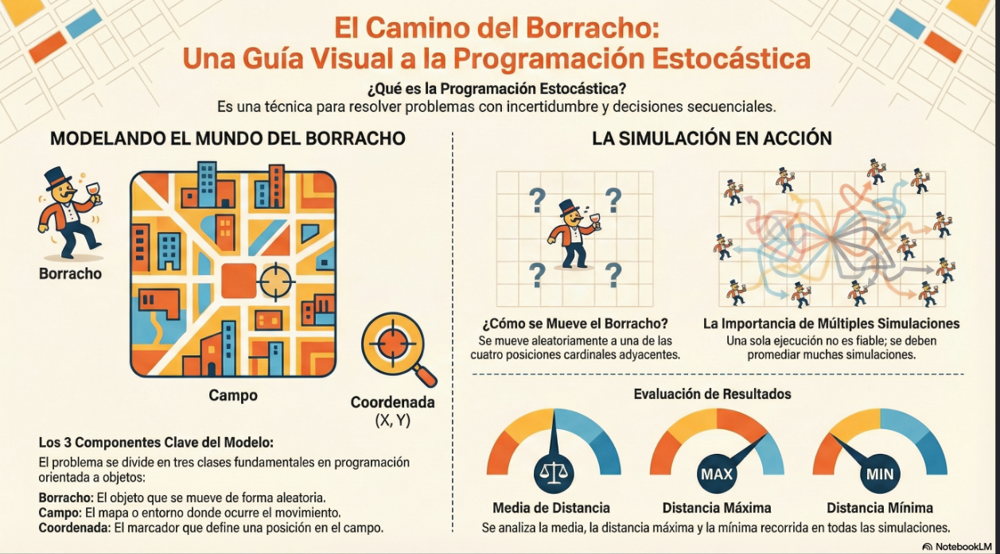
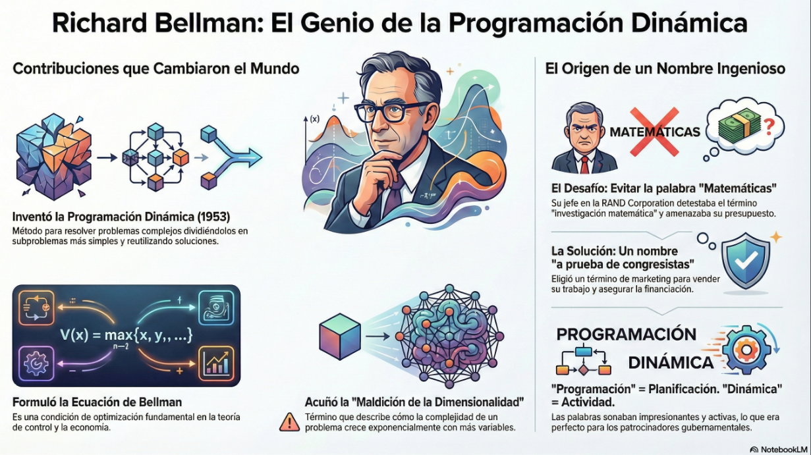
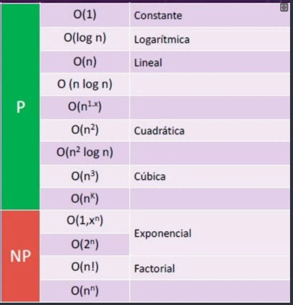
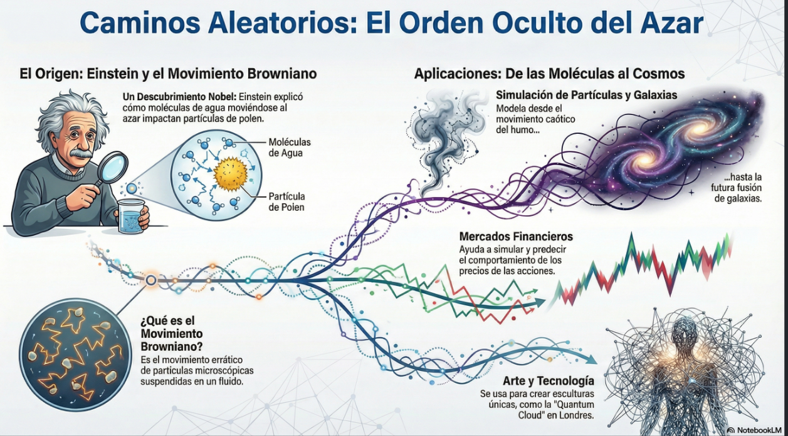

# Curso de Estadística Computacional con Python🚀

> Domina la estadística computacional usando Python para analizar datos, realizar simulaciones y calcular probabilidades. Aprende a aplicar técnicas de inferencia estadística y a desarrollar simulaciones de Monte Carlo.

| Detalle | Información |
| :--- | :--- |
| **Publicado el** | 24 FEBRERO 2025 |
| **Profesor** | DAVID AROESTI  |
| **Fecha de Inicio** | 11/12/2025  |
| **Fecha de Fin** | 31/12/2025  |
| **Enlace** | https://platzi.com/cursos/programacion-estocastica/ |


---
<div align="center">
  
</div>


| Curso | Certificado |
| :--- | :---: |
| Curso de Estadística Computacional con Python | [Ver PDF](https://github.com/LeoSan/CursosBackendPython/blob/main/02_DesarrolloBackendPythonDjango_2025_Avanzado\05_CursoEstadisticaComputacionalPython\2025_CursoEstadisticaComputacionalPython_PLATZI.pdf) |

--- 

## CLASE 01: INTRODUCCIÓN 

**Objetivos**
● Aprender cuándo utilizar Programación
Dinámica y sus beneficios
● Entender la diferencia entre programas
deterministas y estocásticos
● Aprender a utilizar Programación Estocástica
● Aprender a crear simulaciones computacionales
válidas

## CLASE 02: Programación Dinámica: Optimización de Problemas con Memorización

> [El nombre] Programación Dinámica se escogió para esconder a patrocinadores gubernamentales el hecho que en realidad estaba haciendo Matemáticas. La frase Programación Dinámica es algo que ningún congresista puede oponerse. **Richard Bellman**


**PUNTOS CLAVES**

> Programación Dinámica
● Subestructura Óptima. Una solución global
óptima se puede encontrar al combinar
soluciones óptimas de subproblemas locales.
● Problemas empalmados. Una solución óptima
que involucra resolver el mismo problema en
varias ocasiones.


> Memoization
● La Memorización es una técnica para guardar
cómputos previos y evitar realizarlos
nuevamente.
● Normalmente se utiliza un diccionario, donde las
consultas se pueden hacer en O(1).
● Intercambia tiempo por espacio.


**¿Qué es la programación dinámica?**

La programación dinámica es un concepto indispensable en el mundo de las ciencias de la computación. A pesar de su nombre, el cual no refleja su verdadera esencia, es una técnica poderosa para optimizar ciertos tipos de problemas. La historia de su origen es peculiar: Richard Bellman acuñó este término en la década de 1950 para garantizar el financiamiento de sus investigaciones matemáticas, utilizando un nombre que sonara impresionante pero que, curiosamente, no está relacionado con el dinamismo. Sin embargo, su aplicación ha demostrado ser fundamental en la informática.

**¿Cómo funciona la programación dinámica?**

La programación dinámica se centra en problemas con una "subestructura óptima". Esto significa que la solución global óptima se puede alcanzar dividiendo el problema en partes más pequeñas, resolviendo cada una de manera óptima antes de combinarlas para obtener la solución total. Ejemplos de su aplicación incluyen:

- El problema del morral (Knapsack problem): Aquí se buscan soluciones óptimas en problemas cada vez más pequeños.

- La secuencia de Fibonacci: La solución se genera dividiendo el problema en partes más reducidas y encontrando soluciones para cada segmento menor.

- Las soluciones a estos problemas más pequeños se combinan para hallar una solución a la totalidad del problema.

**¿Qué es la memorización en programación dinámica?**

La memorización es crucial para hacer eficiente la programación dinámica. Se utiliza para evitar cálculos innecesarios al almacenar resultados de computaciones previas en una estructura de datos, como un diccionario, que nos permite acceder rápidamente a estos datos almacenados. He aquí algunos puntos clave sobre la memorización:

Optimización de tiempo: Al guardar los resultados en la memoria del sistema, se disminuyen significativamente los tiempos de cómputo.

Intercambio de tiempo por espacio: Este concepto es esencial en ciencias de la computación, donde al aumentar el uso del espacio de memoria, se reduce el tiempo necesario para la solución del problema.

Utilizando la memorización, se logra que los programas no repitan cálculos ya realizados, lo que resulta en la ejecución de programas mucho más rápidos y eficientes.

**¿Cuáles son las aplicaciones prácticas de la programación dinámica?**
La programación dinámica se aplica a una variedad de problemas, haciendo de su comprensión algo esencial para cualquier estudiante de informática. Con ejemplos amplios en algoritmos y optimización, continúa siendo un área fértil para el aprendizaje y la aplicación:

- Ordenación y búsqueda: Se utilizan técnicas para estructurar datos ordenadamente y búsquedas eficientes.

- Resolución de problemas matemáticos complejos: Desde la secuencia de Fibonacci hasta problemas de combinatoria, la programación dinámica ofrece formas eficientes de llegar a soluciones.

- Optimización de recursos: Eficiente en tareas de asignación de recursos y planificación.

- Aprovechar las técnicas de programación dinámica no solo refuerza la comprensión teórica, sino que potencia la capacidad de resolver problemas complejos de manera sistemática y optimizada.

**En conclusión, la programación dinámica y la memorización son conceptos que, aunque quizás intrincados en su origen, se revelan como herramientas esenciales en la caja de herramientas de cualquier ingeniero en informática. Su dominio abre puertas a la optimización de programas y algoritmos, culminando en soluciones eficientes e innovadoras. Continúa explorando estos conceptos para mejorar tu comprensión del fascinante mundo de las ciencias de la computación.**




## CLASE 03:  Optimización de Algoritmos con Programación Dinámica en Python


**¿Qué es la Programación Dinámica?**
La programación dinámica es una metodología de optimización que ahorra tiempo al intercambiar espacio. Utiliza la memorización para evitar cálculos repetidos al guardar los resultados de subproblemas que se pueden reutilizar. Esto es esencial en problemas donde hay muchas subestructuras comunes, como es el caso de la secuencia de Fibonacci.

**¿Cómo se implementa la secuencia de Fibonacci de forma recursiva?**
A pesar de ser sencilla de implementar, la solución recursiva a la secuencia de Fibonacci es ineficiente debido al cálculo repetido de los mismos subproblemas. El algoritmo recursivo es el siguiente:

```PYTHON

import sys
sys.setrecursionlimit(10002)

def fibonacci_dinamico(n, memo = {}):
    if n == 0 or n == 1:
        return 1
    if n in memo:
        return memo[n]
    memo[n] = fibonacci_dinamico(n-1, memo) + fibonacci_dinamico(n-2, memo)
    return memo[n]

if __name__ == '__main__':
    n = int(input("Escoge un número: "))
    print(f"Fibonacci de {n} es {fibonacci_dinamico(n)}")    

```

> Recuerda programación algoritmica depende de la complegidad algoritmica ya que hay que saber a nivel de base que tipo de complejidad tiene el algoritmo.


**Dejo base de la complejidad algoritmica Complejidad Algorítmica (Big O Notation)**


"""
🟢 Zona Verde: P (Tiempo Polinómico - "Eficiente")
Estos son los algoritmos que las computadoras pueden resolver en un tiempo razonable, incluso con muchos datos.

- $O(1)$ - Constante: El mejor de todos. No importa si tienes 10 datos o 1 millón, toma el mismo tiempo.
Ejemplo: Acceder a un valor en un diccionario de Python o un array por su índice.

- $O(\log n)$ - Logarítmica: Muy rápido. El tiempo crece muy lentamente comparado con los datos.
Ejemplo: Búsqueda binaria (buscar una palabra en un diccionario físico abriendo por la mitad).

- $O(n)$ - Lineal: El tiempo crece proporcionalmente a los datos. Si duplicas los datos, duplicas el tiempo.
Ejemplo: Recorrer una lista con un bucle for simple.

- $O(n \log n)$: Un poco más lento que lineal, pero muy eficiente. Es el estándar para ordenar cosas.
Ejemplo: Los algoritmos de ordenamiento eficientes como Merge Sort o Quick Sort (lo que usa .sort() en Python).

- $O(n^2)$ - Cuadrática: El tiempo crece al cuadrado. Común en algoritmos "ingenuos".
Ejemplo: Un bucle for dentro de otro (bucles anidados). Común en ordenamiento burbuja.

- $O(n^3)$ y $O(n^k)$: Cúbica o Polinómica general. Bucles triples, cuádruples, etc. Sigue siendo "resoluble" (está en P), pero se vuelve lento rápido.


🔴 Zona Roja: NP (No Polinómico* / Intratable)
- Nota técnica: Aunque la imagen dice "NP", en este contexto visual se refiere a algoritmos que "No son Polinómicos" o que son Exponenciales/Factoriales. 
- Estos algoritmos son tan lentos que se vuelven inútiles si $n$ crece un poco (por ejemplo, si $n=100$, el programa podría tardar siglos).

- $O(2^n)$ - Exponencial: Por cada dato nuevo, el tiempo se duplica. Esto explota rapidísimo.
Ejemplo: Fibonacci Recursivo sin memoria (el que viste en tu README antes de optimizar). Calcular Fibonacci de 50 así podría tardar años.

- $O(n!)$ - Factorial: La peor pesadilla. Crece monstruosamente rápido.
Ejemplo: El problema del viajero (probar todas las rutas posibles entre ciudades). Si tienes 20 ciudades, es casi imposible de calcular a fuerza bruta.

""" 
## CLASE 04: Simulaciones con Caminos Aleatorios en Programación

**¿Cómo explicaron Einstein y el movimiento browniano esta teoría?**

Uno de los ejemplos más sorprendentes y fundamentales del uso de aleatoriedad es el movimiento browniano. En el siglo XIX, la mejora en los microscopios permitió observar comportamientos inesperados en partículas microscópicas que no podían ser explicados con el conocimiento de la época. Fue Albert Einstein el que explicó este fenómeno siendo un pionero en el uso de la aleatoriedad para entender cómo las moléculas de agua, al moverse aleatoriamente, impactan partículas de polen, generando lo que se conoce como movimiento browniano. Este descubrimiento le valió el Premio Nobel, no por su teoría de la relatividad, sino por este entendimiento profundo del comportamiento aleatorio a nivel molecular.

**¿Qué aplicaciones tienen los caminos aleatorios en las simulaciones?**
Los caminos aleatorios son la clave para crear simulaciones avanzadas y precisas en múltiples campos:

Simulación de partículas: Las simulaciones como la del humo, utilizan caminos aleatorios para modelar el comportamiento de millones de partículas. Mediante la definición de un comportamiento general, las partículas se mueven de manera aleatoria, reproduciendo el movimiento caótico del humo.

Unión de galaxias: A nivel macro, estas simulaciones ayudan a entender fenómenos astronómicos. Por ejemplo, la probable fusión de la galaxia Vía Láctea con Andrómeda es modelada usando caminos aleatorios, permitiendo prever el comportamiento de las estrellas y la gravedad involucradas.

Mercados financieros: En el ámbito económico, se utilizan para simular el comportamiento del mercado de valores, ayudando a predecir cómo las acciones pueden subir o bajar en el tiempo.

**¿Qué relación tienen con el arte y la tecnología?**
La aleatoriedad no se limita al ámbito científico, también se extiende a la creación artística:

Escultura de nube cuántica: Un ejemplo fascinante es el Quantum Cloud en Londres. Esta atracción turística utiliza caminos aleatorios computacionales para posicionar los elementos de la escultura, creando así una estructura singular que desafía las nociones tradicionales del arte.

```PYTHON


```


## CLASE 05: Camino Aleatorio en Programación Orientada a Objetos

**¿Qué es la programación dinámica y estocástica?**

La programación dinámica y estocástica es una técnica que se utiliza en el diseño de algoritmos para resolver problemas de optimización que se caracterizan por la incertidumbre y la necesidad de tomar decisiones secuenciales. Esta técnica es fundamental en la resolución de problemas en diversos campos como la ingeniería, la economía o las ciencias de la computación.

En este contexto, la profesora introduce un concepto interesante: el camino de borrachos. Descubramos cómo este concepto se materializa en un algoritmo de programación orientada a objetos.

**¿Cómo se implementa el camino de borrachos?**
El algoritmo del camino de borrachos se deriva de un problema que simula el movimiento aleatorio de un borracho que camina en un campo. Para entender cómo se desarrolla este concepto en programación, dividimos el problema en tres clases fundamentales:

Borracho: Un objeto que representa a una persona que se mueve de manera aleatoria.
Campo: Un objeto que define el entorno o mapa en el cual el borracho se mueve.
Coordenada: Un concepto abstracto que sirve para definir la posición dentro del campo.

**¿Cómo se representa a través de programación orientada a objetos?**
La programación orientada a objetos permite modelar el mundo real creando clases y objetos. En el caso del camino de borrachos, las clases mencionadas se configuran de la siguiente manera:

Borracho: Puede imaginarse como un individuo que se mueve dentro de las coordenadas de un campo. Además, se pueden extender sus características para definir comportamientos específicos, como un "borracho tradicional" que se mueve aleatoriamente a uno de los lados cardinales.

Campo: Funciona como un mapa y contiene las disposiciones de las coordenadas, permitiendo que el borracho se desplace dentro de él.

Coordenada: Es como un marcador que señala la posición actual del borracho dentro del campo, similar a un pin en Google Maps.

**¿Cómo se implementa el movimiento del borracho?**
El borracho se mueve aleatoriamente dentro del campo a través de movimientos en los ejes X e Y. Estos movimientos pueden ser:

Hacia la izquierda: decremento en el eje X.
Hacia la derecha: incremento en el eje X.
Hacia arriba: incremento en el eje Y.
Hacia abajo: decremento en el eje Y.
Aquí les presento un fragmento del código en Python:

class Borracho:
    def __init__(self):
        pass

    def mover(self):
        return random.choice([(1,0), (0,1), (-1,0), (0,-1)])

class Campo:
    def __init__(self):
        pass
¿Cómo se integran estas clases en la función principal?
Para concretar el comportamiento del borracho y sus desplazamientos, es necesario definir una función principal o main, un punto de entrada común en la mayoría de los lenguajes de programación:

if __name__ == '__main__':
    # Implementación del movimiento del borracho
    # Código para crear instancias de las clases e interactuar con ellas
El main se encarga de gestionar el flujo del programa: crear objetos, iniciar movimientos y registrar resultados. Se pueden implementar simulaciones para ver cómo varía la posición del borracho tras un número determinado de pasos.

¿Cómo se evalúan los resultados de las simulaciones?
En programación estocástica, ejecutar una simulación una sola vez no proporciona suficiente información debido a su componente aleatorio. Por ello, es necesario realizar múltiples simulaciones para obtener resultados promedio más fiables.

Simulaciones Múltiples: Es importante ejecutar varias simulaciones (por ejemplo, 100) para cada número de pasos definido, obteniendo así la media de las distancias recorridas.

Distancias Máxima y Mínima: Evaluar la distancia máxima y mínima alcanzada por el borracho en las distintas simulaciones proporciona insights sobre el comportamiento y alcance de los movimientos.


```PYTHON
import random

class Borracho:

    def __init__(self):
        self.posicion = [0,0]


    def camino_borrachos(self, pasos=0):
        direccion = random.choice(["derecha","izquierda","arriba","abajo"])
        for i in range(pasos):
            direccion = random.choice(["derecha", "izquierda", "arriba", "abajo"])
            if direccion == "izquierda":
                self.posicion[0] -= 1
            elif direccion == "derecha":
                self.posicion[0] += 1
            elif direccion == "arriba":
                self.posicion[1] += 1
            elif direccion == "abajo":
                self.posicion[1] -= 1
            else:
                return None
        return self.posicion

if __name__ == "__main__":
    borrachin = Borracho()
    direccion_final = borrachin.camino_borrachos(pasos=500)
    print(direccion_final)
    distancia_final = (direccion_final[0]**2+direccion_final[1]**2)**0.5
    print("La distancia final es: ",distancia_final)

```


## CLASE 06: Algoritmo de Caminata Aleatoria en Python: Clase Borracho

¿Qué es un camino aleatorio?
Un camino aleatorio comienza en un punto de origen y puede moverse en varias direcciones: arriba, abajo, izquierda, o derecha, con una probabilidad igual del 25% para cada dirección. Este proceso se repite en cada paso, llevando a infinitas posibilidades de recorrer diferentes trayectorias. Algunos aspectos interesantes de un camino aleatorio incluyen:

Puede ser extendido a múltiples dimensiones, no solo en 2D, sino también en 3D, 5D, etc.
Se pueden asignar probabilidades diferentes para cada movimiento.
La distancia recorrida se calcula fácilmente mediante el teorema de Pitágoras.
¿Cómo podemos representar un borracho?
En el contexto del camino de borrachos, un borracho es una entidad que se mueve al azar en un plano. Implementamos la clase Borracho para abstraer el comportamiento de esta entidad.

class Borracho:
    def __init__(self, nombre):
        self.nombre = nombre
De esta manera, al extender Borracho, podemos crear subclases que modelen diferentes tipos de trayectorias y comportamientos. Un ejemplo de subclase es el BorrachoTradicional, quien se mueve aleatoriamente entre cuatro opciones: arriba, abajo, izquierda y derecha.

¿Cómo defino los movimientos del borracho?
Usamos la clase BorrachoTradicional para implementar esta lógica con la ayuda de la librería random de Python.

import random

class BorrachoTradicional(Borracho):
    def __init__(self, nombre):
        super().__init__(nombre)

    def camina(self):
        return random.choice([(0, 1), (0, -1), (1, 0), (-1, 0)])
Aquí random.choice se utiliza para seleccionar aleatoriamente una de las direcciones posibles, reflejando nuestro modelo de movimientos equiprobables.

¿Cómo manejamos las coordenadas y calculamos distancias?
Para gestionar la posición en el plano, creamos la clase Coordenada. Esta clase se encarga de las posiciones y desplazamientos del borracho.

import math

class Coordenada:
    def __init__(self, x, y):
        self.x = x
        self.y = y

    def mover(self, delta_x, delta_y):
        return Coordenada(self.x + delta_x, self.y + delta_y)

    def distancia(self, otra_coordenada):
        delta_x = self.x - otra_coordenada.x
        delta_y = self.y - otra_coordenada.y
        return math.sqrt(delta_x**2 + delta_y**2)
Aquí, utilizamos el teorema de Pitágoras para calcular la distancia entre dos puntos.

¿Cómo se representa el campo?
El campo es el espacio que contiene a los borrachos. Implementamos esto a través de la clase Campo, la cual permitirá añadir, mover, y consultar las coordenadas de nuestros "borrachos".

class Campo:
    def __init__(self):
        self.coordenadas_de_borrachos = {}

    def añadir_borracho(self, borracho, coordenada):
        self.coordenadas_de_borrachos[borracho] = coordenada

    def mover_borracho(self, borracho):
        delta_x, delta_y = borracho.camina()
        coordenada_actual = self.coordenadas_de_borrachos[borracho]
        nueva_coordenada = coordenada_actual.mover(delta_x, delta_y)
        self.coordenadas_de_borrachos[borracho] = nueva_coordenada

    def obtener_coordenada(self, borracho):
        return self.coordenadas_de_borrachos[borracho]
Con esto, ahora tenemos el framework necesario para implementar simulaciones complejas de caminos aleatorios. Estas clases nos ofrecen la flexibilidad para modelar diferentes escenarios de simulación.
```PYTHON


```


## CLASE 07: Simulación de Caminata Aleatoria con Python

¿Cómo se configura el entorno para simular una caminata de borrachos?
Primero, es esencial importar las clases que hemos creado para simular nuestra caminata. Estas son BorachoTradicional, Campo, y Coordenada. Reiterar la distinción entre "Campo" (el módulo) y "Campo" (la clase) es fundamental.

El siguiente paso es establecer un entorno para ejecutar el programa mediante if __name__ == "__main__": asegurando que nuestro código se ejecute cuando sea llamado desde la terminal. Luego definimos las distancias de las caminatas y la cantidad de intentos de simulación, que serán 10, 100, 1000, y 10000 pasos en 100 intentos cada una. Estos múltiplos permiten medir más precisamente la media de los resultados logrados.

¿Cómo definimos la función main?
La función main es vital ya que coordina la simulación. Recibe tres parámetros:

distancias_de_caminata: lista de enteros indicando la cantidad de pasos por simulación.
num_intentos: número de veces que cada simulación se debe ejecutar para obtener una media precisa.
tipo_de_borracho: la clase del borracho que se utilizará, como BorachoTradicional.
Código de ejemplo para la función main
def main(distancias_de_caminata, num_intentos, tipo_de_borracho):
    for dist in distancias_de_caminata:
        # Simula la caminata para cada distancia y número de intentos
        distancias = simular_caminata(dist, num_intentos, tipo_de_borracho)
        # Genera estadísticas de las simulaciones
        distancia_media = round(sum(distancias) / len(distancias), 3)
        distancia_maxima = max(distancias)
        distancia_minima = min(distancias)
        # Imprime resultados
        print(f'{tipo_de_borracho.__name__} tuvo una caminata aleatoria de {dist} pasos')
        print(f'Distancia media: {distancia_media}')
        print(f'Distancia máxima: {distancia_maxima}')
        print(f'Distancia mínima: {distancia_minima}\n')
¿Cómo implementamos la simulación de la caminata?
La función simular_caminata organiza cómo un borracho se desplazará paso a paso desde una coordenada inicial (0, 0).

Inicialización: Crea una instancia del tipo de borracho y establece el punto de inicio en (0, 0).
Iteración: Por cada intento, se crea un nuevo campo y se añade el borracho en la coordenada inicial.
Movimiento: Utiliza la función caminata para mover el borracho según el número de pasos definidos y calcula la distancia.
Ejemplo de Código para simular_caminata
def simular_caminata(pasos, num_intentos, tipo_de_borracho):
    distancias = []
    for _ in range(num_intentos):
        campo = Campo()
        borracho = tipo_de_borracho()
        origen = Coordenada(0, 0)
        campo.anadir_borracho(borracho, origen)
        simulacion_distancia = caminata(campo, borracho, pasos)
        distancias.append(round(simulacion_distancia, 1))
    return distancias
¿Cómo implementamos el movimiento del borracho?
La función caminata simula el movimiento paso a paso:

Inicio: La coordenada inicial es (0, 0).
Iteración: Por cada paso, se llama a la función mover_borracho del campo, que mueve al borracho y actualiza su posición.
Resultado: Calcula la distancia final entre la posición inicial y la alcanzada tras todos los pasos.
Código de Ejemplo para caminata
def caminata(campo, borracho, pasos):
    inicio = campo.obtener_coordenada(borracho)
    for _ in range(pasos):
        campo.mover_borracho(borracho)
    return inicio.distancia(campo.obtener_coordenada(borracho))

```PYTHON


```

## CLASE 08: Visualización de Caminatas Aleatorias con Python y Bokeh


¿Cómo ejecutar el código y corregir errores comunes?
Es frecuente encontrarse con errores al ejecutar código, pero cada uno es una oportunidad para aprender. Para ejecutar un script de Python, abre una terminal, navega a la carpeta del proyecto y usa el comando python script.py. Si aparece un error, no te preocupes. En este caso, los errores encontrados fueron:

Nombre no definido: En el código se intentó utilizar la función rango, cuando debería ser range(). Corrige el nombre y vuelve a intentarlo.

Número incorrecto de argumentos: Al definir métodos dentro de una clase en Python, siempre se debe incluir self como primer parámetro. Corrige esto para evitar errores de argumentos.

Estos pasos básicos te ayudarán a ejecutar tu código correctamente y aprender qué mejorar cuando se presenten fallos.

¿Cómo interpretar los resultados de la simulación de caminos aleatorios?
Al ejecutar la simulación de caminos aleatorios, obtienes resultados como la media, distancia máxima y mínima de pasos. En este ejemplo:

10 pasos: Media de distancia fue 3, máxima 7, mínima 0. El borracho regresó al origen.
100 pasos: Alejamiento gradual, pero regresos frecuentes al origen.
1000 pasos: Mayor alejamiento del origen.
10,000 pasos: Incremento en la distancia máxima y mínima.
Estos resultados muestran cómo, aun con eventos aleatorios incorporados, la simulación se comporta de manera consistente con lo esperado estadísticamente. Cada ejecución te dará resultados ligeramente diferentes debido a su naturaleza estocástica.

¿Cómo graficar los datos con la librería Bokeh?
Visualizar los datos puede brindarte una mejor comprensión de los resultados. Para esto, usamos la librería Bokeh, recomendada por su facilidad de uso:

Configura un entorno virtual para no instalar la librería de manera global:

python -m venv venv
source venv/bin/activate # Linux/MacOS
.\venv\Scripts\activate  # Windows
Instala Bokeh:

pip install bokeh
Importa y utiliza Bokeh en el código:

from bokeh.plotting import figure, show

def graficar(x, y):
    plot = figure(title="Camino aleatorio", x_axis_label='Pasos', y_axis_label='Distancia')
    plot.line(x, y, legend_label="Distancia Media")
    show(plot)
Ejecuta tu código para ver la gráfica después de haber añadido los pasos para los ejes.

¿Qué reto puedes intentar para continuar el aprendizaje?
Como ejercicio práctico, te animamos a modificar la clase del borracho o crear una nueva implementación. Varía el comportamiento, como el incremento en los pasos hacia cualquier dirección, y observa cómo afectas la simulación.

Cambia los pasos a más frecuentes en una dirección.
Prueba múltiples direcciones con diferentes probabilidades.
Compara el comportamiento de diferentes "borrachos" entre sí.

```PYTHON


```

## CLASE 09: Programación Estocástica: Aplicaciones y Ejemplos Prácticos

Soluciones deterministicas son usadas

Cuando se conoce el sistema a profundidad.
Soluciones estocasticas son usadas

Cuando la solución deterministica requiere alto procesamiento computacional;
Cuando todas las variables del sistema no están bien descritas.


Estocástico: Aleatorio, depende del azar.

Determinista: No hay incertidumbre. (Por lo tanto no posee aleatoriedad)

Qué es la programación estocástica

Teniendo claro los significados de “estocástico” y “determinista”, podemos pasarnos al siguiente término.

Programación determinista, es aquella que para un mismo input siempre se obtiene el mismo output, sin importar el número de veces que el programa sea ejecutado. Este tipo de programación es la más común y es sumamente importante para para resolución de problemas, sin embargo no es suficiente, ya que existe problemas que no pueden ser resueltos de forma determinista.

Para ello entramos a la programación estocástica, la cual al contener elementos de aleatoriedad e incertidumbre, es capaz de resolver problemas por medio de simulación y análisis de probabilidad.

Algunos ejemplos de programación estocástica son:

Sincronización de semáforos en una ciudad dependiendo de los datos estadísticos de tráfico.
Optimización de logística y cadena de suministros.
Toma de decisiones de marketing.
Planificación de la distribución de recursos de un proyecto.

```PYTHON


```


## CLASE 10:  Cálculo de Probabilidades y Simulación de Montecarlo

¿Qué es la probabilidad y cómo se mide?
La probabilidad es una herramienta crucial para entender y predecir eventos futuros en un mundo lleno de incertidumbre. Se mide en una escala de cero a uno, donde cero indica que un evento no sucederá y uno que sucederá con absoluta certeza. Por ejemplo, las probabilidades de fenómenos improbables, como ver unicornios voladores, son teóricamente cero. En contraste, la probabilidad de eventos cotidianos, como que mañana amanezca, es prácticamente uno. Este concepto nos ayuda a visualizar y medir las posibilidades de diferentes escenarios en la vida real.

¿Cómo calcular eventos posibles en un universo de posibilidades?
Cuando hablamos de probabilidad, nos referimos a la fracción de eventos que ocurren dentro de un conjunto de eventos posibles. Para calcular todos estos eventos, utilizamos métodos como la enumeración exhaustiva. Esta técnica, también conocida como "Brute Force", nos permite listar todas las combinaciones posibles de eventos y así calcular sus probabilidades.

A menudo se requiere contar los eventos posibles antes de determinar la probabilidad de uno específico. Comprender esta técnica nos ayuda a descomponer problemas complejos en partes más manejables y a visualizar cómo pueden desarrollarse diferentes escenarios.

¿Cuáles son las leyes fundamentales de la probabilidad?
Existen dos leyes fundamentales en la probabilidad, aplicables en diferentes situaciones:

Ley del complemento: La probabilidad de que un evento ocurra sumada a la probabilidad de que no ocurra siempre es igual a uno. Matemáticamente se expresa como (Prob(A) + Prob(\neg A) = 1). Un ejemplo es un dado de seis caras: si la probabilidad de sacar un 1 es (1/6), entonces la probabilidad de no sacar un 1 es (5/6).

Leyes multiplicativa y aditiva:

La ley multiplicativa indica la probabilidad de que dos eventos independientes ocurran simultáneamente. La probabilidad conjunta es el producto de sus probabilidades individuales.
La ley aditiva se aplica para determinar la probabilidad de que ocurra al menos uno de varios eventos mutuamente excluyentes sumando sus probabilidades individuales.

```PYTHON


```

## CLASE 11: Simulaciones de Probabilidades con Dados en Python
¿Cómo calcular probabilidades mediante simulación?
La simulación nos ofrece una poderosa herramienta para calcular probabilidades de eventos complejos de manera intuitiva. A diferencia de los métodos analíticos, que pueden ser complejos y laboriosos, las simulaciones son más accesibles y permiten experimentar con distintos parámetros de manera sencilla. En este enfoque, utilizaremos las simulaciones para ejecutar experimentos sobre el lanzamiento de dados, explorando diversas variaciones para obtener resultados probabilísticos.

¿Cómo implementamos la simulación en Python?
Para realizar la simulación en Python, primero debemos configurar nuestro entorno y entender los componentes básicos del código. Utilizamos la biblioteca random para generar lanzamientos de dados aleatorios. A continuación, mostramos el código esencial:

import random

def main(numero_de_tiros, numero_de_intentos):
    tiros = []
    for _ in range(numero_de_intentos):
        secuencia = tirar_dado(numero_de_tiros)
        tiros.append(secuencia)
    
    tiros_con_uno = sum(1 for tiro in tiros if 1 in tiro)
    probabilidad = tiros_con_uno / numero_de_intentos
    print(f'La probabilidad de obtener al menos un uno en {numero_de_tiros} tiros es: {probabilidad}')

def tirar_dado(numero_de_tiros):
    secuencia = []
    for _ in range(numero_de_tiros):
        tiro = random.choice([1, 2, 3, 4, 5, 6])
        secuencia.append(tiro)
    return secuencia

if __name__ == '__main__':
    numero_de_tiros = int(input('Cuántos tiros del dado: '))
    numero_de_intentos = int(input('Cuántas veces correras la simulación: '))
    main(numero_de_tiros, numero_de_intentos)
¿Qué son las variables clave en la simulación?
Número de tiros: Determina cuántas veces lanzamos el dado en cada intento.
Número de intentos: Total de veces que repetimos el experimento para obtener un promedio significativo.
Secuencia de tiros: Lista que contiene los resultados de cada lanzamiento de dado por intento.
¿Cómo calculamos las probabilidades?
El cálculo de probabilidades sigue estos pasos esenciales:

Inicialización: Almacenamos el número de veces que ocurre cierto evento (como obtener un '1' al lanzar el dado) en una variable.
Iteración: Ejecutamos el experimento varias veces para cubrir un rango amplio de posibilidades y obtener resultados confiables.
Comparación: Comparamos cuántas veces obtuvo el resultado deseado respecto al número total de intentos.
Cálculo: Dividimos el número de éxitos por el total de intentos para calcular la probabilidad.
```PYTHON


```

## CLASE 12: Inferencia Estadística: Conceptos y Aplicaciones Prácticas

¿Qué es la inferencia estadística?
La inferencia estadística es una herramienta poderosa que nos permite derivar propiedades de una población a partir de una muestra. Imagine tener que averiguar la altura promedio de los hombres adultos en América Latina pero sin acceso a toda la población. Realizar un censo total no solo es inviable en la práctica, sino también innecesario cuando podemos usar técnicas de inferencia estadística. Al extraer una muestra representativa y aleatoria, podemos hacer inferencias válidas sobre la población general. Pero, ¿cómo se logra esto?

¿Cómo se obtiene una muestra representativa?
Para que la inferencia estadística funcione, la muestra debe ser aleatoria y representativa. Si existe sesgo en la selección de la muestra, las inferencias estarán sesgadas también. Por ello, es crucial que la muestra abarque una diversidad que refleje a la población. La inferencia estadística se fundamenta en que a medida que obtenemos más muestras, la probabilidad de que los resultados se acerquen a la realidad aumenta.

¿Qué es la Ley de los Grandes Números?
La Ley de los Grandes Números es un concepto clave en estadística que refuerza la validez de las inferencias estadísticas. Este teorema establece que, tras repetir experimentos independientes con la misma probabilidad de un resultado, la diferencia entre el valor observado y el valor esperado se aproximará a cero conforme aumenta el número de pruebas. En otras palabras, mientras más pruebas realicemos, más cercanas serán nuestras conclusiones a la realidad.

¿Cómo se aplica este concepto en computación?
En un contexto computacional, al enfrentar grandes datos, dividir el problema en muestras más pequeñas y manejables es práctico y efectivo. Este enfoque no solo ahorra recursos de cómputo, sino que también limita la necesidad de procesar conjuntos de datos completos cada vez.

¿Qué es la falacia del apostador?
La falacia del apostador es un error común que surge al suponer que después de una serie de eventos extremos, deberían ocurrir eventos opuestos para equilibrar el promedio. Sin embargo, esto es incorrecto ya que cada evento es independiente. Un ejemplo clásico es la historia de la ruleta de Montecarlo, donde los jugadores, erróneamente, apostaron por el negro después de 32 rojos consecutivos, creyendo que debía equilibrarse.

¿Qué es la regresión a la media?
La regresión a la media, a diferencia de la falacia del apostador, es un fenómeno estadístico válido. Estipula que tras un evento aleatorio extremo, el próximo evento tenderá a acercarse más a la media. Esto no implica que los eventos deben equilibrar, sino que es menos probable que continúe la desviación extrema.

Aplicaciones prácticas de la inferencia estadística
La inferencia estadística se puede aplicar en múltiples contextos, desde computación y ciencia de datos hasta ciencias sociales. En situaciones donde no es posible manejar toda la población, el uso estratégico de muestras permite generar predicciones y conclusiones precisas.

En las próximas lecciones, se profundizará en conceptos que hacen de la inferencia estadística una herramienta poderosa y cómo aplicar estos conceptos para obtener intervalos de confianza y calcular medias de poblaciones. Este conocimiento te proporcionará una base sólida para trabajar con datos de manera eficiente y precisa.

```PYTHON


```


## CLASE 13:  Cálculo de la Media Aritmética en Python paso a paso

¿Cómo se calcula la media en estadística?
Calcular la media es un paso fundamental en la inferencia estadística, ya que es una medida de tendencia central que ayuda a comprender dónde se encuentra la mayoría de los valores en una muestra o población. La media de la población se conoce comúnmente como $\mu$ (muy), mientras que la media de la muestra se representa con $\bar{x}$ (x barra).

Para calcular la media:

Suma todos los valores en un conjunto.
Divide esa suma por el número total de valores.
Por ejemplo, si tienes tres calificaciones: 10, 9 y 8, la suma es 27. Dividimos esta suma por 3 (el número total de calificaciones), lo que resulta en una media de 9. En términos matemáticos, la fórmula se representa como:

[ \bar{x} = \frac{\sum x_i}{n} ]

Donde:

(\sum x_i) es la suma de todos los valores.
(n) es el número total de valores.
¿Cómo implementar la media en Python?
La implementación del cálculo de la media en Python es sencilla y se puede realizar con pocas líneas de código. Aquí te mostramos cómo se puede hacer:

def calcular_media(X):
    return sum(X) / len(X)
¿Cómo utilizar esta función?
Para comprender mejor cómo usar esta función, veamos un ejemplo en el que se utiliza una lista de valores generada aleatoriamente.

import random

if __name__ == "__main__":
    # Generamos una lista aleatoria de 20 números entre 1 y 20
    X = [random.randint(1, 20) for _ in range(20)]
    
    # Calculamos la media
    media = calcular_media(X)
    
    # Mostramos la lista y su media
    print("Lista:", X)
    print("Media:", media)
Al ejecutar este fragmento de código, obtendrás una lista aleatoria de números junto con su media. Cada ejecución puede generar diferentes resultados debido al uso de números aleatorios.

¿Qué ventajas ofrece comprender el cálculo de la media?
Conocer cómo calcular la media con funciones en Python no solo es una habilidad crucial para la programación y análisis de datos, sino que también te proporciona las herramientas para comprender y aplicar conocimientos matemáticos directamente en el código. Este enfoque te ayudará a:

Mejorar la habilidad analítica al realizar análisis de datos más comprensivos.
Facilitar la ejecución de técnicas estadísticas que requieren cálculos de tendencia central.
Aplicar matemática en programación de manera efectiva, superando el miedo a la notación matemática y aprendiendo a usarla de forma práctica.


```PYTHON


```


## CLASE 14: Media, Varianza y Desviación Estándar en Estadística

¿Cómo calcular la varianza y la desviación estándar?
El cálculo de la varianza y la desviación estándar es fundamental para entender la dispersión de los datos en un conjunto. Estos son dos elementos cruciales en la estadística inferencial que nos permiten obtener una imagen más clara sobre cómo se distribuyen nuestros datos respecto a la media.

¿Qué es la varianza y cómo se calcula?
La varianza nos muestra cuán alejados están los datos de la media aritmética, proporcionando una medida de dispersión en términos cuadráticos. Calcular la varianza es sencillo, siguiendo estos pasos:

Calcular la media: Primero, obtén el promedio de todos los valores.
Restar la media de cada valor: Posteriormente, resta la media de cada uno de los valores del conjunto de datos.
Elevar las diferencias al cuadrado: Eleva al cuadrado las diferencias obtenidas, eliminando así los valores negativos.
Sumar todos los valores al cuadrado: Calcula la suma de todos los valores al cuadrado obtenidos.
Dividir entre el número total de elementos: Este resultado se divide por el número total de elementos en el conjunto de datos.
Aquí está el código que ilustra cómo calcular la varianza en Python:

def varianza(x):
    media = calcular_media(x)
    acumulador = 0
    for xi in x:
        acumulador += (xi - media) ** 2
    return acumulador / len(x)
¿Qué es la desviación estándar?
La desviación estándar es la raíz cuadrada de la varianza. Nos permite expresar la variabilidad de los datos en las mismas unidades que la media, facilitando así su interpretación. La desviación estándar indica, de una manera más clara, cuán dispersos están los datos alrededor de la media.

Código para calcular la desviación estándar:

import math

def desviacion_estandar(x):
    return math.sqrt(varianza(x))
¿Por qué es importante entender la media, la varianza y la desviación estándar?
Al estudiar un conjunto de datos, es esencial no solo conocer el promedio, sino también comprender cómo los datos se dispersan alrededor de este. Por ejemplo, tener una media no nos dice cuándo los datos se encuentran muy alejados unos de otros o están muy agrupados. La desviación estándar y la varianza brindan una visión más completa al respecto.

Ejemplo práctico:
Datos: Un conjunto de alturas con una media de aproximadamente 1.80 metros puede tener una desviación estándar significativamente diferente dependiendo de la dispersión de los valores.

Alta varianza/desviación estándar: Significa que las alturas varían de manera considerable con respecto a la media.
Baja varianza/desviación estándar: Indica que las alturas están cercanas al valor promedio.
Fórmulas clave y su implementación en código
Como se ha mostrado, calcular la media es el primer paso:

def calcular_media(x):
    return sum(x) / len(x)
Utilizando estas implementaciones, podemos entender mejor la variabilidad de los datos:

datos = [9, 10, 11]
media = calcular_media(datos)
var = varianza(datos)
desvest = desviacion_estandar(datos)

print(f"Media: {media}, Varianza: {var}, Desviación Estándar: {desvest}")
Este enfoque permite evaluar estadísticamente un conjunto de datos, lo que es esencial para realizar inferencias estadísticas válidas. Asimismo, entender la varianza y la desviación estándar permite realizar muestreos e inferencias más precisas en diferentes contextos de análisis de datos. No olvides que cada consulta o duda sobre este tema puede ser discutida y resuelta en los sistemas de comentarios o foros especializados en estadística. ¡Sigue explorando el mundo de la estadística inferencial!

```PYTHON


```

## CLASE 15: 

```PYTHON


```

## CLASE 16: 


```PYTHON


```
## CLASE 17: 
```PYTHON


```


## CLASE 18: 

```PYTHON


```

## CLASE 19: 

```PYTHON


```

## CLASE 20: 
```PYTHON


```